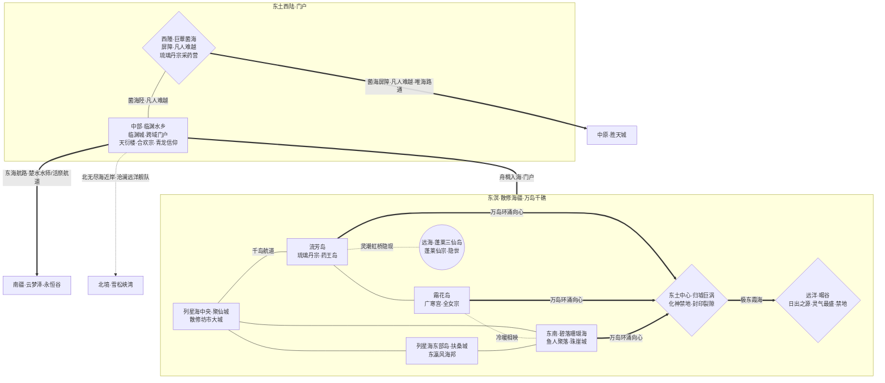

# 东土游戏地图生图提示词 (ChatGPT img2.0 / DALL-E 3)

> 用途: 直接整段复制粘贴到 ChatGPT 对话框,让其调用 DALL-E 3 生成东土游戏地图
> 风格: 完全中文自然语言 + mermaid 拓扑图辅助理解

---

## 提示词正文(从下面这段开始整段复制)

请帮我画一张奇幻游戏地图。这是一款中式修真世界角色扮演游戏的世界地图,展示其中名为"东土"的大区。下面我先介绍绘画风格与世界观,再给出地图的拓扑结构与各区域具体设定,请你综合这些信息绘制。

### 一、绘画风格

我希望地图采用中国古代山海经画卷与传统水墨彩绘融合的风格,辅以蓬莱仙山图与东瀛浮世绘海浪的色感,俯视视角,广角覆盖整个东土海疆——请注意东土并非一块大陆,而是一片名为"东溟"的浩瀚母海,无数仙岛、礁屿星罗其间,唯西陲连着一线通往中原的陆地门户。地图整体呈现古旧羊皮卷或宣纸卷轴的质感,边缘点缀云气、海雾、惊涛与千帆纹饰,可有八卦罗盘点缀。东土横跨"菌林屏障—河口水乡—灵药仙岛—隐世仙山—薄冰霜岛—珊瑚礁海—万丈巨涡—日出霞海"多种海陆地貌,色调以**海碧、雾白、霞金(日出)**为主基,辅以**丹霞红(琉璃丹宗与暘谷日华)、霜玉青白(霜花岛广寒宫月华)、珊瑚碧蓝(碧落珊瑚海)、菌林幽绿(巨蕈菌海孢雾)、归墟玄黑(中心巨涡禁地)、东瀛朱红(扶桑城神社鸟居)**作为重要地标的点缀色——西陲菌海一片幽绿孢蒙,中央列星海碧波千帆,极东海天之交霞光喷薄、金渊耀目。所有地名标注请使用竖排毛笔楷书或行书的中文字样,不要出现任何英文或拉丁字母,不要出现现代建筑、车辆、武器或其他不属于古风修仙世界的元素。整体氛围应当既浩渺苍茫又仙岛缥缈,海雾氤氲、霞光万道、千帆散修、神社海祭,具有上古修真世界的史诗感与海上仙乡的逍遥灵秀。

### 二、世界观背景

这个世界的人间称为"凡界",由"中原·北境·西域·东土·南疆"五大区组成,被四面环绕的"无尽海域"包围。中原居中是文明腹地,东土在中原之东,是凡界最东之地、日出之源,以海岛散布、舟楫往来为基调。东土与众不同——它是凡界唯一不站队的"自由海疆":所有宗门一律中立,既不入西域为首的"仙盟",也不附南疆为首的"道盟"。东土西陲被"巨蕈菌海"屏障封死,孢雾巨蕈连绵、凡人难以穿越,故东土与中原的陆路断绝,往来高度依赖海路(临渊城港),更显其海上孤悬、自成一界。东土内有丹道圣地、隐世仙宗、全女月修、阵法情报枢机、双修宗门等多元中立势力,与散修云集的坊市大城、东瀛风的海邦神社、鱼人珊瑚聚落杂处共存,本图就是要把它们各自的位置、地形特征、相互关系都直观呈现出来。

### 三、东土的核心设定

东土并非一块被海环绕的大陆,而是一片名为"东溟"的广袤母海(散修海疆),万岛千礁星罗其间;诸生态皆以海岛形式散布于这片汪洋,唯西陲连着一线陆地门户。东土由八处海岛/水乡生态、一处中央海疆、一处远洋圣域,以及散布雾海间的几处游移秘境组成。

东土最西是横亘于东土与中原之间的**"巨蕈菌海"(西陲·屏障)**——擎天巨蕈连绵成海,菌岛、菌泽交织,孢雾终年弥漫、夜放幽光,无路可循、凡人难以穿越,封死了东土↔中原的陆路(丹道宗门琉璃丹宗在此设有采药营)。巨蕈菌海以东即**"临渊水乡"(中部·河口水乡)**——悬河、天江两大水系下游交汇成的三角洲泽国,泥岛、苇荡、水寨星布,舟楫为路;水上矗立着超大型修仙城市**临渊城**(凡人与修士杂处的跨域贸易与情报总枢、各域跨海者登陆的门户、青龙信仰中心),阵法符箓卜算的**天衍楼**与阴阳双修证道的**合欢宗**皆驻于城中。

临渊水乡以东,陆地渐碎、散入汪洋,便是东溟的中央海疆**"列星海"(中央·散修海疆)**——千岛万礁星罗、暗流潮汐交织,海上散修、海商、海寇行舟其间;两座凡城立于此:散修坊市大城**聚仙城**(凡修共处、鱼龙混杂、法外自由)与东瀛风海邦**扶桑城**(神社鸟居遍布、剑士民风,信日神扶曜大神与海神沧溟海君,岁有迎日祭、海祭)。列星海四周环列着几座大岛。

环列于列星海四周的诸岛各具风物:灵药巨型仙岛**"流芳岛"**(灵雾缭绕、奇花异草仙植遍生,丹道圣地**琉璃丹宗**所在、神陆最大丹药供应地,凡间誉为"药王岛");更东远海三岛鼎立、以虹桥相连、海市般时隐时现的**"蓬莱三仙岛"**(东土战力天花板、隐世的**蓬莱仙宗**驻此);终年清寒、海面薄冰铺展、冰上霜花成簇如玉花海、月华灵蕴最盛的**"霜花岛"**(全女宗·冰霜月修·太阴一脉的**广寒宫**驻此);东南一片蔚蓝珊瑚礁海**"碧落珊瑚海"(东南·珊瑚海)**——海面下有鱼人珊瑚聚落(以珍珠海珍与水面通商,仅为异族聚落、非修仙势力),缘海有海珍贸易港城**珠崖城**。

东溟之心、东土中央,是封印禁地**"归墟巨涡"**——海床骤陷、终年旋成万丈巨涡(古名"归墟"),万岛环列其外、海流环涌向心,越向心则越深、涡心之下死寂无灵;这是化神级禁地,涡底为上古"归墟之战"古战场,封印着一道空间裂隙(相传通往域外天魔的位面,仅作伏笔)。

东土极东远洋,则是东无尽海唯一的远洋生态**"暘谷"(远洋·日出之源)**——朝阳自海天之交喷薄而生之处,霞光蒸腾、金渊耀目,灵气冠绝凡界五域,被视为东土"日出之地"的本源圣域;远洋禁地,唯化神可勉强御霞一窥。

此外,东溟雾海之间还散布着几处**游移秘境**——永不在原处、刻满未知异文的方碑礁群"无文方碑",重力倒转、倒悬如钟乳石的"倒悬山",随海漂流、登者多迷失的鬼岛"无定漂屿";三者位置不定,唯雾散星稀之夜或云开之时偶现。

**特别提示(东土海域规则,与其他大区不同)**:东土的"东无尽海"不分近/中/远三层——整片大区本身就是一片汪洋(东溟母海),诸生态皆以海岛、礁屿形式散布其中,只在极东远洋设一处生态(暘谷·日出)。因此请把东土画成一片**海上群岛大区**(碧海万岛、雾锁千礁),而不是被海环绕的中央大陆。

主要凡人城市四座:**临渊城**(临渊水乡·建于水上的超大型修仙城市/自由港,凡修杂处、跨域门户、青龙信仰中心)、**珠崖城**(碧落珊瑚海缘·珍珠海珍贸易港城,与鱼人通商而富)、**聚仙城**(列星海中央·散修坊市大城,拍卖鱼龙、法外自由)、**扶桑城**(列星海东部岛·东瀛风海邦,神社鸟居海祭剑士、信诸天百神)。

主要修仙势力(东土所有宗门一律中立,无正魔之分):临渊城的**天衍楼**(阵法符箓卜算·神陆情报中枢)与**合欢宗**(阴阳双修证道);流芳岛的**琉璃丹宗**(丹道圣地·最大丹药供应);蓬莱三仙岛的**蓬莱仙宗**(东土战力天花板·隐世);霜花岛的**广寒宫**(全女宗·冰霜月修·太阴一脉)。

东土对外有几条要道:西面经巨蕈菌海"菌海陉"本可陆路通往中原胜天城,然孢雾巨蕈封死、凡人难越,故跨域往来实际唯靠临渊城海路;东南面经临渊城"东海航路"渡东无尽海通往南疆(楚水水师航道、活祭航道,接云梦泽郢城与永恒谷);北面则有北境沧澜王朝的远洋舰队走北无尽海近岸航线绕至临渊城,连通北境雪松峡湾。

### 四、地图拓扑参考(mermaid 代码,辅助你理解各生态相互位置与势力归属)

以下 mermaid 代码精确表达了各区块的相对位置、连接方式与势力分布,请按此拓扑作为绘图骨架,不要遗漏任何节点和连接,但绘图时把它视觉化为真实地理而不是流程图:

拓扑解读说明:节点形状里**矩形**代表普通生态海岛、水乡或散修凡城(如临渊水乡、流芳岛、霜花岛、碧落珊瑚海、聚仙城、扶桑城);**菱形**代表屏障或禁地(如巨蕈菌海、归墟巨涡、暘谷);**圆形**代表隐世远岛(如蓬莱三仙岛)。**粗线 ===** 代表主干海路、门户出入、万岛环涌向心(归墟巨涡)与极东霞海(暘谷)等重要主干或地理向心;**普通实线 ---** 代表岛屿/陆地接壤、可舟楫通行(含西陲菌海陉);**虚线 -.-** 代表隐现或险阻(灵潮虹桥隐现、冷暖相映、跨域绕航)。**特别注意**:与其他大区不同,东土的"东无尽海"不分近/中/远三层——整片大区本身就是一片名为"东溟"的汪洋母海,诸生态以海岛形式散布其中,仅极东远洋设一处生态(暘谷),故请把东土画成海上群岛大区而非中央大陆,只有西陲(巨蕈菌海+临渊水乡)连着一线通往中原的陆地门户;聚仙城、扶桑城所在的中央海域即"列星海"。标注"中原/南疆/北境"的方向节点是地图边缘的跨域出口,不是东土内部区块,绘图时可以画成地图边缘指向外的箭头标注或路标牌,而不画成实际地物;其中东土↔中原的陆路被巨蕈菌海所阻、凡人难越,跨域往来高度依赖临渊城海路。

### 五、绘画请求

请基于以上世界观、东土核心设定和拓扑结构,生成一张完整的东土游戏地图。地图整体应当呈现卷轴式构图,**整片大区是一片浩渺碧海(东溟母海),万岛千礁星罗棋布**——西陲是一线陆地门户(巨蕈菌海菌林幽绿、孢雾迷蒙、擎天巨蕈连绵成海,临渊水乡泽国水网密布、水上矗立超大型修仙巨城临渊城与千帆港口),向东陆地渐碎、散入汪洋:中央列星海千岛万礁、散修帆影点点(坊市大城聚仙城、东瀛风神社鸟居的扶桑城),四周环列灵雾药岛流芳岛、远海三峰鼎立虹桥相连且海市时隐时现的蓬莱三仙岛、薄冰霜花月华青白的霜花岛、东南珊瑚碧蓝有水下鱼人聚落的碧落珊瑚海;海域正中是万丈巨涡"归墟"(海流环涌向心、涡心玄黑死寂的禁地);极东海天之交是日出之源暘谷(霞门大开、霞光万道、金渊喷薄)。

各个城市(临渊城、珠崖城、聚仙城、扶桑城)、宗门驻地(天衍楼、合欢宗、琉璃丹宗、蓬莱仙宗、广寒宫)用富有特色的中式古建筑插画图标标记并配竖排楷书地名:临渊城绘成水上超大型修仙城阙群配港口千帆;扶桑城绘成东瀛风海岛城邦,神社、鸟居、海祭、剑士;流芳岛绘成灵雾药田与丹炉药圃;蓬莱三仙岛绘成三峰鼎立、彩虹桥相连、云海半隐的隐世仙山;霜花岛绘成薄冰花海、霜花成簇配月华楼阁(广寒宫);碧落珊瑚海绘成蔚蓝珊瑚礁与水下鱼人珊瑚城,缘海珠崖港城采珠帆船;归墟巨涡绘成中心一个巨大旋涡、万岛环涌向心、涡心一团死寂玄黑;暘谷绘成极东海平线上霞门大开、朝阳与金渊喷薄耀目。雾海之间的游移秘境(无文方碑、倒悬山、无定漂屿)可点缀为若隐若现的异文碑礁、倒悬山影与漂流鬼岛。

重要的跨境通道(西陲菌海陉/海路通中原、东海航路通南疆、北无尽海近岸通北境)用古卷地图常见的虚线、波浪线或商队帆影表示。整体气氛要既浩渺苍茫又仙岛缥缈、霞光灵秀,有水墨晕染的海雾远岛,有彩绘点睛的仙城灵峰与神社祭礼,既要保留中式山水画的诗意也要让玩家一眼能读懂各岛归属与海路连接。请尽量在一张图中容纳所有信息,但避免画面过于拥挤,合理安排留白。
