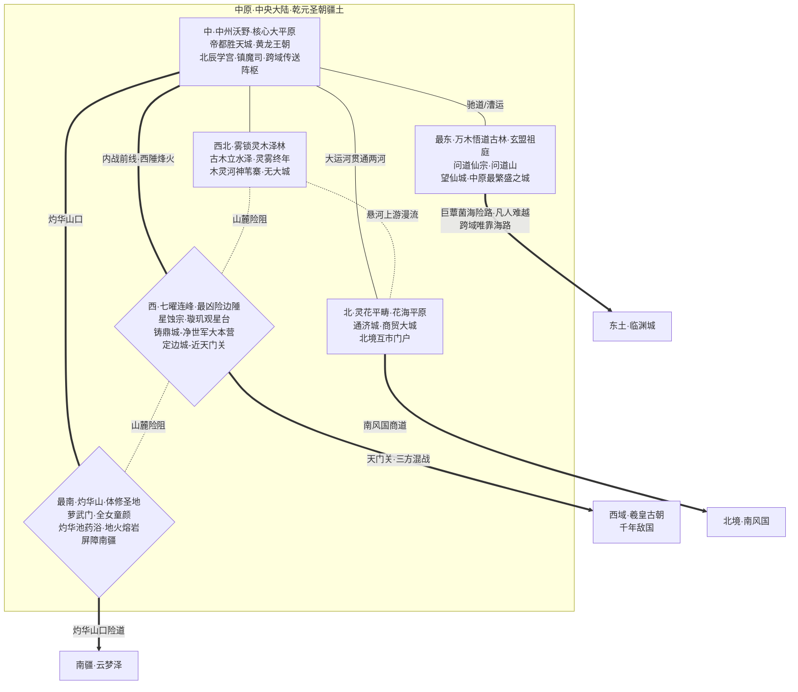

# 中原游戏地图生图提示词 (ChatGPT img2.0 / DALL-E 3)

> 用途: 直接整段复制粘贴到 ChatGPT 对话框,让其调用 DALL-E 3 生成中原游戏地图
> 风格: 完全中文自然语言 + mermaid 拓扑图辅助理解

---

## 提示词正文(从下面这段开始整段复制)

请帮我画一张奇幻游戏地图。这是一款中式修真世界角色扮演游戏的世界地图,展示其中名为"中原"的大区。下面我先介绍绘画风格与世界观,再给出地图的拓扑结构与各区域具体设定,请你综合这些信息绘制。

### 一、绘画风格

我希望地图采用中国古代山海经画卷与宋元青绿山水融合的风格,辅以工笔重彩与水墨晕染,俯视视角,广角覆盖整个中原大区——中原是凡界正中央一片**广袤辽阔的中央大陆**(与东土海岛大区截然不同),平原、湖泽、丘陵、温带森林、雄峻山脉与边陲群峰错落,被北悬河、南天江两条大河横贯东西、又以中央纵贯的人工大运河相连,**两河三纵**水网贯通全域,呈现凡界文明最发达的"修仙工业化"气象——引灵渠如水利般灌入万顷灵田、灵石轨驰道纵横、烽燧符阵连珠传讯,与帝都金阙、画舫商市、文人书院、镇魔司军镇杂处共存。地图整体呈古旧羊皮卷或宣纸卷轴的质感,边缘点缀云气、龙纹、瑞穗、辇道纹饰,可有黄龙盘旋于卷云之上、八卦罗盘点缀于角隅。中原横跨"中央沃野—北部花海—西北雾泽—东部古林—南部火山—西陲星峰"多种地貌,色调以**沃土金黄(中央土德·黄龙气运·帝都金阙)、灵田青翠、两河水墨蓝**为主基,辅以**帝都殿阙的黄琉璃瓦与朱砂宫墙、北部花海的霞粉与桃绯(万顷灵花·灵蜜霞光)、西北泽林的雾白与苍翠(灵雾迷蒙·古木倒影)、东部古林的青苍与文气朱墨(玄盟祖庭·书院灯火)、最南灼华山的丹朱与桃粉(地火熔岩与灼华池·萝武门童颜女修)、西陲七曜连峰的星银钢灰与魔渗紫黑(星蚀宗"星彼端"诡气·铸鼎城军工黑烟)**作为各区点缀色——中央帝都金阙煌煌、龙气盘旋,北部花海如锦缎漫漫,西北泽林雾岚朦胧,东部古林苍翠生灵气,南部山势嵯峨地火奔腾,西陲群峰星辉森厉、紫黑魔气与黑烟战火交织。所有地名标注请使用竖排毛笔楷书或行书的中文字样,不要出现任何英文或拉丁字母,不要出现现代建筑、车辆、武器或其他不属于古风修仙世界的元素。整体氛围应当"**外强中干的盛世**"——表面金碧辉煌、阡陌纵横、漕运不绝、烽燧连珠,内里却被西陲魔渗战火与内乱拉扯,既有中央文明腹地的雍容大气,也有边陲烽火三方混战的紧绷凶险。

### 二、世界观背景

这个世界的人间称为"凡界",由"中原·北境·西域·东土·南疆"五大区组成,被四面环绕的"无尽海域"包围。中原居于五域正中央,是凡界的**文明腹地与中央之国**——这里把修仙规模化、制度化:朝廷养修士、宗门育官吏、灵气如水利般被引入田地驰道,**论底蕴本应威压四方**,坐拥凡界最多的化神级修士。然而中原如今**外强中干、无力对外征伐**,只因两道内伤同时发作:其一是**域外天魔渗透**——已让昔日"三大联盟"之一的【玄盟】(问道仙宗领衔)折损一员(成员璇玑阁因穷究星空、惊动了星辰彼端之物,整宗堕落为侍奉星彼端的【星蚀宗】,与昔日盟友为敌),又驱使大批被天魔操纵的凡人聚成叛军【净世军】、占据中原军工心脏铸鼎城;其二是**永无休止的内战**——天魔未除,叛军屡剿屡起,乾元圣朝(中原唯一凡人王朝·黄龙血统修仙王朝)与玄盟全力镇魔、剿叛、护国,无暇过问与【仙盟】(西域为首)、【道盟】(南疆为首)的天下棋局。中原【去正魔二分】——这里真正的敌人是天魔及其爪牙(星蚀宗与净世军),玄盟内部不分正邪、共御天魔。本图就是要把这片"金碧辉煌却烽烟暗起"的中央大陆,把它的六片生态、五座大城、三方混战与四向边境,通通直观呈现出来。

### 三、中原的核心设定

中原是一块**连片完整的广袤大陆**(与东土海岛大区不同),由**六处生态**构成,北有【悬河】、南有【天江】两条大河横贯东西(皆自西域无垠雪山经七曜连峰一带入中原),中央纵贯一条人工大运河贯通两河、漕运不绝。乾元圣朝(疆域含全部中原)的版图覆盖六生态,唯西陲七曜连峰已被天魔之爪反向蚕食。

**中央——【中州沃野】**(中·核心大平原·政治心脏):两河之间一望无际的冲积大平原,**阡陌灵田万顷、城邑驰道密布**,引灵渠/聚灵阵田把灵气如水般导入庄稼,灵石轨驰道纵横,烽燧以传讯符阵连珠,人工大运河贯通悬河—天江并以镇水阵稳之。帝都**胜天城**坐落于此——黄龙血统的修仙王朝中枢,黄琉璃瓦金阙煌煌、龙气盘旋,社稷坛与太庙祀黄龙,护国仙师祠香火世代,小宗门【北辰学宫】(乾元官学)与【镇魔司】(乾元执法,镇天魔)分置城中,跨域传送阵枢亦在此城。这是凡界唯一把修仙当"水利工程"经营的文明腹地。

**北部——【灵花平畴】**(北·花海平原):悬河下游冲积出的辽阔平原,**化作四时不谢的灵花海**——万顷灵花终年盛放、花气化作灵雾霞光,灵蝶灵蜂飞舞、花妖出没,是采蜜炼蜜、酿灵酒、制香脂的灵植产业带。富甲天下的**商贸大城通济城**在此,画舫连江、灵市拍卖、悬河商道转运,也是中原对北境(经藩国南风国)的互市门户。

**西北——【雾锁灵木泽林】**(西北·湖泽+温带森林):悬河自西域入中原后于此漫流出的广袤水网与温带林海,**古木立于水泽之间、灵雾终年不散**,泽岛、雾径、灵潭错落如迷宫;木灵与水妖出没、古木参天、灵藤垂蔓,雾中藏洞府古迹。**无大城**——只有雾泽渔隐、采药人、林泽部族散居在木灵河神的苇寨之中,敬畏木灵河神。

**最东——【万木悟道古林】**(最东·温带森林·玄盟祖庭):中原东缘一片浩瀚的温带灵木古林,**古木参天、林海无际**,天江下游穿林流过;**问道山**为林海中央拔起的圣峰,是【问道仙宗】所在、亦是玄盟祖庭与中枢所系——洞天福地遍布、悟道崖与论道之风隐于古木深处。**修仙城市望仙城**围绕问道仙宗而建,是中原最繁盛之城;古林亦有崇文向道之士人、书院学子、香客往来。古林东缘之外即是东土的"巨蕈菌海"蕈林屏障,封死了陆路、跨域往来唯靠东土临渊城海路。

**最南——【灼华山】**(最南·山·体修圣地·屏障南疆):临天江拔起的**雄峻巨型山脉**——峰岭嵯峨、断壁千仞,山高谷深、地脉至此隆起、山根直通地火,**多温泉与熔岩窟**。【萝武门】居此——一个全女、童颜(12–16 岁外貌)、锻体的玄盟宗门,以**灼华池**(以百种珍稀灵药熬炼之巨池)的药浴定形秘法闻名,粉色药浴雾气与橙红地火熔岩并置。山势横亘中原最南、屏障南疆,南面山口为通南疆云梦泽之险道。

**西陲——【七曜连峰】**(西·群山·**最凶险边陲·三方混战**):中原西陲拔地而起的**七座云雾灵峰**,以北斗七曜命名(天枢/天璇/天玑/天权/玉衡/开阳/摇光),峰高出云、夜空澄澈,本应观星天下第一,山麓灵矿丰饶。然此地如今三方混战、最为凶险:**【星蚀宗】**(原玄盟占星宗璇玑阁)据七峰、**璇玑观星台**立于中峰——昔年穷究星空、惊动星彼端之物,整宗堕落为天魔之爪,自此七峰星气转厉、渗着**紫黑色"星彼端"诡气**;山麓矿冶军工大城**铸鼎城**(中原军工心脏)紧邻星蚀宗、最易渗透,故首先陷落、今为**【净世军】**(凡人叛军)大本营,叛军与天魔之爪在此连成一气、**军镇烟火冲天**;乾元于近天门关内侧设**边塞军镇定边城**镇守西陲、关上有警则就近驰援。**最西峰之外即天门关**(通西域之陆路关口,关口本身详见西域)——关外即**西域羲皇古朝**(乾元千年敌国);所以西陲实为**乾元 vs 星蚀宗·净世军(天魔) vs 西域羲皇古朝**的三方混战,天魔与一切人类为敌、无人是其盟友。

**主要凡人城市五座**:**胜天城**(中州沃野·黄龙王朝帝都,凡修杂处)、**通济城**(灵花平畴·富甲天下的商贸大城,互市门户)、**望仙城**(万木悟道古林·围绕问道仙宗的修仙城市,中原最繁盛之城)、**定边城**(七曜连峰·西陲边塞军镇,近天门关可驰援)、**铸鼎城**(七曜连峰·矿冶军工大城,今为净世军大本营·叛军占据,烟火冲天)。

**主要修仙势力**:【玄盟】成员**问道仙宗**(万木悟道古林·玄盟盟主·问道山,兼容诸道万法可修、依古盟世代护持乾元圣朝)与**萝武门**(灼华山·全女童颜锻体宗门);天魔之爪**星蚀宗**(七曜连峰·璇玑台,原玄盟璇玑阁堕落、与天下生灵为敌);乾元小宗门**北辰学宫**(胜天城·官学)与**镇魔司**(胜天城与各地分司·执法镇魔)。

**对外四向门户**:西经**天门关·定边城**通西域(千年敌国羲皇古朝·三方混战);北经**通济城·南风国商道**通北境;南经**灼华山口险道**通南疆云梦泽;东经**万木悟道古林东缘·巨蕈菌海险路**(凡人难越、跨域唯靠东土临渊城海路)通东土。

### 四、地图拓扑参考(mermaid 代码,辅助你理解各生态相互位置与势力归属)

以下 mermaid 代码精确表达了各区块的相对位置、连接方式与势力分布,请按此拓扑作为绘图骨架,不要遗漏任何节点和连接,但绘图时把它视觉化为真实地理而不是流程图:

拓扑解读说明:节点形状里**矩形**代表平原、花海、湖泽、温带森林类生态(中州沃野、雾锁灵木泽林、灵花平畴、万木悟道古林);**菱形**代表雄峻群山或凶险边陲(最南灼华山、西陲七曜连峰)。**粗线 ===** 代表主干通道与西陲内战前线;**普通实线 ---** 代表平原接壤、驰道漕运可通行;**虚线 -.-** 代表险阻或漫流地脉。**北悬河**自西经七曜连峰一带入中原,横贯北方流经雾锁泽林漫流、灵花平畴而下;**南天江**自西经七曜南麓入中原,横贯南方流经灼华山北麓与万木悟道古林;**中央人工大运河**纵贯两河、连通漕运,这是中原"修仙工业化"水网的骨架,绘图时应清晰画出"上下两条横贯大河 + 中央一条纵贯运河"的水利格局。标注"西域/北境/南疆/东土"的方向节点是地图边缘的跨域出口、不是中原内部区块,绘图时可以画成地图边缘指向外的箭头标注或路标牌、关塞门、商队帆影,而不画成实际地物;其中东土↔中原的陆路被巨蕈菌海所阻、凡人难越,跨域往来高度依赖海路绕行;西陲天门关被乾元、净世军(天魔)、西域羲皇古朝三方拉锯。

### 五、绘画请求

请基于以上世界观、中原核心设定和拓扑结构,生成一张完整的中原游戏地图。地图整体应当呈现卷轴式构图,**整片大区是一块辽阔连片的中央大陆**(不是海岛/岛群)——构图骨架是"**北悬河、南天江两条大河横贯东西 + 中央人工大运河纵贯连通两河**"的水网格局,在此水网之上落布六片生态:**中央中州沃野**为大平原政治心脏(阡陌灵田万顷、引灵渠纵横、灵轨驰道连珠、烽燧符阵闪烁,**帝都胜天城**坐落正中,黄琉璃瓦金阙煌煌、龙气盘旋、社稷坛太庙祀黄龙、护国仙师祠香火,小宗门北辰学宫与镇魔司分置城中);**北部灵花平畴**绘成万顷灵花海(四时盛放、花气霞光、灵蝶灵蜂飞舞,**通济城**画舫连江、灵市拍卖、悬河商道帆影点点);**西北雾锁灵木泽林**绘成古木立于水泽、灵雾终年不散的迷宫水乡(泽岛、雾径、灵潭错落、木灵河神苇寨星散,无大城但有部族苇寨与采药小径);**最东万木悟道古林**绘成苍翠浩瀚的温带灵木古林(古木参天、林海无际、天江下游穿林,**问道山**为林海中央拔起的圣峰、玄盟祖庭,洞天福地隐于古木,**望仙城**绘成繁盛雅致的修仙城市、楼台书院灯火点点);**最南灼华山**绘成雄峻嵯峨的巨型山脉(峰岭断壁千仞、地火熔岩窟橙红奔腾、温泉雾气蒸腾,**萝武门**配粉色灼华池药浴雾气、童颜女修楼台与擎天殿,山势横亘最南、屏障南疆);**西陲七曜连峰**最为凶险——七座云雾灵峰按北斗七曜命名星辰相连,**璇玑观星台**立于中峰、台心一道紫黑色裂隙渗"星彼端"诡气、星气森厉(对应星蚀宗据七峰的堕落),**铸鼎城**(矿冶军工大城,今为净世军大本营)绘成军镇烟火冲天、炉火黑烟与叛军营帐、与璇玑台连成一气,**定边城**绘成西陲边塞军镇、近天门关可驰援、戍边军卒往来,**最西峰之外天门关**绘成地图边缘的雄关哨楼、关外箭头标注西域。

各个城市(胜天城、通济城、望仙城、定边城、铸鼎城)与宗门驻地(问道仙宗、萝武门、星蚀宗、北辰学宫、镇魔司)用富有特色的中式古建筑插画图标标记并配竖排楷书地名:**胜天城**绘成中央帝都殿阙群落、黄琉璃瓦金阙煌煌、龙气盘旋;**通济城**绘成花海中的商贸大城、画舫连江、灵市帆影;**望仙城**绘成古林圣峰下的修仙繁城、楼台书院云海半隐;**定边城**绘成西陲烽燧军镇、戍边军卒与近关哨楼;**铸鼎城**绘成军工大城炉火黑烟冲天、叛军营帐与净世军旗号、显出"被叛军占据"的紧绷感;**问道仙宗**绘成问道山圣峰之上的洞天福地、论道殿阙与悟道崖;**萝武门**绘成灼华山主峰擎天殿与粉色灼华池药浴雾气;**星蚀宗·璇玑观星台**绘成中峰之上崩毁观星台、紫黑色裂隙与"星彼端"诡气、星图碎石与万瞳殿森森;**北辰学宫与镇魔司**绘成胜天城内的官学殿阙与镇魔执法衙署。**北悬河、南天江**用古卷常见的青蓝水墨晕染、两岸城市与漕运帆影点点;**中央大运河**纵贯连通两河、镇水阵符墩沿岸点缀。**两河自西陲七曜连峰一带流入中原**,源头处应可见自西域无垠雪山方向延伸而来。**乾元圣朝**疆域用淡淡的金黄色气运光晕笼罩整片大陆(西陲七曜连峰则覆以紫黑魔气晕染、表示已被天魔之爪反向蚕食、与中央金黄气运形成对照)。

重要的跨境通道(西**天门关·三方混战**、北**南风国商道**、南**灼华山口险道**、东**巨蕈菌海险路·凡人难越**)用古卷地图常见的虚线、关塞门、商队帆影或波浪线表示,各自在地图边缘指向外、用路标牌或竖排楷书标注"西域·羲皇古朝(千年敌国)"、"北境·南风国"、"南疆·云梦泽"、"东土·临渊城(海路)"。整体气氛要既呈现"**金碧辉煌的中央文明腹地**"(帝都金阙、灵田阡陌、漕运不绝、烽燧连珠、画舫商市、洞天福地)的雍容气象,又能让人一眼读出"**外强中干、内忧外患**"——西陲七曜连峰紫黑魔气与铸鼎城军工黑烟交织、星蚀宗璇玑台诡气森森、定边城烽火紧绷,与中央金阙的祥和、北部花海的灿烂、东部古林的灵秀、南部灼华山的雄峻、西北泽林的朦胧形成鲜明对照。请尽量在一张图中容纳所有信息,但避免画面过于拥挤,合理安排留白,既保留中式青绿山水的诗意,也让玩家一眼能读懂各生态归属、五大城位置、河运水网、三方混战边陲与四向跨域通道。
