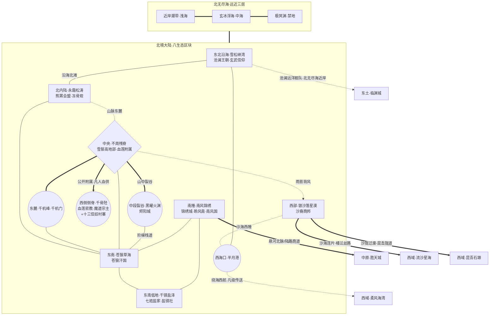

# 北境游戏地图生图提示词 (ChatGPT img2.0 / DALL-E 3)

> 用途: 直接整段复制粘贴到 ChatGPT 对话框,让其调用 DALL-E 3 生成北境游戏地图
> 风格: 完全中文自然语言 + mermaid 拓扑图辅助理解

---

## 提示词正文(从下面这段开始整段复制)

请帮我画一张奇幻游戏地图。这是一款中式修真世界角色扮演游戏的世界地图,展示其中名为"北境"的大区。下面我先介绍绘画风格与世界观,再给出地图的拓扑结构与各区域具体设定,请你综合这些信息绘制。

### 一、绘画风格

我希望地图采用中国古代山海经画卷与传统水墨彩绘融合的风格,俯视视角,广角覆盖整个北境大陆与环绕的北无尽海。地图整体呈现古旧羊皮卷或宣纸卷轴的质感,边缘点缀云气与海浪纹饰,可有八卦罗盘点缀。色调以蓝灰、墨白为主,辅以朱砂红、明黄金、玉石青绿作为重要地标的点缀色。所有地名标注请使用竖排毛笔楷书或行书的中文字样,不要出现任何英文或拉丁字母,不要出现现代建筑、车辆、武器或其他不属于古风修仙世界的元素。整体氛围应当严寒、苍凉、神秘、悠远,远山隐入云雾,具有上古修真世界的史诗感。

### 二、世界观背景

这个世界的人间称为"凡界",由"中原·北境·西域·东土·南疆"五大区组成,被四面环绕的"无尽海域"包围。中原居中是文明腹地,北境在中原之北,以严寒、险峻、海陆交界为基调,是各方势力交错共存的边荒之地。北境内有正派修仙宗门、魔道大宗、游牧凡人、海上王朝、沙漠商邦、山地神权附属国等等多元势力杂居,本图就是要把它们各自的位置、地形特征、相互关系都直观呈现出来。

### 三、北境的核心设定

北境大陆由八个内陆生态区块和三层环绕的"北无尽海"组成。从地形看,北境西部是雨影下的银沙寒漠,中央纵贯一条南北向断折山脉(称为"不周残脊",是上古天柱倾倒后的残骸),山脉将北境劈为东西两半。东北沿海是被冰川刻凿出的深邃峡湾;北部内陆是无边的黑松针叶林;东南是金色草海与盐光闪烁的镜湖湿地;南陲是温润沃土与文风鼎盛的锦绣城。山脉中段裂开一道地热裂谷叫"黑曜火渊",熔岩涌动,东壁悬挂着层级黑石的炼器之都"烬阳城"。山脉东侧山麓伸出一支孤峰称"千机峰",上面坐落着以机关炼器闻名的正派宗门"千机门"。山脉西侧侧脊则是一片血红雾气笼罩的"千骨陉",藏地式血祭魔教"血莲密教"的总坛和它附庸的雪鬃高地部凡人国就盘踞在那一带。

环北境的"北无尽海"分三层:近岸潮带是浅海航线,中海是常年浮冰的玄冰浮海,远洋则是化神级修士才能勉强一窥的"极冥渊"禁地。

主要凡人国家七个:东北沿海的沧澜王朝(海上世袭王朝,鲸骨为梁的鲸髓城为都,以鲸语者血脉立国,崇北方玄武,有龙首楼船舰队);北境内陆的熊罴会盟(松林狩猎部族松散联盟,无王);西部沙漠的沙裔商邦(五绿洲城邦联盟,以星陨堡为议会驻地,白驼骑兵驰骋沙海);山中央的雪鬃高地部(高山神权王国,天梯堡依崖而建,血莲密教附庸);东南草海的苍狼汗国(游牧十二部联盟,金顶王庭为都,长生天信仰);东南低地的七姓盐家(盐商豪族议盟,千镜盐泽中众盐田如镜);南陲的南风国(中原乾元圣朝藩属,文修兴盛,以锦绣城为都)。

主要修仙势力六个:正道大宗有山东麓的千机门(机关炼器)、南陲锦绣城内的聆风斋(音律修真)、火渊城壁的烬阳城(炼丹炼器立体阶梯城);魔道大宗是山西侧脊的血莲密教(藏密血祭);小宗有北境永霜松涛深处的冻骨观(鬼修小宗·孤坟岭旁)、东南千镜盐泽中的盐镜社(倒影幻术小宗)。

北境对外有几条要道:南陲沿悬河北脉商道通往中原胜天城;西部沙裔商邦的"半月港"通过绕海西航连接西域柔风海湾;西部银沙落星漠的沙海西缘则与西域流沙星海连成一片(沙商陆路);东北沿海沧澜王朝的远洋舰队走北无尽海近岸海路绕至东土临渊城。

### 四、地图拓扑参考(mermaid 代码,辅助你理解各生态相互位置与势力归属)

以下 mermaid 代码精确表达了各区块的相对位置、连接方式与势力分布,请按此拓扑作为绘图骨架,不要遗漏任何节点和连接,但绘图时把它视觉化为真实地理而不是流程图:

拓扑解读说明:节点形状里矩形代表普通生态区块或平原沃土;菱形代表山脉(如不周残脊);圆形代表修仙宗门驻峰、修仙城或关键港口(如千机峰、烬阳城、半月港);粗线代表重要主干道或势力公开附属关系;虚线代表险阻或绕航路径(雨影背风、海路绕航等);标注"中原/西域/东土"的方向节点是地图边缘的跨域出口,不是北境内部区块,绘图时可以画成地图边缘指向外的箭头标注或路标牌,而不画成实际地物。

### 五、绘画请求

请基于以上世界观、北境核心设定和拓扑结构,生成一张完整的北境游戏地图。地图整体应当呈现卷轴式构图,北无尽海三层从外向内环绕北境大陆三面(北、东、西),八个内陆生态区块按拓扑分布在大陆上,各个城市、宗门驻地、王都用富有特色的中式古建筑插画图标标记并配竖排楷书地名。重要的跨境通道(陆路商道、绕海航线)用古卷地图常见的虚线或波浪线表示。整体气氛要冷峻而史诗,有水墨晕染的远山雾气,有彩绘点睛的城池灵峰,既要保留中式山水画的诗意也要让玩家一眼能读懂各区域归属与连接。请尽量在一张图中容纳所有信息,但避免画面过于拥挤,合理安排留白。
