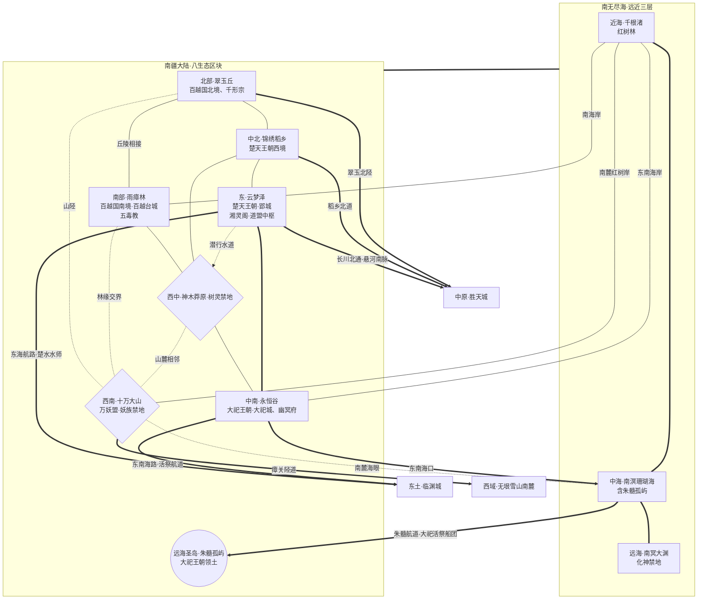

# 南疆游戏地图生图提示词 (ChatGPT img2.0 / DALL-E 3)

> 用途: 直接整段复制粘贴到 ChatGPT 对话框,让其调用 DALL-E 3 生成南疆游戏地图
> 风格: 完全中文自然语言 + mermaid 拓扑图辅助理解

---

## 提示词正文(从下面这段开始整段复制)

请帮我画一张奇幻游戏地图。这是一款中式修真世界角色扮演游戏的世界地图,展示其中名为"南疆"的大区。下面我先介绍绘画风格与世界观,再给出地图的拓扑结构与各区域具体设定,请你综合这些信息绘制。

### 一、绘画风格

我希望地图采用中国古代山海经画卷与传统水墨彩绘融合的风格,辅以楚地漆器与三星堆青铜的色感,俯视视角,广角覆盖整个南疆大陆与其南侧环绕的南无尽海。地图整体呈现古旧羊皮卷或宣纸卷轴的质感,边缘点缀云气、瘴雾、海浪与藤蔓纹饰,可有八卦罗盘点缀。南疆横跨"雨林—丘陵—大泽—巨山—神木林—死气谷—红树海岸—珊瑚海"多种湿热地貌,色调以**瘴绿、楚水青、稻金**为主基,辅以**朱砂红(朱髓与血祭)、死灰墨黑(永恒谷)、巫祝铜金(楚天与大祀青铜礼器)、珊瑚碧与深渊黑(三层海域)**作为重要地标的点缀色——南境雨林一片湿翠瘴蒙,东部大泽烟波浩渺透青,中南死谷阴墨苍灰,远海珊瑚碧蓝、深渊幽黑。所有地名标注请使用竖排毛笔楷书或行书的中文字样,不要出现任何英文或拉丁字母,不要出现现代建筑、车辆、武器或其他不属于古风修仙世界的元素。整体氛围应当既湿热苍莽又巫蛊神秘,瘴雾氤氲、巫祝诡谲、妖族盘踞、青铜祭礼森然,具有上古修真世界的史诗感与南国楚巫的瑰丽诡奇。

### 二、世界观背景

这个世界的人间称为"凡界",由"中原·北境·西域·东土·南疆"五大区组成,被四面环绕的"无尽海域"包围。中原居中是文明腹地,南疆在中原之南,以湿热、瘴蛊、巫祝、妖族、王朝交错共存为基调,是道盟统御、与西域仙盟政治对峙的南陲大区。南疆内有巫族大宗、死气尸傀大宗、毒蛊大宗、活体改造大宗结成的"道盟",有十万大山的妖族独立联盟"万妖盟",还有楚地巫祝王朝、部落联邦、神权奴隶王朝等多元势力杂居,本图就是要把它们各自的位置、地形特征、相互关系都直观呈现出来。

南疆的政治格局不用"正道/魔道"二分,而以"仙盟(西域) vs 道盟(南疆)"的阵营对峙为框架:道盟以巫族大宗湘灵阁为盟主,统御幽冥府、五毒教、千形宗,并将楚天、大祀两个凡人王朝纳为附庸;万妖盟则是独立中立的妖族联盟,与道盟订有"互不侵犯"之约。

### 三、南疆的核心设定

南疆大陆由七个内陆生态区块、一座远海圣岛(朱髓孤屿)和三层环绕的"南无尽海"组成。从地形看,南疆**西侧与西南是一道纵贯的万年原始山脉"十万大山"**——巨木如柱、瀑布悬崖、山间无路,是妖族禁地,万妖盟七族(潜龙、落凤、青丘狐、洛水龟、覆山虎、啸夜狼、混世猴)各据山头,南麓临海有"潜龙海眼"直通中海,西侧越过"瘴关陉道"便是西域无垠雪山南麓。

十万大山以东、南疆**北部是亚热带翠绿丘陵"翠玉丘"**——灵泉密布、地脉异变,活体改造大宗"千形宗"的造物殿盘踞于此,百越国北境(御兽系北四部)在其间挣扎。翠玉丘以东是**中北的"锦绣稻乡"**——千里金色梯田与平原、水道纵横,是楚天王朝的粮仓,稻官府坐镇其中。锦绣稻乡再向东是**东部的"云梦泽"**——南疆最大内陆水域,千里水网与芦苇荡、莲海浮岛,雾中浮起木桩聚落;楚天王朝的水上都城"郢城"与湘灵阁本阁"九歌殿"(道盟议事中枢)皆立于此泽。

大陆中央偏西是**"神木莽原"**——上古神木林,树冠遮天数十里、根须密织如地下经络,树灵与木妖盘踞、不设凡国(树灵禁地),林海深处藏着一座被吞没的上古黑石阶梯巨塔。神木莽原以东是**中南的"永恒谷"**——巨型死气谷地,谷口阴雾不散、谷底寒泉如冥河、碎骨堆山、落叶皆黑;死气尸傀大宗"幽冥府"的通幽阁立于谷心九幽泉,神权奴隶王朝"大祀王朝"的青铜都城"大祀城"(城中央立巨型青铜"通天神树")建于谷口。

南疆**最南是热带原始雨林"雨瘴林"**——树冠如盖、藤蔓垂织、瘴气蛊毒终年弥漫,毒蛊大宗"五毒教"的神木殿据此,百越国南境(苗蛊系南三部)世居其中;部落联邦的王廷"百越台城"依山建于雨瘴林北部。

环南疆的"南无尽海"沿南海岸分三层:近海是红树气根纵横的"千根渚"(红树林潮带);中海是珊瑚礁星罗、水色蔚蓝的"南溟珊瑚海",其中段浮着远海圣岛"朱髓孤屿";远洋则是化神级修士才能勉强一窥的"南冥大渊"禁地——海床骤陷为万丈深渊,浊浪黑雾终年不息。**朱髓孤屿**是大祀王朝的远海飞地:石灰岩白岩高原配赤色沙岸、异种植物极多,岛中央横亘一具上古真龙巨尸"龙骸谷",大祀的"髓祭坛"与活祭码头亦在岛上。

主要凡人国家三个:**楚天王朝**(楚地巫祝文明王朝,湘灵阁附庸国,辖云梦泽+锦绣稻乡,都城郢城立于云梦泽水上,君权神授、"王"治政"大祝"司神,项氏世袭,信奉以东皇太一为首的九神);**百越国**(部落联邦,七大部推举越王,辖雨瘴林南三部+翠玉丘北四部,都城百越台城,被五毒教与千形宗实际控制,黎氏王族);**大祀王朝**(残酷神权奴隶王朝,幽冥府附属国/地上代理,辖永恒谷+朱髓孤屿,都城大祀城立于永恒谷边缘,纵目祭师团与铜面武士、人祭奴隶为根本,子氏世袭)。

主要修仙势力:**道盟四大宗**——云梦泽郢城九歌殿的湘灵阁(道盟盟主·巫族大宗)、永恒谷通幽阁的幽冥府(死气尸傀大宗·大祀王朝宗主)、雨瘴林神木殿的五毒教(毒蛊大宗)、翠玉丘造物殿的千形宗(活体改造大宗);**万妖盟**——十万大山妖族独立联盟,七族共治、无盟主,与道盟平级互不侵犯。

南疆对外有几条要道:北面经云梦泽"长川北通·悬河南脉"、锦绣稻乡"稻乡北道"、翠玉丘"翠玉北陉"陆路通往中原胜天城;东面经云梦泽"东海航路·楚水水师"、永恒谷"东南海路·活祭航道"渡东无尽海通往东土临渊城;西面经十万大山"瘴关陉道"翻越雨林雪山过渡带通往西域无垠雪山南麓;海上则有"朱髓航道"由中海南溟珊瑚海通向远海圣岛朱髓孤屿(大祀活祭船团专用)。

### 四、地图拓扑参考(mermaid 代码,辅助你理解各生态相互位置与势力归属)

以下 mermaid 代码精确表达了各区块的相对位置、连接方式与势力分布,请按此拓扑作为绘图骨架,不要遗漏任何节点和连接,但绘图时把它视觉化为真实地理而不是流程图:

拓扑解读说明:节点形状里**矩形**代表普通生态区块、雨林、丘陵、粮仓沃野或大泽(如翠玉丘、雨瘴林、锦绣稻乡、云梦泽、永恒谷);**菱形**代表山脉或禁地(如十万大山、神木莽原);**圆形**代表远海圣岛(如朱髓孤屿)。**粗线 ===** 代表王朝-粮仓边界、活祭航道、海陆交界等重要主干道或地理过渡;**普通实线 ---** 代表陆地接壤、可徒步通行(含南海岸红树带);**虚线 -.-** 代表险阻地形或隐秘路径(山陉、林缘交界、山麓相邻、潜行水道、南麓海眼)。标注"中原/西域/东土"的方向节点是地图边缘的跨域出口,不是南疆内部区块,绘图时可以画成地图边缘指向外的箭头标注或路标牌,而不画成实际地物。

### 五、绘画请求

请基于以上世界观、南疆核心设定和拓扑结构,生成一张完整的南疆游戏地图。地图整体应当呈现卷轴式构图,**南无尽海三层从南侧向内环绕大陆**(近海千根渚红树带在内,中海南溟珊瑚海居中含朱髓孤屿,远海南冥大渊深渊在最外),七个内陆生态区块加一座远海圣岛按拓扑分布在大陆上——西侧与西南是纵贯的十万大山(妖族苍莽巨岭,云雾缭绕),北部翠玉丘翠绿如玉灵泉点点,中北锦绣稻乡金色梯田水网密布,东部云梦泽烟波浩渺、郢城与九歌殿浮于泽心,中央偏西神木莽原古林遮天、深处隐黑石巨塔,中南永恒谷阴墨苍灰、大祀城青铜通天神树森然,最南雨瘴林湿翠瘴蒙、神木殿与百越台城隐于林中,远海朱髓孤屿白岩赤岸、岛心横陈赤色真龙巨尸。

各个城市(郢城、大祀城、百越台城)、宗门驻地(九歌殿、通幽阁、神木殿、造物殿)、王廷与圣地用富有特色的中式古建筑插画图标标记并配竖排楷书地名:郢城绘成楚地水上宫阙群、九歌殿配巫祝祭坛与九神图样;大祀城绘成青铜城墙+中央青铜"通天神树"与纵目面具纹;百越台城绘成依山吊脚的部落台城配铜鼓龙舟;神木莽原中央可绘一株擎天主神木、林海深处露出黑石阶梯巨塔一角;永恒谷可绘阴雾死气与冥河碎骨;雨瘴林缭绕瘴雾毒花;朱髓孤屿绘白色石灰岩高原配赤色沙岸,岛心一具半埋的巨型真龙骸骨。

重要的跨境通道(长川北通、稻乡北道、翠玉北陉、东海航路、活祭航道、瘴关陉道、朱髓航道)用古卷地图常见的虚线、波浪线或商队帆影表示。整体气氛要既湿热苍莽又巫蛊瑰奇,有水墨晕染的瘴雾远山,有彩绘点睛的城池灵峰与青铜祭礼,既要保留中式山水画的诗意也要让玩家一眼能读懂各区域归属与连接。请尽量在一张图中容纳所有信息,但避免画面过于拥挤,合理安排留白。
