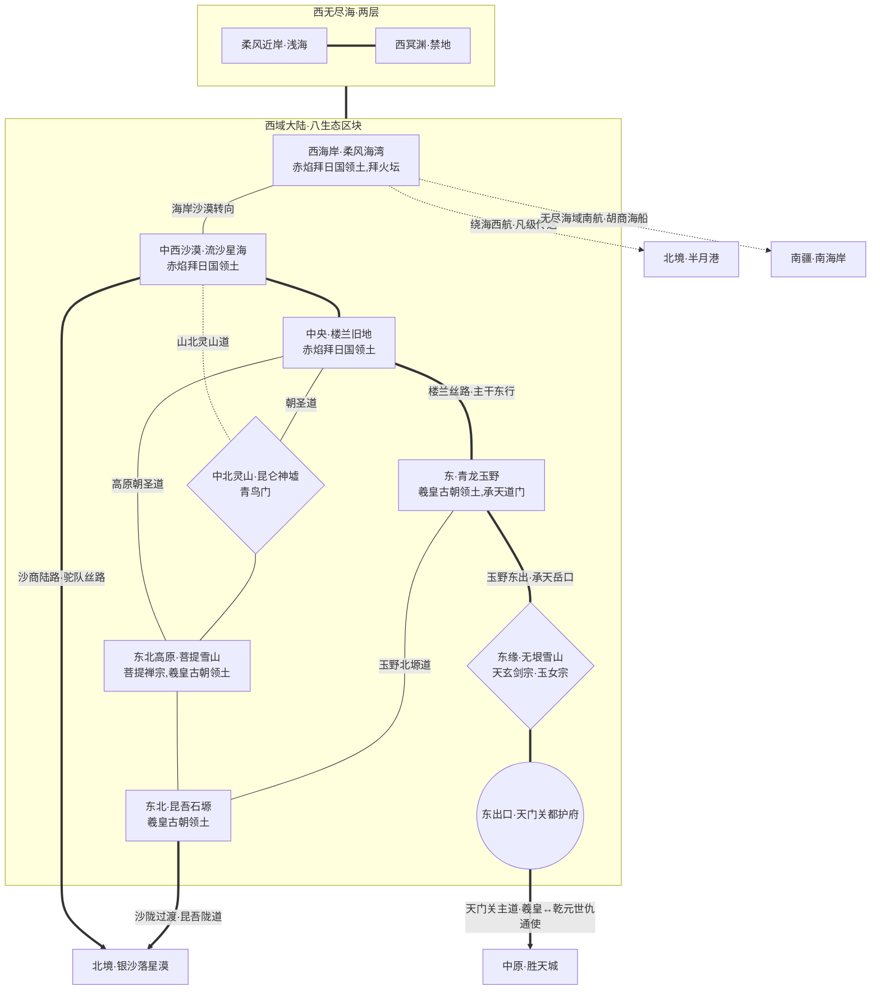

# 西域游戏地图生图提示词 (ChatGPT img2.0 / DALL-E 3)

> 用途: 直接整段复制粘贴到 ChatGPT 对话框,让其调用 DALL-E 3 生成西域游戏地图
> 风格: 完全中文自然语言 + mermaid 拓扑图辅助理解

---

## 提示词正文(从下面这段开始整段复制)

请帮我画一张奇幻游戏地图。这是一款中式修真世界角色扮演游戏的世界地图,展示其中名为"西域"的大区。下面我先介绍绘画风格与世界观,再给出地图的拓扑结构与各区域具体设定,请你综合这些信息绘制。

### 一、绘画风格

我希望地图采用中国古代山海经画卷与传统水墨彩绘融合的风格,辅以丝路敦煌壁画的色感,俯视视角,广角覆盖整个西域大陆与其西侧环绕的西无尽海。地图整体呈现古旧羊皮卷或宣纸卷轴的质感,边缘点缀云气、海浪与沙暴纹饰,可有八卦罗盘点缀。西域横跨"海岸—沙漠—绿洲—灵山—雪山—沃野"多种地貌,色调以**黄沙金、土赭、朱砂**为主基,辅以**玉青、雪白、佛金、圣火橙红、瑶池碧、苍龙翠**作为重要地标的点缀色——西部沙海一片金黄,东部沃野青翠,东缘雪山苍白,中北灵山云雾缭绕透出玉色光晕。所有地名标注请使用竖排毛笔楷书或行书的中文字样,不要出现任何英文或拉丁字母,不要出现现代建筑、车辆、武器或其他不属于古风修仙世界的元素。整体氛围应当既苍茫辽远又灵气氤氲,沙海与雪山相对、佛塔与道观共立、圣火与瑶池呼应,具有上古修真世界的史诗感与丝路商道的异域感。

### 二、世界观背景

这个世界的人间称为"凡界",由"中原·北境·西域·东土·南疆"五大区组成,被四面环绕的"无尽海域"包围。中原居中是文明腹地,西域在中原之西,以沙海、灵山、雪岭、绿洲、海岸交错共存为基调,是上古帝朝与异域宗教碰撞、五大宗门与凡国势力并立的西陲大区。西域内有道家正道祖庭、佛门首席禅宗、剑宗剑修、忘情女宗、祆教拜火大宗、灵兽召唤小宗等多元势力杂居,同时承载着古羲皇帝朝与古波斯式神王王朝的千年对峙,本图就是要把它们各自的位置、地形特征、相互关系都直观呈现出来。

### 三、西域的核心设定

西域大陆由八个内陆生态区块和两层环绕的"西无尽海"组成。从地形看,西域**西部是温润港湾"柔风海湾"**,长滩与礁群相间,内陆低丘起伏,商船帆影不绝。柔风海湾向东延入**"流沙星海"**——浩瀚黄沙覆盖中西腹地,星辰陨落之黄沙偶有古波斯石柱遗迹,中央绿洲城便是赤焰拜日国都"拜日金都",圣火塔常燃不灭。流沙星海再向东接**"楼兰旧地"**,沙海中三十六绿洲星罗,千年废墟与活城邦并存,中央的楼兰故都是巨型废弃建筑群,只余少量居民,昔日三十六绿洲同盟陨落见证仍立其间。

从楼兰旧地向北上行,便是**中北的上古灵山"昆仑神墟"**——以玉山为主峰,瑶池居中央,昆仑九门环列;山海经记载之西王母圣地,高原灵气浓郁,常年云雾缭绕,山顶恒寒而瑶池畔四时如春,青鸟门隐世全女小宗的祖地"三青鸟亭"便栖此。昆仑神墟之东是**"菩提雪山"**——东北高原汉传佛国,须弥宫(羲皇古朝行宫)与菩提禅宗祖庭并立,万佛崖立有镇妖九层古塔。菩提雪山之南**"青龙玉野"**乃西域东部的关中沃野,羲水东西贯穿千里玉野,承天都是羲皇古朝主都,承天岳承天道门祖庭立于其侧,南北山岳环列(承天岳·承天岭·承天陵)。

菩提雪山以北、楼兰以东北方向是**"昆吾石塬"**,喀斯特峰林千崖如骨石遍野,暗河天坑暗布,千年古铜冶遗墟群点缀其间。**"无垠雪山"**则纵贯西域东缘南北千里,万古不化雪山中数处峰峦立宗——天玄剑宗在中部主峰,玉女宗在北麓,东麓设天门关都护府,是西域与中原乾元圣朝直接接壤的咽喉关口。

环西域的"西无尽海"分两层:近岸潮带是商船频繁的浅海"柔风近岸",月圆夜有鱼人歌会浮现于礁外;远洋则是化神级修士才能勉强一窥的"西冥渊"禁地,上次大劫古日轮陨落之处,深海珊瑚与古城残骸星罗。

主要凡人国家三个:**羲皇古朝**(上古帝朝·巨型凡国,辖青龙玉野+昆吾石塬+菩提雪山+无垠雪山四区,首都承天都立于青龙玉野羲水之畔,与中原乾元圣朝为千年敌国);**赤焰拜日国**(古波斯式神王王朝,辖流沙星海+楼兰旧地+柔风海湾三区,都城拜日金都立于沙海中央绿洲,圣火塔常燃,神王受拜火坛圣火真种加冕);**天门关都护府**(无垠雪山东麓·中原乾元圣朝在西域的前哨守军,镇守天门关,非独立国)。

主要修仙势力六个:**五大宗门**——青龙玉野承天岳的承天道门(正道·西域道门首席·羲皇国教·仙盟)、无垠雪山中部的天玄剑宗(正道·剑修圣地·仙盟)、无垠雪山北麓的玉女宗(正道·全女宗门·太上忘情·仙盟)、菩提雪山祖庭峰的菩提禅宗(正道·汉传佛门首宗·禅武双修·仙盟)、柔风海湾圣火塔的拜火坛(中立·祆教大宗·拜日国国教);**一小宗**——昆仑神墟三青鸟亭的青鸟门(中立·西王母信仰·灵兽召唤·全女小宗)。

西域对外有几条要道:东出无垠雪山天门关沿陆路通往中原胜天城,是羲皇与乾元两大千年敌国唯一通使之口;西部柔风海湾的港口通过绕海西航连接北境半月港,亦有胡商海船南下南疆南海岸;中西流沙星海沙海西缘则与北境银沙落星漠的沙海连成一片(沙商陆路·驼队丝路);东北昆吾石塬经"昆吾陇道"沙陇过渡也通北境银沙落星漠。

### 四、地图拓扑参考(mermaid 代码,辅助你理解各生态相互位置与势力归属)

以下 mermaid 代码精确表达了各区块的相对位置、连接方式与势力分布,请按此拓扑作为绘图骨架,不要遗漏任何节点和连接,但绘图时把它视觉化为真实地理而不是流程图:

拓扑解读说明:节点形状里**矩形**代表普通生态区块、平原沃土、沙漠或港湾(如柔风海湾、流沙星海、青龙玉野);**菱形**代表灵山或分界雪山(如昆仑神墟、无垠雪山);**圆形**代表关塞或前哨(如天门关都护府)。**粗线 ===** 代表沙海连片、楼兰丝路、玉野东出等重要主干道或地理过渡;**普通实线 ---** 代表陆地接壤、可徒步通行;**虚线 -.-** 代表险阻地形或绕航(如灵山次道、雨影背风、绕海西航);标注"中原/北境/南疆"的方向节点是地图边缘的跨域出口,不是西域内部区块,绘图时可以画成地图边缘指向外的箭头标注或路标牌,而不画成实际地物。

### 五、绘画请求

请基于以上世界观、西域核心设定和拓扑结构,生成一张完整的西域游戏地图。地图整体应当呈现卷轴式构图,**西无尽海两层从西侧向内环绕大陆**(近岸潮带在内,西冥渊在最外),八个内陆生态区块按拓扑分布在大陆上——西部沙海连片(柔风海湾·流沙星海·楼兰旧地)以赤焰拜日国黄沙金色调统一,中北灵山(昆仑神墟)云雾缭绕透玉色,东北高原雪山(菩提雪山)立佛塔金顶,东部沃野(青龙玉野)青翠平展承天都气势恢宏,东缘雪山(无垠雪山)苍白纵贯南北。各个城市(柔风港、拜日金都、楼兰故都、承天都)、宗门驻地(承天岳·天玄主峰·忘情殿·菩提祖庭·圣火塔·三青鸟亭)、关塞(天门关)用富有特色的中式古建筑插画图标标记并配竖排楷书地名,其中圣火塔可绘成持续燃烧的火焰塔形、菩提塔为九层佛塔、瑶池可绘成灵山中央碧色湖泊配青鸟图样、承天都可绘成上古帝朝宫阙群。

重要的跨境通道(楼兰丝路、玉野东出、天门关主道、绕海西航、沙商陆路、昆吾陇道)用古卷地图常见的虚线、波浪线或商队驼影表示。整体气氛要既苍茫辽远又史诗灵动,有水墨晕染的远山雾气,有彩绘点睛的城池灵峰,既要保留中式山水画的诗意也要让玩家一眼能读懂各区域归属与连接。请尽量在一张图中容纳所有信息,但避免画面过于拥挤,合理安排留白。
