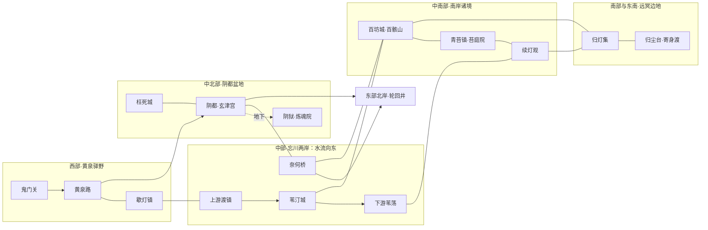

# 冥界蓝图

> 阶段：第一至三步已确认；第四步·总览与世界书落地已完成，待用户验收。
> 依据：`Doc/大陆细化规则.md`、现行全局规则及本轮对话确认。总览、人物分组和创作清单已同步，正式地图留待第五步。落地说明见第十一节。

## 一、总体设定

### 1. 定位与历史

轮回是这里的秩序，但不是这里所有人的生活。冥界以烟火志怪为主：接引长路之外，有田庄、渡镇、医馆、矿坊与长年不熄的街灯；有人慢慢修行，有人经营生计，也有人筹备下一次告别。

冥界是独立于凡界、灵界的幽冥世界，不采用浮空大陆与虚海结构。天地永暗，以雾光、冷焰与城灯照物。忘川由西向东贯穿已知地域，山地逐渐降为河谷、湿地与平原，南方丘陵再升入远冥山口。

轮回通道的来历早于现存宗门史。最初的聚落依接引驿站和渡口而生，留下的亡者带来阳间各地的手艺、语言与旧俗。灵气有限，常住人口却不断增加，各宗曾为招收新魂、占据阴脉和截留过境亡魂发生冲突。后来以玄津宫为首的诸宗订立《津岸约》，区分轮回沿线与留居地区的权责。

阳间战争、灾荒与迁徙会带来成批新来者，冥界于是留下不同年代的街区与行业。旧居民保存的是亲历和技艺，跨界大事的完整真相仍需查证。

### 2. 已确认的世界规则

- 轮回流程依照《轮回转生规则》，不另增选择分支。
- 冥族以幽魂、行尸、白骨、怨煞为主要形态，居民主体是普通冥族与低阶修士；少量阴地灵族、器物生灵生活于林地和城镇。
- 境界沿用灵界尺度，凡人至渡劫；冥界无法飞升，界内无天劫。冥族寿命无终，普遍接受漫长修行。此处不设置离界补劫。
- 冥界灵气稀薄，正常修炼非常缓慢。已确认界域灵气常数 D=0.5，E_realm=(0.5/L)^2；同境界且 E_local=0 时，界域项为凡界的1/16、灵界的1/144。宗门通过阴脉、聚灵阵与炼魂设施改善 E_local；实际修炼速度仍按原公式结算，不把界域项比例当作所有修炼途径的固定倍率。
- 冥族凡人以阳世焚烧后进入冥界的纸钱交易，修士使用灵石。纸钱不由冥界印制发行。
- 玄津宫只直接控制轮回沿线。普通亡魂可以选择轮回、加入宗门，或留作普通居民和散修。
- 炼魂将煞气转化为灵气，怨念越强，作为燃料的供给越持久。诸宗明面上只允许使用罪孽深重者，暗地存在掳掠普通亡魂的黑市。
- 冥族通过附身或夺舍获得阳间肉体，才能经非轮回途径重返阳间，寻求更快修炼与飞升。此途径称为“寄身渡”。
- 生者血肉在冥界极其稀有珍贵；缺少强大实力的生者一旦暴露，极易成为捕猎、争抢与交易的对象。

### 3. 《津岸约》与权力尺度

玄津宫、澄川宗、续灯观、百骸山和归尘台共同守约，苔庭院与地方政权据约参与相关事务。

1. 普通亡魂不被强迫轮回；拒绝轮回者是各宗共同的招收来源，玄津宫也可招收，不得扣留新魂强令入宗。
2. 轮回沿线的接引、审判与轮回井由玄津宫主持；南岸城邦自行管理居民与生产，各宗驻地按各自辖地行事。
3. 罪魂的拘押与炼用须有案据。涉及其他宗门、城邦居民时，由所属一方派员会勘；无主亡魂也不等同于罪魂。
4. 冥族可以迁居、谋生与拜师，普通争产、欠薪、邻里纠纷由当地政权处理。
5. 宗门之间以护送、用水、灵气供给和弟子招收协议结算利益；重大争议在奈何桥南侧的会津亭议定。

世俗主官、将领、行会代表最高金丹（L≤3）。元婴及以上威胁由庇护宗门介入。宗门中化神为中坚、返虚承担管事与长老职务、合体主持大宗事务；大乘仅留极少数，渡劫作为世界上限，人物数量与归属在第三步确定。

### 4. 寄身渡

寄身渡是一套联系阳间肉体、附身或夺舍、导引神魂过界的技艺，由少数宗门掌握。归尘台是公开受理此事的主要宗门，在远冥边缘经营渡台。

- 附身可以通过与阳间宿主约定合作实现；夺舍按已有神通设定处理，寄身渡不替代夺舍本身的能力要求。
- 渡台必须先联系到阳间承接肉体，再施行过界。各处渡台通向特定联系对象与地点，不是任意选择目的地的公共传送阵。
- 归尘台经营寻身、宿主联络与渡界施术，也与阳间少数修士有往来；隐秘势力则贩卖掳来的肉体和强夺机会。
- 还阳所得修炼环境取决于抵达的世界和地点；在阳间谋求飞升仍循该界修行规则。

## 二、空间结构与交通

### 1. 地域关系

| 生态 | 方位与相邻 | 核心聚落 | 社会支点 |
| --- | --- | --- | --- |
| 黄泉驿野 | 西部；东接阴都盆地与忘川两岸 | 歇灯镇 | 接引、旅宿、祭钱转递、新来者安置 |
| 阴都盆地 | 中北部；西邻驿野，南临忘川，东接下游河岸 | 阴都、枉死城 | 轮回管理、城坊生活、刑狱炼灵 |
| 忘川两岸 | 中部东西长带；北接阴都，南连南岸诸境，东抵轮回井外缘 | 苇汀城 | 农圃、航运、织造、治水 |
| 南岸诸境 | 中南部；北接河岸，南连远冥边地 | 百坊城、青苔镇 | 工坊、矿业、药圃与留居城邦 |
| 远冥边地 | 南部及东南山外；经山口联系南岸 | 归灯集 | 驿道、稀疏采集、寄身渡与边地探索 |

忘川西高东低，阴都位于中游北岸，奈何桥位于阴都东南。轮回井处于东部下游北侧台地，桥北官道通往井区。枉死城位于阴都西北的盆地支谷，阴狱位于阴都地下。鬼门关位于驿野西端，黄泉路贯穿驿野通往阴都。

奈何桥是轮回官道的固定桥梁；其他河段有供居民与货物往来的渡船。南岸去轮回井，经奈何桥接入北岸官道；自阴都赴井则沿北岸通行。

草图表示道路、水路与上下游关系，不代表比例；正式地图留待第五步。

### 2. 交通与资源循环

低阶居民主要搭乘驿车、渡船和结伴商队；阴都至奈何桥、轮回井的官道由玄津宫维护。澄川宗管理航标与护航，南岸工坊维修舟车，归尘台负担远冥主驿道的部分维护。

| 来源 | 输出 | 主要去向与换入 |
| --- | --- | --- |
| 黄泉驿野 | 旅宿服务、祭钱转递、劳力与各地手艺 | 向河岸购买食材织物，向南岸购买器具 |
| 忘川两岸 | 苇纤维、灯油、菌粮、舟运 | 供应阴都与南岸，换入工具、药品与护航服务 |
| 阴都盆地 | 文书服务、宗门教育、炼魂灵气及阵器维护订单 | 向各地采购物资，以灵石采购修行材料 |
| 南岸诸境 | 矿材、衣物、器具、医药、舟车部件 | 供应各聚落，换入灯油、纤维、纸钱与灵石 |
| 远冥边地 | 冷焰矿材、采集物、渡界服务 | 依赖南岸药物器具与河岸运输 |

灵石来自既有储藏、稀少灵脉与受限的阳间往来。炼魂所得首先是可供阵法和修炼使用的灵气，不等同于凭空发行灵石。

## 三、生态与区域灵感

### E01·黄泉驿野

- 方位：冥界西部，鬼门关后展开的长谷与缓坡；黄泉路东行至阴都，南侧支路接忘川上游。
- 环境：灰雾沿沟壑流动，路旁彼岸花在雾薄时显出暗红；岩壁渗水汇成浅沟，土地冷而偏干，天然灵气稀少。路标铜灯和驿钟标示行程。
- 居民与聚落：流动亡魂最多，常住者经营旅舍、修鞋、抄信和引路；少量碑石器灵与阴木灵族看护旧驿。歇灯镇沿官道呈长街，两侧小院租给初来者。
- 生产与交换：种植耐阴苔薯、采集花茎纤维，制作路衣、草席与灯罩。河岸粮油经驿车运入，南岸工匠在此雇工与接单。祭钱转递铺根据祭烧时附带的姓名、乡贯线索认领交付，疑似重名的另行核认。
- 普通资源：苔薯、彼岸花茎、灰岩、灯蛾；灯蛾聚集处常是灯罩漏隙，需要驿卒定期清理。
- 日常与风俗：驿舍留有不催客的“等人席”，有人坐一晚，有人租下整间屋。收祭时节长街摆出新灯，新来者常带来已经变化的乡音和做菜方法。路店忌擅拆寄物，也忌拿陌生亡者的死因作招徕噱头。
- 地标：鬼门关、黄泉路、歇灯镇、候乡台、会招棚。候乡台是朝向来路的高台，居民在此等信；会招棚由各宗轮值设席招收自愿留居者。
- 当前矛盾：祭钱铺与长住客争议寄存费，接引路线迁改影响店铺生意，不同宗门争抢有手艺的新来者。

区域灵感：

1. 【日常】客栈收到新来的阳间菜谱，厨娘做了三次都被老客说不像故乡菜，她请人找几位近年亡者来试味。
2. 【关系】一位织席匠终于等到旧友，对方却准备立即轮回；积攒多年的同行计划只剩下两日时间。
3. 【调查】两位同名亡者都来领取一包祭钱，包内夹着的旧称呼指向第三个人。
4. 【生产】阴雨使花茎纤维难以晾干，新招工的人提出改用南岸烘架，老作坊担心毁掉细丝。
5. 【旅途】一座路灯熄灭后，驿车连续走入废弃支道；修灯人需要找回被搬走的旧路碑。
6. 【社会】招收弟子的执事许诺食宿，到了驻地却只安排短工，几名新来者想取回寄存的行李另投别宗。

### E02·阴都盆地

- 方位：忘川中游北岸，西与驿野低坡相接；北侧石山环绕，西北支谷容纳枉死城，南面台阶街通向河岸。
- 环境：常年冷雾，山泉穿过城渠排入忘川支流。城中灵气集中在玄津宫驻地与公共阵枢，普通街坊仍稀薄。盆地高处石材干燥，低处住宅需要排潮沟。
- 居民与聚落：判官、鬼差、宗门弟子与普通居民同城分坊生活。阴都内城为宗门司堂，外城有租院、市场、学馆和夜戏台；枉死城既有候审院，也有长期居民经营的街巷。
- 生产与交换：以文书、制衣、石工、器物维修和宗门服务为主，菜蔬菌粮、灯油、矿材从河岸与南岸运入。城渠和路灯由城署雇工维护，高阶阵枢由玄津宫负责。
- 普通资源：墨苔、阴柳、砚石、渠螺。墨苔用于制墨，柳枝供编篮和作灯架；这些物产来自城郊圃地，不依赖刑狱。
- 日常与风俗：城钟开闭各市，休市后戏棚仍可营业。官服庄重，街坊衣饰则保留多地风格。辞居宴用于送别决定轮回的人，店契、借物与学徒安置常在宴前办完。忌冒用官牒拘人。
- 地标：阴都、玄津宫、判官司堂、阴狱、百灯街、枉死城、故人巷。阴狱深层炼魂院经阵渠向宗门供灵，地面百灯街则以食肆与裁衣闻名。
- 当前矛盾：刑狱供灵需求与案件复核互相牵制；久居者占据旧职位，新来者难获晋升；部分枉死城居民案结后仍愿留下，城市需要从候审管理转向常住治理。

区域灵感：

1. 【生活】裁衣铺为一场辞居宴改旧衣，衣主希望保留几百年前的袖式，学徒却找不到相应裁法。
2. 【关系】两名昔日敌将为院墙争执多年，突然共同来城署申请保住墙边的一株老柳。
3. 【调查】一名准备转交店铺的居民发现城契上的铺面宽度变了，测量牵出旧街改渠时遗漏的补偿。
4. 【社会】一批罪魂拟移入炼魂院，其中一人的案据与外地宗门记录不符，复核人员遭遇供灵期限的催促。
5. 【生产】城渠返潮损坏整条街的墨料，石工、墨坊和渠署需要共同找出堵塞处，不能只责怪临街摊贩。
6. 【日常】枉死城新开学馆缺少教材，老师请人从旧居民手中收集各地算术和手艺笔记。

### E03·忘川两岸

- 方位：沿忘川自西向东展开，北岸连接阴都和轮回井外围，南岸经丘陵支道通百坊城与续灯观。
- 环境：主河深而阴寒，支汊和堤后浅塘适合生产；雾潮有周期性涨落，河风推动苇浪。自然阴气充足但可直接修炼的灵气有限，水脉节点多由澄川宗维护。
- 居民与聚落：船户、种植户、织工和商贩构成多数。幽魂与行尸混居于高脚沿河屋，白骨船工偏用耐潮油衣，少量水生妖族所化冥族经营深水作业。
- 生产与交换：堤后种苇麻、油蒲，潮湿棚室培菌；苇汀城集中榨油、织席、造绳和修船。干货上行入阴都，木石器具从南岸换来，远冥商队在城中补给。
- 普通资源：苇麻、油蒲、灰鳞鱼、泥螺、河砾。支汊鱼产供食肆，油蒲籽榨取灯油；不把忘川主流当作普通采集池。
- 日常与风俗：以开堤、收蒲、修船安排农时，灯渡节沿支渠挂灯纪念建堤人。船家忌私改航标，田户忌在上游随意排放染液。长桌船宴常由邻里轮流出一道菜。
- 地标：苇汀城、澄川宗、奈何桥、会津亭、九汊堤、轮回井外围官道。轮回井由玄津宫管辖，不属于苇汀城税区。
- 当前矛盾：上游疏浚改变下游水位，运送炼魂物资的船队与粮油船争用泊位，各镇对修堤摊派意见不一。

区域灵感：

1. 【生产】油蒲收成很好，旧榨坊却坏了主轴；船队离港前，工匠必须在维修与临时改装之间作出选择。
2. 【旅途】载客渡船因雾潮改泊小村，乘客有人急赴辞居宴，有人反而想在此住下。
3. 【关系】船户准备传船给徒弟，两岸码头却分别认可不同继承人，牵涉多年的共同出资。
4. 【调查】灯渡节航灯被调换，真正受益的不是盗货者，而是一家想迫使大船改道的旧渡铺。
5. 【社会】九汊堤修高后，另一岸田地开始积水，两镇希望澄川宗出面主持重新分水。
6. 【冒险】春汛般的阴潮冲开旧船坞，里面尚有可用船骨；打捞队需要应对暗流、塌顶与产权争议。

### E04·南岸诸境

- 方位：忘川以南的丘陵、盆谷与低山，北有通往奈何桥和苇汀城的道路，南经灰梁山口进入远冥。
- 环境：北部坡地由河雾滋养，中部矿山较干，东部阴泉汇成药谷。菌林沿湿坡成片，岩隙出产矿材，少数阴脉被宗门和工坊共同利用。
- 居民与聚落：常住冥族最多，独立工匠、散修与宗门家属杂居。百坊城围绕矿货、制造和修复形成，青苔镇周围有药圃与村庄；居民保留生前族群习惯，住宅也各异。
- 生产与交换：百骸山周边冶炼、锻造与附体器具制作兴盛，东谷培药、制香和疗养并行。矿粮药材由驮车运至河港，水运换回纤维、灯油与食材。普通人可以靠种植、搬运、缝衣、做饭长期谋生。
- 普通资源：阴铁、灰铜、柔丝菌、眠灯草、穴螈。柔丝菌用于纺线，眠灯草供医药和香料，穴螈多见于矿泉旁，并非所有矿洞都有灵兽。
- 日常与风俗：工坊以成器日祭先师，药谷有交换苗种的分芽会。街边修形铺与裁衣铺相邻，医馆外有调息长廊。忌擅取他人附体器，工匠更忌把借修物当作无主材料拆卖。
- 地标：百坊城、百骸山、青苔镇、苔庭院、续灯观、灰梁山口、旧铜坊。旧铜坊保留早期留居者建城的公共熔炉。
- 当前矛盾：矿业引水挤占药谷用水，工坊传承久无更替，黑市以廉价修形服务为幌子寻找可掳掠的孤身亡魂。

区域灵感：

1. 【日常】一位白骨琴师想把修补后的指节调回旧琴感，炼器师需要听她反复试奏才能找到差别。
2. 【生产】新矿井渗水使药谷阴泉变浊，矿户与医师各执检测结果，需要沿旧巷共同勘查。
3. 【关系】离开多年的作坊创始人回城另开新铺，昔日学徒已是行会领头人，两家都声称保留正统手艺。
4. 【调查】便宜修形铺留下的器具暗记总在夜市失踪案附近出现，一位失踪者的邻居希望先找人再惊动店主。
5. 【社会】新来工匠想按件取酬，旧行会坚持先做多年学徒，世俗议会准备修改用工章程。
6. 【旅途】分芽会临近，运苗驮车在山口折轴；替代路线经过干燥矿坡，需要临时搭建保湿篷。

### E05·远冥边地

- 方位：南岸丘陵以南、东南山外的广大边缘地带，经灰梁山口和续灯观东南驿道与内地连接。
- 环境：低山逐渐升为黑岩岭，岭外有冷焰砂原、沉城盆地和无声谷。水源零散，风从岩隙穿过时遮断远处声响，路灯间隔较长；灵气薄且分布不均，采集营地依靠定期补给。
- 居民与聚落：采矿者、向导、远行散修、归尘台弟子与少量避居者。归灯集是入边地前最后一处完整市镇，外侧驿站多为可容商队停宿的院堡。
- 生产与交换：采冷焰石、镜砂和耐磨黑岩，处理后运往南岸。归尘台经营寄身渡与联络服务，收入的一部分用于驿道和集镇；谷地小棚培菌，只能补充食材，主要物资仍来自内地。
- 普通资源：冷焰石、镜砂、黑岩、伏砂蛾、壁耳菌。冷焰石是地方矿材名称，不直接等同高阶异火；选矿与精炼决定用途。
- 日常与风俗：远行者出发时给店家留一盏寄灯，归来取回；灯只记录约定，不自动感知远方情况。归灯集偏爱浓味菌羹和耐磨厚衣。禁擅挪路标，借用驿井必须留下足够下一队使用的净水。
- 地标：归灯集、归尘台、照隙渡台、无声谷、沉灯旧城、灰梁山口外驿。沉灯旧城是曾被改道商路绕开的旧聚落，部分遗址仍有人居住。
- 当前矛盾：寄身渡名额、阳间肉体来源和跨界联系引发竞争；旧驿失修迫使商队绕路；偏居者与采矿队对土地和井水的使用存在分歧。

区域灵感：

1. 【旅途】商队发现旧路灯仍亮着，灯下驿井却已干涸，需要决定折返还是请本地向导寻找侧谷水源。
2. 【关系】准备还阳的修士想带走旧友手制的琴，渡台提供的承接条件却容不下原器，需要另做安排。
3. 【调查】一份自愿寄身约中的阳间乡名已经改称数百年，联络者必须核实宿主是否真实存在。
4. 【生产】镜砂矿脉穿过隐居者的药棚地基，采矿队愿付灵石，对方只要求保住种了多年的菌床。
5. 【社会】归灯集接到一批价格异常低的肉体交易邀约，消息吸引争买者，也引起归尘台内部对货源的怀疑。
6. 【冒险】沉灯旧城仍有人按旧时刻敲市钟，一支寻路队需要在断街、风穴与有人居住的旧宅间找到可用通道。

## 四、宗门

### S01·玄津宫

- 简介与理念：冥界历史最久、势力最大的轮回宗门，以“疏其来，定其罪，送其往”为宗旨。推动亡者轮回以减少灵气负担，同时招收自愿留下的弟子。
- 位置与规模：宗门中枢位于阴都内城，沿鬼门关、黄泉路、奈何桥、轮回井设常驻机构；大型宗门，拥有少量顶层修士和覆盖沿线的弟子体系。
- 声望：接引与审判的权威，也是诸宗忌惮的炼魂供灵大宗。沿线居民依赖其秩序，涉及刑狱时又保持距离。
- 组织：宫主与长老议事；接引院管理关驿，判官司审案，轮回院守井，炼魂院运营刑狱灵炉，外务院协调诸宗。鬼差是执法与接引职务，阴兵属于宗门护卫。
- 修行：神魂功法、镇魂术、封禁阵法、炼魂转灵与阴火炼器；技艺落入现有阵法、炼器等体系。
- 地标：判官司堂、会灯阶、阴狱、炼魂院、轮回井。
- 产出与服务：轮回沿线公共秩序、弟子教育、受约束的罪魂炼灵、阵法供能。炼魂灵气首先供宗内使用，也按协议供给合作设施。
- 对外：与澄川宗协作维护桥渡，与百骸山采购炉器，与续灯观合作治伤。其他宗门派员参与涉及其居民的罪魂会勘；玄津宫不能借供灵之便接管南岸日常行政。

### S02·澄川宗

- 简介与理念：忘川航运和治水大宗，认为修行者应先使河道可行、两岸可居。
- 位置与规模：苇汀城上游堤台，大型宗门；弟子分布各段渡镇，合体层级主持宗务，返虚承担河段总管与长老职责。
- 声望：船户信任其护航与救援，田户则常对分水裁决不满。
- 组织：宗主、护河长老；堤工院、舟行院、水脉堂、巡渡队和授徒水院。
- 修行：水法、护舟阵法、镇魂与水下作业；修船与航标制作采用炼器技艺。
- 地标：听流台、千桩船坞、九汊堤。
- 产出与服务：治水、护航、造船、航标维护、船户学徒教育。
- 对外：庇护苇汀联埠，与玄津宫划分轮回官船和民用航道；采购百骸山部件，与苔庭院议定农圃水额。

### S03·续灯观

- 简介与理念：魂体医术与调息传承，主张使留居者有稳定的生活与修行条件。
- 位置与规模：南岸东部药谷，中型宗门；返虚修士主持诊疗体系，少量高阶隐修守护山谷。
- 声望：诊疗可靠、愿接外来病患，疗养院长期床位却供不应求。
- 组织：观主、医理长老；调息院、修形房、药圃、巡诊队与教习堂。
- 修行：神魂调息、医术、炼丹和药材培育；不同形态采用不同诊疗器具。
- 地标：长息廊、静泉院、续灯药圃。
- 产出与服务：疗养、魂体损伤诊治、修形协作、药材和医师培养。
- 对外：与苔庭院互换药种，与百骸山合制修形器；为玄津宫提供医疗但不参与刑狱经营。共同庇护青苔乡约，反对矿业污染药谷。

### S04·百骸山

- 简介与理念：由不同形态的工匠共同建起的炼器大宗，重手艺、重交付，也重师承。
- 位置与规模：百坊城南侧矿山，大型宗门；合体层级主持宗务，返虚管理主炉、矿区和传承工坊。
- 声望：修形与器具制作精湛，老派工坊收徒年限漫长，年轻匠人常另寻出路。
- 组织：山主、掌炉长老；矿务堂、主炉院、修形坊、舟械坊与传艺堂。
- 修行：金土功法、阴火控制、炼器、附体器制作和矿脉阵法。
- 地标：百骸主炉、旧铜坊、回音矿廊。
- 产出与服务：日用工具、魂体用具、修形部件、舟车、灵炉与城防器械；向世俗作坊传授基础技术。
- 对外：庇护百坊城盟，向玄津宫供应炼魂炉器，向澄川宗供应船械；与青苔乡约围绕矿水发生争议。

### S05·归尘台

- 简介与理念：研究寄身渡的宗门，将还阳视为修行道路而非对冥界生活的背弃。
- 位置与规模：远冥东南高台，中型而专精；合体层级掌控主要渡台，返虚承担过界施术与联系维护。
- 声望：还阳求道者趋之若鹜，寻身费用高、等待漫长，其外务人员也容易卷入肉体交易。
- 组织：台主、守渡长老；寻身堂、契身院、照隙阵房、行旅队与外务席。
- 修行：神魂寄附、阴阳感应、空间阵法与渡界器制作；夺舍沿用既有能力要求。
- 地标：照隙渡台、寄灯廊、候身院。
- 产出与服务：宿主联络、寻身、寄身渡施术、远冥护送与驿道维护。
- 对外：庇护归灯集，与阳间少量修士有隐秘往来；从百骸山采购渡器，从续灯观聘请调息医师。与玄津宫在留居者去向和招徒上既合作又竞争。

### S06·苔庭院

- 简介与理念：培育阴地作物、经营药圃的地方宗门，认为可持续收成比一次耗尽地力更重要。
- 位置与规模：青苔镇西侧湿坡，小型宗门；化神至返虚的实务修士主持培育与地脉事务。
- 声望：农户亲近，收费平实；面对大型矿宗时需要借助续灯观和乡约共同议价。
- 组织：院主、圃务教习；育种圃、分水房、巡田队与授艺小院。
- 修行：木水功法、培育、土壤调养、药材初制与小型聚灵阵。
- 地标：分芽台、重棚菌圃、留水塘。
- 产出与服务：菌粮、药苗、纤维作物苗种、农艺教育与病害治理。
- 对外：与续灯观共同庇护青苔乡约，与澄川宗协商水源，与百骸山协调矿水治理；向归灯集提供便于远途携带的菌种。

## 五、世俗政权与庇护关系

以下政权服务冥族凡人与低阶修士；主官、将领和行会代表均不超过金丹。凡俗防卫以巡卒、护村队、舟队和联合阵具为主，高阶威胁按各项庇护约定处理。

### K01·阴都城署

- 简介、疆域与政体：管理阴都外城、枉死城常住坊和歇灯镇；由坊社推举办事代表、玄津宫认可署令的城署制，议事中心为阴都外城的听坊厅。内城宗务、刑狱和轮回井由玄津宫直接管理。
- 行政与军事：下设坊正、渠务、工税、客籍和市务；歇灯镇设驿市分署，枉死城设居坊分署。巡卒处理盗窃、失火与街市争执，鬼差另负责宗门接引和相关执法。
- 经济与社会：纸钱用于租金、薪酬和普通货物；修士交易用灵石。居民重视故里会馆与行业先师，辞居宴和迎灯市最盛，禁冒官拘人、侵吞寄物。
- 庇护交换：城署以市税份额、道路用地、灯渠维护和公开招徒场地支持玄津宫；宫方承担元婴及以上袭击、重大阵枢故障及轮回沿线灾害。
- 权责与制衡：玄津宫不直接指定普通店铺经营、学徒工资与房屋租赁；宗门占用民居须经城署议价。涉及其他宗门居民的争议可由对方派员参加会勘。
- 对外：向苇汀联埠采购粮油，与百坊城盟订维修订单，接纳各地同乡会。

### K02·苇汀联埠

- 简介、疆域与政体：忘川民用渡镇和堤后田村组成的联埠，苇汀城为议事中心，各埠依公共工役和人口推举代表，轮值主持水市议事。
- 行政与军事：设堤务、田务、泊务和秤市；舟巡检查私改航标与盗货，田村有护堤队。轮回井与奈何桥宗门辖地不纳入联埠税区。
- 经济与社会：灯油、纤维、织物、鱼产与运费构成收入；尊重建堤先师和船行祖师，以灯渡节、开堤会相聚，禁私改水标、侵占公用泊位。
- 庇护交换：各埠提供护河粮油、修船泊位、弟子招收与按船额分摊的护航费用；澄川宗应对元婴及以上水患异物、修士劫船和大段堤阵损坏。
- 权责与制衡：普通船价、田租、分家与摊位由联埠管理；宗门征用民船需约定补偿。河段分水争议由上下游共同测水，再请苔庭院等用水方旁议。
- 对外：为阴都供给物资、为南岸承运矿器，与归灯集固定交换补给货单。

### K03·百坊城盟

- 简介、疆域与政体：百坊城及附近工匠镇组成的城盟，由作坊街坊、矿户和普通住户共同推举议席，议事中心为旧铜坊旁的百工堂。
- 行政与军事：设工务、矿路、户居、契市和仓务；城巡与矿路护队负责日常治安，城防阵由庇护宗门维护。
- 经济与社会：制造、维修、矿货与转运为主，雇工可取纸钱，修士订单以灵石结算。尊师承也祭共同建城的先匠，成器会展示新作；禁拆卖寄修物、私封公共矿路。
- 庇护交换：向百骸山提供矿区使用、炉料份额、舟械订单和公开授徒场地；山门应对元婴及以上袭扰、重大矿脉灾害与城防阵失效。
- 权责与制衡：工价、雇佣、店契与一般行业纠纷由城盟裁定，宗门不能以师承为由收走世俗作坊。涉及矿水污染时，城盟与青苔乡约共同组织勘查，必要时请澄川宗复核水路。
- 对外：向各地出售器具，同苇汀联埠互保运输，与青苔乡约交换药材和矿区土地使用意见。

### K04·青苔乡约

- 简介、疆域与政体：药谷、湿坡村落和青苔镇组成的乡约自治体，以青苔镇分芽厅为中心，由各村轮值乡议，不采用长期世袭村权。
- 行政与军事：田册、分水、仓储、乡医和集务分任；护村队巡田守仓，重大威胁依宗门庇护。
- 经济与社会：药材、菌粮、香料与苗种交换为主；祭先农和授艺医师，分芽会互赠苗种，禁把病苗混入交换、截断公水。
- 庇护交换：为苔庭院提供试种田、种苗留存、农务工役，为续灯观提供药材与疗养院用地；两宗共同承担元婴及以上侵扰、区域性药害和泉脉损坏，按擅长事项分工。
- 权责与制衡：村落决定普通田租、继承、集市和轮值人员；宗门扩圃须经乡议。遇百骸山矿业争议，由续灯观支持乡约参与跨宗协商。
- 对外：向阴都与远冥供药，同河岸交换油蒲与苇纤维，为百坊工匠提供诊疗。

### K05·归灯集约

- 简介、疆域与政体：归灯集及两条主驿道上的常住驿堡组成的集约，商户、向导、井户和居民推举轮值集正，议事中心设于寄灯公堂。
- 行政与军事：分管路务、井务、仓市、客宿和契务；巡路队保护近郊车队，远程危险护送另请宗门。
- 经济与社会：采集物、补给、寄宿、向导与渡界相关服务繁盛；敬重开路者与守井人，归灯会迎接远行归队，禁移路标、占尽驿井和冒领寄灯。
- 庇护交换：向归尘台提供渡台周边用地、驿道工役、生活物资和外来求渡者接待；台方应对元婴及以上袭扰、关键驿道封阻与渡台影响集镇的阵法事故。
- 权责与制衡：集约管理普通住宿、地租与市场，归尘台主持寄身渡施术，不得挪用寄宿者财物充作渡资。争议在集约与宗门契身院之间核验，涉及其他宗门时请对方共同处理。
- 对外：依赖百坊器具、青苔药物和苇汀补给；接待各宗求渡者，阳间联络仍由掌握技艺者办理。

## 六、普通生活与故事尺度

### 1. 纸钱、祭祀与谋生

阳世焚烧的纸钱进入冥界，成为可转手的日常货币。有后人祭祀的居民获得外来收入，无人祭祀者可凭劳动、经营与交换取得纸钱。祭钱来源造成贫富差异，也促成寄存、认领、转递和旧钱整理行业。

纸钱样式随阳间风俗而异，市面按当地认可的券式议价；本阶段不设新的兑换数值。普通商品以纸钱计价，修行材料、功法与宗门专业服务以灵石计价，需要互换时由交易双方议价。

祭钱减少不等于生活停止：旧居民可以开店、种田、受雇或住进朋友合办的院落。祭祀是人与阳间的关系之一，不承担整套社会的全部生产。

### 2. 衣食住行

幽魂多用便于凝形操持的轻器，行尸偏爱耐潮衣料，白骨居民常将修形铺与衣铺一同拜访。器具差异落实在用途和制作上。

苇荡灯油、菌棚食材、灰鳞鱼、药谷香料支撑日常食肆。食物既是滋味也是旧习，餐桌不负责代替修炼资源。城市以钟声分作息，田户依雾潮与作物安排生产，历法沿用既有纪年。

房屋、手艺、友情会跨越漫长岁月，但并非永远不变：旧铺换了主人，徒弟另立门户，轮回与还阳带来离别，新亡者不断带来新的生活方法。

### 3. 可选远期主线

- 忘川改道：上游工程改变航运与田地，牵动宗门供给和城邦税源，起点可以只是一次修堤委托。
- 炼魂供给争议：某处灵炉获得异常持久的供给，账上罪魂数量却没有变化，逐步牵出非法魂源与宗门利益。
- 寄身渡联系中断：阳间联络点失去消息，多宗求渡者滞留归灯集，商旅、宿主关系和宗门外交相继受影响。

## 七、后续回填清单

以下为第四步回填范围（已完成）：

- 将八个轮回地点归入本蓝图的五片生态，保留关键名称并调整地图关系。
- 总览中的轮回抉择文案与《轮回转生规则》统一，不自行改动轮回规则。
- 将冥界境界、无天劫及不能界内飞升的设定接入相应世界与突破规则。
- 将纸钱及寄身渡的设定接入经济、种族和地点内容；取代旧总览中以阴德或香火支付渡费、单纯拒汤即转冥族等冲突文本。
- 人物名册、关系与秘境流程见第八至十节；人物创作清单和秘境清单已按确认稿同步。

第二步规模：5片生态、6个宗门、5个世俗政权、30条区域灵感、1张空间关系草图。

## 八、人物名册

### 创作规模与年龄口径

本阶段声明并完成40人：女性36人（御姐24、少女8、萝莉4），男性4人。宗门人物21人，地方政务、生产、商旅及独立人物19人。大乘1人、合体4人，本轮不安排具名渡劫人物。

人物的“年龄”沿用现有种族规则：冥族记录转化时固定的历法年龄，另列“入冥”年数表示此后阅历；灵族和物化生灵记录自身实际年龄。外观分类与年龄分列。白骨人物的外观分类指其平日凝形或附体形象，原身特征另写。

### 玄津宫

#### C01·谢照衡

- 身份：女；御姐；冥族·幽魂；大乘初期；年龄12600岁，入冥64000年；玄津宫太上长老，驻会灯阶后殿。
- 外貌与衣饰：银黑长发，眼底有淡金细环，着无纹玄色长衣，腰悬旧铜衡；常用法宝为衡、印、阵盘。
- 性情与生活：寡言却记得旧人的小习惯，爱收各地茶碗，客人打破一只便让对方讲一段当地风俗补偿。她维护《津岸约》，也承认宗门须靠炼魂供灵，对清空刑狱的空泛主张并无耐心。
- 职责与故事：不管日常案务，在诸宗争约时出面。阮停舟是她培养的继任宫主，顾判秋曾受她指点；涉及炼魂案据被篡改时，她要求查清责任，也担心整条供灵链骤停。

#### C02·阮停舟

- 身份：女；御姐；冥族·幽魂；合体后期；年龄3600岁，入冥28000年；玄津宫宫主，驻会灯阶。
- 外貌与衣饰：墨发高髻，狭长灰瞳，深青交领宫衣配素银肩扣；常用法宝为渡舟、令印、长剑。
- 性情与生活：说话从容，喜欢替人把话说完，遇到反驳反而会听得更认真。休沐时去百灯街挑旧戏本，常把悲戏改成团圆戏又嫌改得俗。
- 职责与故事：统筹接引、轮回与供灵，主张提高转生沿线便利而非强迫留居者离开。与沈湄共同维护桥渡，需在顾判秋的复核和乌绮炉的供灵期限之间作决定。

#### C03·顾判秋

- 身份：女；御姐；冥族·怨煞；返虚后期；年龄470岁，入冥17000年；判官司主判，驻判官司堂。
- 外貌与衣饰：乌发束低，暗红眼尾，领口浮着细黑雾，着窄袖墨袍；常用法宝为判笔、册、封禁索。
- 性情与生活：问话直接，不替人圆场，私下却会为一盘下坏的棋懊恼整晚。她经历过误判，不把怨念强烈当作有罪的凭据，也不会因同情省略调查。
- 职责与故事：审案与跨宗会勘。与杜绫常为城署移交范围争执，仍认可对方的测绘证据；调查旧炉夹层时，需要借白既明的运送记录核对案卷。

#### C04·乌绮炉

- 身份：女；御姐；冥族·行尸；返虚后期；年龄2200岁，入冥21000年；炼魂院掌炉长老，驻阴狱炼魂院。
- 外貌与衣饰：青白肤色，短发齐颈，指缝留有炉灰，着暗紫耐火长袍；常用法宝为魂炉、火钳、阵尺。
- 性情与生活：务实而惜才，习惯以损耗衡量事情，给徒弟补工具却从不记账。闲时修复旧陶偶，少了一只耳朵也要配到合意。
- 职责与故事：炼魂转灵、维护供灵阵渠；认可罪魂可炼，厌恶拿活人的善恶口号掩盖物资缺口。与商铸雪是长期合作的匠友，对墨悬铃提供的高效材料渐生疑心，但尚未掌握其来源。

#### C05·孟蘅

- 身份：女；御姐；冥族·幽魂；返虚中期；年龄780岁，入冥23000年；轮回院执事，驻奈何桥孟婆亭，沿用“孟婆”职称。
- 外貌与衣饰：灰白长发绾髻，平日凝形为眉眼温和的妇人，接引时常显老妪相；青布长衣配旧围裙，常用法宝为汤盏、壶、引路灯。
- 性情与生活：不催人说心事，听见客人撒小谎会笑而不拆穿；做糕总多放一勺糖。她记得不少旧客的口味，却不擅长记官署新换的称谓。
- 职责与故事：按现有轮回流程主持亭中接待，不另定转生条件。何晚炊是她的食谱笔友，纪问乡常托她留意旧识；故事重在送别、交还旧物与处理未尽的人情。

#### C06·白既明

- 身份：男；青年；冥族·幽魂；化神中期；年龄390岁，入冥11000年；接引院运送执事，驻鬼门关与黄泉路驿站。
- 外貌与衣饰：白眉、清瘦面容，灰色短披肩压着黑衣，随身一串磨亮的驿钥；常用法宝为引魂幡、铃、护路旗。
- 性情与生活：公事讲次序，赶路却总愿为路边修灯多停片刻；收藏各驿坏锁，认为每把都有不同脾气。
- 职责与故事：安排沿线队伍和交接，区别于黑白无常等既有接引称谓。秦寄笺常随他的车队转递祭钱；他能提供旧魂车经过何处的证据，却不知车内全部案情。

### 澄川宗

#### C07·沈湄

- 身份：女；御姐；冥族·幽魂；合体中期；年龄3100岁，入冥30000年；澄川宗宗主，驻听流台。
- 外貌与衣饰：长发泛水青，右眉有浅白断痕，深蓝束腰舟衣外披宽袖；常用法宝为水尺、舟、长绫。
- 性情与生活：讨厌绕弯，开会时会把话说得像报水位；爱钓灰鳞鱼，却常把鱼放回去后空手到江苇娘家蹭饭。
- 职责与故事：主导分水与护河，和阮停舟互信但不肯让官船长期压占民泊。她与叶苔生共同研究矿水入河，愿出力治水，不愿替矿宗承担全部费用。

#### C08·陶汐

- 身份：女；少女；冥族·幽魂；化神初期；年龄260岁，入冥8200年；堤工院勘水师，驻九汊堤。
- 外貌与衣饰：齐肩卷发，浅绿眼瞳，靴边常沾泥，穿短褂和分腿水裤；常用法宝为测水盘、标桩、绳索。
- 性情与生活：动作快、写字潦草，喜欢把测量结果画成小河兽。她愿意承认算错，却不爱重抄整本记录。
- 职责与故事：勘堤和事故定位；江苇娘曾供她初学时住船，关系如亲人。与邢九桩争论旧桩经验和新测法，必须一起解决九汊旧闸的暗涌。

#### C09·许泊

- 身份：男；大叔；冥族·行尸；元婴后期；年龄540岁，入冥6700年；舟行院船匠，驻千桩船坞。
- 外貌与衣饰：肤色灰褐，短须，肩背厚实，穿油布工衣；常用法宝为锤、钩、护舟符。
- 性情与生活：慢条斯理，不喜欢旁人催他收工；修完一条船会在看不见的地方刻一尾小鱼。常给迟纱留可做织梭的小木料。
- 职责与故事：修船、培养船匠，与陆缮合做机关舵。他主张修旧船，宗门采购则偏爱新造船；参与千桩沉坞打捞可为船户找回可用骨架。

### 续灯观

#### C10·程续微

- 身份：女；御姐；冥族·幽魂；返虚后期；年龄930岁，入冥24000年；续灯观观主，驻静泉院。
- 外貌与衣饰：乌发间夹一缕银丝，淡褐眼眸，素白长衣覆灰绿披帛；常用法宝为针、灯、药鼎。
- 性情与生活：诊疗时耐心，日常极怕麻烦，常把出门请柬压在盆栽下忘掉；偏爱听傅弦骨试新曲。
- 职责与故事：主持魂体诊疗与药谷庇护。与乌绮炉保持工作合作，但拒绝让疗养者成为供灵试材；与叶苔生共同应对矿泉污染，支持梁苗提出世俗田地的补偿要求。

#### C11·宋灯穗

- 身份：女；少女；冥族·幽魂；元婴中期；年龄180岁，入冥4300年；巡诊医师，驻长息廊。
- 外貌与衣饰：黑发编细辫，圆眼，灰白短医衣挂满小药袋；常用法宝为药匣、针、隔音铃。
- 性情与生活：爱说笑，给难吃的药起好听名字，被病人识破便承认；下诊后热衷街边棋摊，棋艺不高却很有气势。
- 职责与故事：往来青苔镇和百坊城，为修形作坊提供诊疗。她是陆缮的朋友，发现廉价修形铺留下的损伤模式相似，为调查失踪者提供医学线索。

#### C12·桑眠

- 身份：女；萝莉；灵族·阴桑；筑基后期；实际年龄860岁；药圃看护，驻续灯药圃。
- 外貌与衣饰：化形矮小，墨绿发梢如桑叶，手腕有木纹，穿宽松褐衫和青色兜裙；常用法宝为育苗盆、水壶、枝杖。
- 性情与生活：慢热，喜欢独自数新叶，对熟人却会一本正经地讲拙劣笑话；爱把落叶压成整齐书签。
- 职责与故事：照料耐阴药苗，与罗芽互换种株，常向郑露畦学菌棚技巧。旧药园发生孢雾病害时，她最先认出被换过的灌溉方式。

### 百骸山

#### C13·商铸雪

- 身份：女；御姐；冥族·白骨；合体后期；年龄4200岁，入冥33000年；百骸山山主，驻百骸主炉。
- 外貌与衣饰：平日以银灰长发、高挑人形示人，原身骨上嵌有细密铜纹；黑色工袍配宽腰带，常用法宝为炉、锤、阵尺。
- 性情与生活：欣赏巧思，却习惯替学徒决定道路；喜欢把废料做成会点头的小鸟，成品常比正式订单更费心。
- 职责与故事：主持主炉和宗门订单，与乌绮炉交情深。面对矿水争议，她起初相信矿务堂的说法，须由实地证据促成改变；莫重钧要求工价自治，也会触及她对师承的执念。

#### C14·殷小砧

- 身份：女；萝莉；物化生灵·炉砧器灵；化神中期；实际年龄9200岁；主炉院掌火师，驻百骸主炉侧坊。
- 外貌与衣饰：矮小化形，铁灰短发，金色眼睛，赤褐短袍外系皮围裙；常用法宝为砧、火钳、听炉铃。
- 性情与生活：脾气急，听到错火声就想插手；喜欢脆响的风铃，睡前却把它们全部取下。说话像敲钉，夸人也只有一句“这下对了”。
- 职责与故事：控制炉温和维护旧式炉具，是商铸雪倚重的技术骨干；与祝铜雀总为旧器该修还是该留争吵。旧铜炉腹可找到她本体旧纹的维修线索。

#### C15·陆缮

- 身份：女；御姐；冥族·行尸；元婴初期；年龄360岁，入冥5400年；修形坊匠师，驻百坊城修形坊。
- 外貌与衣饰：棕黑发束成短尾，脸颊有细缝修痕，穿窄袖青灰工衣；常用法宝为细凿、夹具、骨针。
- 性情与生活：爽快，讨厌顾客假装满意，常追问“走两步，到底卡不卡”；自己收藏许多只做了一半的玩具。
- 职责与故事：承接不同冥族的形体与附体器修整，和宋灯穗互相转介病患，与许泊合造船舵。傅弦骨的指节委托让她开始重视器具之外的演奏习惯。

### 归尘台

#### C16·裴归岫

- 身份：女；御姐；冥族·幽魂；合体中期；年龄2800岁，入冥26000年；归尘台台主，驻照隙渡台。
- 外貌与衣饰：长发以黑玉束起，瞳色如薄烟，月白长袍外披暗灰旅氅；常用法宝为渡镜、阵盘、魂舟。
- 性情与生活：善于等待，不喜欢把愿望说满；收藏阳间山川画，尤其偏爱没有名胜的小路。她自己有还阳打算，却一再把合适机会让给门内急需之人。
- 职责与故事：主持渡台、阳间联络与驿道庇护。和阮停舟对亡魂去留的利益不同，但认可《津岸约》；闻契萤是她的亲传弟子，邵寻枝的货源判断则让她时常头疼。

#### C17·闻契萤

- 身份：女；少女；冥族·幽魂；返虚初期；年龄620岁，入冥16000年；契身院主事，驻候身院。
- 外貌与衣饰：乌发半束，眼神清亮，藏蓝长衫衬细银边，袖里常夹窄纸；常用法宝为契印、照影镜、封函匣。
- 性情与生活：认真到有些较劲，休息时喜欢猜字谜，猜不出会绕路问第三个人；不擅长安慰失望的求渡者，却会记住下一次联络时帮他多问一句。
- 职责与故事：核实宿主联系、安排寄身契约，不靠纸面签字替代实际核验。与黎归枕合作处理滞留旅客，对邵寻枝带回的过时乡名起疑，牵出断照镜窟的联络异常。

#### C18·邵寻枝

- 身份：女；御姐；冥族·怨煞；化神后期；年龄510岁，入冥12000年；寻身堂外务，常驻归灯集与寄灯廊。
- 外貌与衣饰：红褐长发，左耳挂铜叶，暗色披风内是便于赶路的短衣；常用法宝为寻息盘、短刀、渡符。
- 性情与生活：会交朋友也会算价，喜欢在酒桌上讲自己吃过的亏，真正难堪的事却避而不谈。她珍藏几截阳间干枝，以分辨不同地方的气味。
- 职责与故事：寻找肉体来源和联络人，对灰色中介容忍度高，但不愿门内弟子成为替罪人。燕折枝是她的旧识，双方互相利用；闻契萤的核验可能迫使她交代被隐去的一次交易。

### 苔庭院

#### C19·叶苔生

- 身份：女；御姐；灵族·阴苔；返虚初期；实际年龄18000岁；苔庭院院主，驻留水塘。
- 外貌与衣饰：深绿发髻松散，皮肤有极淡苔纹，褐绿长衣配草编带；常用法宝为培土盘、枝杖、引水瓶。
- 性情与生活：平时随和，遇见浪费种苗便变得刻薄；爱尝新口味，失败的菌羹也坚持自己喝完。
- 职责与故事：主持地脉培育、乡约庇护，与程续微协作，向沈湄争取分水。她愿意试改良种，却不赞同梁苗急于扩大收益而铺开全部试田。

#### C20·罗芽

- 身份：女；萝莉；灵族·柔丝菌；金丹初期；实际年龄2100岁；育种圃教习，驻重棚菌圃。
- 外貌与衣饰：淡灰蓬发，眼瞳呈浅褐环纹，小个化形穿宽袖短袄与围裙；常用法宝为菌种匣、喷壶、细丝网。
- 性情与生活：好奇心重，热衷给菌株起绰号，讲课常因新发现偏题；和桑眠见面先交换新做的书签，再谈苗种。
- 职责与故事：保存菌种、教习培育，和郑露畦是合作试种者。她想尝试新灌溉法，旧药园事故会让她学习区分一次好收成与可长期推广的技术。

#### C21·崔雨箬

- 身份：女；少女；冥族·幽魂；筑基中期；年龄96岁，入冥1700年；巡田弟子，驻青苔镇周围村落。
- 外貌与衣饰：黑发扎双辫，浅棕眼，袖口绑紧的灰绿短衣，背编筐；常用法宝为土签、水尺、驱虫铃。
- 性情与生活：勤快又好胜，会偷偷练习教习讲课的腔调；喜欢搜集奇形石子，筐里常比别人多一份重量。
- 职责与故事：巡田测水、运苗和传报，受叶苔生教导，给梁苗提供基层水况。她从矿道采来的浑水样能连接乡约诉求与高阶宗门调查。

### 阴都、歇灯镇与枉死城

#### C22·杜绫

- 身份：女；御姐；冥族·幽魂；金丹后期；年龄280岁，入冥6500年；阴都城署署令，驻听坊厅。
- 外貌与衣饰：黑发盘紧，眉目端整，青灰署服不佩宗门纹，常携量地绳和册页；法宝为印、护身符、测地盘。
- 性情与生活：讲话利落，私下爱听说书，听到不合情理处会插嘴纠正。她希望街坊能自行办事，却常忍不住亲手接过来。
- 职责与故事：协调城坊、税务与迁居，面对高阶争议向玄津宫求援。和顾判秋争权责而非修为；温剪秋的铺契案让她重查旧渠改建的民居补偿。

#### C23·温剪秋

- 身份：女；御姐；冥族·幽魂；凡人；年龄67岁，入冥940年；百灯街裁衣铺主人，驻阴都外城。
- 外貌与衣饰：灰黑发绾髻，笑时眼角起纹，紫褐长衣外罩布围腰；用物为剪刀、尺、针匣。
- 性情与生活：嘴上嫌客人挑剔，手上总多留一道好拆的缝。喜欢改旧戏服给街坊试穿，常与何晚炊争论故乡颜色。
- 职责与故事：为普通居民和宗门缝衣，计划将店铺交给吴小灯。旧契尺寸争议牵出墨渠暗坊，她更在意保住柜台上几代人刻下的身高痕。

#### C24·吴小灯

- 身份：女；少女；冥族·幽魂；炼气中期；年龄32岁，入冥180年；裁衣学徒，驻温剪秋衣铺。
- 外貌与衣饰：短发别骨针，圆脸，穿改过多次的靛色短衣；常用法宝为控线针、轻剪。
- 性情与生活：爱新鲜花样，夸自己时毫不脸红，真正被师父夸了却忙着找事做。闲时替戏棚画夸张面具。
- 职责与故事：接单、量衣和学习经营，想保留老铺又增加新式服饰。她与迟纱互换花样，接到辞居宴衣单时要独立处理师父不愿放手的部分。

#### C25·纪问乡

- 身份：男；大叔；冥族·幽魂；凡人；年龄58岁，入冥1200年；枉死城学馆先生，常往候乡台。
- 外貌与衣饰：鬓角花白，鼻梁低架旧镜，穿补肘长衫；用物为书、算盘、手杖。
- 性情与生活：对学生耐心，对自己写的诗十分自负；明知写得平常，也坚持每逢节庆挂在门口。
- 职责与故事：教授文字、算术与各地旧俗，案结后选择继续留居。与孟蘅往来多年，托秦寄笺寻找旧友的消息；回响书院可补全他的乡学教材。

#### C26·何晚炊

- 身份：女；御姐；冥族·行尸；凡人；年龄54岁，入冥680年；歇灯镇客栈厨娘兼东家。
- 外貌与衣饰：深褐短发，手背旧烫痕，穿赭色布衣和厚围裙；用物为锅、菜刀、汤勺。
- 性情与生活：嗓门大，记客人口味比记姓名快，认准的菜式不轻易改；闲时会悄悄试新来的食谱。
- 职责与故事：提供食宿，收留过暂时无祭钱的秦寄笺，和孟蘅交换糕点做法。旧灶藏粮受潮时，她组织邻里清点，盼找回客栈创办时的一罐老种。

#### C27·秦寄笺

- 身份：女；少女；冥族·幽魂；凡人；年龄29岁，入冥76年；歇灯镇祭钱转递铺跑腿。
- 外貌与衣饰：乌发短辫，眉梢有小痣，穿灰布夹衣，挎带木扣的布包；用物为封袋、乡名册、油灯。
- 性情与生活：记路靠店铺香味，爱听别人讲家乡，自己的思乡话却常讲到一半转题；喜欢收集旧封袋上的花纹。
- 职责与故事：认领联络、送祭钱和找失联收件人，随白既明车队出行。重名寄物将她与纪问乡联系起来；遇到疑似拐带线索时，她先找可靠同行而非独自闯入。

### 苇汀联埠

#### C28·隋丈

- 身份：女；御姐；冥族·行尸；金丹中期；年龄310岁，入冥7200年；苇汀联埠轮值议首，驻苇汀城。
- 外貌与衣饰：灰发盘辫，身形结实，穿深蓝窄袖衣配宽腰封；法宝为水印、护舟旗、短棍。
- 性情与生活：习惯算清小账，对朋友请客却常抢着付。喜欢给孩子讲自己第一次掌船时的糗事，但每次都删去一段。
- 职责与故事：协调船税、堤工和田户代表，依靠澄川宗处理高阶威胁。与沈湄能直言争执，与邢九桩共同组织修堤；水位改变时须说服获益渡镇分担损失。

#### C29·江苇娘

- 身份：女；御姐；冥族·幽魂；凡人；年龄73岁，入冥10000年；苇汀城渡娘，住上游船屋。
- 外貌与衣饰：长辫夹银丝，肤色浅灰，宽袖收束在腰带里，戴旧苇笠；用物为橹、灯、缆绳。
- 性情与生活：识水、识人，却不喜欢别人把经验叫作神通。爱拿陶汐初学测水的糗事逗她，自己也会忘记收晾晒的衣服。
- 职责与故事：摆渡普通乘客，准备培养接班人后再考虑轮回。她与沈湄交好，但人生决定不受宗门支配；九汊旧闸的旧航线可由她口述定位。

#### C30·迟纱

- 身份：女；少女；冥族·幽魂；炼气初期；年龄41岁，入冥390年；苇汀城织坊织工。
- 外貌与衣饰：长发用织梭盘起，杏眼，浅褐布衣配青色围裙；常用法宝为控丝梭、针。
- 性情与生活：看似慢吞吞，谈起纹样便滔滔不绝；常把工资花在少见染料上，月底又认真算饭钱。
- 职责与故事：织席、灯罩和船帆补片，与吴小灯合做新衣，许泊给她留梭料。雾苇织窟的旧染池关系到新一季订单，不是修士独占的寻宝地。

#### C31·邢九桩

- 身份：男；大叔；冥族·白骨；筑基后期；年龄160岁，入冥2700年；联埠堤务工头，驻九汊堤。
- 外貌与衣饰：平日凝形为宽脸汉子，手指显露骨节，油布短衣常搭肩；法宝为桩锤、绳网、土符。
- 性情与生活：固执，听人讲原理总先说“我见过”，真有用的方法学得很快；喜爱用边角料做小船送邻居。
- 职责与故事：组织普通堤工，不能独自压制高阶水患。与陶汐互补，与隋丈争取工钱；打捞旧桩时发现某次工程记录与实际用料不符。

### 百坊城盟与青苔乡约

#### C32·莫重钧

- 身份：女；御姐；冥族·白骨；金丹后期；年龄480岁，入冥8400年；百坊城盟议首，驻百工堂。
- 外貌与衣饰：凝形黑发高束，原身左臂有旧铜接骨，黑褐工衣配短披肩；法宝为工印、尺、护身环。
- 性情与生活：说话稳，讨价时一寸不让；离开议堂喜欢亲自修邻居坏凳，修完又嫌对方坐姿不对。
- 职责与故事：主持工价、契市和城务，与商铸雪有师承渊源，但世俗议首身份独立。她与梁苗需要共同处理矿水问题；旧铜炉腹所得工艺可支持普通作坊自主生产。

#### C33·傅弦骨

- 身份：女；御姐；冥族·白骨；筑基初期；年龄230岁，入冥3200年；百坊城琴师，住旧铜坊旁小院。
- 外貌与衣饰：凝形乌发长垂、身姿修长，弹琴时指端骨纹隐现，穿暗绛宽袖衣；法宝为琴、调音石、护指环。
- 性情与生活：平时随和，音色稍有差别便坐立不安；爱看热闹，自己被围观时却会假装在试弦。
- 职责与故事：授琴、赴宴与为工坊校听器音。和程续微互为知音，委托陆缮修复指节；回音矿廊的异响需要她辨别机关声与真实呼救。

#### C34·祝铜雀

- 身份：女；萝莉；物化生灵·铜雀灯；炼气后期；实际年龄430岁；旧铜坊灯具铺学徒。
- 外貌与衣饰：矮小化形，棕铜短发，背后偶现雀翼光纹，穿圆领短衫和耐磨裙；本体为铜雀灯，常用小钳、灯芯剪。
- 性情与生活：喜欢亮晶晶的旧物，嘴上说只是修好再卖，柜里却越积越多；爱学殷小砧的口气，被当面撞见就低头擦灯。
- 职责与故事：维修居民灯具、整理旧灯芯，认识不少工坊日常。发现失踪修形客寄存的小灯后，托宋灯穗找人，连接民间互助与黑市调查。

#### C35·梁苗

- 身份：女；御姐；冥族·行尸；金丹初期；年龄260岁，入冥5700年；青苔乡约轮值乡议主持，驻分芽厅。
- 外貌与衣饰：短发压在布巾下，手掌宽厚，青褐长衣配束腿布；法宝为田印、驱虫幡、土盘。
- 性情与生活：爱算收成，对村民家的闲事也忍不住管；自家一小块花田却种得乱七八糟，从不让人替她整理。
- 职责与故事：统筹田册、分水与集市，向苔庭院、续灯观求援。她与叶苔生对试种规模有分歧，与莫重钧愿意坐下来谈矿水补偿。

#### C36·郑露畦

- 身份：女；少女；冥族·幽魂；凡人；年龄38岁，入冥520年；青苔镇菌户，驻重棚菌圃外村。
- 外貌与衣饰：发尾齐肩，眼神明快，灰绿布衣总卷着袖，背上竹筐挂细刷；用物为菌铲、喷壶、采收筐。
- 性情与生活：爱尝试，失败了也能认真描述菌子哪里不好吃；常和罗芽争谁先发现一种新长法，争完仍一起下厨。
- 职责与故事：独立经营菌棚，与桑眠交换培育经验。她靠劳动取得纸钱，担心矿水影响来季收成；在旧药园外围可承担培育与标记工作。

### 归灯集与独立人物

#### C37·黎归枕

- 身份：女；御姐；冥族·幽魂；金丹后期；年龄330岁，入冥6900年；归灯集约集正，驻寄灯公堂。
- 外貌与衣饰：墨发松挽，眉间常有淡倦色，深灰夹衣披暖色长巾；法宝为契印、护井符、短剑。
- 性情与生活：擅长让争吵的人先坐下，却常把自己的休息让出去；最喜欢无人打扰地修一件旧木家具。
- 职责与故事：协调驿井、住宿和补给，求渡者滞留时向归尘台索取应负担的开销。她与闻契萤合作，信任周栖砂的路线判断，不把宗门许诺当作已经到手的物资。

#### C38·周栖砂

- 身份：女；御姐；冥族·行尸；筑基中期；年龄190岁，入冥3600年；远冥向导，住归灯集西驿。
- 外貌与衣饰：栗色短发，脸上砂痕细密，厚实旅衣配护目布，靴底钉铜片；法宝为寻路盘、绳钩、风旗。
- 性情与生活：不轻易许诺抵达时辰，休息时却爱夸张地讲路上见闻；收藏不同驿井的杯子，每只都记得来历。
- 职责与故事：带队采集、寻路和运苗，与崔雨箬常有护送合作。黎归枕托她查失修驿道；她知道沉灯旧城尚有居民，不赞成把有人居住的旧宅当作无主遗迹。

#### C39·燕折枝

- 身份：女；御姐；冥族·幽魂；元婴后期；年龄610岁，入冥9000年；独立寻身中介，常出入归灯集，不属集约官署。
- 外貌与衣饰：乌发挑一缕红，细眉，墨绿长衣配可翻面的旅披；法宝为面具、寻息香、短刃。
- 性情与生活：圆滑，惯把坏消息包进好消息里，私下却极认真地养一盆长得很慢的苔。她认为别人的急切就是自己的生意机会。
- 职责与故事：为求渡者撮合肉体来源，既有真实联系，也掩盖过货源漏洞。与邵寻枝旧识，与墨悬铃有交易；调查者可从她手中买消息、设局核验或追查旧货单。

#### C40·墨悬铃

- 身份：女；御姐；冥族·怨煞；化神后期；年龄850岁，入冥14000年；独立魂材商，表面承接炼炉耗材，常住百坊城外货院。
- 外貌与衣饰：黑发如漆，瞳色暗紫，衣角附薄雾，绛黑长衫挂细铃；法宝为摄魂铃、魂袋、封禁针。
- 性情与生活：言辞客气，喜欢谈论材料的“物尽其用”，把他人的苦处当作可利用条件；听曲时讲究座次，真正喜爱的曲目却很朴素。
- 职责与故事：暗中经营非法魂材链，借燕折枝和廉价修形铺寻找孤身亡魂；向炼魂院出售掺有问题魂材的耗材，乌绮炉尚未查明。她是地方调查线的明确对手，不支配所有冥界事件。

## 九、人物关系与组织运行

| 关系组 | 已有关系与分歧 | 可进入的故事 |
| --- | --- | --- |
| 谢照衡—阮停舟—顾判秋—乌绮炉 | 传承、宫务、审判、供灵分工；守约与生产期限之间互相牵制 | 案据复核、旧炉检修、跨宗会勘 |
| 阮停舟—沈湄—隋丈 | 宗门合作、河道管理与民用利益不同 | 官船泊位、堤工摊派与下游补偿 |
| 顾判秋—杜绫—白既明 | 主判、城署与接引交接互有边界 | 移交记录、错误拘押与城契调查 |
| 孟蘅—何晚炊—纪问乡—秦寄笺 | 食谱笔友、旧识寻访、送信跑腿 | 告别宴、故乡消息与寄物认领 |
| 温剪秋—吴小灯—迟纱 | 师徒传店与跨城合作，旧款和新纹样并存 | 辞居衣单、染料采集与铺面修缮 |
| 许泊—陆缮—迟纱 | 合制机关舵，船坊木料供织坊制梭，技术和日常往来相连 | 沉坞打捞、船件维修与织梭改制 |
| 沈湄—陶汐—江苇娘—邢九桩 | 护河、测绘、老船经验与堤工相互补足 | 旧航线传授、暗闸勘查、接班人选择 |
| 商铸雪—莫重钧—殷小砧—祝铜雀 | 师承和民间经营交错；修旧器与换新器各有坚持 | 学徒工价、旧炉修复、公共灯具维护 |
| 程续微—陆缮—宋灯穗—傅弦骨 | 医师、匠师与琴师合作，有工作外的听曲交情 | 指节修形、器音校听、病患失踪 |
| 叶苔生—梁苗—罗芽—郑露畦—桑眠 | 宗门、乡约与种植户合作；试种速度和规模不同 | 药泉污染、苗种互换、旧园复耕 |
| 崔雨箬—周栖砂—黎归枕 | 运苗、向导与集镇补给合作 | 山口折轴、驿井修复与采集护送 |
| 裴归岫—闻契萤—邵寻枝 | 师徒和外务合作；契约核实与机会成本的分歧 | 联络中断、滞留安置与寄身渡筹备 |
| 邵寻枝—燕折枝—墨悬铃 | 旧识交易逐渐牵入非法魂材，所知范围不一 | 查货源、赎救受困者、追究供货责任 |

五个世俗政权均已有具名主事者；宗门主事人与世俗官员分开记录。重大调查由地方人员提供证据、专业人员解决技术问题、庇护宗门承担高阶对抗，人物不会因参与同一事件自动获得相同权限。

## 十、秘境与探索设计

每生态3处，共15处，每处4阶段。这里的秘境包括封闭旧设施、特殊地貌与遗迹；产权清楚的区域以委托、许可或约定开启。表内“收获”包含线索和阶段成果，物资奖励只在可取用的对应阶段结算，委托报酬另按既有任务规则定额。

### M01·失灯岔路

- 生态与位置：黄泉驿野，黄泉路西段废弃支道。
- 推荐境界：炼气至筑基；凡人可随修灯队走首段。
- 入口与开放：三盏旧路灯所在岔口；雾薄时可见旧路碑，白既明的检修委托提供灯钥。
- 结构与用途：错路—驿屋—灯井—旧路出口；以辨路、修灯为主，连接驿道改线和新来者安置。
- 核心风险与收获：雾中循环岔路、松动台阶和失控引路阵；可得炼气级旧灯零件、旧路线图与修灯报酬。

| 阶段 | 场景 | 险 | 解 | 获 |
| --- | --- | --- | --- | --- |
| 1 | 灯影照出三条相似岔路 | 随灯影走回原处 | 对照碑号与地面车辙，留绳标定位 | 真正驿道入口 |
| 2 | 驿屋里堆着移路时留下的箱柜 | 腐梁坠落、灯蛾扑火 | 支撑屋梁，遮灯分散灯蛾，再清点箱柜 | 改线图与完好灯罩 |
| 3 | 灯井底部旧阵盘仍在转动 | 阵纹引人踏空 | 以灰岩垫稳台阶，按检修图停阵更换灯芯 | 可用阵盘部件 |
| 4 | 支路尽头接回黄泉路 | 修好一灯后其余灯位偏移 | 两组协作校灯，使光线落在路碑上 | 完整路线与报酬凭据 |

### M02·候乡残亭

- 生态与位置：黄泉驿野，候乡台后方雾谷。
- 推荐境界：筑基至金丹；低阶可协助入口寄物整理。
- 入口与开放：石阶下旧亭门；持旧寄存木牌或受纪问乡委托整理遗物时开启。
- 结构与用途：外亭—回声廊—寄物室—归路庭；旧阵反复映照寄物者留下的片段，适合寻人和关系故事。
- 核心风险与收获：误认回声、心神牵引、陈旧封柜；获线索与获准处理的筑基级封存材料，私人物品归还权利人。

| 阶段 | 场景 | 险 | 解 | 获 |
| --- | --- | --- | --- | --- |
| 1 | 亭外挂着重名木牌 | 误牌触动闭门机关 | 核对乡贯、字迹与秦寄笺带来的封袋 | 正确寄物号 |
| 2 | 长廊不断传来熟悉乡音 | 被片段引离同伴 | 用绳线和定时敲击保持联系，辨别回声重复处 | 留物人的去向片段 |
| 3 | 潮湿寄物室内柜架倾斜 | 错开封条令旧阵缠身 | 支架承重，按寄物号解封，不强拆柜门 | 寄信、旧物及封存材料 |
| 4 | 庭院显示数次不同的离亭景象 | 将不同时期拼成一次经过 | 依封袋日期排序，再调归路灯 | 可核实的寻人线索 |

### M03·旧灶藏粮窖

- 生态与位置：黄泉驿野，歇灯镇客栈旧院地下。
- 推荐境界：炼气；凡人可参与通风后的清理。
- 入口与开放：废灶后的窖梯；何晚炊开放旧院，准备抢救受潮存粮。
- 结构与用途：灶间—风道—粮室—种柜；日常生产型探索。
- 核心风险与收获：霉雾、坍架、失效保鲜符；获普通种粮、旧菜谱、可修复的炼气级保鲜匣及委托酬谢。

| 阶段 | 场景 | 险 | 解 | 获 |
| --- | --- | --- | --- | --- |
| 1 | 旧灶下渗出湿雾 | 窖口积气、踏板松动 | 开侧窗排气，架绳梯下行 | 可用作业入口 |
| 2 | 排风道被菌丝堵住 | 乱烧使霉尘涌入粮室 | 湿布收集菌团，分段清理风道 | 恢复通风、找到进水口 |
| 3 | 粮架倾斜压住地沟 | 搬运失衡引起倒塌 | 先支架后搬粮，按霉变程度分拣 | 可用普通粮食 |
| 4 | 种柜由旧保鲜符封着 | 强撕符纸损坏种罐 | 对照灶侧符样缓解封存，检查种粒 | 老种、菜谱、保鲜匣 |

### M04·墨渠暗坊

- 生态与位置：阴都盆地，百灯街改渠后封闭的地下染墨作坊。
- 推荐境界：筑基至金丹。
- 入口与开放：温剪秋铺后旧排渠；杜绫组织城契测绘并获各铺进入许可。
- 结构与用途：渠口—旧街基—染池—量地室；城市调查与修缮。
- 核心风险与收获：积墨、坍砖、旧防盗阵；获历史测绘和补偿证据，筑基级砚石与可回收染墨归作坊协商分配。

| 阶段 | 场景 | 险 | 解 | 获 |
| --- | --- | --- | --- | --- |
| 1 | 排渠尽头墨水倒灌 | 水位随城渠启闭上涨 | 查渠署时刻，先封支闸再入 | 稳定退路 |
| 2 | 地下街基与地面墙线错位 | 砖拱承重不足 | 设撑柱，用量地绳对照旧墙标 | 原铺面边界 |
| 3 | 半凝墨池覆盖通道 | 墨雾扰乱视物 | 医术配制过滤布，沿池边分段排液 | 可回收墨料、排水路径 |
| 4 | 量地室内旧册被防盗阵封存 | 强取使墨迹散开 | 按工务印记解除阵锁，拓印再搬册 | 补偿记录与争产证据 |

### M05·阴狱旧炉夹层

- 生态与位置：阴都盆地，炼魂院停用旧炉与新阵渠之间。
- 推荐境界：化神至返虚；低阶在外部复核物资记录。
- 入口与开放：检修井；顾判秋与乌绮炉共同批准停炉会勘，进入者持当次检修令。
- 结构与用途：隔灵间—旧炉室—暗输槽—记录阵；炼魂供给争议的核心调查点。
- 核心风险与收获：残煞、封禁反噬、仍连通的供灵阵渠；主要收获为非法魂材证据和获准取样的化神级炉材，不获得整个灵炉。

| 阶段 | 场景 | 险 | 解 | 获 |
| --- | --- | --- | --- | --- |
| 1 | 隔灵闸仍与外院相连 | 贸然闭闸导致灵流倒冲 | 对照乌绮炉供流图，逐路分流 | 安全作业窗口 |
| 2 | 旧炉内沉积异常持久的煞垢 | 接触引起心神紊乱 | 镇魂阵隔离，以器具分层取样 | 异常魂材样本 |
| 3 | 炉后暗槽通向耗材仓 | 夹层封禁被卸货触发 | 阵法停锁，核对装卸痕迹与白既明交接 | 掺料途径、供货标记 |
| 4 | 检修记录阵留有被覆盖的批次 | 强行追溯损坏残存记录 | 按先后灵纹逐层拓录，和案卷比对 | 指向墨悬铃货院的证据 |

### M06·回响书院

- 生态与位置：阴都盆地，枉死城北侧停办乡学的封闭院落。
- 推荐境界：炼气至筑基；凡人可在入口书房整理书册。
- 入口与开放：故人巷旧学门；纪问乡受托重开乡学，原留守者同意清理。
- 结构与用途：字墙—讲堂—书阁—钟庭；文化传承与地方关系，不关联炼魂案。
- 核心风险与收获：重复训诫的旧教学阵、潮毁书架和断裂钟架；获普通手艺教材、地方旧俗笔记与炼气级留音器维修所得。

| 阶段 | 场景 | 险 | 解 | 获 |
| --- | --- | --- | --- | --- |
| 1 | 字墙混写几种旧乡字 | 错触教学阵锁住院门 | 请旧居民辨字，依课目排列 | 开门口令与乡字对照 |
| 2 | 讲堂回声不断要求背诵 | 重复声干扰专注 | 找到留音器，把循环课次调到末课 | 器具维修线索 |
| 3 | 书阁潮气积聚、木架倾斜 | 书页粘连，搬架压坏底层 | 通风、加撑、逐册分离晾护 | 算术、织造等教材 |
| 4 | 庭钟悬在断裂木架上 | 调响钟身使梁架脱落 | 先卸钟后修架，与居民议定新课时 | 重开学馆与留音器报酬 |

### M07·九汊旧闸

- 生态与位置：忘川两岸，九汊堤下方废弃分水闸群。
- 推荐境界：金丹至元婴；低阶参与堤上测绘。
- 入口与开放：低潮时露出的检修孔，澄川宗和联埠共同发出勘查委托。
- 结构与用途：检修孔—分流井—主闸—堤外水口；忘川改道主线节点。
- 核心风险与收获：暗涌、破损桩阵与上下游水压；获分水资料、金丹级旧水阵部件及工程报酬。

| 阶段 | 场景 | 险 | 解 | 获 |
| --- | --- | --- | --- | --- |
| 1 | 孔道被泥砂半埋 | 入内后潮水封口 | 按江苇娘口述核潮，设置绳线与排水管 | 内闸入口 |
| 2 | 分流井同时连着三条水道 | 误封一道增加另一侧压力 | 陶汐测压、邢九桩核旧桩，逐道试流 | 隐藏支流与旧桩位置 |
| 3 | 主闸轴裂、桩阵错位 | 强启导致闸板断裂 | 炼器补轴并重排水阵，分组控闸 | 可修复阵件、工程证据 |
| 4 | 堤外水口正对一片田地 | 快速泄流冲毁田埂 | 协调上下游分段排水、临设导流槽 | 分水方案与田地保全 |

### M08·千桩沉坞

- 生态与位置：忘川两岸，千桩船坞下游旧坞湾。
- 推荐境界：元婴至化神。
- 入口与开放：阴潮退后旧坞门出现，许泊组织打捞并核准旧船权属。
- 结构与用途：浮木带—沉船廊—坞机室—拖船槽；生产与水下探索。
- 核心风险与收获：坠木、缆阵缠绕、坞门失衡；获经分配的元婴级船骨、护舟阵图残页与修船订单。

| 阶段 | 场景 | 险 | 解 | 获 |
| --- | --- | --- | --- | --- |
| 1 | 浮木与铁链堵住坞口 | 锯断主链引起木堆翻覆 | 系住浮木逐层卸载，保留主链承重 | 开放坞口 |
| 2 | 沉船廊中旧缆阵仍缠着船骨 | 神识探入触发收缆 | 阵法减压，借水下器具固定收缆轮 | 可用船骨位置 |
| 3 | 坞机室一侧沉降 | 启机会拉裂船体 | 许泊与陆缮校机，先补支座再卸重 | 护舟阵图残页 |
| 4 | 拖船槽通往急流湾 | 起浮后船骨受横流冲击 | 两舟牵引、设置导流旗，分批外拖 | 分配船材及交付报酬 |

### M09·雾苇织窟

- 生态与位置：忘川两岸，下游苇荡旁旧染织洞坊。
- 推荐境界：炼气至筑基。
- 入口与开放：收蒲后从低水芦道进入；迟纱联系旧坊后继者许可试用染池。
- 结构与用途：芦道—晒纤洞—染池—试织房；农艺和织造探索。
- 核心风险与收获：软泥、缠丝菌和失控织机；获普通纤维、稳定染方与炼气级控丝梭部件。

| 阶段 | 场景 | 险 | 解 | 获 |
| --- | --- | --- | --- | --- |
| 1 | 芦道水下藏泥穴 | 负重陷入淤泥 | 探杆标路、铺轻苇垫分担重量 | 运料路径 |
| 2 | 晒纤洞挂满灰白菌丝 | 拉扯使菌丝裹住工具 | 调整湿度，切离老丝并保存嫩纤 | 可用纤维 |
| 3 | 旧染池因水质变化而变色 | 混池使整批染液报废 | 小样试染，分别沉淀过滤 | 新水质下的染方 |
| 4 | 试织房机关反复空转 | 梭臂打坏经线 | 停轴补齿、按纹样重新穿线 | 控丝梭部件、试织成品 |

### M10·旧铜炉腹

- 生态与位置：南岸诸境，旧铜坊公共熔炉下部停用铸室。
- 推荐境界：金丹至元婴。
- 入口与开放：成器会前例行检修，由百坊城盟与百骸山共同开放。
- 结构与用途：风箱层—导火廊—模范库—旧砧室；公共工艺与师承故事。
- 核心风险与收获：残火、重模塌落与试锤机关；获金丹级铜材、旧式工艺图及殷小砧的本体维修线索。

| 阶段 | 场景 | 险 | 解 | 获 |
| --- | --- | --- | --- | --- |
| 1 | 风箱层皮膜破裂 | 错开风门使残火窜出 | 殷小砧辨火声，先封漏口再缓排风 | 可进入的导火廊 |
| 2 | 导火廊旧砖与新砖错接 | 灵火回窜烧毁支架 | 阵法切分火路，逐段补砖 | 炉体改建痕迹 |
| 3 | 模范库堆积大型铸模 | 移动下层引发坍落 | 建临时吊架，按受力顺序拆取 | 工艺图、可分配铜材 |
| 4 | 旧砧室保存试锤机关 | 机关将进入者视作待测器 | 以原规格试件完成校验后停机 | 本体维修纹图、公共工艺资料 |

### M11·静泉旧药园

- 生态与位置：南岸诸境，续灯药圃与青苔镇之间封养的旧园。
- 推荐境界：筑基至金丹；凡人可在净化后的外围分苗。
- 入口与开放：孢雾消退窗口，由续灯观、苔庭院共同组织查病和复耕。
- 结构与用途：外棚—泉沟—种室—母圃；医术、培育和矿水调查。
- 核心风险与收获：病孢、污染泉水和过度聚阴的旧阵；获筑基级药苗、培育记录与复耕收益份额。

| 阶段 | 场景 | 险 | 解 | 获 |
| --- | --- | --- | --- | --- |
| 1 | 外棚植株成片失色 | 孢粉随衣物外带 | 宋灯穗配制过滤护具，分区取样 | 病害分布 |
| 2 | 泉沟两股水混流 | 清水与矿水难以目测区分 | 崔雨箬带样比对，沿沉积物追源 | 入园污染路径 |
| 3 | 种室封存旧年菌种 | 暴露太快使种株失活 | 桑眠与罗芽分层调湿，逐罐试育 | 可恢复药苗及旧记录 |
| 4 | 母圃旧阵聚阴过重 | 重种后病害继续复发 | 调阵、换水并保留对照田观察 | 复耕方案、污染证据 |

### M12·回音矿廊

- 生态与位置：南岸诸境，百骸山旧矿区与药谷之间的封闭支巷。
- 推荐境界：元婴至化神。
- 入口与开放：矿水事故后，由百骸山、城盟和乡约共同委托勘查。
- 结构与用途：旧井—回声岔—引水槽—封矿门；地质、器音和非法运输调查。
- 核心风险与收获：矿梁破裂、回声误导、失控封矿傀儡；获元婴级矿材分配、引水事实和秘密运输痕迹。

| 阶段 | 场景 | 险 | 解 | 获 |
| --- | --- | --- | --- | --- |
| 1 | 旧井支柱因浸水开裂 | 下行震动造成坠石 | 炼器加固支柱，分批卸下松岩 | 安全下井通道 |
| 2 | 岔道同时传来敲击和呼声 | 误随机关回声进入落石区 | 傅弦骨辨音，结合粉尘和脚印找真实来路 | 活动支巷位置 |
| 3 | 引水槽通向药谷泉脉 | 强堵使上游矿井漫水 | 先开临时旁槽，再测量旧闸位置 | 矿水责任证据 |
| 4 | 封矿门后留着新运货架 | 旧傀儡仍执行封锁 | 用矿务标识停机或拆其驱动，核对货架印记 | 非法运输痕迹、获准矿材 |

### M13·无声谷驿井

- 生态与位置：远冥边地，无声谷入口废弃驿堡。
- 推荐境界：筑基至金丹。
- 入口与开放：避开强风段从背坡入堡，黎归枕委托周栖砂带队修井。
- 结构与用途：风口—堡院—井壁—蓄水室；旅途补给和地方协作。
- 核心风险与收获：风中传音失效、松岩与泉眼堵塞；获新路线、筑基级旧护井阵件和修井报酬。

| 阶段 | 场景 | 险 | 解 | 获 |
| --- | --- | --- | --- | --- |
| 1 | 谷口风声遮断呼喊 | 同伴走散、踏入风穴 | 结绳并约定旗号，沿背风坡前行 | 稳定入堡路线 |
| 2 | 堡院路标被采矿者搬动 | 旧图指向已塌路面 | 周栖砂对照山形重定标，查驿井记录 | 路标修复位置 |
| 3 | 井壁长满硬壳沉积 | 敲除时落块伤及井下人 | 从上到下分段清理、吊篮接碎块 | 堵塞成因 |
| 4 | 蓄水室阵件磨损 | 一次放水冲走新补井壁 | 修阵后分次蓄放，与过往队伍约定取水 | 护井阵件、恢复补给 |

### M14·沉灯旧城内街

- 生态与位置：远冥边地，沉灯旧城低陷旧商街。
- 推荐境界：金丹至元婴。
- 入口与开放：商路巡查时由周栖砂引见留居者，取得进入旧货巷许可。
- 结构与用途：街门—风穴市—钟楼—旧货栈；探索、居民协商与货源调查。
- 核心风险与收获：地陷、旧巡街机关和仍被使用的隐秘货路；获安全商路、居民口述和元婴级旧运货器部件。

| 阶段 | 场景 | 险 | 解 | 获 |
| --- | --- | --- | --- | --- |
| 1 | 街门旁仍有住户挂灯 | 把私宅当遗迹引发冲突 | 说明修路目的，按住户认可的界线行动 | 进入许可、内街草图 |
| 2 | 风穴从破铺地面穿出 | 货板翻落、脚下塌陷 | 加绳桥、探地基，走旧石梁 | 可供商队通行的路段 |
| 3 | 钟楼按旧市时刻启动巡街器 | 巡街器驱赶所有陌生者 | 修钟校时或隔离机关供能 | 新旧钟点与近期来客记录 |
| 4 | 旧货栈有刚换过的封箱绳 | 贩运者留下警戒符 | 拆符核货，对照燕折枝的货单并护送受困者 | 可追查的货源、许可回收器件 |

### M15·断照镜窟

- 生态与位置：远冥边地，照隙渡台东侧封闭的旧联络阵窟。
- 推荐境界：化神至返虚；低阶可在候身院整理联络资料。
- 入口与开放：归尘台确认联络中断后，由裴归岫批准检修，闻契萤提供核实过的对应端信息。
- 结构与用途：镜门—重影廊—接引阵座—通信镜池；寄身渡联系中断的主线节点。
- 核心风险与收获：神识错投、阵路反冲和伪造回讯；获失联原因、经授权的化神级镜器部件与修阵报酬，不把修好联络阵等同于已经还阳。

| 阶段 | 场景 | 险 | 解 | 获 |
| --- | --- | --- | --- | --- |
| 1 | 镜门反射出过时的阳间景象 | 将旧留影误作当前回讯 | 用闻契萤的新旧联络记号比对 | 失联发生的时间区间 |
| 2 | 重影廊镜面互相牵引神识 | 神识投入错误镜路 | 阵法逐路隔断，只保留已核验支路 | 被更换的联络节点 |
| 3 | 接引阵座有不匹配的渡器 | 启阵造成回流 | 炼器核规格、换回对应阵件，查邵寻枝采购记录 | 装配错误或调包证据 |
| 4 | 镜池收到两份互相矛盾的回讯 | 伪讯诱使开放渡界通道 | 仅做分段通信测试，由对应端完成约定核验 | 恢复可信联系及检修所得 |

### 第三步交付统计

- 人物40人：女36、男4；女性外观为御姐24、少女8、萝莉4。
- 世俗政权主事者5人，均为金丹；其他世俗工作人员、生产者与商旅不超过金丹。独立灰色交易人物燕折枝、墨悬铃分别为元婴、化神，不担任世俗官职。
- 全体境界分布：凡人6、炼气3、筑基5、金丹6、元婴4、化神5、返虚6、合体4、大乘1、渡劫0。
- 宗门人物21人，含大乘1、合体4、返虚6、化神4、元婴3、金丹1、筑基2。
- 秘境15处、探索阶段60段：驿野寻访与生活3处、阴都调查与文化3处、河岸水工与生产3处、南岸工艺与生态调查3处、远冥交通与寄身渡3处。
- 核心远期主线节点3处：阴狱旧炉夹层、九汊旧闸、断照镜窟；其余服务地方生活与独立冒险。

以上人物与秘境已由用户确认，进入第四步落地。

## 十一、第四步落地记录

### 1. 文件与来源

- 总览：`[mvu_plot]冥界总览.txt`，含40名人物短名册、15处四阶段秘境、5片生态普通资源、6个宗门、24段门内视角、5个世俗政权与城市资料、文本关系图。
- 人物：`人物/`下10个分组文件。身份、衣饰、法宝、性情与生活、职责与故事均取自本蓝图；未增加表白和道侣创作。内层关键词只用本名，地点触发词留空。
- 清单：`Doc/角色蓝图.csv`增加40行，`Doc/秘境清单.csv`增加15行，保留既有列序及其他世界记录。未创作的亲密情境等列留空。
- 配置：`本格修仙.yaml`登记冥界总览蓝灯及10组人物绿灯。人物使用既有200顺序和5轮黏性，位于人物包装区间内。
- 全局接入：世界层级、世界观、修为境界、经济新增冥界分支；种族规则补充寄身渡；突破规则接入冥界无天劫及渡劫后期不能界内飞升。轮回转生规则未改。

### 2. 输出层级

- 总览在非冥界输出空；冥界没有同界其他大陆，进入冥界即显示完整生态与宗门，不套用灵界的other模式。
- 秘境默认brief，仅具体地点包含该秘境名时展开四阶段；聊天提及不展开内部流程。
- 世俗政权与城市默认brief，具体地点或最近十条聊天命中相关名称、地标或人物时展开detail。
- 未登记人物在总览中显示身份境界和三行简介；关系列表已有其名时，只保留去境界名片。人物分组文件未登记时按点名输出moderate，已登记时输出detail，不重复初始外貌与境界。
- 门内视角须命中玩家身份中的本宗名称，沿用当前灵界实现：L≤4外门、L=5内门、L=6管事、L≥7长老。该档位选择提示词，不更改人物实际职位。
- 普通资源池每次选取3项，不混入秘境核心收获。纸钱仍采用已经确认的交易设定，本次未新增货币变量或更改前端数据结构。

### 3. 维护与核验

- 生成入口：`node scratchpad/build_underworld.mjs`，仅输出补丁，由维护者审核后应用；总览和人物以本蓝图为源，门内职责分档在该生成器中维护。
- 清单导出补入缺失记录，不覆盖已存在同名行；后续修改人物或秘境元数据时须同时核对对应CSV行。
- 检查入口：`node scratchpad/test_underworld.mjs`，覆盖40人、15秘境/60阶段、门内分档、跨界隐藏、人物关系选档、清单、配置与非冥界规则回归。
- 当前已完成第四步；未打包发布、未提交Git、未制作正式地图。用户验收后进入第五步。
