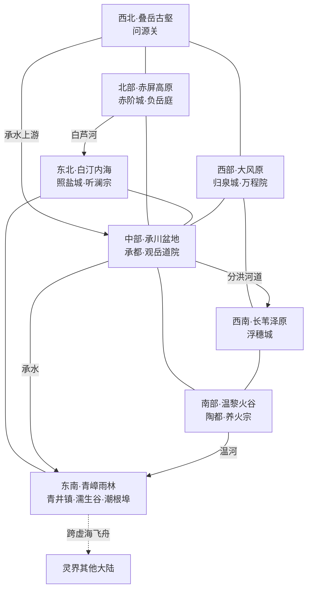

# 太初大陆蓝图

> 最终定稿：天地留痕、古国烟火、山海行修。
>
> 正式地图：[太初大陆地图.png](太初大陆地图.png)。本蓝图记录大陆生态、宗门、凡国、城市、区域灵感、空间关系、人物及秘境的定稿设定。
>
> 运行时内容由同目录 `[mvu_plot]太初大陆总览.txt` 提供；本蓝图本身不作为世界书条目加载。

## 一、定位与兼容约束

太初大陆保留着天地早期的地貌痕迹。赤崖、内海、火谷与深壑横亘其间，文明沿稳定的河谷和盆地延续。修士从山川变化中求道，普通人则经营田地、窑火、盐场与驿路。

- 历史：大陆来自上古天魔战争造成的超大陆破裂；大片古地层与地下灵脉得以保存。战后居民逐渐恢复河渠、山路和聚落，各国由地方共同生活的需要形成。
- 名称：“太初”是后世对古老山海景象的称呼，不确认为世界唯一诞生地，也不暗示此大陆早于其他大陆形成。
- 自然：局部存在地火升涌、泉眼改道、地层抬升与河谷侵蚀。多数变化漫长且可观察；灾害具有地域范围和征兆，不能随意把日常场景变成灭顶之灾。
- 人口：人族为主体；巫族、灵族在部分地区影响显著；开智妖族及少量其他族群分布于聚落、宗门和商路。族群不与职业或政体一一绑定。
- 种族边界：灵族源于自然成精，物化生灵源于器物通灵，冥族涉及死亡转化；不能因外貌相似混用。自然现象不普遍具有人格，古器物也不必都有器灵。
- 修为：沿用凡人 L=0、炼气 L=1 至渡劫 L=9 的正式阶梯。化神是宗门中坚、返虚可任管事长老、合体多任宗主；大陆公开大乘原则上预留一至两位，渡劫不介入常规事务。
- 凡国：君主、官员、将领和世家代表等世俗体系人物最高金丹，即 L≤3。高阶护国修士属于庇护宗门，不作为绕过上限的王廷官员。凡国须依赖宗门保护。
- 经济与技艺：下品灵石是统一计价单位；矿材、药物与法宝采用已有属性、境界、品阶和分类。察脉、治水、烧陶、行修均为现有技艺的地方运用，不新增数值体系。
- 交通：太初无跨大陆传送阵。跨大陆以虚海飞舟为主，大陆内部仅在稳定节点保留有限传送设施。
- 天魔：保留历史威胁与可能的远期线索，不设置下一次入侵的年份、倒计时或确定日期；不把所有地脉异动归因于天魔。
- 人物：名册以女性为主、男性少量；不因此推定全大陆采用统一母系制度。

## 二、历史脉络与生活气质

### 历史层次

1. **山川遗存**：古地层、洞穴沉积与灵脉记录保存了战争以前的片段，遗迹的年代和功能需分别考证，不全部归于同一个失落王朝。
2. **战后寻安**：幸存者沿泉水、河谷与旧路结成聚落；修士参与护送和察脉，乡民保留季节、洪水与农时的口述经验。
3. **治水立国**：承川诸邑联合修渠、储粮，逐渐形成古国；白汀城镇因盐运订约；泽原以分汛合作立国；大风各部通过泉井和驿路结盟。
4. **现世通行**：安稳地区形成成熟的城市与宗门，边地仍保留迁徙生活。商路让地方彼此依赖，也带来税权、开采和文化选择上的分歧。

### 三种地方地理称呼

- **安土**：适宜长期耕种建城的地带，分布于八区内部，并非只指承川盆地。
- **行地**：随汛期、牧草、盐季或风雪改变使用方式的土地，适合季节性生产和迁居。
- **古荒**：环境险峻或未经充分查勘的地方，外围设向导、观察所和补给点；探索收益与实际危险对应。

三者不是强弱等级，也不固定对应某种居民。某处经治理可以成为安土，安土也可能因水源变化需要重新规划，但须有过程和证据。

### 审美与日常

- 色彩：麻白、赭红、青黛、铜绿；盐地偏白蓝，雨林偏深绿，火谷偏黑土与暖红。
- 建筑：盆地夯土石基院落、高原崖居、内海盐砖仓屋、雨林石木吊楼、火谷窑院、泽原舟屋与高脚粮仓、牧地帐庭、古壑石窟驿舍。
- 衣着：依劳作采用叠襟、披肩、绑腿、短褐和长裙；陶珠、玉石、编绳与铜饰常见。礼服古朴，日常服重舒适与修补，不以裸露或粗陋代表“上古”。
- 饮食：米糕、桑叶蒸食、山茶、盐鱼、芦笋、窑烤薄饼、温泉煨豆、乳酪、风干肉；各族可有口味差异，辟谷修士也能因社交与爱好参加食会。
- 文化参考：上古山海意象、治水传说、自然观道、石窟崖居与盐道行旅。参考只用于创作，不把现实神话人物和制度名称直接搬入世界。

## 三、空间结构与交通

地点层级：`灵界-太初大陆-生态-宗门/城市/秘境（可选）-具体位置`。人物旅行必须区分区域、城镇、宗门山门与内部禁地。

### 水系与地势

- 西北叠岳古壑与北部赤屏高原构成主要分水岭。叠岳高处积雪融水形成承水，经中部承川盆地向东南进入青嶂雨林，最终由潮根埠内港外侧的河口出海。
- 赤屏东坡的白芦河注入东北白汀内海。白汀是独立的封闭流域，依蒸发维持水量，没有通向虚海的天然水道；内海盐船不能直接驶往跨大陆港口。
- 承川南缘的分洪河道通向西南长苇泽原，泽水经南部低地水口泄出；温黎山地隔开其与承水下游，两水路不可不经转运直接互通。
- 温黎火谷由南部山地围合，泉流先形成温河，再经东侧峡口注入青嶂下游。地火水源与饮用泉眼分开，不默认所有温泉都适合饮用或疗伤。
- 大风原处于山地背风侧，以雪水支流、绿洲泉井和季节性降雨为主；商路串联可靠水源，不能靠任意施法永久补足大范围缺水。
- 虚海是大陆外的无底深空。潮根埠的内港为大陆岩岸环抱的真实水域，外侧设置悬空泊舟台；内河船只在内港转货，跨虚海由飞舟承担。

### 区域关系图

- 无箭头实线表示相邻地区之间有主要陆路，不表达全部小径；有箭头实线表示水流方向，不代表整段可通航；虚线表示跨虚海航线。
- 关系图表示区域连接，节点排列不表示真实方位；实际方位与水系以本节文字及正式地图为准。
- 承川是内陆转运中心；大风原负责西线陆运；白汀盐货通过陆路进入承川或青嶂；潮根埠承担跨大陆进出。
- 大陆尺度下，凡人与低阶修士依靠有组织的货舟、驮队、飞舟或付费传送，不把跨生态旅行写成半日步行。乡村集市与相邻驿站可以步行往来。
- 不承诺每个季节都能沿同一路线出行。官署与宗门维护汛期、封山和航路公告；紧急救援优先通行，但仍受运力与环境限制。

## 四、八大生态与区域灵感

### 1. 承川盆地（中部·田渠古国）

- 位置：大陆中部，北接赤屏、西通大风、南连温黎与长苇、东向白汀陆路及青嶂水路展开。
- 地貌：宽阔盆地中有低丘、冲积台地和石堤；城邑建在历次洪水线以上，旧河道旁保留桑园与蓄洪田。
- 气候：四季分明，春湿夏雨，秋收冬藏；低洼地容易受长雨影响，北缘丘陵更适宜果木。
- 水文与灵气：承水分渠灌溉，地脉总体稳定；灵气在山麓与渠首较丰，聚灵设施不能截断下游基本用水。
- 居民：人族最多，巫族定居户、灵族泉守与妖族农商共同居住；村社按渠系与道路相连，婚姻往来跨越族群。
- 生产与交通：灵米、桑麻、家畜、制陶原料和木船；主河货运、堤道车运、丘陵驮运相接。向各区输出粮布，输入盐、药、燃料和金属。
- 风俗：开渠先清淤再行祭礼，修桥宴按出工记录分席；乡试包含识字、农务与账目，凡人也有出仕途径。破坏公共水尺与擅堵分渠为重忌。
- 生活：米糕铺、染坊、蚕室、河边学舍与婚船常见；农闲时请宗门弟子讲述山外见闻。
- 普通资源候选：青背耕牛、田鹭、渠鲤；穗灯稻、柔桑、堤柳；青陶土、河砂、浅层石灰岩。灵化资源须另按正式规则定级。
- 地标：承都、观岳道院、九堰台、共渠碑、晒谷长街。
- 持续矛盾：上游新田与下游旧村争水；王廷希望保住旧城税源，道院倾向预先迁出危险地带；乡民经验与旧水图可能互补也可能冲突。

区域灵感：

1. 开渠祭前，两个村争着请同一位老渠工主持仪式，真正无人愿做的清淤工作却落到了外来弟子身上。
2. 婚船被突涨河水困在对岸，两家原本争吵的亲族必须一起安排食宿与渡船，玩家受托协调一场临时婚宴。
3. 新水尺连续报出异常，田间水位却一切正常；调查发现水尺地基在缓慢沉降，维修关系到下一季粮税。
4. 一名乡试考生的治水答卷被指抄袭，答案其实来自没有识字的母亲多年记录的草绳结。
5. 桑园的叶片总在夜里少一片，守园人抓到的并非盗贼，而是一名替病中同伴尝试食谱的幼小灵族。
6. 旧渡口因新桥停业，船户准备举办最后一次河灯会，却收到许多从未往来的远方旧客回信。

### 2. 赤屏高原（北部·崖道与盟誓）

- 位置：北部，西接叠岳，南下承川，东坡水流入白汀。
- 地貌：赭红层崖、石柱、台塬与深切峡谷；居民在稳定崖台建屋，险壁保留封闭旧栈道。
- 气候：干凉多风，日夜温差大；雨季集中降水可能形成山洪，冬季高处积雪封路。
- 水文与灵气：崖缝泉与山地汇水供养梯田，地下矿脉影响局部灵气；修行台选在坚实基岩上，不能把整片高原当作无限淬体宝地。
- 居民：巫族、人族和山地妖族混居；崖寨长与城镇执事按地方习惯产生，承诺重在能否履行及谁来见证。
- 生产与交通：坡麦、耐旱豆、石材、铜矿与驮运；各寨共同维护索桥和栈道，以粮、盐、工具换矿材和皮毛。
- 风俗：修桥宴、踏崖舞、成年远行；盟誓应写明期限与义务，不能用祖辈的含混承诺无限役使后人。损毁路钉、私取公泉受共同追责。
- 生活：崖下茶铺、护具修补摊、石磨与露天练场并存；巫族并非人人居荒野，城中也有教师与商户。
- 普通资源候选：岩羊、灰翅隼、负石蜥；坡麦、赤叶豆、崖柏；赤铜、砺石、赭土。
- 地标：赤阶城、负岳庭、百索桥、风字崖、歇肩台。
- 持续矛盾：采矿影响寨基；旧盟誓与人口迁移不相适应；低处新道改变高崖聚落生计。

区域灵感：

1. 宗门准备改建一座索桥，崖寨坚持保留祖辈的桥柱；玩家需要查清哪根柱子确有结构作用，哪根只是纪念。
2. 炼体女弟子被派去陪山村老人下山，老人每走一段便要停下拜访，赶路任务变成沿途告别。
3. 矿队发现矿脉延伸到居民祖墓下方，迁墓、绕采与停矿都有实际代价，各方请外来人做勘测见证。
4. 两寨举行摔跤会，比赛前的护具失窃，嫌疑最大的青年却正偷偷修补所有人的旧护膝。
5. 大雨冲掉一段古路，商队中的老人坚持看见了年轻时的路标；旧路不是幻境，却已通向一处废弃村落。
6. 一位重诺的巫族商人同时答应救援和按时交货，双方都没有恶意，玩家需要帮助她协商真正可行的补偿。

### 3. 白汀内海（东北·渔盐诸城）

- 位置：东北封闭盆地，西北接受赤屏来水，西南经陆道通承川，南侧山口通青嶂。
- 地貌：辽阔咸水内海、白色盐滩、淡水河口苇洲、浅岛与古海蚀崖；淡水聚落和盐场分开布置。
- 气候：日照充足，海面调节沿岸温差；晒盐季干燥，风季短浪陡急，浓雾时近岸也需谨慎航行。
- 水文与灵气：内海无天然外流，湖面随多年水量变化缓慢涨落；河口水与咸水带孕育不同生物，不将全部内海资源混在一处。
- 居民：人族渔盐户、妖族船户及少量水石灵族；岛民、港民与盐户通过城盟共同管理航道。
- 生产与交通：盐、鱼干、船具、芦编和内海航运；跨大陆货物必须先经陆路转运到潮根埠。盐户依赖承川粮布与温黎耐腐蚀器具。
- 风俗：晒盐开场、补网夜、首航饭；白色外披遮日，靛布便于识别船队。饮水井不得以欠债为由封死，伪造救援灯号为公敌。
- 生活：夜市鱼汤、岸边洗盐槽、晒网院与岛上婚宴；城里也有与航运无关的书铺和裁衣作坊。
- 普通资源候选：盐滩蟹、银背海鱼、白翅汀鸟；芦苇、盐蓬、河口水藻；盐晶、石膏、贝砂。
- 地标：照盐城、听澜宗、白芦河口、候水塔、环海灯路。
- 持续矛盾：低水位使旧港淤塞却增加盐田；上游用水与内海生态冲突；盐价牵动大陆物价。

区域灵感：

1. 一位年迈盐户拒绝卖出废盐田，原因是迁徙水鸟每年都在那里落脚，附近新旅舍却愿意出资保留浅滩。
2. 补网夜上，一封藏在旧浮木中的家书引出两家已经不记得起因的争执，委托只是找到真正收信人。
3. 岛民报称灯塔无故改换信号，查明是新灯油在盐雾中变色，而非有人引船触礁。
4. 年轻女船长接下从未独立走过的冬季航线，玩家受雇协助备航，必须决定哪些货物值得占用有限舱位。
5. 城盟举行鱼宴，两个城的厨娘坚持相反的腌制规矩，外来修士被推为评席却发现争议关系到各自家乡的鱼种。
6. 旧港搬迁后，住在岸石中的灵族仍等着熟悉的修船声，居民想为它保留作坊却负担不起旧堤维护。

### 4. 青嶂雨林（东南·泉林与海门）

- 位置：东南，承水穿境，西接温黎、北通白汀，东南沿岸设潮根埠。
- 地貌：石峰、雾林、地下河、瀑布与河口冲积地；山中聚落沿可靠泉眼展开，潮根埠位于较开阔的河口岩岸。
- 气候：温暖湿润，山雾与阵雨频繁；背阴洞穴凉湿，沿岸受虚海风候影响，远航前由专门观测站评估。
- 水文与灵气：地表河与地下泉道部分相通，需实测才能确认；林木与泉谷灵气丰沛，药圃设置限采范围，避开生灵本源所在。
- 居民：人族山民、草木和金石灵族、妖族采集者及港口各族旅客；定居灵族逐渐形成自己的社会经验，不永远保持初生无知。
- 生产与交通：山茶、药材、香料、木材、河运与跨大陆转运；潮根埠依赖内陆粮食，向内陆供应外来材料和消息。
- 风俗：开茶会、洗井日、避雨共食；进山问泉路，取样先确认是否涉及有灵本源。衣物多便于晾晒，吊楼下设公共雨廊。
- 生活：药背篓、茶摊、长雨中的缝补和旅店闲谈；温湿环境需要保存与防霉技艺，不靠一句“灵气充足”消除问题。
- 普通资源候选：青尾林雉、岩溪鱼、攀藤貂；雾芽茶、石缝兰、香叶藤；青石、洞乳石、溪砂。
- 地标：青井镇、濡生谷、千檐雨廊、泉路碑、潮根埠。
- 持续矛盾：药材外销与当地留种、伐木与坡地稳定、港务扩建与旧村水源之间存在取舍。

区域灵感：

1. 初次出山的泉灵在青井镇买下一只漏水陶罐，坚信它适合给路边小草浇水，卖罐的学徒却以为自己闯了祸。
2. 两名采药人提供同一病症的不同药材，医馆请玩家调查病人来自盐地还是山地，避免把地方药方硬套。
3. 雨困客舍的旅客合做一顿饭，一位平日寡言的护卫显露精湛手艺，被认出曾在某地经营过食铺。
4. 港口商馆收到一批潮湿茶叶，退货会让山村破产，留货会损失信誉，女掌柜请人寻找可行的再制用途。
5. 新凿的水渠让一处老泉减流，村民与泉灵分别请来同一宗门，双方都希望继续共同生活，只是不知如何分水。
6. 一艘虚海飞舟延误，港口旅店要接纳滞留乘客，语言、饭食和价钱的小摩擦逐渐形成临时互助小队。

### 5. 温黎火谷（南部·窑城与温泉）

- 位置：南部山间盆地，北接承川，西邻长苇，东循温河通青嶂。
- 地貌：黑土坡地、旧熔岩台、地火裂谷与温泉盆地；城镇避开活跃喷口，农田利用早已稳定的火山土。
- 气候：低谷温暖，山地仍有季节变化；蒸汽容易在清晨积成薄雾，风道影响窑烟排散。
- 水文与灵气：冷泉、温泉、含矿热流分支标识；火灵气集中于受控炉区，居民区保持普通可居条件，凡人不直接接触高阶地火。
- 居民：人族工匠和农户、金石灵族、少量器灵与巫族劳作者；器灵有独立人格，窑具通灵后须重新协商使用关系。
- 生产与交通：陶器、阵砖、炉鼎、日用法器、坡豆、果木与温泉旅业；输出耐用器具，输入高原矿材、承川粮布和林区药木。
- 风俗：开窑节、补器日、温汤家宴；徒弟出师须制作可用的寻常器物。禁止向饮水支渠倾倒炉渣，公用火道不得私改。
- 生活：窑烤饼、煨豆、浴舍、工棚和阶田；温泉服务按泉性和境界区分，不设浸泡一次便大幅突破的万能泉。
- 普通资源候选：暖羽鸡、黑背蜥、田鼠；温谷豆、赤皮果、耐热麻；耐火土、黑曜石、普通硫矿。含毒含矿材料须按用途处理。
- 地标：陶都、养火宗、百窑坡、分火井、温汤街。
- 持续矛盾：地火在生产、修行与供暖之间分配；大作坊与家窑竞争；泉水改道影响疗养与耕地。

区域灵感：

1. 一窑婚器尽数开裂，匠人母亲想连夜重烧，女儿却请求玩家保留下她小时候亲手刻过的那几只。
2. 温泉客舍的住客都声称自己的房间最冷，掌柜怀疑偷改水道，实际是不同支泉的矿垢积堵。
3. 开窑节上，一件新通灵的旧炉鼎拒绝继续烧同一种釉，师徒两代必须学会把它当作协作者听取意见。
4. 窑火调度临时缩减，一家小作坊要在乡村水管和高价法器订单间取舍，玩家可帮忙寻找替代炉时。
5. 地火观测员坚持上报细微变化，被担忧停工的工匠误解；一次共同巡视让双方学会区分征兆和猜测。
6. 一名宗门女弟子因总把茶壶炼得过于结实而卖不出去，下山后才发现手小的老人根本提不动它。

### 6. 长苇泽原（西南·随水而居）

- 位置：西南，北接大风与承川，东邻温黎，南部有季节泄水通道。
- 地貌：洪泛草地、苇荡、浅湖、堤村与高台岛；舟居不是全境唯一居住方式，稳定高地有长年城镇。
- 气候：温润，汛期与枯水期生活差异明显；暴雨洪水与普通季节涨水须分开叙述。
- 水文与灵气：承川分洪进入泽地，苇带滞蓄后向南泄出；水木灵气利于部分药草，聚灵塘不得侵占公共泄洪口。
- 居民：人族渔农、巫族定居与季迁社群、水木灵族以及开智水禽妖族；各社对捕鱼、放牧、收苇有错开的使用时段。
- 生产与交通：稻、苇编、水禽、鱼虾和草药；小舟与季节堤路相接，丰水期换渡口，冬季修网修屋。向内陆供鱼药苇席，输入陶管、盐与金属。
- 风俗：归鸟节、合堤饭、汛前点船；把应急船卖作私货、堵逃生水道为重忌。衣装常配防湿短披和高绑腿。
- 生活：舟上书塾、晒台婚宴、夜间捕鱼灯和高脚粮仓；世俗官署在汛期设浮动办事船，档案保存在固定高台。
- 普通资源候选：苇鸭、泽虾、长脚鹭；软秆苇、泽稻、浅水藕；泥炭、淤泥陶土、河砾。
- 地标：浮穗城、归鸟汀、百舟塾、退水碑、南泄口。
- 持续矛盾：新堤保护一地可能抬高邻地水位；牧、渔、农三种用途随季节争地；外来人误把季节迁居看作无主土地。

区域灵感：

1. 汛前点船少了一条学舍船，学生们正偷偷把它装饰成老师的婚船，却没想到当天需要搬运书册。
2. 放牧社与捕鱼社争一处浅滩，旧历按时交地已经失准，玩家受托连续观察水位而非只找旧契约。
3. 归鸟节鸟群迟迟不来，调查从寻找灾兆转向上游新建鱼塘；鸟群在那里吃得太好，不愿继续飞行。
4. 两位不同宗门的女弟子共守汛期药船，一人精于备物、一人擅长安抚，最初互相嫌弃对方多管闲事。
5. 渔民捞起的铜铃被老人认作祖村旧物，村落已经迁走，铃声却唤起不同家庭各自记得的一段往事。
6. 商人按枯水季图纸买地建仓，涨水后发现屋基落在公共行舟道上，补救需要官署、工匠与船户共同协商。

### 7. 大风原（西部·泉井与盐道）

- 位置：西部，北接叠岳，东连承川，南下长苇，主要商道沿泉井排列。
- 地貌：起伏草原、砾石地、沙砾浅谷、绿洲与季节草甸；固定驿城靠可靠水源，帐庭随牧场移动。
- 气候：干燥多风，昼夜温差明显；雨后草甸短期丰盛，严寒或旱年需要提前安排迁徙。
- 水文与灵气：深泉与少量山地来水支撑绿洲，地脉节点并非必然出水。临时术法用水不能替代长期水源治理。
- 居民：人族、巫族牧民与妖族驮队交错；部盟中有固定城民、季迁牧户与外来商馆，各有代表。
- 生产与交通：牧畜、乳食、皮毛、绳具、驮运和转盐；向承川换粮布，向火谷送皮件，南下泽原交换鱼药。
- 风俗：归泉会、赛驮、晚间踏歌与讲古；泉井轮用、病畜隔离和救援旗号有通行约定。不得因部族旧怨拒绝遇险者基本饮水。
- 生活：乳酪摊、帐中裁缝、铃具修补和驿站戏台；远行者可以将家书寄存在万程院驿舍，由正式同行队伍逐站转交。
- 普通资源候选：长毛驮牛、细角羊、沙耳狐；针叶草、泉边柳、耐旱药蒿；砾石、碱土、绿洲黏土。
- 地标：归泉城、万程院、七井古道、悬铃驿、归牧坡。
- 持续矛盾：新运输设施改变驿站兴衰；牧场私围与公共迁徙路线冲突；年景变化要求重订泉井配额。

区域灵感：

1. 女商人把重要一程交给女儿，自己却化装跟队；玩家先发现她，面临是否替她保守这个并不高明的秘密。
2. 一头退休驮牛总往已经废弃的驿站走，主人以为它认错路，那里却还住着多年照料它的老伙计。
3. 赛驮大会的一支队伍放弃争冠去救掉队幼兽，是否应补给比赛成绩引起各部争论。
4. 新传送节点让旧驿客流减少，村民筹备一场大集，请行修带来歌者、药师与修补匠，而非寻找假宝藏招徕。
5. 向导发现井水变苦，商队没有足够容器折返取水，玩家需要核算余粮、负重和另一条路线的实际风险。
6. 一个小孩多年替外出家人保管行铃，寄回的信却来自陌生宗门，寻人故事可从一间普通驿舍开始。

### 8. 叠岳古壑（西北·源山与深谷）

- 位置：西北高地，东接赤屏、南向承川与大风分水，外围可居谷地连接问源关。
- 地貌：高山冰川、裸露层岩、深壑、碎石坡与悬泉；古地层清楚可辨，遗迹只占部分地点。
- 气候：高寒、天气变化快；向阳低谷有短夏，雪季山口封闭。高阶修士也需评估崩塌、失温与灵脉干扰。
- 水文与灵气：积雪融水汇入承水与西部支流，泉眼分布依地层而异；深处灵气不均，不默认越深越适合修炼。
- 居民：少量人族山民、巫族向导、金石与气象灵族、山地妖族；长期聚落在低谷，核心古荒只有季节考察队。
- 生产与交通：高山药草、毛料、少量矿材、向导和观察服务；以外围小田与畜牧维生，冬粮依赖下游。登山队分段驮运，不能把陡峭源谷写成通航河道。
- 风俗：开山日、封关饭、留路石；归来者补绘路图，失踪者名录保留最后可核实地点。伪造山况、拆公共路标和私堵融水口为重忌。
- 生活：石窟驿舍的热汤、晒药架、补鞋、寒夜读信；当地向导有专业知识，不能因为修为低就被叙事视作无用。
- 普通资源候选：岩角羊、雪羽雉、谷地鼠兔；寒穗草、裂石苔、雪线药根；板岩、寒铁矿、普通云母。高阶矿层另设限制。
- 地标：问源关、照层壁、悬泉栈、留路石场、观岳道院源山别院。
- 持续矛盾：采矿与下游水源、高阶考察与向导生计、古图保存与公开共享之间存在分歧；风险判断常受季节影响。

区域灵感：

1. 一支高阶考察队嫌老向导走得慢，直到她指出队伍最新地图上的雪坡其实每年都在移动。
2. 封关前，一名裁缝坚持送完最后一双鞋，收鞋人是失散多年的旧友，玩家受托带路而非探宝。
3. 采矿者发现一条可能影响承水的裂缝，立即停工会拖欠山民工钱，继续开采又缺乏把握，必须共同安排勘查与补偿。
4. 一只气象灵学会在村口报天气，却把自己想下雪的心情当成预报，村民决定教它分清愿望与观察。
5. 岩壁显露旧足迹，有人宣称是祖师遗踪；考证最终可能只是古代修路队，仍能补回一段被忽略的历史。
6. 两位多年争论古法的修士困在同一驿舍，因替掌柜修烟道而找到各自方法适用的条件，争论暂时变成合作。

## 五、六大宗门

本节确定组织职位与职责，具名任职见第十节。宗门可有下院、小观、药舍和传承支脉，均不额外算作独立大宗。

### 1. 观岳道院（大型·察脉与古法）

- 简介：由山川观察、地方古法和阵道传承逐渐汇合的道院，保存大陆最连续的地脉与水文记录。
- 理念：察其所然，慎动其本。
- 位置：灵界-太初大陆-承川盆地，承都北侧稳定山麓；叠岳设源山别院。
- 声望：灾前勘察与护国能力受到信任，也常被批评过于谨慎、重视长远而低估搬迁代价。
- 组织：院主、察脉堂、量水堂、古法阁、护境院、外务院及地方观察所。观测与判断分别记录，院主不能用个人威望抹去不同结果。
- 修行：阵法、神识、咒法与传统御物；观地势、辨灵脉、比较古今方法，仍需按正常规则修炼突破。
- 地标：观岳台、历水廊、存图阁、试阵坪、源山别院。
- 产出与服务：勘察、护地阵法、图志、灾害评估、公共水利咨询；核心古法按门规传授。
- 日常基调：巡测、抄图、实地走访、修缮阵标；允许门人对旧记录提出证据充分的修正。
- 对外：庇护承川古国，协助濡生谷庇护长苇泽国；与养火宗讨论工程干预，与听澜宗协调上下游利益，与万程院交换路线报告。

### 2. 负岳庭（大型·炼体与盟誓）

- 简介：起于山地守路、护寨和炼体传承的宗门，巫族影响深厚，长期接纳人族和妖族弟子。
- 理念：力有所当，诺有所尽。
- 位置：灵界-太初大陆-赤屏高原-赤阶城上方宽阔崖台。
- 声望：救援可靠、行事直接；外界有时误以为全庭只懂武力，实际内有专门负责旧约解释与协商的职司。
- 组织：庭主、砺身院、守路堂、援山队、见契堂、护具坊与各地习武场。
- 修行：炼体、御物、护体咒法、山地协作与装备维护；盟誓具备明确条款，只有特定术法契约才产生相应法术效力。
- 地标：承重阶、见契石庭、百索桥、歇肩台、崖风练场。
- 产出与服务：山路护送、救援、护具、淬体材料处理和低阶体术教学。
- 日常基调：训练、修桥、护送与兑现日常承诺；承认伤病与休息，不以自毁证明忠诚。
- 对外：主要庇护大风部盟，与万程院分担驻守和行旅；保护赤阶城自治，不把巫族血统作为取得普通救援的条件。

### 3. 濡生谷（中型·泉药医修）

- 简介：依托泉谷药圃与多族诊疗发展的医修宗门，善于区分地域、种族与生活条件造成的药性差异。
- 理念：辨其所需，养其所生。
- 位置：灵界-太初大陆-青嶂雨林-青井镇上游泉谷。
- 声望：愿意处理长期慢症和乡村医务，颇受居民信任；药材留种与外销限额常使商人抱怨。
- 组织：谷主、诊脉堂、养圃院、辨药阁、巡泉队、药舟舍与地方医馆。
- 修行：医术、培育、炼丹、神识与辅助咒法；灵族适合的疗养方法不能直接套用于其他种族。
- 地标：分泉圃、试药廊、问诊石屋、留种库、汛期药舟。
- 产出与服务：灵药、诊疗、泉性鉴别、药田规划、种苗和普通卫生知识。
- 日常基调：病案、采药、育苗、家访、药舟巡诊；医者也需要休息与物资，不无限免费提供一切。
- 对外：主要庇护长苇泽国，由观岳道院协作防汛；与青井镇乡社共管水源，与养火宗合作泉疗，与潮根埠商馆协调药材外销。

### 4. 养火宗（中型·陶火炼器）

- 简介：以炉鼎、陶质法器、阵砖与实用器具见长的生产宗门，重视对地火的持续养护与精细使用。
- 理念：火有其候，器适其用。
- 位置：灵界-太初大陆-温黎火谷-陶都北坡。
- 声望：器物耐用、维修方便，民间基础设施多有其参与；对外扩产时面临火道供给与小作坊生计的争议。
- 组织：宗主、候火堂、陶器院、金炉院、阵砖坊、火道司、传艺舍。
- 修行：炼器、阵法、御物和控火咒法；陶、铜、铁等材料各有用途，宗门并不包揽大陆全部制造业。
- 地标：养火台、百窑坡、分火井、试器院、共修廊。
- 产出与服务：炉鼎、容器、防具、阵砖、陶管、日用法器、窑炉设计与维修。
- 日常基调：辨土、试釉、记炉候、修器与出师作品；器灵出现后重新协商合作，不将其独立意识视作故障。
- 对外：庇护陶都及周边自治窑镇；与承川签订公共器具供应契约，与听澜宗合作耐盐器具，与濡生谷分管泉疗和药炉问题。

### 5. 听澜宗（大型·水泽与行舟）

- 简介：由白汀古老行舟与水中修行传承发展的大宗，兼顾内海护航、河道安全与水势研究。
- 理念：识其来去，留人归路。
- 位置：灵界-太初大陆-白汀内海-照盐城外石岬。
- 声望：熟悉水情、救船有章法；盐运收入使外界质疑它是否过度偏向大港。
- 组织：宗主、观澜台、护舟堂、治水院、水下作业队、沿湖灯站与外务馆。
- 修行：御物、阵法、神识、水系咒法与有限驯兽；水域技艺不能直接替代虚海航行知识。
- 地标：听澜石岬、试舟湾、候水塔、环海灯路、旧水录馆。
- 产出与服务：内海护航、船具、河渠工程、水下勘查、航图和救援培训。
- 日常基调：修船、测水、巡灯、带队航行；救援有物资调配与复盘，不把每次沉船都设计成阴谋。
- 对外：主要庇护白汀诸城盟；与观岳道院共同核对白芦河来水，与万程院协调水陆转运。潮根埠外海由专业虚海船队与万程院航务堂承担，不由内海宗门自动垄断。

### 6. 万程院（中型·古道行修）

- 简介：以长期游历、实地修行和沿途授业相连的宗门，各地驿院依共同门规维持联系。
- 理念：行有所见，归有所传。
- 位置：灵界-太初大陆-大风原-归泉城外；各主要商路设驿舍，潮根埠设航务堂。
- 声望：向导与寄信可靠，接纳外来修士；分院相距遥远，地方行事风格存在差异。
- 组织：院主、勘路堂、驿务堂、驯兽院、行记阁、航务堂及沿线驿院。
- 修行：御物、神识、驯兽、野外阵法与护体；行旅见闻可以提供领悟契机，不能直接按里程兑换修为。
- 地标：归程院、悬铃驿、行记阁、七井路碑、潮根航务堂。
- 产出与服务：向导、护送、路线记录、寄信、寻人、驮兽照料、港口接驳；与外来虚海船宗合作开辟已勘定航次。
- 日常基调：备行、记账、修具、驿舍授课、归来分享；允许弟子选择长期驻地，不把漂泊设为唯一正途。
- 对外：协同负岳庭庇护大风部盟；维护跨国驿路；与星坠大陆观潮舟宗可建立航图与接驳合作，具体航次在事件中决定，不声称已建立直达传送。

## 六、凡国与庇护关系

四个凡国均治理凡人和低阶修士。它们不覆盖整片大陆；赤屏崖寨、温黎窑镇、青嶂乡社与古壑山村中仍有自治地方。

### 1. 承川古国（中部·治水王朝）

- 简介：围绕盆地水利、粮仓与地方城邑形成的古国，王朝合法性主要来自保田、通渠与赈灾的持续履职。
- 疆域：承川盆地主体及北缘农耕丘陵；不统治赤屏全境，也不把长苇泄洪地视作随时可征用的属地。
- 政体：王廷统筹郡县，渠社、乡老与行会处理部分地方事务；王位承袭受礼制与宗族约束，不等于个人拥有全部土地。
- 都城：承都。
- 组织：国主、农桑署、河渠署、仓计署、郡县与渠社。具名任职见第十节，最高金丹。
- 军事：凡人军卒、炼气与筑基骨干，少量金丹统领；负责缉盗、守仓、巡堤与边境秩序，大型阵法需宗门维护。
- 经济：米粮、桑麻、织物、陶土、内陆转运。平年积粮，灾年可减免受灾户税赋，减免引发的负担仍须协商。
- 信仰与节庆：祭山川、社稷和历代治水者；开渠节、晒谷会、修桥宴。祭祀不保证风调雨顺。
- 禁忌：毁公尺、私堵渠、偷换赈粮和借灾强占田宅。
- 主要庇护：观岳道院。古国提供稳定粮布、公共观察站土地、劳务与自愿入门人才；道院应对元婴及以上敌对威胁、重大地脉风险和需高阶阵法的护境任务。
- 权限边界：道院不得自行任免县官、代收普通税赋或征用民宅；紧急撤离可先行救人，永久迁建须由王廷、地方代表和宗门共同议定。
- 协商：以水图、田籍、损失和恢复方案共同审议，争议款项可暂缓结算；古国不能因一场地方纠纷拒绝全部宗门供养。
- 对外：向各地供粮，依赖白汀盐业和温黎器具；与长苇协商分洪责任，与大风互保商路。

### 2. 白汀诸城盟（东北·渔盐城邦）

- 简介：内海港市与岛城共同组成的联盟，依盐运、粮食输入与航道安全维系。
- 疆域：白汀内海沿岸各城、岛屿与约定盐场；湖上公共航道不归单城私有。
- 政体：各城自治，城使在常驻议事地协商公共事务；大港不得仅凭财富替小岛决定全部水利安排。
- 议事中心：照盐城，不另设凌驾诸城的皇帝。
- 组织：城使会、盐衡署、航务署、井水所及各城渔盐行会；官员与世家代表最高金丹。
- 军事：水巡队、港卫与岸防阵，主要处理走私、救援与普通冲突；不得拥有能独立威慑高阶宗门的舰队。
- 经济：盐、鱼产、船务、仓储和陆路转运；基本饮水与救援设施不作为私人债务抵押物。
- 信仰与节庆：海湖祭、首航饭、晒盐开场、补网夜；各城容纳不同祖先与宗门信仰。
- 禁忌：坏井、伪造灯号、暗改公秤、盐季强逼出险航次。
- 主要庇护：听澜宗。城盟提供船坞、物资、盐运供养和灯站人员；宗门承担元婴及以上外敌、水域高阶妖兽威胁及超出城盟能力的水下工程。
- 权限边界：听澜宗不得独占盐田或包办城使选任；它可基于可核查水情暂停危险航路，但不能借封航任意打击竞争商户。
- 协商：封航必须留下观测与复航条件，损失由城盟救济金、相关经营者与责任方按事实分担；上游争水邀请观岳道院共同勘察。
- 对外：向全大陆供盐；与承川交换粮布，与温黎采购器具，与青嶂通商但不主张内海可直接驶入虚海。

### 3. 长苇泽国（西南·堤村舟社）

- 简介：由高台城镇、堤村与舟社逐渐联合的世俗国家，以共渡汛期和保障四季生产为主要职责。
- 疆域：长苇泽原的聚落、水道、轮用浅滩与南泄口；疆界描述允许季节用途变化，不等于土地无主。
- 政体：推举泽主与各社议事代表；固定政务和档案留在高台，汛期办事船巡回受理民务。
- 议事中心：浮穗城；丰水期设分驻舟署，不整体漂走都城。
- 组织：泽主、分汛署、堤务署、舟籍所、共仓与各地渔农牧社；人物最高金丹。
- 军事：轻舟巡队、堤防守卫、救援船与低阶阵师；无高阶常备修士官僚。
- 经济：稻、鱼虾、苇编、药草、舟运；按季安排农牧渔地，给公共泄洪区保留补偿与粮食储备。
- 信仰与节庆：敬水土与护堤先人，归鸟节、合堤饭、退水集；不给正常季节洪水一律贴上灾祸标签。
- 禁忌：私封泄水口、占用应急舟、以迁居为由夺取他人季节土地。
- 主要庇护：濡生谷；观岳道院为防汛协作宗门。泽国供药田、舟舍、药材与巡诊后勤，濡生谷承担高阶威胁防护、严重灵性疫病处置和高阶医修支援；道院按联合约定处理大型堤阵及地脉风险。
- 权限边界：宗门不得强行征取有灵本源作药，不得以防汛名义永久占用公共浅滩；医修决策与地方分粮权限分开。
- 协商：两宗与泽国共同列出年度巡诊、防汛和物资计划；重大灾情先按约救援，事后核定责任，不能互相推诿导致无人出手。
- 对外：与承川争取合理分洪，与温黎采购陶管和容器，与大风部盟交换季节饲草及畜产。

### 4. 大风部盟（西部·牧部与驿城）

- 简介：迁徙牧部、绿洲居民和固定驿城共同缔结的盟国，水源与通路权比单一血统更能维持团结。
- 疆域：大风原主要牧地、泉井和商路聚落；北部山口与赤屏崖寨有互保协议，不直接吞并其自治权。
- 政体：盟主由主要部社与驿城共同推举；牧民、固定居民与商路社各有发言渠道，国主不独占井泉。
- 议事中心：归泉城；季节帐庭可以外出处理牧地事务。
- 组织：盟主、泉井议会、驿路司、牧群官、商契所与各部长；人物最高金丹。
- 军事：轻骑、驮兽斥候、驿卫与低阶护商队；职责是维持道路和救援，高阶冲突交庇护宗门。
- 经济：畜牧、皮毛、乳食、绳具、驮运与中转贸易；井水基本供给与大规模生产取水分账，不能借前者无限扩养牧群。
- 信仰与节庆：祭泉、祭路、纪念救援者，归泉会、赛驮、归牧大集；不同部社保留各自仪式。
- 禁忌：坏井、断公共迁路、伪造救援旗、弃病畜污染水源。
- 主要庇护：负岳庭；万程院协助商路保护。部盟提供牧场使用、驮兽、粮乳、护具材料与驿站补给；负岳庭应对元婴以上敌对威胁与重大边地救援，万程院负责远行路线、护送与跨地联络。
- 权限边界：宗门不能把公共牧场变为私猎场，不得未经部社议决永久迁井改道；商队可另购护送服务，但基本救援不以购买高价服务为前提。
- 协商：按年景重议泉额和商道维护，旧誓发生争议时查明实际履行条件，不要求后代承担无限义务。
- 对外：向各区供应陆运和畜产，依赖承川粮布、白汀盐与温黎工具；维护通向问源关的北路和通长苇的南路。

## 七、主要城市与地方聚落

城市权责须与上节政权一致。独立自治城镇的官员同样最高金丹；其宗门保护者不计入城官体系。

| 城市或聚落 | 地点与治理 | 城市结构与经济 | 生活文化及保护 |
| --- | --- | --- | --- |
| 承都 | 承川盆地，承川古国都城 | 依高台建宫署，外接粮仓、织坊与河埠；米粮、布匹、教育、转运 | 晒谷长街、共渠碑、河畔书塾；王廷城卫负责日常，观岳道院护境 |
| 赤阶城 | 赤屏高原，多崖寨共同组成的自治城 | 分层崖台以石梯索桥连接，矿材集市与护具铺集中在中层 | 百索桥、修桥宴、崖风练场；负岳庭庇护，寨民议事处理住居与税费 |
| 照盐城 | 白汀内海，城盟议事地 | 盐仓、船坞、灯站、淡水区分置，严禁盐卤混入饮水 | 候水塔、补网院、夜鱼市；城使自治与听澜宗保护并行 |
| 青井镇 | 青嶂雨林，泉社自治镇 | 围泉路建药铺、茶栈与雨廊，房舍沿坡错落，不堵地下水出口 | 洗井日、开茶会、千檐雨廊；濡生谷庇护，镇中公开记录药材来路 |
| 潮根埠 | 青嶂东南沿岸，各商馆与本地里社共管的港城 | 内河码头转货至外缘飞舟泊台；仓储、旅店、贸易、船期消息 | 候舟廊、寄信馆、归灯台；万程院主要护港，濡生谷提供医务，外来船宗依港约营业 |
| 陶都 | 温黎火谷，窑户、居民与工坊组成的自治城 | 居民区与炉区分开，陶土、器具、温泉旅业；火道公开排期 | 百窑坡、温汤街、共修廊；养火宗庇护，城市日常由窑城议事署处理 |
| 浮穗城 | 长苇泽原，泽国固定议事中心 | 稳定高台存档储粮，低岸设舟市，汛期增开浮桥和办事船 | 百舟塾、汛前点船、退水碑；濡生谷与观岳道院按约分担保护 |
| 归泉城 | 大风原，部盟议事中心 | 核心泉井周围为石木常住城区，外围为季节帐市与驮场 | 归泉会、行铃铺、归程院；负岳庭主要护境、万程院协助行旅 |
| 问源关 | 叠岳古壑外围谷地，山民与驿舍共同管理 | 山地补给、向导、药材和考察登记；短夏耕地与冬粮仓并存 | 留路石场、封关饭、热汤驿舍；观岳源山别院主要庇护、万程院负责驿务 |

### 自治地方的庇护供养

- 赤阶城以护具材料、桥路劳务与地方粮物供养负岳庭；庭中不能代替寨民裁断所有婚产纠纷。
- 陶都以炉区维护、生产供给和供养费用支持养火宗；宗门不能为独占订单封掉合法家窑。
- 青井镇提供药圃协作与巡泉后勤，濡生谷保护村镇安全；灵族居民须作为参与者协商，不能作为镇产登记。
- 潮根埠以港务收入供养护港与接驳设施，各宗依具体职责受供；万程院不能强迫所有旅客加入本宗商队。
- 问源关以观察后勤、向导合作与合理供养支持源山别院；下游受益地区通过观岳道院协助冬粮，不能要求高山居民独自承担公共水源保护成本。

## 八、大陆政治与经济联系

### 山川共约

太初没有统辖全大陆的帝国。主要宗门、四个凡国与自治地方共同承认“山川共约”，约束跨域水源、公共道路、救援与高阶冲突。

- **共同事务**：上下游测水、公共通路、跨境救援、灾民暂居、高阶修士争斗造成的公共损害。
- **议事方式**：按议题邀请受影响各方，承都常设存约馆保存副本，归泉、照盐、浮穗分别留有互证文本；存约馆不拥有统治大陆的军队。
- **世俗席位**：凡国代表有权说明人口、粮食与治理成本，不能因境界低被默认取消发言；高阶安全判断由有能力承担责任的宗门提供。
- **执行方式**：地方官署执行世俗裁决，宗门执行对高阶修士的约束；赔偿以可核实损失为据，严重违约可能失去互保与供养，但不会自动抹去全部民众的基本救援资格。
- **大乘地位**：公开大乘为观岳道院院主郁见山、负岳庭守约前辈祝玄岑，负责极端高阶冲突；她们不审理普通买卖和邻里纠纷，也不能凭境界替所有地方决定生活安排。

### 主要资源往来

| 产地 | 主要输出 | 主要需求 |
| --- | --- | --- |
| 承川 | 粮布、陶土、内陆转运 | 盐、药、金属、农用器具 |
| 赤屏 | 铜石、护具材料、山地驮运 | 粮、盐、药、木料 |
| 白汀 | 盐、鱼产、船具与内海运输 | 粮布、淡水工程、耐盐器具 |
| 青嶂 | 药茶、香料、木材、跨大陆货物 | 粮食、陶器、金属、港务服务 |
| 温黎 | 陶器、炉鼎、阵砖、温泉服务 | 矿材、药木、粮布 |
| 长苇 | 稻鱼、苇编、草药、水路劳务 | 盐、陶管、工具、防汛协作 |
| 大风 | 畜产、皮毛、驮运、路线消息 | 粮布、盐、工具、稳定取水 |
| 叠岳 | 向导、观测、少量药矿 | 冬粮、衣物、工具、救援补给 |

各区都有一定日常自给能力，交通中断会造成涨价与短缺，但不默认一处停运便全大陆立刻饥荒。跨大陆贸易侧重药材、耐用法器、精加工材料、特产与服务；普通大宗粮食优先使用大陆内部运输。

## 九、长期叙事方向

### 1. 安居与迁徙

从一个水尺、一口井、一段旧路开始。河流变化影响居所、祖墓、生计和地方财政，解决方案可以是修缮、局部迁建、改变用地或长期观察，不强制所有故事以迁城结束。

### 2. 古法与新知

古法可能保存未被解释的有效经验，也可能因环境变化而不再适用；新术需要试验与长期维护。争论围绕具体对象展开，不能让“古老”或“创新”自动等于正确。

### 3. 上古遗产的归属

考古、修路与采矿可能显露遗存。后裔、当地居民、维护者和研究者有不同诉求，需区分公共遗产、私人财产与拥有独立人格的生灵。零散记录只能解释局部历史，不能一次揭露全部灵界真相。

### 4. 古老地脉设施（可选远期线索）

部分深层遗存显示古修曾长期经营山川。关于设施用途，保留“约束地脉”“顺应地脉”“不同阶段曾反复改建”等解释。“承川旧衡府”和“叠岳地脉遗枢”提供可选证据，两处资料只说明局部功能，不设唯一最终答案。

这些线索不具备统一强制启动条件，玩家可以长住温泉镇、经营驿舍、入宗修行或游历诸国而不介入大陆级事件。天魔仅在有明确证据的个别远期线索中出现，不给出下一次入侵时间。

## 十、人物设计

### 名册与使用规则

- 共三十二名人物：女性二十八名、男性四名。女性涵盖年长者、成熟女性与年轻成年人；人物类型用于外观气质，不替代实际年龄设定。
- 人物只在其职责、所在地和当前经历允许时参与剧情，不因玩家进入生态就全部登场。人物初始身份与境界供首次引入，后续变化服从聊天事实与变量。
- 凡国、自治城镇中的世俗人物均为金丹及以下。宗门驻地与城市可重叠，但高阶宗门人物不兼任国主、城使或普通官吏。
- 两名公开大乘分别是郁见山、祝玄岑；其他宗门首领最高合体。公开威望不代表全知，古老人物也只知道自己经历或考证过的部分历史。
- 总览按宗门、政权、地点及剧情需要输出人物，不强制把三十二份完整人设同时注入。

### 1. 承川盆地人物

#### 郁见山

- 性别／类型：女／外观清瘦端正的成熟女性；种族：人族；境界：大乘初期。
- 身份与位置：观岳道院院主，常居承川盆地观岳台，负责重大护境决策与长期记录的保存。
- 外貌与着装：乌发间有两缕霜白，眼神平静；青灰交领长衣、旧玉簪、带补痕的深色披风。
- 性格与生活：谨慎但愿承认误判，喜欢亲自照料院中果树，记录结果常比弟子要求得还细。
- 所长与法宝：阵法、神识、地势勘察；使用山形印、量脉尺与护境阵图。
- 联系与用途：支持提前避险，也知道自己难以切身体会失去祖宅的代价；用于重大迁建争论、古法考证及师门代际关系，不替玩家解决地方小事。

#### 姚令禾

- 性别／类型：女／御姐；种族：人族；境界：金丹中期。
- 身份与位置：承川古国国主，承都王廷。
- 外貌与着装：乌发高绾，眉目利落，手指常沾墨；赭色常服、青玉带，正式礼服饰谷穗纹。
- 性格与生活：善记具体的人和账目，不愿拿空泛“万世之利”搪塞眼前损失；喜欢米糕，批折时会忘记放凉的茶。
- 所长与法宝：统筹、交涉、基础护身术；印、短剑、护身佩，不具备抗衡高阶宗门的能力。
- 联系与用途：尊重郁见山而敢质疑迁城方案的执行成本；可发布赈粮、走访和地籍核实委托，体现低境界统治者的治理价值。

#### 陶素渠

- 性别／类型：女／年长女性；种族：人族；境界：筑基后期。
- 身份与位置：河渠署巡渠官，承都与九堰台间往来。
- 外貌与着装：灰白发辫盘在脑后，手掌粗糙；蓝布短褐、涉水绑腿、木尺与油布册。
- 性格与生活：实在、嘴硬，熟记不同渠社的脾气；闲时做布鞋，对不合脚的官靴抱怨多年。
- 所长与法宝：水工经验、基础阵法、现场协调；测水尺、定线钉与普通护身符。
- 联系与用途：为王廷和道院提供实地数据，既反对迷信古图，也不盲信最新测具；适合带玩家走村、修渠和参与普通人的生活。

#### 陆砚生

- 性别／类型：男／青年；种族：人族；境界：化神初期。
- 身份与位置：观岳道院古法阁校图弟子，承川盆地。
- 外貌与着装：黑发束冠，常眯眼辨字；素白道衣、墨染袖口、装满纸尺的书囊。
- 性格与生活：好胜又怕失礼，能背旧卷却容易错认田间植物；偷偷向陶素渠请教，喜做纸模型。
- 所长与法宝：神识、图志校勘、阵法；笔、卷轴、小阵盘。
- 联系与用途：是新旧知识互证的参与者，错误不必全出于恶意；用于考察、学徒日常和承川旧衡府的资料整理。

### 2. 赤屏高原人物

#### 祝玄岑

- 性别／类型：女／年长女性；种族：巫族；境界：大乘初期。
- 身份与位置：负岳庭退任庭主、山川共约守约前辈，常居赤屏歇肩台。
- 外貌与着装：银灰长发编成厚辫，身形高大，笑纹明显；褐色长衣、旧皮护腕、磨平的石珠串。
- 性格与生活：看重实际履约，不赞成后人因一句旧誓终身受役；喜欢缝护膝，也愿参加晚辈家宴。
- 所长与法宝：炼体、护体、山地救援；山杖与承重护甲。
- 联系与用途：在高阶毁约事件中出面，与郁见山合作但不总同意其审慎尺度；不知晓全部上古史，也不以年龄垄断判断。

#### 岳照棠

- 性别／类型：女／御姐；种族：巫族；境界：合体中期。
- 身份与位置：负岳庭现任庭主，赤阶城上方崖台。
- 外貌与着装：深棕长发束辫，肩背结实；赭黑练衣、护臂、便于攀援的窄袖披肩。
- 性格与生活：决断快，愿亲自担责，但容易低估疲劳；喜酸果与踏歌，受伤时最怕被徒弟催休养。
- 所长与法宝：炼体、御物、队伍协作；长枪、索钩、护山盾。
- 联系与用途：掌握宗门实际调度，努力把祝玄岑的人望转化为可持续的制度；适合入门考校、山路救援和兑现旧约的故事。

#### 石晚缃

- 性别／类型：女／御姐；种族：人族；境界：金丹初期。
- 身份与位置：赤阶城寨民议事署轮值城使，自治世俗人物。
- 外貌与着装：栗黑短辫、肤色微褐；靛蓝短衣、长裙配绑腿、铜制城使牌。
- 性格与生活：善于调解但不肯无限让步，喜欢修复旧乐器；会在议事后和居民一起喝崖茶。
- 所长与法宝：地方行政、交涉、基础护身；扇、护身玉佩。
- 联系与用途：请求负岳庭庇护，也阻止宗门为修桥随意拆屋；用于矿寨纠纷、崖城节庆与公共工程。

#### 段绣岩

- 性别／类型：女／年轻成年女性；种族：人族；境界：元婴中期。
- 身份与位置：负岳庭护具坊匠师，赤屏百索桥附近作坊；属于宗门，不任城官。
- 外貌与着装：乌发以竹针固定，眉梢留一道旧伤；灰麻工衣、皮围裙、装针线和铆钉的腰袋。
- 性格与生活：对手艺挑剔，对人却容易心软；会把废料做成精巧风铃，不愿承认自己喜欢装饰。
- 所长与法宝：炼器、护具修补、基础阵法；锤、针、护绳梭。
- 联系与用途：兼顾高阶护具与普通人的鞋绳，常提醒岳照棠装备也有极限；用于师徒、维修、采材及古索渡场探索。

### 3. 白汀内海人物

#### 闻汀雪

- 性别／类型：女／御姐；种族：人族；境界：合体中期。
- 身份与位置：听澜宗宗主，照盐城外听澜石岬。
- 外貌与着装：银黑长发、灰蓝眼眸；深蓝长衣、白色短披、朴素船结腰绳。
- 性格与生活：讲话简短，习惯先核实再表态；偏爱热鱼汤，偶尔独自补网以整理心绪。
- 所长与法宝：御物、阵法、水系咒法；水尺、舟印、长剑。
- 联系与用途：维护各港安全，却难完全避开大港供养带来的影响；与郁见山讨论白芦河来水，适合航路、盐运与水文矛盾。

#### 盐青蘅

- 性别／类型：女／御姐；种族：人族；境界：金丹后期。
- 身份与位置：白汀诸城盟当值议事城使，照盐城；姓氏源于家族传统，不代表所有盐户同姓。
- 外貌与着装：黑发盘髻，眼角笑纹细密；盐白外披、靛裙、便于穿行船坞的短靴。
- 性格与生活：精明、能忍耐繁琐争吵，私下喜做难度很高的腌鱼；不愿被当成只算利润的商人。
- 所长与法宝：议事、账目、贸易；算筹盒、印与护身簪。
- 联系与用途：为小港争取灯路维护，也要说服它们承担费用；适合城盟谈判、宴席、物价与移港故事。

#### 白渚绫

- 性别／类型：女／年轻成年女性；种族：妖族（白鹭化形）；境界：化神中期。
- 身份与位置：听澜宗护舟堂领航修士，白汀内海；不属于城盟军官。
- 外貌与着装：白发挽低髻，黑眸明亮；水青束袖衣、羽纹披肩，行动轻快。
- 性格与生活：熟悉航道却不擅处理称赞，喜欢收藏不同港口的碗；照料未开智水鸟，但不把所有同类动物当作族人。
- 所长与法宝：御物、神识、风水环境辨识；铃、舟旗、短矛。
- 联系与用途：用实际航行检验宗门新图，愿带新人但不替其承担所有失误；用于首航、海雾救援和岛上居民故事。

#### 许平潮

- 性别／类型：男／中年男性；种族：人族；境界：筑基中期。
- 身份与位置：照盐城井水所管事，世俗公务人员。
- 外貌与着装：短须、发际渐高；青布长衣、卷起的裤脚、背负采水桶。
- 性格与生活：爱念叨、肯跑腿，照顾年迈父亲，做鱼汤偏咸却坚持是当地口味。
- 所长与法宝：井水记录、基础辨材和民务；验水器、木尺，无高阶战力。
- 联系与用途：为盐青蘅提供供水实情，遇超出能力的水质问题向听澜宗求助；用于日常探访、井田与水源调查。

### 4. 青嶂雨林人物

#### 林漱泉

- 性别／类型：女／成熟女性；种族：人族；境界：合体初期。
- 身份与位置：濡生谷谷主，青井镇上游分泉圃。
- 外貌与着装：黑发松挽，眉眼温和但目光锐利；浅绿药衣、素色披肩、随身药囊。
- 性格与生活：问诊耐心，拒绝没有把握的承诺；喜种寻常香草，常被弟子发现忘记吃饭。
- 所长与法宝：医术、培育、炼丹、神识；针、药瓶、护魂灯。
- 联系与用途：协调外销与地方用药，尊重灵族人格；为泽国提供医务和高阶庇护，适合病因调查、多族相处与师门生活。

#### 泠芽

- 性别／类型：女／年轻成年女性外观；种族：灵族（泉水孕生的水行真灵）；境界：元婴初期。
- 身份与位置：濡生谷巡泉队成员，青井镇泉路；无世俗官职。
- 外貌与着装：青黑发尾略透明，眸色淡碧；水纹短襦、轻薄长裙、陶珠发饰。
- 性格与生活：认真学习世俗礼仪，时常把人情话理解得过实；喜收集形状古怪的陶罐，愿为喜欢的店家浇花。
- 所长与法宝：水行辅助、神识、培育；水盂、竹管、铃。
- 联系与用途：懂得自己的泉域，却不能凭天性理解所有地下水道；与林漱泉互教经验，适合泉渠、种植和初入人群的日常。

#### 乔映帆

- 性别／类型：女／御姐；种族：人族；境界：金丹初期。
- 身份与位置：潮根埠港务议事代表，世俗港城管理者。
- 外貌与着装：乌发束紧、神情干练；黛青短披、束腰长衣、皮靴与港务印。
- 性格与生活：办事务实，习惯替人想好下一程；家里养满亲友远行留下的盆栽，嘴上抱怨却照料认真。
- 所长与法宝：港务、交涉、基础阵具操作；印、扇、护身佩。
- 联系与用途：依靠万程院保护港城，自己负责舱期纠纷、仓储与安置；用于外来者初抵太初、商旅与旅店故事。

#### 孟听雨

- 性别／类型：女／年轻成年女性；种族：人族；境界：炼气后期。
- 身份与位置：青井镇茶栈学徒兼寄信跑腿，普通地方居民。
- 外貌与着装：黑色长辫、圆眼；青布衣裙、油纸雨披、竹背篓。
- 性格与生活：好奇健谈，记路比记字快，攒钱想第一次去看白汀内海；对熟客的口味记得很牢。
- 所长与法宝：制茶、识路与基础护身；普通纸伞、短刀和少量符箓。
- 联系与用途：常带泠芽逛集市，也会给谷中送普通药材；提供低阶生活视角，不能被派入需要高阶防护的秘境核心。

### 5. 温黎火谷人物

#### 容照陶

- 性别／类型：女／御姐；种族：人族；境界：合体中期。
- 身份与位置：养火宗宗主，陶都北坡养火台。
- 外貌与着装：赤棕发髻，指侧细碎烫痕；赭色工袍、深灰长裙、护腕。
- 性格与生活：擅长把复杂需求拆成可做的工序，容易以为别人也理解她的省略；喜做轻巧茶壶，难得愿意承认审美偏好。
- 所长与法宝：炼器、阵法、御物与控火；炉、锤、量规。
- 联系与用途：支持适度扩大生产，须面对小窑、地火与民用供给的现实限制；用于生产委托、古窑考察和师徒传承。

#### 阮合釉

- 性别／类型：女／年长女性；种族：人族；境界：筑基后期。
- 身份与位置：陶都窑城议事署轮值议事人、家窑匠师，世俗人物。
- 外貌与着装：灰发短髻、手背有釉痕；靛布上衣、旧围裙、铜耳环。
- 性格与生活：慢条斯理却很难被糊弄；为远嫁女儿保留一套尚未烧成的婚器，担心被嫌老派。
- 所长与法宝：民用制陶、炉候经验、议价；普通窑具与低阶护火符。
- 联系与用途：与容照陶争论大宗订单对家窑的影响，也愿承认新工艺的好处；用于家庭、补器、节庆和工坊利益。

#### 釉眠

- 性别／类型：女／年轻成年女性外观；种族：物化生灵（陶炉器灵）；境界：化神初期。
- 身份与位置：养火宗共修廊契约合作者，本源为一座可移动陶炉。
- 外貌与着装：浅褐发、眼角有细釉纹；乳白交领衣、青釉色裙、炉纹披帛。
- 性格与生活：有自己的烧造偏好，会因长期重复同一件事烦躁；喜欢夜间听雨，出行须安排本源炉的安全运输。
- 所长与法宝：炉候辅助、炼器经验；主要依自身炉体发挥能力，维护消耗灵气与相应材料。
- 联系与用途：与养火宗是协作而非无条件服役；可参与古窑工作方式调查，但不拥有制造自己的全部历史记忆。

#### 沈暖岫

- 性别／类型：女／御姐；种族：人族；境界：金丹中期。
- 身份与位置：温汤街疗养客舍主人，普通经营者，不任高阶医修职责。
- 外貌与着装：乌发半挽、笑容爽朗；暖杏长裙、卷袖外衫、木簪。
- 性格与生活：会照顾人的尴尬，也敢拒绝无理客人；喜研究煨豆与应季果食，最大的愿望是空出半个月自己旅行。
- 所长与法宝：客舍经营、基础医护、泉性记录；温水阵具与测泉石，疑难伤病转请濡生谷。
- 联系与用途：为不同阶层提供可停留的生活场景；与阮合釉互供器具，适合休养、关系推进和泉路维修。

### 6. 长苇泽原人物

#### 苇清晏

- 性别／类型：女／御姐；种族：人族；境界：金丹中期。
- 身份与位置：长苇泽国泽主，浮穗城与汛期办事船。
- 外貌与着装：黑发辫髻，面色常带日晒；藕白短披、青灰衣裙、防湿靴。
- 性格与生活：习惯边走边听诉求，怕漏掉沉默者；会亲手编苇席，忙乱时以此静心。
- 所长与法宝：地方治理、分汛协调、基础护身；舟印、短桨、护身符。
- 联系与用途：与姚令禾争取公平分洪，依濡生谷和观岳道院应对高阶风险；用于汛期民务、迁居和渔农牧地安排。

#### 岑汀兰

- 性别／类型：女／成熟女性；种族：人族；境界：返虚初期。
- 身份与位置：濡生谷药舟舍负责人，常驻长苇药舟；属于宗门体系。
- 外貌与着装：黑发低髻，眼神疲倦时仍很专注；白绿药衣、防水短披、随身针囊。
- 性格与生活：讲原则但愿解释，排班非常仔细；喜欢读普通游记，梦想去干燥的地方住一季。
- 所长与法宝：医术、炼丹、神识、药舟防护阵；针、药炉、舟阵盘。
- 联系与用途：与苇清晏讨论如何覆盖偏远社群，与林漱泉协调药材；适合多病例、师徒和公益成本故事。

#### 叶纫秋

- 性别／类型：女／年轻成年女性；种族：巫族；境界：筑基中期。
- 身份与位置：百舟塾教师、苇编匠，浮穗城普通居民。
- 外貌与着装：长辫、肩臂结实；深绿短衣、苇黄裙裤、铜铃发绳。
- 性格与生活：对孩子严格又护短，想把零散地方故事编成读本；在热闹场合反而容易害羞。
- 所长与法宝：识字教学、编织、基础炼体；短杖、绳索与普通护身符。
- 联系与用途：能解释季节地权与舟居习俗；与孟听雨交换各地故事，适合学舍、节庆及普通人的承诺。

#### 荷照

- 性别／类型：女／年轻成年女性外观；种族：灵族（草木灵）；境界：元婴中期。
- 身份与位置：濡生谷协作育种者，归鸟汀附近的莲塘，无世俗官职。
- 外貌与着装：深绿长发、瞳中淡金环纹；荷白短襦、层叠绿裙、细藤腰绳。
- 性格与生活：观察仔细，喜欢给熟人送吃食；能接受捕食是生态的一部分，却会为熟悉的鸟巢损毁难过。
- 所长与法宝：培育、水木辅助、神识；莲灯、种囊、分水竹管。
- 联系与用途：与泽国协商留种和泄水，不拥有整片泽原；可提供植物观察与药材线索，收获其种苗须取得同意。

### 7. 大风原人物

#### 顾归遥

- 性别／类型：女／御姐；种族：人族；境界：合体初期。
- 身份与位置：万程院院主，归泉城外归程院，定期在各驿院轮住。
- 外貌与着装：黑发束高、眉眼舒展；沙色披风、青衣、旧皮靴。
- 性格与生活：见闻广而愿问路，不把游历当作高人一等的资本；会修鞋，回院最先检查弟子寄回的家书是否送达。
- 所长与法宝：御物、神识、野外阵法、驯兽；长剑、行铃、便携阵盘。
- 联系与用途：协调牧部、驿站和港口利益，支持弟子自行选择久住或远行；用于跨区域旅程与行修生活。

#### 乌兰笙

- 性别／类型：女／御姐；种族：巫族；境界：金丹后期。
- 身份与位置：大风部盟盟主，归泉城及季节帐庭。
- 外貌与着装：深棕长辫、目光坦率；青黑骑装、毛边披肩、编绳束带。
- 性格与生活：善听各方但讨厌拖延，珍视井泉共约；喜晚间唱歌，嗓音嘹亮而厨艺平常。
- 所长与法宝：盟务、骑术、基础炼体；弓、短刀、护身佩。
- 联系与用途：依负岳庭与万程院庇护部盟，不能靠个人武力对抗高阶修士；适合泉额谈判、归牧节与商道纠纷。

#### 俞铃纱

- 性别／类型：女／成熟女性；种族：人族；境界：筑基后期。
- 身份与位置：七井古道盐货商队掌柜，归泉城居民。
- 外貌与着装：乌发夹少量白丝、笑起来眼睛很弯；茶褐长衣、靛披肩、多口袋腰带。
- 性格与生活：算账精细，担心晚辈又想学会放手；收藏旧行铃，会认真记录每个驿站的饭菜。
- 所长与法宝：商贸、路线规划、基础驯兽；账册、传讯符、短剑。
- 联系与用途：常与乔映帆对接外来货物，向万程院购买实际护送；用于母女、商队、驿站兴衰与普通贸易。

#### 程逐泉

- 性别／类型：男／年轻成年男性；种族：人族；境界：元婴初期。
- 身份与位置：万程院勘路堂弟子，大风原沿线驿舍；非部盟官员。
- 外貌与着装：黑色短发、肤色黝黑；灰青束袖衣、短披风、旧水囊。
- 性格与生活：愿意尝试新路线，容易过于乐观；喜欢画驮兽，遇生人有点笨拙。
- 所长与法宝：驯兽、基础阵法、神识；铃、路标钉、短枪。
- 联系与用途：受顾归遥教导，常被俞铃纱提醒实际成本；用于领路、勘井、救兽和成长故事。

### 8. 叠岳古壑人物

#### 邵留霜

- 性别／类型：女／成熟女性；种族：人族；境界：合体初期。
- 身份与位置：观岳道院源山别院院正，问源关上方别院。
- 外貌与着装：灰黑长发、眉目清冷，双手保养得很仔细；厚青道衣、白毛短领、耐磨手套。
- 性格与生活：说话直接、对记录极严，私下会给山民孩子缝玩偶；不喜欢下属把熬夜当尽责。
- 所长与法宝：阵法、神识、护体和高山勘察；山图、定脉钉、护阵印。
- 联系与用途：向郁见山汇报源山证据，尊重当地向导；负责高阶探索的边界和安全准备，不替玩家完成探险。

#### 邢知岫

- 性别／类型：女／年轻成年女性；种族：人族；境界：金丹初期。
- 身份与位置：问源关山民议事代表兼仓务负责人，自治世俗人物。
- 外貌与着装：乌发两辫盘起、眼神明快；深蓝厚衣、羊毛披肩、手腕系钥匙绳。
- 性格与生活：擅长把含混承诺问到具体数目；会做热汤，始终想给驿舍添一个更大的晾鞋架。
- 所长与法宝：仓务、民务、基础御物；护身佩、传讯符。
- 联系与用途：与邵留霜协商考察后勤和冬粮，与大风商队安排封关前运输；用于山村生活与公共成本问题。

#### 云绻

- 性别／类型：女／年轻成年女性外观；种族：灵族（气象灵）；境界：化神初期。
- 身份与位置：源山别院协作观测者，问源关与悬泉栈附近活动。
- 外貌与着装：灰白卷发如薄云、浅灰眸；雾白罩衣、蓝灰长裙、绒线围巾。
- 性格与生活：感受天气敏锐，正在学习区分自身情绪与客观征兆；喜欢在窗边听人讲家常。
- 所长与法宝：气象感知、辅助咒法、神识；风铃和观测旗。影响范围有限，不能任意改变全山气候。
- 联系与用途：与向导互证天气，知岫教她读仓单以练习区分愿望与事实；用于天气观察、生活适应和雪线救援。

#### 石望川

- 性别／类型：男／年长男性；种族：人族；境界：筑基后期。
- 身份与位置：问源关向导，普通山民，不属于高阶宗门。
- 外貌与着装：白短须、面上风霜痕深；厚毛衣、补过的皮靴、长木杖。
- 性格与生活：慢而有条理，记得路比记得人名牢；给老伴带回的礼物常是一块形状好看的石头。
- 所长与法宝：山路经验、绳结、宿营和风险辨认；木杖、绳索、低阶保暖符。
- 联系与用途：能带队到能力允许的外围，进入返虚以上危险区须停留补给点或另有可靠防护；用于古图核验、救援和普通劳动者历史。

### 组织与境界校验表

| 体系 | 代表人物与境界 | 权责边界 |
| --- | --- | --- |
| 观岳道院 | 郁见山·大乘初期；邵留霜·合体初期；陆砚生·化神初期 | 高阶护境、研究、源山勘察，不代任凡国官署 |
| 负岳庭 | 祝玄岑·大乘初期；岳照棠·合体中期；段绣岩·元婴中期 | 祝玄岑已退任；日常由岳照棠主持 |
| 濡生谷 | 林漱泉·合体初期；岑汀兰·返虚初期；泠芽·元婴初期；荷照·元婴中期 | 巡泉、药舟与育种属宗门或协作职责 |
| 养火宗 | 容照陶·合体中期；釉眠·化神初期 | 釉眠保有本源与自主契约，不属城产 |
| 听澜宗 | 闻汀雪·合体中期；白渚绫·化神中期 | 负责内海高阶安全，不统治城盟 |
| 万程院 | 顾归遥·合体初期；程逐泉·元婴初期 | 行旅护送与勘路，不代管部盟 |
| 源山协作 | 云绻·化神初期 | 协作观测者，不是问源关官员 |
| 承川古国 | 姚令禾·金丹中期；陶素渠·筑基后期 | 最高 L=3，受观岳道院庇护 |
| 白汀诸城盟 | 盐青蘅·金丹后期；许平潮·筑基中期 | 最高 L=3，受听澜宗庇护 |
| 长苇泽国 | 苇清晏·金丹中期；叶纫秋·筑基中期 | 最高 L=3，受濡生谷与观岳道院庇护 |
| 大风部盟 | 乌兰笙·金丹后期；俞铃纱·筑基后期 | 最高 L=3，受负岳庭与万程院庇护 |
| 自治地方及普通居民 | 石晚缃·金丹初期；乔映帆·金丹初期；孟听雨·炼气后期；阮合釉·筑基后期；沈暖岫·金丹中期；邢知岫·金丹初期；石望川·筑基后期 | 全部 L≤3，依第七节地方庇护安排 |

## 十一、人物关系骨架

关系用于产生具体互动，不预设每段合作都演变为恋爱，也不把人物情感自动绑定玩家。

1. **郁见山—祝玄岑**：长期共同维护山川共约。前者重记录与渐进调整，后者重承诺能否落在人身上；有分歧时仍愿给对方证据和时间。
2. **郁见山—姚令禾**：庇护者与国主，互相尊重。姚令禾要求迁建方案写清粮食与安置，郁见山不许王廷为了短期财政隐瞒危险。
3. **姚令禾—陶素渠—陆砚生**：治理、民间经验和宗门研究之间的往来。陶素渠会同时纠正王廷的时间表与弟子的古图；陆砚生逐渐学会把她列为成果共同提供者。
4. **祝玄岑—岳照棠**：退任前辈与现任庭主。祝玄岑公开支持其权责，私下提醒她别把每个求助都变成自己必须亲自兑现的诺言。
5. **岳照棠—石晚缃—段绣岩**：救援、地方生计与装备维护三方。城使要求保屋，匠师要求停桥检修，庭主须安排替代路线，不能只用力量结束争议。
6. **闻汀雪—盐青蘅**：宗门保护与城盟供养相互依赖。盐青蘅敢追问封航依据，闻汀雪也会拒绝明知危险的盐季加航要求。
7. **白渚绫—许平潮**：航行修士与井水管事因湖水变化经常合作，修为差异不妨碍二人互信；许平潮提醒她有些问题须问住岸上的人。
8. **林漱泉—泠芽—孟听雨**：医修、灵族与镇中年轻人的日常往来。泠芽帮助辨泉，听雨教她买卖与客套，两人也会联合催谷主吃饭。
9. **乔映帆—顾归遥—俞铃纱**：港务、护送与商贸衔接。货期出问题时各有压力，平日会互留房间、信件和行程消息。
10. **容照陶—阮合釉**：大宗工艺与家窑经验的长期争论者。彼此承认手艺，却会为民用订单、署名和炉时公开争执。
11. **容照陶—釉眠**：宗主与自主合作者。釉眠希望偶尔更换烧造内容，容照陶必须把她的意愿纳入排期而非只计算产量。
12. **阮合釉—沈暖岫**：互供器具和食宿的邻里朋友，暖岫支持她给女儿做婚器，也直言别把所有关心都变成替晚辈作主。
13. **苇清晏—岑汀兰—荷照**：分汛、医疗与育种。三人都希望泽地安稳，但药材保种、药舟人手和应急粮田未必能同时满足。
14. **苇清晏—姚令禾**：上游与下游国主。争分洪时不相让，汛后共同核实损失；合作源于共同承担，不是某方无条件仁慈。
15. **叶纫秋—孟听雨**：通过药舟和寄信结识的朋友，一人整理地方故事，一人收集行旅见闻；适合互访、节庆和写信剧情。
16. **乌兰笙—岳照棠—顾归遥**：部盟治理、驻守保护与流动商路三方。都支持泉井共约，却需经常重议人口增长后的负担。
17. **俞铃纱—程逐泉**：经验丰富的商人和年轻勘路弟子。她教他核算负重，他带来新路线；不把低修为者的建议视为胆小。
18. **邵留霜—邢知岫—石望川—云绻**：研究、地方后勤、向导经验与气象感知互证。任何一人都不能独自宣布整座源山安全，平日却可以围着同一炉热汤闲谈。

## 十二、秘境设计

### 统一规范

- 八个生态每区三处，共二十四处。秘境包括有边界的古建筑遗存、特殊自然地点和封存作业空间，不要求每处都另开小世界。
- “秘境入口”是实际进入条件；“推荐境界”是危险和资源尺度，不是叙事自动放行的凭据。进入生态或聊天提及名称，不等于已进入秘境内部。
- 每处四阶段，包含场景、危险、解决方向与收获；解法是可行方向而非唯一口令。必要战斗仍按正式战斗规则判定，不能用一句“尊重自然”跳过实力差距。
- 低阶参与以外围任务、资料整理、向导、后勤或具备可靠防护的团队行动为主；高阶环境核心不因谜题解对就无条件变安全。
- 常规收获是资料、有限材料、可修复部件或修行参考。图谱和感悟不自动提供熟练技艺与修为，炼制和领悟仍执行正式规则。
- 禁止无限重复刷取同一资源。已搬走、修复、封存的东西遵循剧情状态；调查记录可保留，不能每次重新凭空获得。
- 仅“承川旧衡府”“叠岳地脉遗枢”列入跨大陆重要秘境白名单，其余仅在本大陆显示简报。重要秘境也只输出线索名片，不跨地点泄露内部解法。
- 无秘境直接揭示仙界、天魔下一次入侵时间或整个灵界的唯一真相。

### 承川盆地秘境

#### 1. 承川旧衡府（重要秘境）

- 位置／入口：九堰台下游的废堤基；检修季水位下降后，由河渠署和观岳道院核验上游闸况，经旧工役井进入。
- 推荐境界：外围化神，核心返虚；金丹以下可参加堤外档案、测水和后勤。
- 性质与用途：分配旧渠水势的古代设施，留下不同年代的改造痕迹；联系陆砚生、陶素渠及迁建争议，不能据此断定全大陆地脉设施用途一致。

| 阶段／场景 | 危险 | 解决方向 | 收获 |
| --- | --- | --- | --- |
| 1. 堤脚工道〔化神〕：刻着水位的窄廊 | 回灌水流夹带碎石，旧路局部坍塌 | 核实停闸窗口，设退路和分段阵标 | 旧水尺、工道图 |
| 2. 衡流室〔化神〕：多个水盘仍连着外渠 | 误转一盘会把压力转移到另一村段 | 结合现时水位与古图逐支测试 | 水盘拓图、旧调度记录 |
| 3. 工役簿库〔返虚〕：封存的木简与阵箍 | 湿胀阵箍断裂，碎片伤人并毁资料 | 稳住承重，分批隔湿取录 | 修筑者名录、两次改渠证据 |
| 4. 旧衡枢〔返虚〕：旧新两层轴座交叠 | 拆旧轴会破坏仍承担泄压的支路 | 先布临时旁路，只取脱离运转的部件 | 水势阵法残图、局部改建记录 |

#### 2. 桑台藏种圃

- 位置／入口：承川北缘废桑台；枯枝落尽后可见被旧培育阵遮掩的石门，须经当地渠社确认土地归属。
- 推荐境界：金丹至元婴；可由熟悉药草的低阶人员在门外处理样本。
- 性质与用途：封存旧种的培育园；服务农业、传承与留种问题，联络陶素渠和濡生谷。

| 阶段／场景 | 危险 | 解决方向 | 收获 |
| --- | --- | --- | --- |
| 1. 桑影外圃〔金丹〕：藤蔓遮蔽畦线 | 毒刺和花粉使人失去方向 | 辨药、设绳、避开授粉带 | 旧桑枝样、药性记录 |
| 2. 分温苗室〔金丹〕：各间温度不同 | 贸然同开门使保存的种胚失活 | 按胚种需求逐室调温 | 少量可试种旧种 |
| 3. 护圃棚〔元婴〕：守园傀儡巡走 | 旧识别阵将采集者视为侵入者 | 修复识别、证明培育目的或依法制伏 | 培育工具、维护札记 |
| 4. 留种床〔元婴〕：母株与幼苗共生 | 大量取种耗尽母株生机 | 留足繁殖量，登记分批取样 | 培育残篇、有限种苗 |

#### 3. 沉桥石庭

- 位置／入口：承水旧桥的水下侧门，枯水时由受检小舟接近，须先取得现桥检修人员许可。
- 推荐境界：元婴至化神。
- 性质与用途：古桥工匠封存的试构场；用于修桥、工匠历史和公共设施维护。

| 阶段／场景 | 危险 | 解决方向 | 收获 |
| --- | --- | --- | --- |
| 1. 沉阶〔元婴〕：河沙盖住阶面 | 暗涡卷人，脚下石板松脱 | 设锚与导索，轮流清沙 | 石庭位置图 |
| 2. 试拱廊〔元婴〕：数种桥拱并排 | 错误卸重引发局部垮塌 | 用模型与小负重试验 | 旧拱样、受力记录 |
| 3. 回水庭〔化神〕：水阵绕石柱奔流 | 御物取柱会使水压集中 | 先辨现桥关联，再调整无关支阵 | 固桥阵纹拓本 |
| 4. 匠师室〔化神〕：工具封于稳压台 | 强取工具令稳压台失衡 | 换入等效材料，或只取录后封存 | 修桥札记、可回收备用工具 |

### 赤屏高原秘境

#### 4. 古索渡场

- 位置／入口：百索桥上游废峡口；连续晴日后由负岳庭确认岩面稳定，从封闭旧栈道进入。
- 推荐境界：化神至返虚。
- 性质与用途：上代渡峡设施与护桥训练场；联系段绣岩、岳照棠，侧重协作与装备维护。

| 阶段／场景 | 危险 | 解决方向 | 收获 |
| --- | --- | --- | --- |
| 1. 锈索坡〔化神〕：残索挂满崖壁 | 索丝断裂回弹，浮石滑落 | 排查受力点，使用自备护索 | 可回收索材、锚点记录 |
| 2. 分载台〔化神〕：三台共用旧索 | 一人强行跃过导致同伴平台失载 | 计算负重并逐台传递 | 分载构造图 |
| 3. 崖风井〔返虚〕：风从峡底间歇上冲 | 悬浮方向失稳，飞行未必优于攀援 | 观风、设侧锚、分队过井 | 定风部件、风候记录 |
| 4. 护索库〔返虚〕：旧护具连着张力阵 | 拆库会放松仍承载外围旧路的主索 | 加设替代承重后取备用品 | 护具图谱、桥工名录 |

#### 5. 断契石廊

- 位置／入口：风字崖后方封存石廊，见契堂完成外壁勘验后开放；普通盟誓不会自动开门。
- 推荐境界：返虚。
- 性质与用途：古代专用誓约阵的遗存，影响仅限入廊者与阵内凭据，不代表大陆所有诺言都有法术强制。

| 阶段／场景 | 危险 | 解决方向 | 收获 |
| --- | --- | --- | --- |
| 1. 录誓门：石面仍可接受血印 | 随手按印被旧阵识作承担任务 | 用无生命拓具调查，不主动立约 | 条款拓片 |
| 2. 对证廊：两方证物分别陈列 | 只取一方证物激活偏向性攻击阵 | 同时勘验双方凭据与残缺处 | 旧争议记录 |
| 3. 履约台：搬运石具的傀儡循环工作 | 阵法不断追加无法完成的工作量 | 查明损坏的截止阵纹，修复终止条件 | 契阵辨误材料 |
| 4. 解契室：残印维系封门 | 强破残印会伤及仍在阵中的同伴神识 | 核对参与者、按现存条款解除阵内关联 | 有限契阵残诀、判例文书 |

#### 6. 眠铜矿庭

- 位置／入口：赤阶城北面封存矿道，由寨民议事署与负岳庭共同准入；邻近祖墓的部分不得擅挖。
- 推荐境界：元婴至化神。
- 性质与用途：废矿与地灵活动带；服务资源归属、矿工生活与地基维护。

| 阶段／场景 | 危险 | 解决方向 | 收获 |
| --- | --- | --- | --- |
| 1. 旧轨道〔元婴〕：矿车半埋于碎岩 | 支柱腐朽、落石封路 | 支撑、通风、留应急出口 | 旧工具和矿道图 |
| 2. 铜尘室〔元婴〕：金属细粉悬浮 | 灵力震荡扬尘伤肺并扰乱御物 | 抑尘护体、低扰动作业 | 少量铜母料样本 |
| 3. 回声矿柱〔化神〕：击声经矿脉传远 | 误采承重矿柱引起上层地基位移 | 联合地面测量，标记禁采区 | 矿层结构记录 |
| 4. 眠铜庭〔化神〕：有灵矿核正在孕生 | 强采毁坏可能形成生灵的本源 | 与已有意识沟通，或保留核心只取脱落矿料 | 有限材料、后续观察与合作机会 |

### 白汀内海秘境

#### 7. 退潮盐宫

- 位置／入口：内海东岸旧盐滩；仅在多年低水位与持续退风叠加时显露，名称“退潮”沿用旧称，并非固定海潮周期。
- 推荐境界：化神至返虚。
- 性质与用途：被盐壳包覆的旧盐务建筑；联系城盟移港和盐田权益。

| 阶段／场景 | 危险 | 解决方向 | 收获 |
| --- | --- | --- | --- |
| 1. 盐壳前庭〔化神〕：白壳掩盖空洞 | 踏碎壳层落入浓卤 | 探地、铺临时桥板 | 老盐田界标 |
| 2. 卤渠间〔化神〕：不同浓度的卤水分槽 | 混槽使结晶堵住退路并腐蚀装备 | 辨浓度与流向，分槽隔离 | 古晒盐工序记录 |
| 3. 盐秤堂〔返虚〕：秤阵连接封库门 | 灵力冲击引起结晶碎片暴射 | 校准秤阵，以合适替代物试载 | 盐务账册、旧量具 |
| 4. 盐藏〔返虚〕：部分库墙溶蚀 | 贪取矿料造成库顶失稳 | 留支护、先搬档案、限量采样 | 有限盐晶灵材、旧权属文书 |

#### 8. 灯下沉舟

- 位置／入口：环海灯路中段沉船，获听澜宗确认风候后从船艉破口潜入。
- 推荐境界：元婴至化神。
- 性质与用途：旧救援船及失事资料；白渚绫可牵线，适合返航、责任和遗物归还。

| 阶段／场景 | 危险 | 解决方向 | 收获 |
| --- | --- | --- | --- |
| 1. 缠网船艉〔元婴〕 | 旧网与暗流缠住潜入者 | 外留看守，设绳后分段剪网 | 船名牌、外舱货签 |
| 2. 倾斜客舱〔元婴〕 | 腐木坠落，挪货使船身滑移 | 固定承重点后逐舱探查 | 乘客遗物、行程线索 |
| 3. 救援灯室〔化神〕 | 破损灯阵误导方向并灼伤神识 | 遮断故障支路，以实物导索辨位 | 灯具修复图、遇险记录 |
| 4. 压舱底库〔化神〕 | 搬尽压舱物令船体翻滚 | 分批替换负重、保留稳定结构 | 可修复船件、返航名册 |

#### 9. 苇口潜泉

- 位置／入口：白芦河口淡水苇洲下的泉洞，低风日循可核实泉流进入，不可按盐宫水位推断开放。
- 推荐境界：化神。
- 性质与用途：河口淡咸水交界的天然洞穴；关系井水、鱼群与城盟供水。

| 阶段／场景 | 危险 | 解决方向 | 收获 |
| --- | --- | --- | --- |
| 1. 苇根水道：根须覆住洞口 | 低能见度、根须缠绕 | 标出口、用短探杆开路 | 泉道外图 |
| 2. 双水洞：淡咸水分层 | 浮力与水压改变，误判返回方向 | 分层测水、预留返程灵力 | 泉水样本、盐度记录 |
| 3. 护巢岩：水兽在泉口育幼 | 靠近巢穴引发防卫 | 绕道、驯兽沟通或适度防御，不毁巢取利 | 巢区图、脱落鳞材 |
| 4. 潜泉眼：堵塞石隙连接井群 | 强疏泉口使咸水倒灌 | 先与地面联测，只清除已确认堵点 | 泉脉记录、有限水行石材 |

### 青嶂雨林秘境

#### 10. 雨骨洞

- 位置／入口：青井镇上游石峰腹地；连续少雨后由巡泉队勘定水位，经落瀑侧洞进入。
- 推荐境界：元婴至化神。
- 性质与用途：石灰洞穴与旧采药径；联络泠芽，解决地下泉路与药材辨识问题。

| 阶段／场景 | 危险 | 解决方向 | 收获 |
| --- | --- | --- | --- |
| 1. 落瀑侧径〔元婴〕 | 湿滑与突涨水 | 测上游降雨，设高处撤退点 | 洞口药草样本 |
| 2. 雨骨林〔元婴〕：石笋密布 | 敲断石笋误触旧封路阵 | 辨自然石与阵柱，从安全缝隙穿行 | 阵路残记 |
| 3. 分泉腹〔化神〕：多支暗流交会 | 被强流带入狭窄支洞 | 布定向阵，投标追流 | 地下水路图 |
| 4. 石乳台〔化神〕：药苔依泉生长 | 过采破坏泉台并影响下游 | 留根、取少量表层，记录重访条件 | 有限药苔、泉养记录 |

#### 11. 旧茶山封圃

- 位置／入口：青嶂山茶旧产区，茶社保管门牌；开茶季前确认无采工滞留后开放查勘。
- 推荐境界：金丹至元婴。
- 性质与用途：被失修培育阵封住的古茶园；孟听雨可介绍地方需求，重在生产与乡民记忆。

| 阶段／场景 | 危险 | 解决方向 | 收获 |
| --- | --- | --- | --- |
| 1. 茶影路〔金丹〕 | 幻阵使人反复回到同一处 | 实物标记、对照坡向 | 茶园外图 |
| 2. 留香棚〔金丹〕 | 旧熏料与霉菌伤身 | 通风、辨材、防护取样 | 旧制茶工具 |
| 3. 催芽台〔元婴〕 | 阵法无节制催生，藤枝压人 | 停供能支路、逐步退阵 | 培育阵图残页 |
| 4. 母茶圃〔元婴〕 | 根系与旧阵相缠，强拔毁株 | 修复共生空间，依法取得剪枝许可 | 少量茶枝、失传制茶记载 |

#### 12. 潮根旧栈

- 位置／入口：潮根埠崖侧封存货栈，港务与万程院确认外侧岩壁稳定后开门。
- 推荐境界：化神至返虚。
- 性质与用途：旧虚海接驳仓，内部在大陆岩层中，不通往另一大陆；联系乔映帆与寄信、货物权属。

| 阶段／场景 | 危险 | 解决方向 | 收获 |
| --- | --- | --- | --- |
| 1. 断台廊〔化神〕 | 泊台破损、外风倒灌 | 封风加锚，经内壁通道进入 | 老泊台图 |
| 2. 悬货厅〔化神〕 | 御物托架失稳导致重货坠落 | 分批接替负重、不得贸然解阵 | 仓储法器部件 |
| 3. 留信库〔返虚〕 | 旧防盗阵封锁所有传讯 | 查凭据、切断局部故障阵路 | 家书、货主登记与旧航期资料 |
| 4. 护栈枢〔返虚〕 | 岩体裂缝仍靠阵枢支护 | 先修岩壁，只取备用核心 | 可修复枢件、工程记录；他人货物须登记归还 |

### 温黎火谷秘境

#### 13. 分火古窑

- 位置／入口：百窑坡下层停用炉道，养火宗完成降火与旁路供能后进入。
- 推荐境界：化神至返虚。
- 性质与用途：多代改造的公共窑炉系统；联系容照陶、釉眠，不能将该处结构推广成整个大陆唯一原理。

| 阶段／场景 | 危险 | 解决方向 | 收获 |
| --- | --- | --- | --- |
| 1. 冷灰廊〔化神〕 | 灰下余火与窒息烟气 | 测温通风、分段护体 | 炉灰样本、工序牌 |
| 2. 分火室〔化神〕 | 调低一炉会抬高另一炉压力 | 联合地面排期、先建泄压旁路 | 火道图、阀件 |
| 3. 共烧堂〔返虚〕 | 旧阵按过时材料温度运转 | 辨现存材料，重新校准炉候 | 古釉记录、有限成品试片 |
| 4. 祖窑基〔返虚〕 | 拆基影响上方窑镇稳定 | 仅拆不承重附属件，保留主基 | 炉鼎残图、历次修建记录 |

#### 14. 黑镜石胎

- 位置／入口：温黎西侧稳定旧熔岩台的裂洞，候火堂确认冷却层厚度后允许勘采。
- 推荐境界：返虚至合体。
- 性质与用途：地火孕育的矿物空腔；高阶材料调查，不存在必然化形或无条件认主。

| 阶段／场景 | 危险 | 解决方向 | 收获 |
| --- | --- | --- | --- |
| 1. 黑镜斜廊〔返虚〕 | 镜面错觉遮掩薄壳，坠入热隙 | 实测厚度、设隔热锚 | 黑曜石样本 |
| 2. 熔息腔〔返虚〕 | 间歇热压破坏护体节律 | 测周期、分段降温、不逆压强行 | 热压记录 |
| 3. 晶胎层〔合体〕 | 矿层共振放大采击，引发崩裂 | 阵法消振、选脱离主脉的晶片 | 有限高阶炼器材料 |
| 4. 沉火眼〔合体〕 | 取尽结晶导致封火层变薄 | 保留封层、修补采口后撤离 | 火脉观测资料，不搬走整处火眼 |

#### 15. 暖泉旧苑

- 位置／入口：温汤街后山封存疗养院，泉水恢复常态且医修完成检测后开启。
- 推荐境界：元婴至化神。
- 性质与用途：旧泉疗设施；沈暖岫可提供线索，关注病案、泉性与疗法适用范围。

| 阶段／场景 | 危险 | 解决方向 | 收获 |
| --- | --- | --- | --- |
| 1. 雾池院〔元婴〕 | 有害泉气积聚 | 通风、采气检测，不直接入浴 | 泉性旧牌 |
| 2. 分汤室〔元婴〕 | 混接冷热管路使泉液药性改变 | 核对水路与不同体质疗程 | 泉疗配伍札记 |
| 3. 静养阁〔化神〕 | 镇痛幻阵掩盖身体真实损伤 | 定时解除幻阵，医术检查 | 病案、幻阵停机图 |
| 4. 留泉台〔化神〕 | 旧药垢堵塞阵管，贸然加压爆裂 | 分管清理、替换材料、重新试水 | 有限可修复疗养阵具，不直接获得治愈一切的灵泉 |

### 长苇泽原秘境

#### 16. 芦下旧邑

- 位置／入口：浮穗城南旧聚落，退水期从旧城门高台进入；涨水窗口前必须撤离。
- 推荐境界：金丹至元婴。
- 性质与用途：主动迁弃而非必然遭灭族的旧城；适合叶纫秋、苇清晏参与外围历史与土地核实。

| 阶段／场景 | 危险 | 解决方向 | 收获 |
| --- | --- | --- | --- |
| 1. 泥门道〔金丹〕 | 淤泥陷脚、旧井被苇遮住 | 探地铺板、标井口 | 旧城街图 |
| 2. 浮仓街〔金丹〕 | 腐朽仓楼倾覆 | 分段支护，先取可携文书 | 粮册、迁居清单 |
| 3. 堤神祠〔元婴〕 | 残余护堤阵驱逐来客 | 查明阵柱和水位条件，暂停巡护支阵 | 堤阵记录、旧祭器 |
| 4. 社藏室〔元婴〕 | 水气持续侵蚀地契和种袋 | 隔湿转存，保留可核对归属 | 季节地权文书、少量存活旧种 |

#### 17. 百根水庭

- 位置／入口：归鸟汀深处根系围成的水下空庭，由荷照说明季节变化，实际进入仍需自备防护。
- 推荐境界：化神。
- 性质与用途：自然共生水庭；调查留种、泄水与生态，不把荷照设成整处秘境的主人。

| 阶段／场景 | 危险 | 解决方向 | 收获 |
| --- | --- | --- | --- |
| 1. 根桥口 | 根须随水流收紧 | 不砍主根，以引流和浮具通过 | 根系观察记录 |
| 2. 花粉穹 | 不同花粉叠加产生昏沉 | 辨药防护，改变通风而非焚烧全区 | 有限花粉样本 |
| 3. 伏鱼池 | 护巢鱼兽伏击 | 绕育幼区、驯兽或适度防御 | 脱落鳞片、水域图 |
| 4. 共根床 | 改动一株影响整片滞水能力 | 测共生关系，只取外缘可再生部分 | 有限药种、共生培育记录 |

#### 18. 南泄古闸

- 位置／入口：南泄口下层旧闸室，仅在上游停放水、下游窗口核实后进入。
- 推荐境界：返虚。
- 性质与用途：泽地泄洪工程遗存；岑汀兰负责可能的伤员后勤，技术需观岳道院协作。

| 阶段／场景 | 危险 | 解决方向 | 收获 |
| --- | --- | --- | --- |
| 1. 检修井 | 残余倒压使井壁剥落 | 从旁井泄压、建立撤退阵标 | 井道记录 |
| 2. 双闸室 | 两闸不能同时闭合，误操作抬水 | 对照当前水情逐次试闸 | 联动闸图 |
| 3. 沉沙堂 | 沙体滑动掩埋队伍 | 分区固沙、顺序清淤 | 可回收闸材 |
| 4. 旧泄枢 | 强关枢轴可能把洪峰转回泽国 | 保留泄路，接入新旁路再修复 | 泄洪残图、历史洪水记录；不随意取走现役枢轴 |

### 大风原秘境

#### 19. 七井旧驿

- 位置／入口：七井古道的废弃支驿，经万程院确认屋基与水井后从院门进入；院后深层工道平时封闭。
- 推荐境界：金丹至元婴。
- 性质与用途：被沙埋没的驿站与供水设施；联系俞铃纱、程逐泉及旧商路兴衰。

| 阶段／场景 | 危险 | 解决方向 | 收获 |
| --- | --- | --- | --- |
| 1. 沙院〔金丹〕 | 薄沙盖井、屋檐坠落 | 探查与清理安全通道 | 老驿牌、客册片段 |
| 2. 驮棚〔金丹〕 | 防盗阵仍按旧铃号攻击 | 辨阵、停机或以有效旧凭据核验 | 驮具修补材料 |
| 3. 引井道〔元婴〕 | 淤塞水道积压后突然喷涌 | 分段疏堵、外留接应 | 引水构造记录 |
| 4. 寄藏室〔元婴〕 | 封藏阵失稳毁坏信件货包 | 稳阵后登记搬出 | 家书、旧路线；有主货物归还而非自动归玩家 |

#### 20. 风蚀鸣谷

- 位置／入口：大风原北部砾石谷，风季间歇窗口从背风坡进入。
- 推荐境界：化神至返虚。
- 性质与用途：天然声谷与修行旧台；适合神识、观察、护送及不依赖蛮力的探索。

| 阶段／场景 | 危险 | 解决方向 | 收获 |
| --- | --- | --- | --- |
| 1. 鸣石口〔化神〕 | 回声干扰方向，碎砂伤眼 | 实物标路、护目、短距离互证 | 声向记录 |
| 2. 旋砂坡〔化神〕 | 沙流移动，御空受横风冲击 | 选择岩脊，抓风歇窗口 | 少量风磨矿材 |
| 3. 回音台〔返虚〕 | 旧试音阵放大施术声波 | 降低输出、修复泄声支路 | 神识试炼札记 |
| 4. 谷心石穴〔返虚〕 | 取承声矿柱使洞腔共振崩落 | 只取自然脱落片，记录后撤 | 有限声学阵材、观察感悟参考 |

#### 21. 枯泉牧庭

- 位置／入口：归牧坡以北旧泉台，部盟核实归属后由外圈牧道进入。
- 推荐境界：元婴至化神。
- 性质与用途：旧牧群疗养与分水设施；联系乌兰笙的泉额争议，避免一处泉眼解决整个大陆缺水。

| 阶段／场景 | 危险 | 解决方向 | 收获 |
| --- | --- | --- | --- |
| 1. 旧围场〔元婴〕 | 野兽占据阴棚并防卫 | 驯兽、绕行或有限战斗 | 旧牧场记录 |
| 2. 药浴槽〔元婴〕 | 干涸药垢遇水析出刺激毒气 | 辨药分槽清理 | 兽医残方 |
| 3. 分泉盘〔化神〕 | 损坏阵盘把灵力导入脚下裂隙 | 隔断供能、辨识实际泉道 | 分水器具图 |
| 4. 旧泉室〔化神〕 | 泉脉已迁，强引会损新绿洲水源 | 实测迁移，选择封旧口或有限恢复 | 迁泉证据、少量泉石；不保证恢复原流量 |

### 叠岳古壑秘境

#### 22. 叠岳地脉遗枢（重要秘境）

- 位置／入口：照层壁下方深壑，由源山别院完成外围勘查后沿旧检修竖道进入；需合体级核心探索能力和返虚以上协作，不能由低阶向导包办安全。
- 推荐境界：外围返虚，核心合体。石望川可协助到外部补给点，随后须止步或依实际防护另行判断。
- 性质与用途：不同年代改造过的地脉设施，局部仍承担释压；与承川旧衡府记录可互证，但不能直接证明所有古设施同源同用。

| 阶段／场景 | 危险 | 解决方向 | 收获 |
| --- | --- | --- | --- |
| 1. 层壁竖道〔返虚〕 | 崩石、灵压梯度与失温叠加 | 分段护阵、测压、保留撤退窗口 | 地层与检修刻记 |
| 2. 旁释廊〔返虚〕 | 堵塞旁道使压力向团队所在处分流 | 先建立临时释压路再清堵 | 支路拓图、旧操作标记 |
| 3. 叠枢台〔合体〕 | 多代构件受力不同，误拆引发连锁偏移 | 区分年代与现役职能，逐项观测验证 | 不同时期改建记录、有限非现役部件 |
| 4. 源隙观台〔合体〕 | 深层扰动会扩大裂隙、影响外部泉流 | 远距观测、稳固现有支护后撤离 | 局部脉动资料和多种解释的证据；不取走整个枢核 |

#### 23. 雪线藏庐

- 位置／入口：问源关上游旧修路者石庐，开山季积雪退后从背风门进入，庐后封存廊只对完成现场评估者开放。
- 推荐境界：元婴至化神。
- 性质与用途：古代修路与勘山人员的冬驻地；用于普通劳动者历史、留路与归家故事。

| 阶段／场景 | 危险 | 解决方向 | 收获 |
| --- | --- | --- | --- |
| 1. 冰门坡〔元婴〕 | 雪檐坠落、暗冰滑坠 | 绕开檐下，固定绳索 | 入庐路线 |
| 2. 冬居室〔元婴〕 | 旧炉排烟堵塞，点火产生窒息气体 | 先清烟道，用安全热源缓暖 | 生活札记、旧衣具 |
| 3. 藏图廊〔化神〕 | 护图寒阵冻结取卷者经脉 | 调整阵温、分批取录 | 古路图、劳动者名册 |
| 4. 留路石室〔化神〕 | 岩裂与融水威胁封存碑刻 | 支撑排水，只搬松脱小件 | 修路技法、可核实名单与遗物 |

#### 24. 悬泉冰窟

- 位置／入口：悬泉栈下侧冰洞，融雪稳定期由邵留霜与云绻的观测资料辅助判断窗口，不能只凭云绻心情开洞。
- 推荐境界：化神至返虚。
- 性质与用途：源山天然水洞与旧测泉阵；用于水源、季节记录和高山协作。

| 阶段／场景 | 危险 | 解决方向 | 收获 |
| --- | --- | --- | --- |
| 1. 冰瀑缘〔化神〕 | 冰层剥落、上方水流忽增 | 外留观测，设侧壁锚点 | 冰层样本 |
| 2. 空心冰桥〔化神〕 | 薄冰掩盖深水洞 | 探厚度，绕岩沿通过 | 冰窟通路图 |
| 3. 悬泉室〔返虚〕 | 水压与寒气交替冲击护体 | 合作分担护阵，按实测间隔前进 | 有限寒水灵材 |
| 4. 测泉底台〔返虚〕 | 旧阵插入泉眼，强拔影响下游 | 对照地面流量，停用故障支路不堵主泉 | 测泉残图、长期变化证据 |

## 十三、定稿内容与使用边界

- 大陆包含八个生态、六个宗门、四个凡国、九个主要城市或聚落、四十八条区域灵感。
- 人物名册共三十二名（女性二十八、男性四），其中公开大乘两名；人物关系十八组。秘境共二十四处、九十六个探索阶段，其中两处为重要秘境。
- 四国及自治地方的官员、居民最高金丹；元婴及以上具名人物属于宗门或协作体系，不通过兼任世俗官职绕过上限。
- 人物经历与秘境状态须继承实际剧情；低阶参与不等于无视高阶危险，已有主物品不自动变为探索者战利品，地方特殊环境不创造全局新规则。
- 正式地图表现一整块连续浮空大陆：断崖和悬空岩基外为幽暗虚空，内部河湖为真实水体，生态通过地势与植被自然过渡。跨大陆交通以飞舟表示。
- 地图不表达精确距离或测绘疆界；凡国以政治中心标注，秘境仅选择两处重要地标入图。细部设定以本蓝图与动态总览为准，图片不自动新增世界设定。
