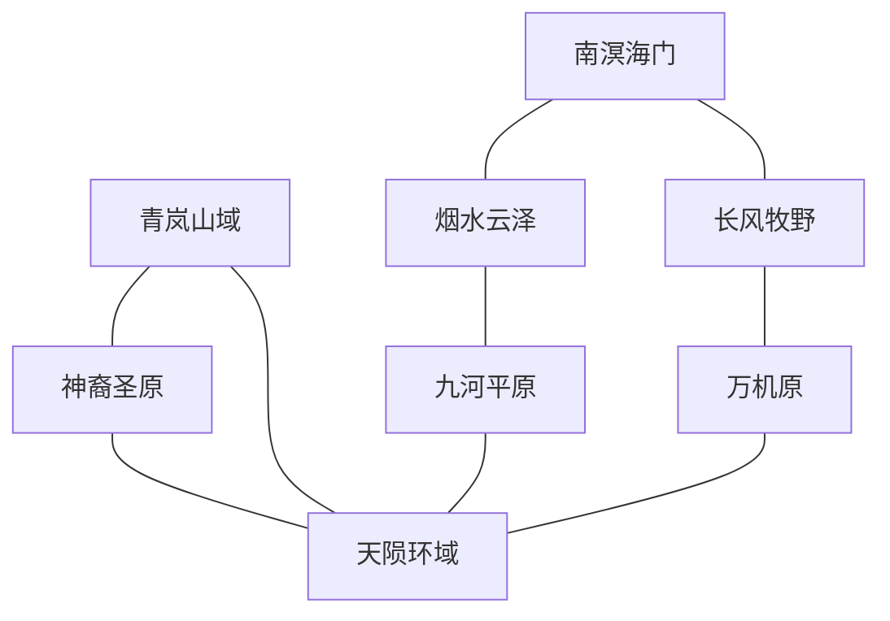

[mvu_plot]星坠大陆总览

# 星坠大陆蓝图

> 状态：创作蓝图，供后续转写为 `[mvu_plot]星坠大陆总览.txt`、区域灵感库、人物条目与事件条目使用。
>
> 设计原则：陨星是大陆主线，不是大陆的全部。机关术与傀儡术集中于天陨环域、万机原等地；农业、山林修行、水乡文化、牧野生活、虚海贸易与神族氏族社会各自拥有独立内容。

## 一、与现有世界设定的兼容约束

- 世界历史：上古天魔战争将灵界超大陆撕裂为七大陆，星坠大陆由原超大陆的一部分形成。
- 陨星性质：陨星是战争期间脱轨坠落的天然天星，蕴含天然神纹与破碎法则，不是域外异类造物，不存在现代科技或外星文明。
- 主要人口：人族数量最多，是农业、手工业、商贸与凡国的主体；神族人数较少，却凭借上古神格血脉、高阶修士与古老氏族占据重要地位。
- 神族特征：依血脉纯度划分地位，多在氏族内部通婚，擅长神识与幻术；神族不是神祇，也会衰老、受伤与死亡。
- 修为尺度：灵界以化神为中坚、返虚为管事或长老、合体多为宗主；公开存在的大乘修士宜控制在一至两位，渡劫修士不介入常规纷争。凡国人物最高不超过金丹，境界远低于宗门；凡国必须依靠宗门庇护，超出自身能力的修士冲突由护国宗门介入。
- 技艺归属：机关术和傀儡术属于炼器、阵法、御物与神识的综合运用；傀儡仍使用现有“傀儡”物品分类，不新增科技物品体系。
- 五行归属：星砂、星纹铁等材料通常归金、阳或混沌，不新增“星属性”。
- 经济体系：继续使用下品灵石作为唯一标准计价单位；大陆特色资源只改变商品种类，不另设通用货币。
- 凡国定义：灵界的“凡国”指负责普通人口与低阶修士日常治理的世俗政权，并非国民全是凡人。高阶战力仍主要由宗门、神族氏族或护国修士提供。

## 二、核心设定

上古天魔战争撕裂灵界时，一颗原本环绕灵界运行的天星脱轨坠落，在大陆中央撞出“天陨渊”。撞击掀起的山环、河流与星砂塑造了今日的星坠大陆，陨星内部则保存着无法以当世文字完整解释的天然神纹。

关于陨星本质，存在三种并立学说：

- 神骸说：神族认为陨星是上古神祇陨落后留下的神骸，天然神纹是破碎神格的显现。
- 天星说：人族学宫认为陨星只是孕育于天地间的自然星体，神纹是可被观察、验证与复现的法则现象。
- 界壁说：少数修士认为陨星其实是灵界世界壁垒破裂后凝结成的碎片，其深层异动可能关系到下一次天魔入侵。

三种观点均不设为绝对真相。围绕陨星形成的核心矛盾是：神纹究竟是神族不可侵犯的血脉遗产，还是万族皆可研究的天地规律；继续开采星核是否会破坏某种尚未被理解的封印。

### 大陆空间结构

地点层级建议：`灵界-星坠大陆-${生态}-${?宗门|秘境|城市}-${具体位置}`

- 中央：天陨环域，陨星研究与大陆级政治的中心。
- 北部：神裔圣原，神族氏族与古老祭祀之地。
- 东部：九河平原，人族农业、王朝与人口中心。
- 东南：烟水云泽，水乡城市、艺术与幻术文化中心。
- 西北：青岚山域，传统宗门、药谷与山林聚落。
- 西部：万机原，炼器、阵法、傀儡与百工生产中心。
- 西南：长风牧野，牧业、驿路与游牧城镇并存。
- 南部：南溟海门，面向虚海的跨大陆贸易门户。

## 三、生态设定与区域灵感

### 1. 天陨环域（中央·陨星撞击区）

- 位置：星坠大陆中央，八方道路与河流皆以此为起点或终点。
- 地貌：天陨渊深陷地心，外围是数层同心环山；部分山体受残余浮力影响悬在空中，以锁链、虹桥和传送阵连接。
- 气候：昼夜温差极大；每逢“星鸣”，天空出现无声极光，附近灵力与神识产生短暂共振。
- 水文：环山雪水汇成九条大河；天陨渊内部存在逆流而上的悬瀑，但渊底水源去向不明。
- 危险：重力错乱、神识回响、法宝自行激活、傀儡误认主人。越接近星核，修为越高者受到的法则干扰越明显。
- 秘境候选：无字神殿、倒悬星宫、静默矿层。
- 地标：天陨渊、曜京、观星司、九环封锁阵、星门大桥。
- 资源：星砂、星纹铁、星髓、明神玉、环山雪莲；极少量法则残片只可由合体以上修士接触。

区域灵感：

1. 新开启的矿层中没有任何矿石，只有一座会模仿访客动作的无面石像。
2. 星鸣期间，城中所有傀儡同时停工，朝天陨渊方向行礼，片刻后又恢复正常。
3. 玩家受托护送一批普通矿工撤离重力紊乱区，途中必须在救人与保全星髓之间取舍。
4. 神族祭司与人族学者对一段神纹给出完全相反的解释，却都能用实验证明自己正确。
5. 某件普通生活法宝被星鸣激活，开始反复播放一段上古家庭的日常记忆。
6. 曜京举办公开观星日，市民在庆典中参观外围研究区，封锁阵却突然短暂熄灭。

### 2. 神裔圣原（北部·神族氏族高原）

- 位置：天陨环域以北，高原缓缓抬升，最北端临虚海断崖。
- 地貌：金白草原、台地、浅湖与神辉林交错；古神殿沿山脊排列，氏族庄园散布于各处灵脉。
- 气候：清寒干燥，日照充足；夜间星光异常明亮，适合神识与幻术修炼。
- 水文：以高原湖、地下泉与季节性河流为主，湖泊常被氏族视为血脉发源地。
- 社会：神族依血脉纯度、神纹共鸣与祖谱决定地位；礼仪繁复，婚姻、继承与收徒皆受氏族长老干预。
- 秘境候选：失名祖殿、照魂天池、千面回廊。
- 地标：曜天神宫、百氏祖庭、天镜台、圣阶古道、神契碑林。
- 资源：明神玉、曜辉草、照魂莲、白角灵鹿、曜羽鹤、凝神泉。

区域灵感：

1. 一名旁系神族在成年仪式上唤醒了嫡系失传的神纹，族谱与继承秩序因此动摇。
2. 神族少女第一次离开庄园，在普通集市中不会买东西，也无法理解讨价还价。
3. 两个长期敌对的氏族被迫共同修复祖殿，年轻一代却发现双方供奉的是同一位祖先。
4. 照魂天池映出的不是前世，而是一个人最不愿承认的愿望，引发祭礼混乱。
5. 某氏族举办婚选，表面考察血脉，实际是在寻找能承受家族诅咒的外来者。
6. 一位神族长辈私下学习人族烹饪、戏曲或农艺，竭力维持庄严形象却屡屡失误。

### 3. 九河平原（东部·农业与王朝腹地）

- 位置：天陨环域以东，九条河流穿过平原后汇入烟水云泽。
- 地貌：冲积平原广阔，灵田、桑林、果园与大小城镇连成片；古河堤下常埋有撞击前的遗址。
- 气候：四季分明、雨热同期，偶有河道改流与灵潮洪水。
- 水文：九河灌溉全境，各地以引水阵、堰坝和河渠管理水量；河流被视为大陆生机之源。
- 社会：人族人口最密集，凡人、低阶修士与修仙世家共同生活；机关主要用于耕种、灌溉、运输和防洪。
- 秘境候选：倒流古渠、沉禾城、河伯旧府。
- 地标：河洛城、九河大堰、万顷灵田、社稷坛、通济水市。
- 资源：灵米、金穗麦、云桑、河珠、青背灵牛、水纹陶土。

区域灵感：

1. 收割傀儡在秋收时拒绝进入一块田地，地下随后传出古城钟声。
2. 两县争夺改道后的灵河，玩家需调查究竟是自然改流、阵法失修还是有人蓄意截水。
3. 丰收祭上的灵米突然开花，引来各方宗门争抢，老农却只担心来年无种可播。
4. 一名神族贵族被派来治理乡县，擅长神识推演却完全不懂农时与人情。
5. 玩家受托护送一支普通婚船穿过九河水网，沿途牵出两个世家延续百年的旧怨。
6. 河洛城举行面向凡人与低阶修士的百工考试，参赛者用朴素方法击败昂贵法宝。

### 4. 青岚山域（西北·传统宗门与药谷）

- 位置：天陨环域西北，连接神裔圣原与万机原。
- 地貌：群峰、竹海、峡谷、古林与高山药甸层叠；山中洞府和小宗门远多于大型城市。
- 气候：山脚温润、山腰多雾、峰顶积雪，同一山域内可见多种气候。
- 水文：山泉密布，汇成九河西侧支流；部分灵泉具有疗伤、淬体或滋养神魂之效。
- 社会：传统修士重视自身修炼与师徒传承，对过度依赖傀儡和外物持保留态度，但并不拒绝实用法器。
- 秘境候选：百草眠谷、听剑石林、云腹洞天。
- 地标：青岚回春谷、守一台、万药古道、悬泉坊、问心竹海。
- 资源：青岚参、玉髓芝、问心竹、云纹豹、药香鹿、温灵玉。

区域灵感：

1. 山村所供奉的“护村仙人”其实是一具年久失修、仍坚持履行命令的古傀儡。
2. 两位医修为同一名病人提出相反疗法，需要玩家寻找病因而非简单选择阵营。
3. 问心竹海会重复访客曾说过的谎言，宗门弟子因此不敢轻易进入。
4. 一场采药竞赛中，珍贵灵药主动躲避经验丰富的修士，却跟在毫无培育技艺的孩童身后。
5. 传统宗门请万机原修士修复护山阵，双方因“外物是否有损道心”争论不休。
6. 玩家在山间客栈遭遇闭关失败的高阶修士，对方没有阴谋，只想重新学习普通人的生活。

### 5. 万机原（西部·炼器与百工生产区）

- 位置：天陨环域以西，南接长风牧野，北邻青岚山域。
- 地貌：赤色台地、矿山、地火裂谷与人工运河密布；工坊城市之间以大型货运阵和傀儡车道相连。
- 气候：干燥多风，地火区终年温暖；炼炉烟霞受净尘阵约束，不形成永久污染。
- 水文：水源主要来自青岚山脉，通过人工渠网供应城市与工坊。
- 社会：工匠、学徒、商会与生产宗门众多；重视可验证的技艺、契约、署名和师承，偷窃图谱比盗取成品更受忌讳。
- 秘境候选：千炉地宫、自鸣废城、无主机藏。
- 地标：玲珑城、璇玑天工宗、百炉谷、万机斗场、祖师尺塔。
- 资源：赤铜母矿、地火晶、玄铁、火蚕丝、铁背蜥、耐火灵木。

区域灵感：

1. 某工坊制造的家务傀儡陆续离开主人，聚在废城中模仿凡人建立家庭。
2. 百工大会要求参赛者不用星砂，只凭寻常材料解决一座城的实际难题。
3. 一名学徒发现师门传承图谱抄错了一笔，却因此造出前所未有的新机关。
4. 大型货运阵停摆后，修士才发现整座城市已经不会使用传统畜力和人工运输。
5. 两家工坊争夺一件法宝的署名权，器灵却声称自己才是真正的创造者。
6. 玩家接到维修农用傀儡的小委托，最终发现损坏来自使用者多年未曾表达的纪念习惯。

### 6. 烟水云泽（东南·湖城与文化水乡）

- 位置：九河下游汇聚之处，南接虚海沿岸。
- 地貌：大湖、苇泽、水巷、岛城与低山交错，建筑临水而立，舟船是主要交通工具。
- 气候：温暖湿润，春雾与夏雨频繁；月夜湖面容易自然形成微弱幻景。
- 水文：九河在此分成无数水道，最终经南溟海门流入虚海。
- 社会：诗画、丝竹、酿酒、制香、服饰与幻术表演兴盛；神族的神识天赋在此发展为艺术，而非单纯战斗手段。
- 秘境候选：留梦画舫、沉月戏台、无岸芦洲。
- 地标：镜花城、千舫夜市、留梦馆、十二桥、云泽大戏台。
- 资源：梦莲、月纱藕、镜鳞鱼、云泽蚌珠、留香木、水月石。

区域灵感：

1. 一场幻术戏演到结局时，台上角色拒绝退场，声称自己拥有独立人格。
2. 玩家进入留梦馆寻找线索，却发现委托人的记忆被剪成数段卖给了不同买家。
3. 道侣相约游湖，随手放出的祈愿灯却漂回了其中一人的故乡。
4. 著名琴师突然失去听觉，仍能通过灵力震动演奏，却开始怀疑过去的盛名是否属于自己。
5. 水乡服饰大会混入一件会随穿着者心意变化的器灵法衣，引发身份错认。
6. 暴雨困住一群互不相识的旅客，众人在小客栈里闲谈、烹饪、争吵并建立短暂关系。

### 7. 长风牧野（西南·草原与陆路驿道）

- 位置：万机原以南、南溟海门以西，是连接西部工坊与南部港口的陆路走廊。
- 地貌：起伏草原、孤山、盐湖与风蚀石林；聚落随牧场变化迁移，但固定驿城控制主要商道。
- 气候：昼夜温差大，春秋长风不断；雷雨季草木迅速繁盛。
- 水文：盐湖和地下泉为主，雨季形成短暂河道与花海。
- 社会：人族牧民与少量神族旁支混居，重视待客、歌舞、赛骑和口述历史；傀儡不适应复杂牧群，灵兽与人工驯养更重要。
- 秘境候选：风葬王庭、万蹄梦原、雷息石林。
- 地标：风籁城、千帐大集、白鹿泉、长风驿路、牧星台。
- 资源：踏云马、青角羊、鸣风雕、雷纹草、牧星花、盐湖晶。

区域灵感：

1. 一支商队因迷路进入早已消失的旧驿站，店主仍按千年前的价目招待客人。
2. 牧群每夜围成同一幅图案，老牧人认为是吉兆，观星修士却认出那是一段神纹。
3. 神族旁支少女想参加赛骑证明自己，却被家族认为骑术有失贵族体面。
4. 玩家帮牧民寻找走失灵兽，发现它正在照料一只受伤的野生天敌。
5. 千帐大集上，两族青年用歌舞、驯兽和礼物争相展示自身优点，不得以暴力解决竞争。
6. 长风驿路被新传送阵取代，沿途旧城为求生存开始发展食宿、节庆和观光。

### 8. 南溟海门（南部·虚海港湾）

- 位置：星坠大陆最南端，烟水云泽与长风牧野在此汇入虚海。
- 地貌：深水港湾、海蚀崖、岛链和天然避风峡；港外虚海深不见底，偶有浮岛与星雾漂过。
- 气候：温暖多雨，季风决定远航时节；虚海风暴来临前会出现低沉灵压。
- 水文：九河入海口与虚海潮汐交汇，淡水、海水和灵潮形成复杂航道。
- 社会：各族旅客、飞舟水手、商人、护卫和散修汇聚，是大陆风俗最开放的地区。
- 秘境候选：沉槎古港、星雾浮岛、无底潮穴。
- 地标：天槎港、跨大陆传送枢纽、万舟船坞、海关司、归帆灯塔。
- 资源：虚海鲸脂、浮岛木、潮汐晶、星雾藻、银翼鳐、定风珊瑚。

区域灵感：

1. 玩家登船后才发现飞舟船员来自互相敌对的大陆，却必须共同穿过虚海风暴。
2. 一座浮岛靠港后迟迟不再离开，岛上居民坚称港口才是移动的那一方。
3. 远航者托玩家把普通家书送往九河平原，信件却被多个势力误认为重要情报。
4. 港口举行归帆节，失踪百年的旧船突然与庆典船队一同返航，船上人毫无衰老。
5. 海关查获一批未经登记的器灵，它们声称自己不是货物，而是付费乘客。
6. 一次普通跨大陆旅程中，乘客因舱位、饮食、宗教和生活习惯产生矛盾，最终在危机中互相协助。

## 四、宗门设定

以下宗门按凡界总览的字段设计。此阶段只确定宗门职能与生活基调，不创建具名人物；组织职位可在人物细化阶段补全。

### 1. 曜天神宫（大型·神族传承）

- 简介：神族最古老的传承宗门，负责保存祖谱、神格残篇与神识秘法，也是神裔圣原的精神权威。
- 理念：照见本心，承续神性。
- 位置：灵界-星坠大陆-神裔圣原。
- 声望：在神族中地位尊崇；人族则认为其过度垄断神纹知识。
- 组织：宫主姬照微、神契长老姬含章、照魂师姬月衡、内宫执律使姜执素；下设十二氏族祭正与内外宫弟子。
- 修行：神识、幻术、护体、血脉唤醒；反对以粗暴移植方式制造伪神血脉。
- 地标：曜天正殿、照魂天池、百氏祖堂、神纹藏室、千面回廊。
- 外销：凝神丹、幻术法宝、神识鉴定、心魔疗愈与高阶护魂服务。
- 对外：与万象学宫合作研究陨星但长期争执；与神族各氏族关系紧密；对璇玑天工宗复制神纹的行为保持警惕。

### 2. 万象学宫（大型·人族综合学宫）

- 简介：人族主导、兼收各族的综合修仙学宫，研究天地规律、历史、阵法、医术与百工，不以机关术作为唯一方向。
- 理念：万象皆可察，万法皆可证。
- 位置：灵界-星坠大陆-天陨环域-曜京。
- 声望：大陆最开放的知识中心；凡界飞升者常在此获得适应灵界的指导。
- 组织：山长墨观澜、历史院首座温砚秋、阵法院研究师叶疏星、飞升者客院掌院许问渠；另设天文、医药、百工、外交诸院及内外院弟子。
- 修行：阵法、神识、医术、炼器、培育与传统功法并重。
- 地标：万象藏书楼、问证台、诸界碑廊、公开讲坛、飞升者客院。
- 外销：典籍、鉴定、阵图、教育、跨族翻译与研究委托。
- 对外：与曜天神宫共同管理部分星核资料；向各凡国培养官吏、医师和阵法师。

### 3. 璇玑天工宗（大型·炼器傀儡）

- 简介：以炼器、阵法和傀儡术闻名的生产宗门，擅长将成熟技艺转化为可批量制造的实用器具。
- 理念：器以载道，巧夺天工。
- 位置：灵界-星坠大陆-万机原-玲珑城。
- 声望：大陆法宝与傀儡的主要供应者；因生产规模庞大而对各地经济影响极深。
- 组织：宗主公输朱弦、器灵仲裁尺九、机傀院首座鲁丹枢、炉院首席韩漱金、营造院首座祁木迟；另设天工议堂、阵衡院与外务院。
- 修行：炼器、阵法、御物、神识多线操控；弟子同时接受手工基础训练，禁止只会依赖自动傀儡。
- 地标：百炉谷、祖师尺塔、万机斗场、图谱藏库、器灵议室。
- 外销：法宝、阵盘、傀儡、生产工具、大型建筑阵法与维修服务。
- 对外：依赖青岚山域的灵木、九河平原的粮食与南溟港口的贸易；与传统宗门既合作又争论。

### 4. 青岚回春谷（中型·医药培育）

- 简介：隐于青岚山域的医修宗门，以灵药培育、经脉治疗与神魂调养见长。
- 理念：顺时养生，济人亦济己。
- 位置：灵界-星坠大陆-青岚山域。
- 声望：不以战力著称，却因治疗星蚀、神识损伤与炼器火毒而受各方尊重。
- 组织：谷主容春岫、医堂首座白芷湄、育灵堂掌事桑柔、巡山使统领程苦参；另设药堂、采药队与内外谷弟子。
- 修行：医术、培育、炼丹、护体；重视望闻问切与实地采药。
- 地标：回春谷、万药古道、温灵泉、百草眠谷、青囊院。
- 外销：灵药、疗伤丹、诊疗、药田设计与星蚀缓解方案。
- 对外：与九河皇朝合作推广药田；为天陨环域研究者提供长期身体检查。

### 5. 镜心乐府（中型·艺术幻术）

- 简介：以丝竹、舞蹈、绘画和幻术修行见长的宗门，将神识幻境用于艺术、疗愈与记录，而非单纯惑敌。
- 理念：照心成境，以情入道。
- 位置：灵界-星坠大陆-烟水云泽-镜花城。
- 声望：演出名动诸大陆，也因能够读取、保存记忆而受到权贵忌惮。
- 组织：府主姬流月、十二艺监之首商清商、舞监薄绯、乐器师顾弦歌；下辖留梦师、乐师、舞修、画师与外院弟子。
- 修行：幻术、神识、御物、医术；强调情感真实，禁止强取他人记忆。
- 地标：云泽大戏台、留梦馆、十二桥乐院、沉月戏台。
- 外销：演出、留影幻境、神魂疗愈、乐器法宝、节庆策划。
- 对外：与曜天神宫有神识传承交流；与烟水十二城盟关系密切。

### 6. 观潮舟宗（中型·航行与虚海探索）

- 简介：驻守南溟海门的航海宗门，培养飞舟驾驭者、虚海向导与远航护卫。
- 理念：识潮定向，渡人渡己。
- 位置：灵界-星坠大陆-南溟海门-天槎港。
- 声望：跨大陆远航的重要保障；不保证旅途绝对安全，但极少弃船客于不顾。
- 组织：宗主闻潮生、搜救堂主祝归帆、航图院首席鱼晚晴、船坞院首座罗定波；另设观潮台与护航堂。
- 修行：阵法、御物、神识、炼器、驯兽；擅长大型飞舟阵法与虚海灵兽预警。
- 地标：归帆灯塔、万舟船坞、观潮台、沉槎古港。
- 外销：船票、护航、飞舟维修、航图、虚海情报与搜救服务。
- 对外：与南溟商国互相依赖；在各大陆主要港口设有驻点。

## 五、城市设定

### 1. 曜京（大陆中心·超大型修仙城市）

- 简介：建于天陨渊第一环山外侧的大陆都城，是神族、人族与各方势力共同议事之地。
- 风格原型：环形山城与多层修仙都市；内城庄严，外城开放繁忙。
- 位置：灵界-星坠大陆-天陨环域。
- 政体：天衡议庭共治，神族氏族、万象学宫、四大凡国与主要宗门各有席位。
- 城市结构：内环为观星司与封锁阵，中环为学宫、使馆和大商会，外环为居民区、坊市与飞升者客栈。
- 经济：陨星研究、情报、教育、鉴定、拍卖、跨域服务；不允许在城内私自交易法则残片。
- 文化：各族节庆并存，新旧礼制冲突频繁；公开讲坛与街头辩论是城市特色。
- 军事：观星司卫队与各势力轮值修士守城，核心职责是防止天陨渊异变外溢。
- 节庆：星降纪念日、万象问证会、诸族灯会。
- 地标：天衡议庭、万象学宫、观星司、星门大桥、九环封锁阵。

### 2. 河洛城（九河平原·人族皇都）

- 简介：九河皇朝都城，管理大陆最广阔的灵田和最多的普通人口。
- 风格原型：河渠纵横的礼制皇城，宫城、官署、书院、粮仓与水市层层展开。
- 位置：灵界-星坠大陆-九河平原。
- 政体：九河皇朝君主集权，以文官、世家和护国修士共同维持秩序。
- 经济：灵米、丝绸、灵酒、陶器、河运与农用法器。
- 文化：重视农时、科考、宗族和节令；凡人与低阶修士可以参加部分共同考试。
- 军事：河防军、堤阵司与少量护国修士，重在防洪、护粮与维持水运。
- 节庆：九河开闸祭、丰穗节、春蚕会。
- 地标：社稷坛、九河大堰、通济水市、万仓城垣。

### 3. 玲珑城（万机原·百工之都）

- 简介：依百炉谷而建的工坊都市，城中从大型宗门工坊到家庭小铺一应俱全。
- 风格原型：层叠工坊城；传送货台、引水渠和炉塔构成城市骨架。
- 位置：灵界-星坠大陆-万机原。
- 政体：工坊议会自治，璇玑天工宗拥有仲裁权但不直接管理全部商户。
- 经济：法宝、傀儡、阵盘、建筑构件、维修、图谱授权。
- 文化：尊重手艺、师承和署名；学徒出师时必须独立完成一件服务普通人的器具。
- 军事：城防巨傀与阵塔负责外敌，城内私斗会被停业和封炉。
- 节庆：百工大会、开炉节、器灵认主礼。
- 地标：百炉谷、祖师尺塔、万机斗场、图谱藏库。

### 4. 镜花城（烟水云泽·水乡艺都）

- 简介：建立在湖岛与桥梁上的水城，以幻术演出、丝竹、服饰和夜市闻名。
- 风格原型：繁华水乡与修仙艺术之都。
- 位置：灵界-星坠大陆-烟水云泽。
- 政体：十二桥行会与镜心乐府共同议事。
- 经济：演出、制香、酿酒、丝织、幻境留影、画舫旅业。
- 文化：重情趣和审美，城市生活节奏较慢；居民习惯在公共场合以琴曲或幻景表达心意。
- 军事：水巡司与护城幻阵，以困敌、示警和疏散为主。
- 节庆：镜湖花朝、千舫灯会、留梦戏祭。
- 地标：云泽大戏台、留梦馆、十二桥、千舫夜市。

### 5. 风籁城（长风牧野·草原驿城）

- 简介：由固定驿站发展而成的草原城市，是牧民、商队与万机原工匠交换物资的中心。
- 风格原型：石木城寨与季节性帐市并存。
- 位置：灵界-星坠大陆-长风牧野。
- 政体：长风牧国王庭与各部落长共同管理，重大商事由驿路行会裁定。
- 经济：灵兽、皮毛、乳酒、药草、盐晶、长途运输。
- 文化：好客、重歌舞与口述历史；竞争多以赛骑、驯兽和赠礼进行。
- 军事：灵骑、鸣风雕斥候与商道护卫。
- 节庆：千帐大集、逐风赛、白鹿泉盟誓。
- 地标：千帐大集、白鹿泉、牧星台、长风驿总站。

### 6. 天槎港（南溟海门·跨大陆自由港）

- 简介：星坠大陆最大的虚海港口，传送阵、飞舟船坞和各族商馆集中于此。
- 风格原型：立体港城；港湾停泊飞舟，崖壁开凿仓库，上层建有传送枢纽。
- 位置：灵界-星坠大陆-南溟海门。
- 政体：南溟商国管理港务，观潮舟宗负责航行安全，各族商会拥有自治商馆。
- 经济：跨大陆贸易、船票、仓储、保险、护航、外来灵材与情报。
- 文化：开放务实，居民习惯多族语言与不同礼俗；旅店、酒楼和临时雇佣市场发达。
- 军事：港务舰队、护航飞舟与归帆灯塔大阵。
- 节庆：归帆节、虚海大市、诸族食会。
- 地标：跨大陆传送枢纽、万舟船坞、归帆灯塔、诸界商馆街。

## 六、凡国与世俗政权设定

### 1. 九河皇朝（人族农业皇朝）

- 简介：统治九河平原的人族皇朝，是星坠大陆人口、粮食与河运的基础。
- 风格原型：重农、重水利与文官治理的修仙王朝。
- 疆域：九河平原大部，名义上对烟水云泽北部拥有宗主权。
- 政体：君主集权；皇室、文官、修仙世家与护国修士相互制衡。
- 都城：河洛城。
- 立国：上古战争后，各地治水城邦为修复九河共同推举河洛王族，逐渐统一平原。
- 组织：皇帝、三台六司、九河总督、堤阵司、农桑院、地方郡县。
- 军事：河防军、粮道军、城池阵师；将领以筑基、金丹为主，世俗人物最高不超过金丹，高阶战争完全依赖护国宗门盟约。
- 庇护：与万象学宫及沿河诸宗订有护国盟约；皇朝供应粮税、土地和基层人才，超出凡国应对能力的修士威胁由护国宗门介入。
- 经济：灵米、丝绸、灵酒、云桑、河运和农用法器。
- 信仰：祭天地、社稷与九河，不立排他的唯一国教。
- 节庆：开闸祭、丰穗节、春蚕会。
- 对外：向曜京供应粮食；与烟水十二城盟既合作水运又争夺税权；需要万机原维护水利阵法。

### 2. 烟水十二城盟（水乡城邦联盟）

- 简介：烟水云泽十二座岛城组成的松散联盟，以文化、商贸和水运维系共同利益。
- 风格原型：水乡城市联盟，不设世袭皇帝。
- 疆域：烟水云泽及九河入海水道。
- 政体：十二城各自治，每城推举一名城使参加水盟议会；镜花城为常驻议事地。
- 都城：无固定都城，镜花城承担盟会与外交职能。
- 组织：水盟议会、十二城使、水巡司、行会、艺坊与船帮。
- 军事：水师、幻阵、快舟斥候；城使与将领多为筑基、金丹，最高不超过金丹，无法独立应对元婴及以上修士。
- 庇护：镜心乐府负责维持护城幻阵并威慑高阶修士；水盟则提供弟子、税赋与演出资源。
- 经济：丝织、制香、酿酒、幻术演出、旅业、水产与内河贸易。
- 信仰：多神与祖师信仰并存，尤重水神、乐祖和桥神祭祀。
- 节庆：千舫灯会、花朝、十二桥会盟。
- 禁忌：不得以幻术强行窃取他人隐私或记忆。
- 对外：与九河皇朝共享水系；与南溟商国争夺入海贸易利润；受镜心乐府深刻影响。

### 3. 长风牧国（牧野部族盟国）

- 简介：长风牧野各部落、驿城与牧场共同组成的盟国，人族为主，也接纳神族旁支和其他族群。
- 风格原型：游牧部族与固定商道国家并存，强调迁徙权和水源公约。
- 疆域：长风牧野与西南陆路驿道。
- 政体：王庭负责外交与战争，各部保留牧场和内部自治；国主由主要部落按盟约推举，不限定单一血统。
- 都城：风籁城；王庭仍会随季节迁往不同牧场。
- 组织：国主、部落长会、驿路司、牧群官、泉盟守卫。
- 军事：灵骑、驯兽师、鸣风雕斥候与机动护商队；以凡人、炼气、筑基为主体，金丹统领已属少数。
- 庇护：各部共同供养数个传统修行宗门，并通过天衡之约获得大陆势力保护；国主不能直接号令这些宗门。
- 经济：灵兽、皮毛、乳酒、盐晶、药草与陆路运输。
- 信仰：敬畏长风、白鹿泉与祖先，不把自然灵物视为可任意占有之物。
- 节庆：千帐大集、逐风赛、归牧祭。
- 禁忌：不得永久封占公共泉眼；不得在幼兽季大规模狩猎。
- 对外：向万机原供应灵兽与皮革；向南溟海门输送陆运货物；与神裔圣原存在通婚和血统争议。

### 4. 南溟商国（虚海港口商国）

- 简介：围绕天槎港、岛链和飞舟航线形成的商贸国家，居民来源复杂，以人族为主。
- 风格原型：港口商国与跨大陆贸易联盟。
- 疆域：南溟海门、近海岛链与若干虚海补给浮岛。
- 政体：港务议会制；大型商会、船坞、观潮舟宗和本地居民各有席位。
- 都城：天槎港。
- 组织：港务议会、海关司、航路司、商事法庭、港务舰队与诸族商馆。
- 军事：护航飞舟、港湾阵法、搜救船队；主要依靠阵法与飞舟协同，执政者本身不掌握高阶武力。
- 庇护：观潮舟宗依盟约保护港口、航路与跨大陆传送枢纽；商国承担船坞、补给和弟子供养。
- 经济：跨大陆贸易、仓储、船票、护航、飞舟制造与外来灵材转运。
- 信仰：自由信仰，远航者普遍祭祀归帆灯和历代失踪水手。
- 节庆：归帆节、虚海大市、诸族食会。
- 禁忌：不得伪造航图与遇险信号；救援飞舟不得因债务拒绝救人。
- 对外：与灵界各大陆保持贸易；与烟水十二城盟竞争河海转运；依赖观潮舟宗提供航行技术。

## 七、大陆政治结构

星坠大陆不设统一帝国。上古战后，各方通过“天衡之约”共同管理天陨环域：

- 曜天神宫代表神族氏族，主张谨慎封存与有限研究。
- 万象学宫代表开放学术，主张可验证、可监管的公开研究。
- 璇玑天工宗代表生产与应用，希望将成熟成果转化为法宝、阵法和傀儡。
- 九河皇朝、烟水十二城盟、长风牧国、南溟商国负责人口、粮食、文化、陆运与海贸。
- 观星司由上述势力共同建立，负责星鸣预警、危险材料登记和禁域封锁。

大陆公开存在的大乘战力暂不落实为具名人物，只预留两席：一席来自神族体系，一席来自人族体系。两者负责维持天衡之约，不直接介入地方日常争端。

## 八、人物设计

### 人物设计原则

- 每个生态至少设置一名权力人物、一名专业人物和一名适合日常接触的引路人，避免人物全部集中在曜京与天陨渊。
- 神族人物遵循既有设定：重视血脉纯度、祖谱与氏族婚姻，擅长神识和幻术；个体可以质疑传统，但不能把整个神族写成已经放弃血脉等级。
- 人族人物覆盖皇朝官吏、宗门修士、工匠、农户、艺人、牧民、船员等阶层，体现人族是大陆人口与生产主体。
- 大乘修士只设两名公开人物：神族的姬照微与人族的墨观澜。其余宗主、国主以合体或返虚为主。
- 蓝图只确定人物骨架。正式绿灯人物条目仍需按《人物提示词示例》补充角色魅力、着装、法宝、底色、性格生活细节、表白与道侣相处。
- 总览中出现的具名女性，正式落地时必须建立对应人物条目，避免只有名字而无法继续展开。

### 1. 天陨环域人物

#### 墨观澜（大叔）

- 种族／境界：人族，大乘初期。
- 身份：万象学宫山长，人族公开的大乘修士，“天衡之约”两位维系者之一。
- 外在印象：衣着朴素、说话随和，喜欢在公开讲坛与年轻修士争论，不摆大乘架子。
- 底色：坚信知识不该由血脉垄断；越是未知，越应允许不同身份的人共同验证。
- 内在矛盾：主张公开研究，却亲手封存过一批足以动摇大陆秩序的星核记录。
- 剧情用途：学宫引路人、陨星研究争论、人族最高层立场；不会轻易替玩家解决具体危机。

#### 沈星晷（御姐）

- 种族／境界：人族，合体中期。
- 身份：观星司正监，负责星鸣预警、禁域封锁与危险材料登记。
- 外在印象：精确克制，随身携带多枚计时星盘，对迟到和未经记录的实验极其敏感。
- 底色：把规则视为保护研究者生命的底线，而非维护权威的工具。
- 内在矛盾：她反对任何人因私人执念进入禁域，自己却一直在寻找失踪于星核的姐姐。
- 剧情用途：发布调查、撤离、封锁与护送任务；承担陨星主线中的理性制动者。

#### 钟小铛（少女）

- 种族／境界：人族，化神初期。
- 身份：曜京外环的法宝维修师兼公开观星日向导。
- 外在印象：腰间挂满会互相碰响的小工具，喜欢把复杂神纹解释成炊具、水渠和门锁。
- 底色：认为修仙百艺首先应让普通人的生活更方便，而不是只为高阶修士服务。
- 内在矛盾：手艺灵巧却没有原创天赋，总担心自己只能修补别人的成果。
- 剧情用途：曜京生活引路人、低风险委托来源、以普通视角解释机关和陨星研究。

### 2. 神裔圣原人物

#### 姬照微（御姐）

- 种族／境界：神族，大乘初期。
- 身份：曜天神宫宫主，神族公开的大乘修士，“天衡之约”两位维系者之一。
- 外在印象：言行端雅威严，神识如澄澈天光；私下喜欢亲自整理破损祖谱，不许侍从代劳。
- 底色：真正重视的是神族能否延续，而非个人权威；她相信失去历史的血脉只剩空壳。
- 内在矛盾：维护血脉等级制度，却清楚过度封闭和近亲通婚正让部分氏族逐渐衰弱。
- 剧情用途：神族最高层、陨星封存派代表、氏族改革与传统之间的核心人物。

#### 姬明夷（少女）

- 种族／境界：神族，返虚初期。
- 身份：古老嫡系的继承候选人，天生拥有罕见的神纹共鸣。
- 外在印象：在祭礼上无可挑剔，离开圣原后却缺乏生活常识，不懂价格、农时和市井礼节。
- 底色：渴望证明自身价值来自选择与行动，而非祖谱中一行漂亮的血统记录。
- 内在矛盾：反感氏族婚配安排，却无法否认纯血给她带来的力量与地位。
- 剧情用途：神族贵女日常、血脉继承冲突、玩家进入氏族社会的引路人。

#### 姜无咎（青年）

- 种族／境界：神族，合体初期。
- 身份：百氏祖庭守谱人，负责裁定血脉、收录婚生子嗣与维护神契碑林。
- 外在印象：寡言守礼，记得每个氏族数千年的谱系，却常认不出刚见过的普通人。
- 底色：相信准确记录可以阻止历史被权力任意改写。
- 内在矛盾：公开维护氏族秩序，私下却为不被家族承认的混血后裔建立匿名副谱。
- 剧情用途：身世查证、神族婚姻、族谱篡改与混血身份事件。

### 3. 九河平原人物

#### 陆衡川（青年）

- 种族／境界：人族，金丹后期。
- 身份：九河皇朝皇帝。
- 外在印象：善于倾听、熟悉政务，接见农官时远比接见宗门使者耐心。
- 底色：认为一个皇朝首先应让大多数人吃饱、安居，而非追求几件镇国奇宝。
- 内在矛盾：希望削弱修仙世家对河道和灵田的控制，却必须依赖这些世家维持护国战力。
- 剧情用途：国家政策、水利争端、世家与皇权冲突；不把他塑造成万能明君。

#### 苏浣渠（御姐）

- 种族／境界：人族，金丹后期；是九河皇朝的世俗水利骨干，高阶修士威胁须依靠护国宗门处理。
- 身份：九河总督兼堤阵司首席阵师。
- 外在印象：常年穿便于涉水的短袍，鞋袜沾泥；谈到河流时会忘记官场礼节。
- 底色：河道从不服从身份，治水只能尊重地势、时令和沿岸百姓的经验。
- 内在矛盾：擅长规划千年水系，却不会处理自己与家人的细小矛盾。
- 剧情用途：治水、灾害、地方调查、农业生产与务实型长辈互动。

#### 田穗穗（少女）

- 种族／境界：人族，筑基后期。
- 身份：灵农之女，兼任村中农用傀儡操作员，准备参加河洛城百工考试。
- 外在印象：开朗健谈，随身带着种子袋和修理木牛的扳手，能分辨数百种土壤气味。
- 底色：不认为耕种比炼制战斗法宝低贱，希望让家乡不再依赖昂贵宗门器具。
- 内在矛盾：擅长解决真实问题，却因出身和理论基础不足在正式考试中屡受轻视。
- 剧情用途：乡村生活、考试、农业改良、普通修士成长线和玩家的基层向导。

### 4. 青岚山域人物

#### 容春岫（御姐）

- 种族／境界：人族，合体初期。
- 身份：青岚回春谷谷主。
- 外在印象：温和从容，诊病时直言不讳；习惯让求医的高阶修士自己排队、自己煎药。
- 底色：治疗不是施恩，医者与病人都必须为选择和后果负责。
- 内在矛盾：能接受生老病死，却始终无法放下一个被她误诊而死的早年病人。
- 剧情用途：医药、星蚀治疗、宗门生活、伦理抉择与长期调养剧情。

#### 卓守拙（老翁）

- 种族／境界：人族，返虚后期。
- 身份：守一台隐修，也是青岚诸小宗之间受敬重的调停者。
- 外在印象：剑法极高却喜欢劈柴、补屋和种菜，遇到复杂法宝首先寻找最朴素的解决方法。
- 底色：外物可以使用，但修士必须知道离开外物后自己还剩什么。
- 内在矛盾：反感机关依赖，却珍藏着亡侣留下的一具陪伴傀儡，始终不舍得关闭。
- 剧情用途：传统修行观、宗门调解、生活哲理和机关与人情关系。

#### 青瓷（少女）

- 种族／境界：灵族，化神中期。
- 身份：一株生于温灵泉畔的瓷兰化形者，回春谷采药人与药田照料者。
- 外在印象：肤色如温润青瓷，喜欢把草药当作有脾气的邻居介绍给客人。
- 底色：相信照料来自长期相处，而不是一次性的催熟与索取。
- 内在矛盾：能理解草木枯荣，却害怕与寿命远短于自己的凡人建立感情。
- 剧情用途：药谷日常、灵族视角、培育任务和跨寿命关系故事。

### 5. 万机原人物

#### 公输朱弦（御姐）

- 种族／境界：人族，合体中期。
- 身份：璇玑天工宗宗主。
- 外在印象：仪态明艳，指尖常留炉火灼痕；欣赏漂亮器物，也要求每件器物经得起实际使用。
- 底色：技艺的价值既在精妙，也在能否被普通工匠学习和维护。
- 内在矛盾：推动制式生产，却担心大量复制会抹去工匠个性并催生无法控制的垄断。
- 剧情用途：炼器、生产改革、工坊政治、傀儡伦理与机关主线。

#### 尺九（少女）

- 种族／境界：物化生灵，返虚初期。
- 身份：祖师尺塔中一柄量天古尺化灵，担任器灵议室的首席仲裁者。
- 外在印象：说话喜欢报出精确尺寸，对人的情绪却常作出荒谬测量；讨厌别人把器灵称为工具。
- 底色：创造者赋予器物用途，但有灵之后应由器灵自己决定如何存在。
- 内在矛盾：努力争取器灵自主，却无法摆脱最初命令中“维护天工宗”的约束。
- 剧情用途：器灵权利、契约纠纷、法宝归属和轻松喜剧。

#### 唐榫（少年）

- 种族／境界：人族，金丹后期。
- 身份：玲珑城小工坊学徒，擅长以普通材料修复日用器具。
- 外在印象：手快嘴慢，紧张时会反复拆装手边物品；做出的东西不华丽却格外耐用。
- 底色：认为坏掉的东西应先尝试修复，人和关系也是如此。
- 内在矛盾：能修复别人的器物，却因害怕再次失败而不敢重做自己的出师作品。
- 剧情用途：工坊日常、低阶炼器、比赛、友情与成长。

### 6. 烟水云泽人物

#### 姬流月（御姐）

- 种族／境界：神族，返虚后期。
- 身份：镜心乐府府主，出身神裔圣原旁系氏族。
- 外在印象：举止慵懒风雅，能将一段寻常对话即兴编成琴曲；不喜欢别人追问她的本名与祖谱。
- 底色：情感只有被真实经历过才有价值，幻术可以放大感受，却不能代替人生。
- 内在矛盾：以艺术反对血脉束缚，却仍依赖神族天赋维持自身最高成就。
- 剧情用途：艺术、幻术、记忆伦理、神族旁支与水乡社交。

#### 顾照蘅（御姐）

- 种族／境界：人族，金丹后期。
- 身份：烟水十二城盟当值盟首，镜花城城使。
- 外在印象：擅长在宴席、画舫和闲谈中解决政治问题，很少在公开场合发怒。
- 底色：联盟不是彼此相爱，而是让彼此无法轻易掀翻共同生活的桌子。
- 内在矛盾：精于调和十二城利益，却逐渐把所有私人关系也当成需要计算的联盟。
- 剧情用途：城市政治、水运税权、宴会交际和成熟型关系剧情。

#### 柳弄晴（少女）

- 种族／境界：人族，化神初期。
- 身份：云泽大戏台当红幻术演员。
- 外在印象：台上能扮演百种人物，台下直率笨拙，常因说话太直接破坏精心营造的神秘感。
- 底色：希望观众喜欢真实的自己，而不仅是她制造的幻象。
- 内在矛盾：越擅长扮演他人，越难确认哪些习惯真正属于自己。
- 剧情用途：演出、身份错认、名声压力、约会与生活化互动。

### 7. 长风牧野人物

#### 赫连青野（御姐）

- 种族／境界：人族，金丹后期。
- 身份：长风牧国现任国主。
- 外在印象：爽朗健谈，议事时喜欢在露天火堆旁听取意见；对泉眼、牧期和商道极其严肃。
- 底色：权力来自各部愿意继续同行，而不是一座固定宫殿或某条神圣血统。
- 内在矛盾：维护各部迁徙自由，却发现国家要应对外部压力就必须建立更多固定制度。
- 剧情用途：部族政治、牧野生活、商道护送和开放型统治者。

#### 姬逐风（少女）

- 种族／境界：神族，金丹后期。
- 身份：定居牧野的神族旁支骑手，逐风赛连续数届优胜者。
- 外在印象：爱笑好胜，擅长骑乘却不擅长神族礼仪；回圣原时总被长辈纠正坐姿与用词。
- 底色：血脉不应只用来证明出身，也可以让自己跑得更远、看见更多地方。
- 内在矛盾：享受牧野自由，却仍渴望得到曾经轻视她的嫡系亲族认可。
- 剧情用途：神族旁支、比赛、驯兽、旅行陪伴和轻快日常。

#### 阿牧（少年）

- 种族／境界：人族，筑基中期。
- 身份：白鹿泉附近的年轻牧人，兼做商队临时向导。
- 外在印象：能辨认每一头灵兽的脚印，却不识多少文字；遇到陌生人先递奶茶再问来历。
- 底色：人与灵兽相处靠长期观察，不靠一次威压便能建立信任。
- 内在矛盾：热爱牧野，却羡慕远航者讲述的外界，担心离开后再也无法适应故乡。
- 剧情用途：基层向导、灵兽走失、牧场生活、旅行愿望与普通友情。

### 8. 南溟海门人物

#### 沈千帆（御姐）

- 种族／境界：人族，金丹后期。
- 身份：南溟商国当值执政，出身普通船主家庭。
- 外在印象：言谈精明但不吝啬，能记住数十年前每场海难的船名和遇难者名单。
- 底色：贸易可以逐利，但航海者不能把他人的性命只写成账本损耗。
- 内在矛盾：坚持遇险必救，却必须面对资源有限时无法救下所有人的现实。
- 剧情用途：港口政治、跨大陆贸易、救援伦理与商会冲突。

#### 闻潮生（大叔）

- 种族／境界：人族，合体初期。
- 身份：观潮舟宗宗主，曾是虚海远航船长。
- 外在印象：沉稳寡言，听风和灵压便能判断航路；靠岸后反而容易迷失在复杂街巷里。
- 底色：船长的职责不是永远正确，而是在错误发生后让尽可能多的人回家。
- 内在矛盾：教导弟子接受风险，自己却因一次旧海难不再亲自远航。
- 剧情用途：远航、搜救、师徒传承、创伤与重新出海。

#### 安澜（少女）

- 种族／境界：人族，金丹后期；远航主要依赖飞舟阵法与观潮舟宗的航路保障。
- 身份：年轻飞舟船长，经营往返万兽大陆的定期航线。
- 外在印象：在甲板上果断利落，靠港后喜欢收集各地食谱和廉价纪念品。
- 底色：远行不是逃离故乡，而是不断扩大自己能够称为故乡的地方。
- 内在矛盾：渴望自由航行，却背负船员、乘客和固定航线带来的责任。
- 剧情用途：跨大陆入口、航行日常、异族旅客冲突和虚海冒险。

### 9. 宗门增补人物

以下人物是在各区域既有人物之外，为六个宗门分别追加的三名核心成员；共十八人，其中十四人为女性。正式转写宗门总览时，应与宗主一同写入对应组织名单。

#### 曜天神宫

##### 姬含章（御姐）

- 种族／境界：神族，合体中期。
- 身份：曜天神宫神契长老，负责重大誓约、氏族盟约与神纹传承审核。
- 性格底色：端正严谨，坚信任何力量都必须由承担后果的人亲自立誓约束。
- 内在矛盾：维护古老神契，却发现部分祖制本身建立在被抹去的历史之上。
- 剧情用途：神契、婚约、传承资格与氏族之间的契约争议。

##### 姬月衡（少女）

- 种族／境界：神族，化神后期。
- 身份：曜天神宫照魂师，负责主持照魂天池试炼与治疗神识创伤。
- 性格底色：好奇亲切，喜欢收集普通人的梦境和生活习惯，认为琐碎愿望比宏大誓言更接近本心。
- 内在矛盾：可以看清他人的欲望，却害怕照见自己真正想离开神宫的念头。
- 剧情用途：心魔治疗、情感幻境、日常愿望与照魂天池引路。

##### 姜执素（青年）

- 种族／境界：神族，返虚初期。
- 身份：曜天神宫内宫执律使，负责处理私传神纹、破坏祖谱与违背神契之事。
- 性格底色：公正克己，不因氏族贵贱改变判罚。
- 内在矛盾：能够平等执行不平等的规则，却始终回避规则是否合理的问题。
- 剧情用途：神宫纪律、调查审问、被冤旁支与传统制度冲突。

#### 万象学宫

##### 温砚秋（御姐）

- 种族／境界：人族，返虚中期。
- 身份：万象学宫历史院首座，主持上古战争、七大陆形成与飞升者口述史研究。
- 性格底色：温和耐心，认为被忽略的私人记录同样可以纠正宏大的官方历史。
- 内在矛盾：主张保存全部记录，却曾为防止战争而主动隐去一段危险真相。
- 剧情用途：历史考据、遗迹鉴定、旧档案追查与陨星三种学说。

##### 叶疏星（少女）

- 种族／境界：人族，化神后期。
- 身份：万象学宫阵法院研究师，专长是将天然地势转化为低消耗阵法。
- 性格底色：思路跳脱，习惯先实地试验再补写理论，对学院繁琐审批颇不耐烦。
- 内在矛盾：追求快速验证，却亲眼见过一次未经审核的实验伤及无辜。
- 剧情用途：阵法实验、野外勘测、学宫竞赛和研究事故。

##### 许问渠（青年）

- 种族／境界：人族，化神中期。
- 身份：飞升者客院掌院，负责接待从万千凡界抵达灵界的修士。
- 性格底色：风趣圆融，尊重每个凡界看似荒诞的习俗，不以灵界常识嘲笑来客。
- 内在矛盾：帮助无数飞升者找到归宿，自己却已经记不清故乡凡界的模样。
- 剧情用途：玩家初到灵界、文化差异、身份安置与跨界旧乡情结。

#### 璇玑天工宗

##### 鲁丹枢（御姐）

- 种族／境界：人族，返虚中期。
- 身份：璇玑天工宗机傀院首座，负责战斗、生产与生活傀儡的设计规范。
- 性格底色：冷静务实，判断傀儡优劣首先看是否安全、耐用和便于维护。
- 内在矛盾：反对制造无法控制的高灵智傀儡，却最早察觉器灵可能拥有独立人格。
- 剧情用途：傀儡设计、器灵伦理、事故鉴定与机傀院修行。

##### 韩漱金（少女）

- 种族／境界：人族，化神后期。
- 身份：炉院首席炼器师，擅长调和地火、异火与不同五行灵材。
- 性格底色：热情直率，把炼器视为与材料交谈，习惯给每座炉子起名字。
- 内在矛盾：能感知细微火候，却不擅长察觉他人的委婉拒绝与疲惫。
- 剧情用途：炼器委托、炉火事故、材料搜集和热闹工坊日常。

##### 祁木迟（御姐）

- 种族／境界：人族，化神中期。
- 身份：营造院首座，负责城墙、桥梁、水利与大型宗门建筑。
- 性格底色：从容寡言，坚持先理解居民如何生活，再决定建筑该是什么形状。
- 内在矛盾：作品以稳固长久闻名，面对必须拆除的旧建筑时却总因其中的人情记忆犹豫。
- 剧情用途：城市建设、遗址修复、搬迁争议与大型阵法工程。

#### 青岚回春谷

##### 白芷湄（御姐）

- 种族／境界：人族，返虚中期。
- 身份：青岚回春谷医堂首座，尤其擅长经脉、神魂与长期慢性损伤。
- 性格底色：说话直接、照料细致，宁可得罪病人也不允许其用昂贵丹药掩盖真正病因。
- 内在矛盾：要求病人正视脆弱，自己却长期隐瞒施针导致的手部旧伤。
- 剧情用途：诊疗、康复、医患冲突与高阶修士不愿承认的衰弱。

##### 桑柔（少女）

- 种族／境界：灵族，化神后期。
- 身份：古桑化形的育灵堂掌事，负责药株移栽、灵田共生与受损灵木救治。
- 性格底色：温柔絮叨，习惯把弟子和药苗一同记录身高、饮食与情绪变化。
- 内在矛盾：珍视自然生长，却必须决定哪些药株会被采收、炼制乃至彻底耗尽。
- 剧情用途：培育、灵植伦理、药田日常与灵族生活视角。

##### 程苦参（青年）

- 种族／境界：人族，化神中期。
- 身份：巡山使统领，负责采药队安全、山中灵兽冲突与盗采案件。
- 性格底色：外冷内热，熟悉每条山路和每户山民，处罚盗采者前一定先查清其缘由。
- 内在矛盾：维护谷中规矩，却曾依靠一次违规采药救下至亲。
- 剧情用途：山地护送、盗采调查、灵兽冲突与规则之外的人情。

#### 镜心乐府

##### 商清商（御姐）

- 种族／境界：人族，返虚初期。
- 身份：十二艺监之首，负责审核大型幻戏、演出契约与留梦内容。
- 性格底色：克制知礼，能准确指出作品中的虚假情感，却很少谈论自己的感受。
- 内在矛盾：要求艺术坦诚，自己却把所有私人情绪藏进无人知晓的旧曲中。
- 剧情用途：演出审核、艺术争论、留梦版权和隐秘情感线索。

##### 薄绯（少女）

- 种族／境界：神族，化神后期。
- 身份：镜心乐府舞监，擅长以神识幻术配合舞蹈表现不同人生阶段。
- 性格底色：大胆活泼，乐于展示身体与情绪，不认同神族氏族对仪态和婚姻的严苛约束。
- 内在矛盾：舞台上无惧目光，面对真正心仪之人时反而无法自然表达爱意。
- 剧情用途：舞蹈、节庆、约会、神族礼教冲突与舞台反差。

##### 顾弦歌（御姐）

- 种族／境界：人族，化神中期。
- 身份：乐器师，负责炼制琴、箫、鼓、铃等法宝并维护云泽大戏台音阵。
- 性格底色：爽朗爱笑，喜欢根据使用者性格设计乐器，而不是追求统一名贵材料。
- 内在矛盾：能替所有人寻找合适声音，却因早年神魂损伤逐渐听不清自己的琴音。
- 剧情用途：乐器炼制、听觉疗愈、艺术日常和寻找替代表达方式。

#### 观潮舟宗

##### 祝归帆（御姐）

- 种族／境界：人族，返虚中期。
- 身份：观潮舟宗搜救堂主，负责海难应急、失踪船只调查与遇难者家属联络。
- 性格底色：果断可靠，从不以遇险者身份贵贱决定救援顺序。
- 内在矛盾：能冷静决定救援优先级，却会在事后记住每个没能救回的人。
- 剧情用途：海难、搜救、责任伦理与高压行动。

##### 鱼晚晴（少女）

- 种族／境界：人族，化神后期。
- 身份：航图院首席绘图师，能够根据星雾、灵压和虚海浮岛变化实时修订航图。
- 性格底色：细心浪漫，喜欢在严谨航图边缘画下沿途见闻、食物和乘客故事。
- 内在矛盾：熟悉无数远方航路，却因先天畏高极少站上飞舟露天甲板。
- 剧情用途：航路规划、星雾浮岛、室内反差和远航准备。

##### 罗定波（大叔）

- 种族／境界：人族，化神中期。
- 身份：船坞院首座，负责大型飞舟检修、事故复盘与船员维修训练。
- 性格底色：嘴硬心软，对飞舟的异响比对人的抱怨更敏感，常边训斥边替年轻船员收拾残局。
- 内在矛盾：坚持所有故障都有可追溯原因，却无法解释一艘旧船为何总在亡主忌日自行鸣笛。
- 剧情用途：飞舟维修、工匠师徒、古船异象和出航前日常。

### 人物关系骨架

- 姬照微与墨观澜：互相尊重的长期政见对手，共同维持天衡之约；争论激烈但不会允许任何一方以战争摧毁大陆。
- 姬照微与姬明夷：宫主与重点培养的后辈；姬照微看见改革可能，仍要求姬明夷先承担血脉带来的责任。
- 墨观澜与沈星晷：山长与昔日学生；墨观澜鼓励探索，沈星晷负责为他的理想划定安全边界。
- 公输朱弦与尺九：宗主与宗门古器灵；双方在器灵是否拥有拒绝服役的权利上既合作又对立。
- 陆衡川与苏浣渠：皇帝与九河总督；彼此信任，但常在国库、迁民和水利优先级上争执。
- 姬流月与顾照蘅：艺术宗门与城盟政治的代表，一人强调真实情感，一人习惯利益平衡。
- 赫连青野与姬逐风：国主把姬逐风当作沟通神族的桥梁，姬逐风却只想先作为骑手而非血脉代表被看待。
- 沈千帆与闻潮生：商国执政与舟宗宗主，共同坚持海难救援；对商船应承担多少公共成本意见不同。

## 九、秘境设计

### 秘境统一规范

- 总览中的每个生态保留三处秘境，共二十四处。
- 正式写入世界书时，每处秘境拆为 `brief/detail`：`brief` 说明位置、入口和开放条件；`detail` 按四阶段线性或分支结构书写。
- 每阶段至少包含场景、危险、解决方法和收获；危险不只依靠战斗，可使用阵法、医术、培育、炼器、驯兽、神识或社会交涉解决。
- 境界标注是危险与资源等级，不代表低阶玩家绝对不能进入；低阶玩家可通过队伍、护符、向导或只探索外围参与。
- 重要秘境白名单建议只收录“无字神殿”和“无主机藏”，其余秘境仅在玩家位于星坠大陆时显示，避免跨大陆泄露过多信息。

### 天陨环域秘境

#### 1. 无字神殿（大陆主线·重要秘境）

- 推荐境界：外围返虚，深层合体。
- 入口：星鸣期间，天陨渊第二环山会显现一扇没有门框的白色石门；携带不同神纹者看见的入口位置不同。
- 结构：无字前庭 → 共鸣长阶 → 神格空座 → 星核观测井。
- 核心危险：神殿不攻击来客，而是根据其身份生成“理应服从的命令”；越相信自身血脉或权威者越难违抗。
- 解决方向：质疑命令来源、多人互相校验记忆、以无灵力的普通方法通过机关。
- 收获：天然神纹拓片、护魂法宝、上古历史片段；观测井只提供矛盾证据，不直接揭晓陨星真相。
- 剧情用途：神骸说与天星说的核心争议，适合大陆后期主线。

#### 2. 倒悬星宫

- 推荐境界：化神至返虚。
- 入口：天陨环域上空的浮山每九年降低一次，借星门大桥末端的临时虹桥进入。
- 结构：落星庭 → 倒置回廊 → 无重书库 → 星宫中枢。
- 核心危险：重力方向不断改变，法宝和人体可能坠向不同“地面”；书库中的文字只有在倒立状态下可读。
- 解决方向：固定队伍、改变负重、使用阵法测定重力切换规律，而非强行飞行。
- 收获：浮空石、古星图、重力阵纹与一座可修复的小型浮台。
- 剧情用途：探索、合作解谜、救援被困研究队。

#### 3. 静默矿层

- 推荐境界：化神至返虚。
- 入口：天陨渊外层一条停止出产的旧矿道，进入后声音、传音和部分神识感知依次消失。
- 结构：失声矿道 → 无感作业区 → 静默工棚 → 星髓裂隙。
- 核心危险：队伍无法交流，旧矿工留下的傀儡仍在重复采掘；裂隙会吸收主动释放的灵力波动。
- 解决方向：事先约定手势、利用绳索和灯光、关闭自动法宝，以最低灵力完成探索。
- 收获：静音石、星髓薄片、矿工日志与神识隐匿法门。
- 剧情用途：突出普通经验的价值，也可追查失踪矿工。

### 神裔圣原秘境

#### 4. 失名祖殿

- 推荐境界：返虚。
- 入口：百氏祖庭最北端，一座从所有族谱中被抹去名称的神殿；只有未被祖谱承认者能主动看见殿门。
- 结构：弃名石阶 → 空谱堂 → 混血神像廊 → 失名祭坛。
- 核心危险：殿内会逐步夺走访客的姓名、身份记忆和他人对其的印象。
- 解决方向：以彼此相处的具体经历确认身份，而不能只依赖姓名、血脉和称号。
- 收获：被删除的旁支谱系、稳定混血神纹的方法、护持自我认知的神契。
- 剧情用途：神族血脉政治与混血身份主线。

#### 5. 照魂天池

- 推荐境界：化神。
- 入口：圣原高处的天池只在无月夜开放，需由一名神族或持有神宫许可者领入。
- 结构：映身浅滩 → 欲念镜湖 → 旧誓冰层 → 天池泉眼。
- 核心危险：水面不会显示真实过去，只会把最深愿望伪装成“命中注定”的未来。
- 解决方向：承认愿望但拒绝把它当作预言；同伴可指出幻景与现实的矛盾。
- 收获：照魂莲、凝神泉水、一次梳理心魔的机会。
- 剧情用途：人物关系、表白、家族期待与个人选择。

#### 6. 千面回廊

- 推荐境界：返虚。
- 入口：曜天神宫旧址地下，完成神识修行或受神宫邀请者可进入。
- 结构：礼仪面 → 血脉面 → 众望面 → 无面之室，多条路线会因访客身份变化。
- 核心危险：幻境逐层生成“他人期待中的自己”，接受任何一张面具都会遗忘部分真实习惯。
- 解决方向：主动展现不完美和不合身份的生活细节；由熟识者唤回真实记忆。
- 收获：幻术功法残篇、千面玉、提高神识抗性的感悟。
- 剧情用途：神族礼制、角色反差与道侣互相理解。

### 九河平原秘境

#### 7. 倒流古渠

- 推荐境界：化神。
- 入口：九河枯水期，一段水流逆坡而上的古渠从河床显露；进入时间受水位限制。
- 结构：逆水闸 → 百工渠室 → 错流农田 → 古渠总枢。
- 核心危险：水流方向与阵纹指示相反，错误开启闸门会淹没其他区域甚至波及现实河道。
- 解决方向：结合古水工记录、沿岸老农经验和阵法测算逐级试水。
- 收获：上古水利阵图、净水珠、耐涝灵种与河道控制法器。
- 剧情用途：治水、知识阶层与民间经验合作。

#### 8. 沉禾城

- 推荐境界：元婴至化神。
- 入口：丰穗节前后，某片灵田在夜间变成水面，倒映出沉于地下的古城入口。
- 结构：稻影城门 → 无人粮市 → 丰年祠 → 地下种库。
- 核心危险：城中幻象会不断提供取之不尽的粮食，使访客忘记离开；守仓傀儡把任何取种者视为盗贼。
- 解决方向：完成古城的分粮账目、证明取种用于延续而非囤积。
- 收获：失传灵种、粮仓阵法、农用傀儡图谱与古代灾年记录。
- 剧情用途：农业危机、饥荒历史与资源分配。

#### 9. 河伯旧府

- 推荐境界：返虚。
- 入口：九河交汇处的深水漩涡，每逢河流改道会短暂连接旧府。
- 结构：迎潮门 → 九河案牍库 → 水族宴庭 → 空缺神座。
- 核心危险：旧府仍按上古规则征收水税，误签契约者会被强制担任某条河流的守护者。
- 解决方向：查明契约条款、完成一项治水职责或找到真正继承者。
- 收获：河图、水系灵材、控水法宝与对九河源流的完整记录。
- 剧情用途：河道政治、契约剧情，也可解释九河为何从天陨环域流出。

### 青岚山域秘境

#### 10. 百草眠谷

- 推荐境界：化神。
- 入口：每隔五年谷中百草同时休眠，迷雾散开七日；其他时间强行进入会被花粉催眠。
- 结构：睡莲坡 → 梦药圃 → 枯荣药屋 → 草木母床。
- 核心危险：不同灵药让人共享动物、植物或病人的梦境，沉溺者会被当作养分扎根。
- 解决方向：医术辨识药性、依次唤醒相克灵植、保留现实中的触觉标记。
- 收获：珍稀药种、梦疗法、草木灵液与失传培育手册。
- 剧情用途：医术、培育、灵族诞生与温和型心境试炼。

#### 11. 听剑石林

- 推荐境界：元婴至化神。
- 入口：雷雨后，石林会发出类似剑鸣的回声；循与自身心跳一致的鸣声可入。
- 结构：试音石径 → 万锋回谷 → 无剑台 → 守拙石室。
- 核心危险：石林复制访客最依赖的招式，越反复使用越会被针对；强行毁石会引发万声齐鸣。
- 解决方向：更换战斗方式、使用生活工具或放弃攻击，通过理解而非胜负抵达核心。
- 收获：剑意感悟、回音石、御物功法与古修生活札记。
- 剧情用途：传统修行、破除招式依赖、师徒考校。

#### 12. 云腹洞天

- 推荐境界：返虚。
- 入口：青岚最高峰被云海吞没时，可从瀑布背后的风穴进入。
- 结构：云肺风道 → 悬泉药园 → 雾中村落 → 洞天界壁。
- 核心危险：洞天气候随居民情绪变化，争执会引发雷暴，悲伤会造成长期阴雨。
- 解决方向：调解村落矛盾、修复气象阵灵，单纯镇压只会让天气更加极端。
- 收获：气象灵材、悬泉水、古药园与一名可能自愿同行的阵灵。
- 剧情用途：社会交涉、气象灵族与封闭聚落故事。

### 万机原秘境

#### 13. 千炉地宫

- 推荐境界：返虚。
- 入口：百炉谷地火衰退时，地下废弃炉门会因压力下降而开启。
- 结构：冷炉廊 → 地火分流室 → 千炉共鸣阵 → 祖炉核心。
- 核心危险：每修复一座炉都会加重其他炉压力，错误调度可引发连锁爆炉。
- 解决方向：炼器、阵法与团队分工；允许关闭无价值炉室，不能贪图全部开启。
- 收获：高阶炉鼎部件、地火晶、批量炼制阵图与祖炉火种。
- 剧情用途：生产事故、取舍、工坊合作与宗门传承。

#### 14. 自鸣废城

- 推荐境界：化神。
- 入口：万机原风暴过后，废城的钟楼会自行鸣响，城门随之开启一夜。
- 结构：空宅街区 → 自演市集 → 傀儡议堂 → 城主工坊。
- 核心危险：城中傀儡模仿旧居民生活，并要求访客扮演空缺角色；拒绝参与者会被视为破坏秩序。
- 解决方向：进入角色调查旧城毁灭原因，在不伤害傀儡的前提下结束错误循环。
- 收获：生活傀儡图谱、旧城账册、器灵孕生记录和可收复的普通傀儡。
- 剧情用途：傀儡家庭、活人感、旧文明日常与器灵伦理。

#### 15. 无主机藏（大陆主线·重要秘境）

- 推荐境界：合体。
- 入口：没有固定入口；机藏会主动在需要某件机关的人附近出现，并以实现愿望作为邀请。
- 结构：需求厅 → 万用机库 → 主人认证场 → 无主核心。
- 核心危险：机藏能够制造符合愿望的机关，但会逐步把许愿者改造成最适合操纵它的“主人”。
- 解决方向：拒绝完美解决方案、证明需求可以通过人与人合作完成，或为机藏确立不依附单一主人的新契约。
- 收获：天阶傀儡图谱、无主核心、古代生产记录；核心不可被简单当作普通战利品带走。
- 剧情用途：机关文明最高风险、控制与便利的代价，可与陨星主线连接但不依赖陨星。

### 烟水云泽秘境

#### 16. 留梦画舫

- 推荐境界：化神。
- 入口：只在雨夜靠岸，没有固定航线；持有一段想要忘却的记忆即可登船。
- 结构：迎客舱 → 百梦宴 → 私忆回廊 → 船主空室。
- 核心危险：乘客可用记忆交换愿望，失去的记忆却会被其他乘客买走并重新演绎。
- 解决方向：追回记忆、说服持有者归还，或接受一段经历已经被他人重新理解。
- 收获：留梦晶、神魂疗愈、失落情报和幻术功法。
- 剧情用途：人物过去、关系修复、记忆交易与情感剧情。

#### 17. 沉月戏台

- 推荐境界：元婴至化神。
- 入口：湖水退至最低时，水下古戏台露出；登台者必须先抽取一个角色签。
- 结构：后台妆阁 → 水下观众席 → 四折旧戏 → 未写结局。
- 核心危险：演员必须按角色命运演完故事，擅自离场会被水下观众拖回；角色关系会影响现实情绪。
- 解决方向：在不违背人物底色的前提下改写结局，而非机械照念台词。
- 收获：幻戏面具、情绪类幻术、古曲谱与角色心境感悟。
- 剧情用途：角色扮演、关系推进、改写悲剧和群像故事。

#### 18. 无岸芦洲

- 推荐境界：返虚。
- 入口：烟水大雾中失去所有岸上参照后出现；越急于靠岸，芦洲越远。
- 结构：迷舟水道 → 芦中人家 → 无岸集市 → 雾心古树。
- 核心危险：居民过着平静生活，却都忘记自己来自哪里；访客停留越久，越觉得此处就是故乡。
- 解决方向：依靠具体人际记忆确定来处，同时帮助居民决定留下还是离开。
- 收获：定心芦、雾航法器、失踪人口线索与通往其他水域的隐秘航道。
- 剧情用途：归属、故乡、慢节奏生活与失踪调查。

### 长风牧野秘境

#### 19. 风葬王庭

- 推荐境界：返虚。
- 入口：大风掀开草地下的白石门时显现；携带旧王庭信物者可在无风时进入。
- 结构：空帐门 → 英灵宴地 → 王座争辩场 → 风葬天井。
- 核心危险：历代部族首领的残念会要求来客选择唯一正统，任何站队都会唤醒其余英灵围攻。
- 解决方向：证明牧国来自持续盟约而非单一血统，或完成所有部族共同认可的旧誓。
- 收获：王庭盟书、灵骑战具、风系功法与部族失落历史。
- 剧情用途：国家合法性、部族团结与赫连青野的制度改革。

#### 20. 万蹄梦原

- 推荐境界：化神。
- 入口：雷雨季后的花海中，随一匹无主白马奔跑至天地失去边界即可进入。
- 结构：幼兽草甸 → 逐风群落 → 猎食之夜 → 梦原母群。
- 核心危险：访客会逐渐以灵兽感官理解世界，忘记语言和人类身份；捕捉任何灵兽都会遭全群排斥。
- 解决方向：驯兽、陪伴和观察，不以威压强制服从。
- 收获：灵兽亲和感悟、稀有坐骑契约、牧星花与古老迁徙路线。
- 剧情用途：灵兽伙伴、人与动物关系和阿牧、姬逐风的个人剧情。

#### 21. 雷息石林

- 推荐境界：元婴至化神。
- 入口：草原雷暴后，带电石柱排列成门；必须在下一场雷雨前离开。
- 结构：余电外林 → 引雷狭道 → 伏雷兽巢 → 雷息核心。
- 核心危险：金属法宝会吸引雷击，石林中的灵兽借雷遁移动；雷息核心会记录并放大攻击。
- 解决方向：减少金属器具、使用土木材料、观察雷击间隔或安抚伏雷兽。
- 收获：雷纹草、引雷石、伏雷兽素材与一次淬体机会。
- 剧情用途：低中阶冒险、炼器素材、牧野自然危险。

### 南溟海门秘境

#### 22. 沉槎古港

- 推荐境界：返虚。
- 入口：虚海退潮般的灵压异象出现时，海面下会露出一座倒置港口；需乘小舟从灯塔阴影进入。
- 结构：倒港栈桥 → 封存仓区 → 失事名册厅 → 未归旗舰。
- 核心危险：古港会把进入者登记为等待返航的船员，离开会被视作擅离职守；仓库中封存着仍在活动的危险货物。
- 解决方向：补完一艘失踪船的返航记录，或查清当年港口为何主动沉没。
- 收获：古航图、虚海船材、失踪者遗物与大型飞舟部件。
- 剧情用途：旧海难、责任、闻潮生过去与港口历史。

#### 23. 星雾浮岛

- 推荐境界：化神。
- 入口：虚海星雾靠近大陆时随机出现，位置每次不同，可由观潮舟宗预测大致航线。
- 结构：雾滩 → 漂移树林 → 临时聚落 → 浮岛心核，路线随岛屿移动改变。
- 核心危险：星雾扭曲距离，来自不同时间进入的旅人可能同时相遇；岛屿离港时会毫无预兆地加速。
- 解决方向：留下时间标记、合作测量漂移方向、在资源与撤离之间及时取舍。
- 收获：浮岛木、星雾藻、时差记录与偶然漂来的异大陆物品。
- 剧情用途：短期开放探索、跨大陆人物相遇和限时撤离。

#### 24. 无底潮穴

- 推荐境界：合体。
- 入口：南溟外海永久漩涡下方，只有虚海风暴中心短暂平静时才能潜入。
- 结构：潮压竖井 → 无光海层 → 巨兽遗骨湾 → 世界裂痕观测点。
- 核心危险：灵压持续增大、神识被深渊回声误导，虚海巨兽残骸中寄生着危险生物；最深处接近世界壁垒薄弱点。
- 解决方向：大型飞舟或水下法宝协作、分段建立返航阵标，不得因发现裂痕而贸然扩大通道。
- 收获：潮汐晶、巨兽素材、世界壁垒观测资料与天魔入侵预警证据。
- 剧情用途：大陆高阶探索、下一次天魔威胁的远期伏笔；不直接通往殒落大陆。

## 十、后续落地顺序

1. 将本蓝图中的八个生态转写为总览 `ecoData`，每区补三处正式秘境与动物／植物／矿产资源池。
2. 将六个宗门转写为 `sectsData` 的 `brief/detail`，再按宗门细化工作流程补门内四档。
3. 将六座城市、四个凡国转写为 `kingsData`，城市与凡国共用关键字触发体系。
4. 依据本蓝图人物骨架建立总览组织名单和人物绿灯条目；先补六名宗门首领、四名政权代表，再补各区域引路人。
5. 将各区域“区域灵感”拆入灵感库，按地点关键词触发，不在总览内常驻全部剧情钩子。
6. 按本蓝图秘境顺序建立 `brief/detail`；先写每区第一座秘境，再补其余秘境，避免一次加入过多常驻文本。
7. 最后设计陨星主线事件；日常、宗门生活与主线分开挂载，避免玩家进入大陆后立刻被强制卷入星核危机。
