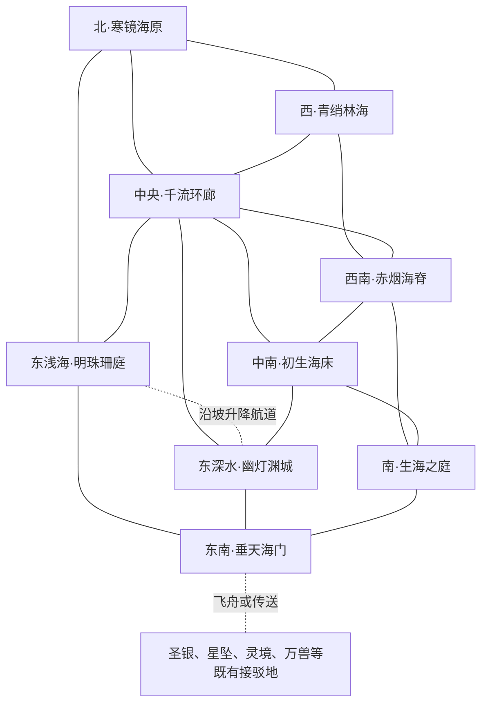

# 沧溟大陆蓝图

> 阶段：第五步——第四步总览已获继续制图确认，地图视觉稿已生成并完成水下与溢海特效修订；部分地名字形仍需精修，详见第十四节。
>
> 第一步已确认：九区布局；浅海与深海双重繁荣；多族海国并存；生海之庭持续生水、海底火山形成海床、初生海床保存生命起源之谜、外缘落海瀑布参与水量平衡。
>
> 人口约束：鱼人属于妖族，典型形态参考美人鱼；鱼人与其他海洋妖族为主体，另有其他种族。没有原生人类；人类只来自其他大陆的修士来访，不设置本土人类国家或世代繁衍的人类居民区。

## 一、设定边界

- 正式名称为沧溟大陆。被替代大陆的旧占位文本全部无效；不继承人族祖庭、中央昆仑、五行分区或妖修从属于人族大宗等临时内容。
- 沿用灵界七大陆、上古战争撕裂超大陆的历史框架；此地海洋的更早起源仍有争论，不擅自宣称灵界或全部生命诞生于此。
- 外围虚海是无底深空，内部海洋才是真实海水。整个海盆承托于连续浮空岩基，深海不是通往外部虚空的无底洞。
- 不新增系统种族、境界、通用货币、基础属性或技艺大类；沿用下品灵石计价和现有五行、功法、炼器、阵法、医术、炼丹、培育等规则。
- 鱼人为妖族内部族群，典型形态为人形上身与鱼尾下身，不默认鱼头人身；男女皆有。鳞色、鳍形和生活海域可以不同，但不据此创造固定职业或性格。
- 人形上身不等于人族血统。开智、鱼人族群形态、完整人形变化与修为分别处理，不新增统一化形境界；不默认低阶鱼人能随时变出双腿。
- 其他海洋妖族有独立人格、组织与生活，不只是鱼人的侍从、坐骑或食材。普通动物和开智居民分开；不得因外形相似将居民当作可捕捞资源。
- 原生深水居民可以在适宜深度正常生活；深度适应不等于修为。海兽的呼吸、蜕壳、育幼、体型和感官差异按具体生物与个人修行处理，不把所有海族写成永久水下呼吸。
- 灵族可包括水、石、草木等自然成灵者；器物历久通灵者归物化生灵。少量冥族可以因既有生命的死亡转化而存在，不把海沟统一写成鬼域。其他种族的来访不自动改变原生人口结构；不为凑齐名单增设罕见种族聚居国。
- 世俗人物一律不高于金丹（L≤3）；面对元婴及以上威胁依靠宗门。化神为宗门中坚，返虚可任管事长老，合体多任宗主；大乘仅留极少数空间，渡劫不参与常规纠纷。第三步人物名册见第九节。
- 后续人物以女性为明显多数，男性少量。婚姻、继承与政体因地区而异，不自动推出全大陆女性专政。
- 天魔仅作历史与远期威胁，不指定下一次入侵年份、日期或倒计时。

## 二、总体文明与自然循环

### 1. 大陆定位与历史骨架

一片仍在生长的海，承载已经成熟的文明。居民生活在珊瑚城、藻林村、海岭驿站、火山工埠与幽光深城之间；生海奇观提供远期问题，普通人的生活不需要时时围绕它展开。

上古战争后，残存岩盆与环缘高地承托住大片海水，旧航路中断，幸存聚落依礁山、温泉与海岭重建。早期合作首先围绕安全水道、育幼地、上浮呼吸通道和火山避险产生，而非出自一位统一海皇的敕令。

之后，掌握高阶传承、观测与营造的道统形成宗门；承担户籍、食物、税收与市场的聚落结成海国和城邦。浅海与深海均形成独立繁华中心，种族谱系与国籍不一一对应。现行共同约章来自反复协商，仍有执行争议，不是天然完美的秩序。

### 2. 生海之庭：已知、推论与未知

- 已知：在南部深水岩盆，海水于岩隙、矿晶和局部水幕间持续生成，既非降雨汇入，也非已证实的远处抽水。不同泉群的温度、盐度与矿物含量有差异。
- 观察：出水变化与地下灵脉、火山活动存在部分关联，但无法用单一规律解释。尚无宗门能够制造同等泉源或精确控制其总量。
- 学说：远古海源遗存、灵脉与矿物转化、尚在继续的世界形成过程等解释并存；本蓝图不确定其中任何一种为真相。
- 区分：生海奇观增加海水，火山热泉主要加热、搬运和沉积物质，两者不是同一种现象。
- 限制：新生海水不是无限高阶灵液；外围居民使用的混合海水仍是当地环境与生产用水，不能直接用作无条件修为奖励。

### 3. 水量、热量与洋流

持续补水经过地形、温差和各支流共同作用进入多条环流；部分海水在外缘泄海峡坠入虚空，远处散为雾、冰晶与逸散灵气。长期水量大致平衡，季节与地方工程会造成局部变化，不预设迫近的淹世灾难。

大陆不依靠一座必须日日续命的总阵法维持存在。宗门监测水位、海床与水质，维护局部工程，不拥有关闭整片海洋的机关。海水循环不是一条自泉源直通所有城市的单线水管；常见副流、回流和相对静水湾。

主要地理水路名称：贯穿中央海岭的回环主流及其支路；西部藻林缓流；北部冰底暖支；南部泉庭外流；东部台地沿坡回流。垂天泄海峡为重要外缘出水口之一，北缘和西缘另有较小泄水峡，不把所有排水集中一处。

### 4. 生命起源的三个层次

初生海床同时保存古老生态、地层记录和少量无法解释的生命现象。古老菌毯、附生群落和胶质生物不自动开智，也不因古老就有高阶战力。岩层保存壳印、纹理与已经消失的生态痕迹，需通过调查判断，不能凭一块化石还原全部历史。

少数泉池出现此前未记录的简单生命形态，究竟为深层带入、现有生物变化还是真正初生，尚无定论。不能据此复活死者、制造魂魄、批量创造智慧种族，或获得无代价境界提升。研究价值、公共保护与居民生计必须同时考虑。

### 5. 水下日常

- 建筑：活体礁庭、石砌殿廊、金属骨架与贝质板材并用。城市有上下门庭、不同体型通道、缓流街区与公共锚台；海中聚落原则上依托海床、海岭或可靠设施，不让低阶居民无保障地悬空漂泊。
- 食物：藻、海草、普通鱼贝、菌类及各族适宜食材共同供给。养殖与捕捞必须避开开智居民、育幼保护地及迁徙通路；水中凝胶食品、封装熟食和少量隔水食堂各有用途。
- 工艺：织造、书写、储物考虑海水浸泡。石版、刻片、耐水纸、封存匣与传声器具并存；炼器需要的干燥、高温工序使用隔水工室和现有阵法，而非一切都在水中随意点火。
- 衣饰：鱼尾套饰、贴身织衣、鳍缘护具、臂环与触感纹样因族而异；避免长带缠入水流。礼服与工装不同，不把所有鱼人写成只佩珠饰的裸身形象。
- 公共服务：育海人、听泉人、养礁匠、迁庭队和守流人都是职业方向，不新增系统技艺。学舍教通用文字、地方光讯与安全水路；医馆处理水质、蜕壳、鳍伤等地方问题。
- 外来者：稀少人类修士可游历、求学、贸易或驻留，但全为其他大陆来客。干燥客舍与防护服务存在，不设置原生人类村落、王朝或世袭侨民社会；是否能入深水须看实际能力与保障。
- 多族交往：不同感官使用声音、光色、刻纹和触感辅助交流。歌声不默认惑心，发光不默认催眠；翻译、照明与噪声规定是公共服务而非压制某一族天性。

## 三、九区空间结构

| 生态     | 方位与层次                   | 主要聚落       | 世俗政权                             | 主驻宗门 |
| -------- | ---------------------------- | -------------- | ------------------------------------ | -------- |
| 明珠珊庭 | 东部浅海台地                 | 珠阙城         | 明珠城邦盟                           | 澄珠宫   |
| 青绡林海 | 西部透光海域                 | 绡根城         | 青绡海国                             | 青绡苑   |
| 千流环廊 | 中央海岭及其上方中层水域     | 环枢城         | 环廊商盟                             | 回流天院 |
| 寒镜海原 | 北部寒海、冰下暖谷           | 暖镜城         | 寒镜海国                             | 寒灯台   |
| 赤烟海脊 | 西南海底火山与露水火山岛     | 赤炉埠         | 赤脊诸埠                             | 赤炉山   |
| 初生海床 | 中南深水缓坡                 | 温苗城         | 温苗海国                             | 育海谷   |
| 生海之庭 | 南部深水岩盆                 | 栖泉集（外围） | 温苗海国外围属地；核心无凡国主权划归 | 听泉院   |
| 幽灯渊城 | 东部台地下方的深水盆地       | 幽灯城         | 幽灯渊国                             | 照渊书宫 |
| 垂天海门 | 东南大陆外缘、海面岛港与高崖 | 双阙港         | 海门港盟                             | 垂天阁   |

### 区域关系草图

草图表达邻接与交通，不代表比例或精确洋流方向。明珠珊庭与幽灯渊城上下相邻，不是两座同层岛屿；中央与幽灯之间有独立沿海岭下降路线。潜舟不能沿落海瀑布驶入虚海，须在双阙港换乘。太初、殒落无跨大陆传送阵，不因本图接驳而新增。

## 四、生态细化与区域灵感

### 1. 明珠珊庭——透光礁山上的繁华海城

- 方位与相邻：东部浅海台地，北接寒镜外海，西接千流环廊，东南接垂天海门，下方沿坡通幽灯渊城。
- 地貌与环境：礁山、浅砂台地、珊瑚园与潮沟交错，透光充足，迎光面与背光面种植不同。温暖水流与北方支流交汇处有季节变化；水、木灵气较活跃，礁石兼土，不改变居民灵根。
- 居民与聚落：鱼人众多，章鱼、贝螺、虾蟹等妖族参与城市治理与行业；少量水木灵族和通灵器物。珠阙城依数座相连礁山建设，上层园圃、中层集市、下层仓储各有缓流门；不是覆盖全城的避水罩。
- 生产与交通：普通珍珠、贝质板材、织物、育苗、医养和商业服务。重载潜舟走外围货道，居民穿行内街，上下港井衔接深水路线；进口西部粮产、赤脊器具和深城耐水档案材料。
- 风俗与生活：迎礁礼庆祝新礁形成稳定幼生群落；歌庭需限定传声范围，夜市以低亮灯标分巷。私人住宅可有休鳍架与不同体型门庭；擅改育幼街流速为公共禁忌。
- 普通资源：食用海藻、海草、普通小型鱼贝、礁砂、贝灰、可合法采集的枝状礁材；活体受保护礁与居民本体不得进入普通资源池。
- 地标：珠阙城、澄珠宫、缓流百市、七孔歌庭、迎礁圃、沿坡港井。
- 当前矛盾：新建高层礁楼挡住公共藻圃采光；城市扩建和低价住房都迫切需要空间，不能简单判定建设者全为恶人。

区域灵感：
1. 一间糕铺的凝胶点心总在同一刻变散，店主怀疑同行，实际线索指向附近温流阀的维修记录。
2. 歌庭排练被深水居民投诉，双方都拿出合法许可，需要查明隔音设施究竟归谁养护。
3. 新礁迎礼将至，养礁匠发现幼生群落迟迟不附着；庆典承办者已收定金，调查与延期协商同样重要。
4. 货运潜舟堵住多肢居民通道，卸货者与街坊互相指责，背后是旧尺寸图没有记录新的安全规范。
5. 外来修士遗落的干燥匣被误当作货品竞价，匣主只求找回私人书信，却不愿公开身份。
6. 两位不同海域出身的伴侣筹办合居，亲友争论光照、访客礼仪与尾饰习惯，需要一份双方真能生活的宅院方案。

### 2. 青绡林海——藻冠、根庭与海中田野

- 方位与相邻：西部透光海域，北接寒镜，东接千流，南接赤烟外围。藻林缓流与中央航道之间设分流坡。
- 地貌与环境：巨藻根固于台阶状海床，叶冠向光展开；林间空隙形成牧场与缓流苗圃。季节性光照、温度和养分改变收成，深处逐渐过渡到稀疏藻林与岩地；水木为主。
- 居民与聚落：鱼人、海马、鳗类、蟹螺等妖族共同耕养；草木灵族参与林权协商。绡根城依岩台建于藻根间，活藻搭架仅作附属设施，收割不能使住宅坠落。
- 生产与交通：食用藻、海草、贝圃苗种、普通养殖鱼、藻纤维与药用辅材。支流小舟接中央货驿；轮养、休耕与迁徙通行共同安排，不能依靠全年无休的无限催生。
- 风俗与生活：割绡节先核对共有苗圃，再分派收获；家庭常同时掌握耕养和修网。不得截断迁徙通道、私掘共有根床或将已开智生灵登记为养殖货物。
- 普通资源：食用藻叶、成熟藻茎、海草籽、贝壳、普通海胆及养殖鱼、沉积砂；有主养殖物与野生资源须区分。
- 地标：绡根城、青绡苑、轮养九圃、留苗湾、根廊货驿。
- 当前矛盾：大商家要求稳定供货，农户需要休耕；扩大遮光叶冠提高纤维产量却降低下层食物产量。

区域灵感：
1. 迁徙鱼群提前穿过即将收获的藻田，村落需要引导与补偿，不是围杀鱼群便能解决。
2. 一批耐水织线在离乡后迅速脆化，织户希望追回货物并找到盐度记录中的差错。
3. 两村争夺祖辈共同栽下的根床，一位新近开智的草木灵族要求作为当事者而非证物出席。
4. 借读的年轻居民不愿接管家中贝圃，长辈请求介绍可信的代养伙伴而不是强迫其留下。
5. 留苗湾出现异常旺盛的外来藻，清除过快也会损伤本地幼生，需要分区试验。
6. 老货驿停运后偏远村落买不起药，商盟愿意复航但要求改变卸货时间，引出生活节律的协调。

### 3. 千流环廊——海岭上空的商路与驿城

- 方位与相邻：中央海岭及上方中层水域，连接北、西、东、西南、中南；东侧有下降海岭通幽灯。回环主流绕岭分支，通道不是固定不动的传送带。
- 地貌与环境：岩柱、鞍部、潜谷与流速差形成天然航路；季节温差改变部分路线。稳定锚区适合聚落，剪切流带禁止居民随意穿越；水灵气较盛，岩岭兼土金。
- 居民与聚落：远游鱼人、鳗类、章鱼与海兽妖族常见，各族工匠和商旅混居。环枢城固定于环形岩岭，多层码头按载重、体型及呼吸需求分配，不漂在无依托的水层中。
- 生产与交通：潜舟修理、航图、牵引、翻译、寄存与转运；海兽居民有接向安全上浮区的独立通路。地方货币不另设，运票记录服务而非代替灵石。
- 风俗与生活：换流会公示下一阶段航路；旅舍提供不同压力与光照的休息区。假冒求救声、遮蔽引航灯及占用呼吸通道为重禁。
- 普通资源：海岭石材、漂集海藻、可回收普通矿砂、野生小鱼及普通胶质生物；沉船货物先查归属，不能全部视为无主。
- 地标：环枢城、回流天院、三层锚庭、分声驿、回环航标群。
- 当前矛盾：免费迁徙通行与收费商运争用流道，小驿站担心大型船行制定的标准将其排挤。

区域灵感：
1. 一艘货舟按旧图准时抵达，却比同行多耗大量灵石，船主怀疑导航服务隐瞒了新回流。
2. 翻译馆收到一段被当成求婚歌的求救讯号，必须在尴尬扩大前确认方言与发送地点。
3. 迁徙海兽的幼体丢失了识别带，驿站不肯让陌生队伍领走，需要非强制的身份核实。
4. 小修船坞被要求购买昂贵新设备，工匠希望证明现有工法同样符合安全标准。
5. 寄存数十年的耐水匣终于有人来取，继承凭据与当年登记的身体形态不一致。
6. 引航灯并未损坏，却被新长出的普通生物遮挡，清理人员需要保护正在其间育幼的群落。

### 4. 寒镜海原——冰下灯市与暖泉长谷

- 方位与相邻：北部，南接中央，西南连青绡，东南连明珠。寒季局部封冰，冰底暖支维持部分长谷与呼吸水道。
- 地貌与环境：冰底穹顶、冷水台地、暖泉裂谷与碎冰峡口；非全境永久结冰。水灵气为主，暖泉局地带火，融冻影响道路而非自动触发灾变。
- 居民与聚落：寒海鱼人、鲸豚、海豹及耐寒鱼贝妖族；少量冰水灵族。暖镜城靠暖谷岩壁，冰下临时市集与永久城区分开，不能将季节冰体当无风险基础。
- 生产与交通：冷水药材、食用藻贝、冷藏服务、耐寒织具与冰况测绘；去中央的货路设暖驿。陆上呼吸与歇息台由海兽社群和港务共同维护。
- 风俗与生活：开隙节检修上浮口，寒灯宴分送储粮；不要敲击他人休眠庭，不得封堵呼吸通道或擅改共用暖泉。
- 普通资源：冷水海草、食用贝、小型普通鱼、冰晶、玄武岩、暖泉周边常见药用藻；不把冰水灵族本源列为采集物。
- 地标：暖镜城、寒灯台、通息井群、冰下灯市、长暖谷。
- 当前矛盾：观光照明影响居民休息，暖泉扩建与冷水养殖要求相冲；海兽通道的维护成本由谁承担长期有争论。

区域灵感：
1. 冰下灯市的灯光照进休眠庭，商户与住户都不愿失去一年一次的收入或安眠。
2. 呼吸井看似畅通，却传出错误的冰况讯号，调查需同时查声学反射与值守轮班。
3. 冷藏行收到不耐低温的货物却被要求按原契约入仓，需要联系失联委托方。
4. 暖泉浴庭突然拥挤，原来邻村浴所维修延期，收费争议背后有可协作的工料问题。
5. 一名常年迁游的居民想赶回寒灯宴，却忘记申领新的穿冰航标，向导可安排安全绕行。
6. 鱼贝养殖户发现温度缓慢上升，证据既可能指向自然暖支，也可能指向上游工事。

### 5. 赤烟海脊——新生岩地与热泉工埠

- 方位与相邻：西南，北接青绡，东北接中央，东接初生，东南通生海之庭外围。少数火山峰露水，海面作业与海底工埠由升降货井联系。
- 地貌与环境：熔岩冷却丘、管洞、热泉烟柱、旧火山平台；活跃喷口与稳定居住带分别测绘。富矿热水冷却沉积形成石柱；水火并见，矿层兼金土，不代表居民自动兼修多属性。
- 居民与聚落：鱼人、甲壳、章鱼等妖族，少量金石灵族与工坊物化生灵。赤炉埠位于已长期稳定的旧岩台，迁庭点与工料仓预先分散建设。
- 生产与交通：普通矿材、合规灵材、隔水炉具、潜舟构件与营造服务。高温干作在隔水工室完成，外海废水经过冷却与处理才排放；货路通中央及藻林，露水岛仅承担有限干燥与转运。
- 风俗与生活：迎炉礼与熄泉告别宴并存，退休烟柱可作公共纪念；新生海床先勘测、公布既有通行与育幼利益，不允许先插旗后驱逐。
- 普通资源：玄武岩、火山玻璃、普通硫矿、铁铜矿砂、热泉菌类及附生贝虫；喷口有毒环境不能按普通郊游处理。
- 地标：赤炉埠、赤炉山、旧烟柱广场、隔水炉街、迁庭锚场、露水晾材岛。
- 当前矛盾：矿期延长与居民避险，低价器具与废水处理成本，工坊财产与新开智器物的自主权。

区域灵感：
1. 旧泉将熄，居民想举行告别宴，工坊却要把烟柱拆作建材，双方对产权记忆不同。
2. 一套迁建住宅少了祖龛所在的墙板，搬运队坚持交付完整，需查拆装图与委托变更。
3. 新矿床恰在幼生群落扩张方向，暂停开采会使工人失去收入，需要替代工期与保护范围。
4. 隔水炉街多家工坊同时出现凝露，原因可能是公共换热设施而非炉匠技艺退步。
5. 一件开始表达意愿的老工器拒绝随厂搬迁，主人想保住生产，器物想留在旧泉附近。
6. 藻林采购者指认器具污染水质，工坊提出共同检验，却争执样品由谁保存。

### 6. 初生海床——古老生态与育海人家

- 方位与相邻：中南缓坡，北接中央，西接赤烟，南接生海，东接幽灯；来自泉庭与火山带的水流充分混合后进入适宜区，不让普通居民住在喷口上。
- 地貌与环境：层叠沉积台地、温和矿泉洼地、菌毯与附生生物群、育幼湾；深处缺光，生产依适宜生态和明确的物资输入，不能描写无光处普通巨藻无限光合作用。水土为底，温泉局地带火。
- 居民与聚落：鱼人、贝螺、虫类及甲壳妖族，少量自然灵族。温苗城建于稳定坡地，邻接开放苗圃和受限保护地；保护地没有全部划成宗门禁区。
- 生产与交通：合规苗种、生态修复、耐水标本保存、普通药用辅材；进口藻林粮料、赤脊器具，向各海国提供育养服务，不将核心异常生命作为商品。
- 风俗与生活：留苗日先划出生物补充区再安排收获；学舍可认养观察地，不得私刻古地层、伪造样本来源或把活体智慧生命当标本。
- 普通资源：可采食用菌、普通附生贝虫、壳砂、沉积石片与常见育养材料；地层标本采集须许可，保护核心不是普通资源池。
- 地标：温苗城、育海谷、层纹坡、留生湾、共验标本馆。
- 当前矛盾：研究封区与居民传统使用权，苗种商业化与生态风险，古老谱系声望与新证据冲突。

区域灵感：
1. 学舍观察地被施工误划为弃土区，教师需要在工程继续前找到原始界标。
2. 一位养殖户拒绝接受免费新品种，因为邻圃上次试养损失尚未赔付。
3. 标本馆收到据称证明古老世家起源的岩片，修复师发现附着层顺序可疑。
4. 留苗日的停捕通知使用错了方言，村落并非抗令，却面临商队追责。
5. 一个普通附生群落堵住旧货井，搬迁它比清除昂贵，但附近居民发现幼鱼依赖它躲藏。
6. 研究队申请封闭祖传泉池，居民提出共同观测与轮用方案，需要设计能被双方执行的记录制度。

### 7. 生海之庭——仍在生成的海水

- 方位与相邻：南部深水岩盆，西北接赤烟，北接初生，东北经外缘通垂天海门。核心泉群与外围聚落之间保留明确距离、航标和撤离路线。
- 地貌与环境：矿晶林、断续水幕、岩隙泉群、稳定外流槽与局部急流；不同泉口盐温差明显，直接接触可能有危险。水灵气突出但不一概为高阶资源，局地兼土金及地热。
- 居民与聚落：适应深水的鱼人及其他海族、少量水石灵族；人类如出现只能是具有保障的外大陆来访修士。栖泉集位于北侧安全外流台地，居民靠观测服务、补给与器具维护生活。
- 生产与交通：水样检测、航标维护、观测器具、客舍与补给；普通食物主要由温苗与中央转运，少量适宜养殖补充。泉口没有可以任意贩卖的无限神液。
- 风俗与生活：听水会交换全年观测差异，不强迫居民认同同一种起源解释；不得擅改共用仪器、垄断撤离路线或伪造泉口变化制造恐慌。
- 普通资源：外围盐析物、常见矿砂、普通石材和合规水样；核心矿晶、异常泉池及研究样本不作随地可捡资源。
- 地标：栖泉集、听泉院、分泉观台、盐温阶、北外流锚廊。
- 当前矛盾：观测资料是否公开、研究期间如何保障补给居民、公众崇敬与非法售卖“起源圣水”之间的冲突。

区域灵感：
1. 两座观台的读数长期不合，双方坚持对方仪器有误，可能只是取样层次不同。
2. 商人出售能让后代获得古老血脉的泉水，受骗者担心公开投诉会伤害家人。
3. 栖泉集补给晚到，客居研究队有储粮却被契约限制用途，需要协商借粮与归还。
4. 一段奇妙水声只在某个旧仪器旁出现，居民想保留它，观测员认为它干扰记录。
5. 暴增访客挤占当地修具匠的时间，巡标器具不能按期维护，热闹背后是公共服务缺口。
6. 泉庭外围新出现一条弱流，有人主张封禁，有人认为可缓解旧航道负担，需先做低风险勘测。

### 8. 幽灯渊城——独立繁荣的深水文明

- 方位与相邻：东部浅台地下方盆地，上接明珠，西北沿海岭接中央，西南接初生，东南接海门；与浅海的上下联系不等于政治隶属。
- 地貌与环境：稳定盆底、沿壁台地、温流口、幽光附生群落；低光与较大水压是生活条件而非邪恶象征。水土灵气为底，照明依生物培育、器具及少量阵法，不能无成本照亮整片深海。
- 居民与聚落：深水鱼人、鳗类、章鱼、贝螺等妖族，少量金石灵族与档案器物生灵；部分冥族依当地祭存规则生活。幽灯城有灯庭、静园、医馆、市场和住宅，是完整都会，不是浅城的贫民窟。
- 生产与交通：耐水档案、精密器具、深水防护、低光园艺、研究与艺术；常见食物来自适宜本地养殖及外区输入。沿坡潜舟需缓变压力，客舍提供个体适宜条件，不把深度适应直接换算境界。
- 风俗与生活：续灯节修复公共灯标、讲述城史；静声时段与弱光街规定保护不同感官居民。强光照射他人私宅、未经同意读取记忆或处置祭存物为禁忌。
- 普通资源：常见深水菌贝、普通鳗类、沉积矿砂、石材、合法培育的发光生物；智慧居民与有主灯种不得当野生采集品。
- 地标：幽灯城、照渊书宫、低光百市、缓压阶港、层卷馆、静水园。
- 当前矛盾：浅深贸易条款、公共灯费、档案开放与隐私、上层工程改变深层沉积环境。

区域灵感：
1. 浅海剧团的灯具过亮却已售出门票，深城剧场希望保留演出并重新设计舞台。
2. 一批档案不是被偷，而是旧匣出现浮力变化漂到馆顶，需要在破损前取回并核对索引。
3. 新灯种节省灵石，却影响某些居民睡眠，低价与舒适之间需要分区试用。
4. 祭存庭中的旧器物开始表达意愿，其所保存的私人记录能否继续公开，家属意见不一。
5. 缓压港排期过长，急需运送的药材与普通旅客争用舱位，管理者需要透明的优先规则。
6. 两城对一批沉积物污染来源争执，采样队发现沿坡回流会把证据带回上游。

### 9. 垂天海门——落海瀑布旁的双层港市

- 方位与相邻：东南外缘，西北接明珠与幽灯，西南连生海外围；内海与外部虚空以岩缘、岛山和断崖清晰分开。
- 地貌与环境：内侧水港、露水山岛、外侧高崖空港、泄海峡与落海瀑布。海面有风雨，水下有港湾潮流，外部没有普通海平线；水土为主，高岛受天候影响。
- 居民与聚落：鱼人和多种海族为港市主体，适于岛面活动的妖族、少量灵族与物化生灵参与接驳。人类仅为外大陆来的修士，不建立本土人类街区。双阙港分内水阙和外空阙，干燥客舍规模服从实际来客需求。
- 生产与交通：转运、海产贸易、晾材仓储、飞舟维护、客居服务与入境翻译；水道升降设施衔接外空港，传送阵设稳定岩台。落海峡设警戒浮标，绝不让普通潜舟沿瀑布驶入虚海。
- 风俗与生活：启舷会更新港规与航标，送舟礼祝远行者归来；救援不得按族别区别收费资格。不得冒用通行凭证、把开智海族作为活货或在泄海口偷接未经勘测的引水设施。
- 普通资源：普通海盐、岛面少量作物、港湾鱼贝、浮石、晾干藻材与回收木料；跨境货品不因堆在码头就成为无主资源。
- 地标：双阙港、垂天阁、内水阙、外空阙、升潮井、传送岩台、垂天泄海峡。
- 当前矛盾：空港成本与水下居民税负、跨境活体贸易、外来修士的便利需求与本地公共规范。

区域灵感：
1. 外来修士坚持用大陆通行契约携带活体货物，验货员发现其中可能已有开智者。
2. 升潮井临时停修，港商指责延误，匠人则拿出不可继续运行的疲损证据。
3. 一艘飞舟提前抵达，货舱需要干燥仓位，原仓位却存放着海国的救济物资。
4. 落海瀑布附近出现漂亮冰晶带，游人靠得太近，向导需要安排安全观景而非封掉所有生意。
5. 鱼人旅客在外大陆购买的座具无法通过本港升降口，商家与港务争论谁应承担改装。
6. 一封迟到的返航通知让家属误以为亲人失踪，查找过程揭出两种历法记录与转驿抄写的差异。

## 五、宗门体系

下列九宗为本阶段组织骨架：四大型、五中型。大型不等于主权政府，中型也能凭专业性承担关键公共职责。宗门可跨族收徒，但功法和生活设施须适合实际身体与灵根。

### 1. 澄珠宫（大型）

- 简介与理念：主驻明珠珊庭的多族道统，鱼人弟子众多；主张“清其水，安其居”，兼重水法、医养与城市营造，不以美貌或歌术决定入门资格。
- 位置与规模：珠阙城外高礁山，设内外水庭和沿坡分院；大陆四大宗之一。
- 组织：宫主、诸庭长老、护礁院、医养庭、营造司、声律馆及地方教习所；世俗城务不由宫主兼任。
- 修行：水法、神识、声术、医术、阵法、培育；声术是具体功法，不是所有鱼人的天生魅惑能力。
- 声望：医养与护城可靠，公共工程收费和礁地占用常受批评。
- 地标与产出：澄珠宫、养鳍庭、清声廊；护水器具、医养、礁体修复、公共阵法维护。
- 对外：主护明珠城邦盟，与照渊书宫协作沿坡设施；与青绡苑共享苗种，与商盟争论货道扩建。

### 2. 回流天院（大型）

- 简介与理念：由海岭观流、潜航和护路传承结成，强调“通路不独占，行险须知责”。
- 位置与规模：中央环枢城上方、固定于岩岭的多层院庭；多处驿站有分院。
- 组织：院主、观流台、航图房、巡路院、救援庭、潜舟教坊；数据发布与商业引航分账。
- 修行：水法、遁术、阵法、炼器、神识感知；弟子由观测与维修逐步承担远程护航。
- 声望：航图公信力较高，专业术语和收费标准易使小船行处于弱势。
- 地标与产出：回流天院、验标台、分流钟；航图、救援、引航器具、跨区域护商。
- 对外：主护环廊商盟，协护海门港盟；与听泉院共享水文，与寒灯台维护冰底路线，与各国协调迁徙通行。

### 3. 赤炉山（大型）

- 简介与理念：海底火山营造与炼器道统，“器成须可用，迁城须有人归”；名称中的山指海底山体，不是内陆山门。
- 位置与规模：赤烟海脊稳定旧火山内外坡；有露水晾材与干作分场，但主体山门在水下。
- 组织：山主、熔工院、隔水炉坊、勘脊司、迁庭院、器物契议所。
- 修行：火土金相关功法依灵根分修，兼炼器、阵法和护体；不强迫水生弟子人人修火。
- 声望：器具耐用、避险经验深，矿权和工程合同使其容易卷入利益冲突。
- 地标与产出：赤炉山、冷却阶、迁庭锚院；炉具、潜舟骨架、护压设施、海床勘测与迁建。
- 对外：主护赤脊诸埠，与育海谷商定热水排放；为幽灯与海门供器，不能靠供器合同取得地方统治权。

### 4. 照渊书宫（大型）

- 简介与理念：深水功法、档案保存与感知之学的道统，主张“有光可读，无光亦可知”；不是只藏书不修行的世俗学馆。
- 位置与规模：幽灯城盆壁岩台，多层书庭与训练水域相连；四大宗之一。
- 组织：宫主、传法殿、层卷院、感知庭、护压院、静声司；私人记忆与公共档案分开管理。
- 修行：神识、水法、护体、阵法、炼器及符文记录；低光训练不是无条件获得看穿一切的能力。
- 声望：史料严谨、深水保障稳定，也常因开放许可与证据解释过于谨慎受指责。
- 地标与产出：照渊书宫、无眩廊、旧卷水庭；防护器具、档案修复、深水医养协作、海床历史研究。
- 对外：主护幽灯渊国；与澄珠宫共管沿坡设施，与育海谷研究地层，与听泉院争论起源证据的解释范围。

### 5. 青绡苑（中型）

- 简介与理念：由海草培育、藻纤维与水木传承发展，认为“留下一季，才算收获”；接纳耕养居民的弟子而不垄断所有田地。
- 位置与规模：青绡林海绡根城外固定根台，中型，分设季节苗圃。
- 组织：苑主、留苗院、病害坊、织养庭、轮圃教所。
- 修行：水木功法、培育、医术、炼丹辅材处理与织具炼器。
- 声望：帮助农户稳定生产，但封圃与新品种许可容易被视为限制生计。
- 地标与产出：青绡苑、留种台、辨病廊；合规苗种、药材、藻纤维与生态修复。
- 对外：主护青绡海国；与澄珠宫交流医养，与育海谷共同评估外来物种，与赤炉山协商排水。

### 6. 寒灯台（中型）

- 简介与理念：冰下护航与寒水传承，“灯可熄，归路不可弃”；兼顾永久居民与迁游族群。
- 位置与规模：寒镜长暖谷上方岩脊，中型，多处通息井有轮值站。
- 组织：台主、冰况房、通息院、暖泉医舍、寒路巡队。
- 修行：寒水功法、护体、神识、阵法与耐寒器具炼制。
- 声望：救援可信，偏远井群的维护资源分配长期有争议。
- 地标与产出：寒灯台、听冰廊、暖灯院；寒路预报、护寒物资、通息设施与医养。
- 对外：主护寒镜海国；与回流天院联巡北路，与青绡苑交换冷水苗种，必要时按约请求大型宗门协援。

### 7. 育海谷（中型）

- 简介与理念：以古生态、育养与生命变化研究见长，“知其来，亦护其生”；反对将起源研究等同无限制活体试验。
- 位置与规模：初生海床温苗城外温和坡谷，中型，保护点分散而非整区封闭。
- 组织：谷主、育苗院、地层馆、共验庭、医养坊；研究项目须明确采样与居民协商记录。
- 修行：培育、医术、炼丹、水土功法、生态阵法；地方研究是现有技艺的应用。
- 声望：修复能力受尊重，研究进度与传统采集权的冲突不可避免。
- 地标与产出：育海谷、留生庭、层纹样库；苗种、修复服务、普通药用辅材和公开研究。
- 对外：主护温苗海国；与听泉院共同维护栖泉外围，与赤炉山协调排放，与照渊书宫互验地层。

### 8. 听泉院（中型）

- 简介与理念：专注泉庭观测、水文与安全通行，“记所见，不以愿望代证据”；不宣称拥有创造海水的传承。
- 位置与规模：生海之庭北缘安全台地，近栖泉集，中型；核心观台按条件轮值。
- 组织：院主、泉谱房、验样室、巡标庭、客研舍；记录保留异议，不强迫统一学说。
- 修行：水法、阵法、神识感知与观测器具炼制；勘察深入程度服从实际修为和装备。
- 声望：数据积累深厚，但公布节奏常遭外界猜疑。
- 地标与产出：听泉院、分泉观台、校器廊；水样检测、预警、观测器具与外围引路。
- 对外：协护温苗海国的栖泉属地；与回流天院共享水文，与其他宗门按约共同监督核心通行，不将泉庭据为私国。

### 9. 垂天阁（中型）

- 简介与理念：连接水港与虚空航行的道统，“两界接舷，不失一客”；本地海族主导，外来修士可学习合适技艺。
- 位置与规模：双阙港的水下基座与外缘高崖，中型；水中山门与空港分阁连通。
- 组织：阁主、水空转运院、升潮工坊、港防庭、契验舍、飞舟教所。
- 修行：阵法、炼器、水法、遁术及适合个体的航行功法；不是所有弟子都能裸身跨虚海。
- 声望：换乘与救援可靠，港务费用和排期容易受到商人施压。
- 地标与产出：垂天阁、升潮工坊、归舟台；接驳设施、护商、飞舟维修、客居防护。
- 对外：主护海门港盟，回流天院协护大型航路；与万兽群潮庭衔接航运，与圣银断柱海门保持既有联系。

## 六、凡国与世俗政权

“凡国”是规则分类，指治理普通居民与低阶修士的世俗政权，不意味着存在原生人类。以下八国的君主、议员、官员、将领、世家代表均受L≤3约束，宗门驻使不兼作超标世俗战力。基层巡防处理治安、普通兽害、救援与设施维护，元婴及以上威胁必须请护国宗门介入。

### 1. 明珠城邦盟

- 简介与疆域：明珠珊庭多座鱼人及海族城邦结盟，含浅海居住台地与明确登记的港井，不因上层投影占有幽灯盆地。
- 政体与中心：珠阙城为轮值议事中心；各城保留地方议会，盟议席由城邦推举，重大采光与航道事项须受影响街区听证。
- 行政与军事：礁务、街流、市税、育幼、医舍与港井诸署；低阶巡礁队、救援队和货道执勤队分工。
- 经济：贸易、医养、织品与营造，收入来自公开市税、港井服务与共有礁产，不把居民化形程度作为纳税资格。
- 信仰、节庆与禁忌：纪念养礁先师与地方守护者，迎礁礼和歌庭节并行；禁占育幼缓流、强光扰宅与非法出售开智居民。
- 庇护交换：澄珠宫主护。盟国提供阵基用地、药圃份额及公示维护费，弟子招募须自愿且不按血统强征。高阶兽害、元婴及以上侵袭和超出世俗能力的护城事故由宗门介入。
- 权责与制衡：宗门不得任命盟议员、夺取民宅或裁定普通商案；工程费用由双方验收，争议可请照渊书宫作技术见证，但最终世俗赔偿仍按盟国法庭与契约处理。
- 对外：与青绡订粮约，与幽灯互认上下港井权，与环廊商盟协商货道限速。

### 2. 青绡海国

- 简介与疆域：覆盖西部主要耕养海域，由根庭村落与绡根城共同组成；海草牧场、迁徙通道和藻冠使用权分别登记。
- 政体与中心：绡根城为都城，议选海主主持行政，根庭代表保留年度问责与更换程序，不以高修为争王位。
- 行政与军事：轮圃署、田契所、留苗司、货驿所与互济仓；低阶护圃队管盗采和安全，不能独抗高阶病害或妖修。
- 经济：食物、苗种、藻纤维与运输，税收按实际收获及公共使用权核算，灾年可依公开记录减免。
- 信仰、节庆与禁忌：敬土地与育养祖师但不强迫崇拜草木灵族；割绡节、留苗日；禁私毁共有根床、售卖未经检验的入侵苗种。
- 庇护交换：青绡苑主护，海国提供试圃、普通粮材与服务费；宗门承担超出地方能力的生态灾害、高阶侵袭与重大护田阵损坏，必要时按跨宗盟约请求大型宗门协援。
- 权责与制衡：试种须获土地使用者同意，不得强迫改种；失败赔偿由事前契约和共验记录确定，跨界影响可由育海谷复核。
- 对外：供应浅城与深城食物，同赤脊诸埠商定排水标准，与寒镜交换冷水物产。

### 3. 环廊商盟

- 简介与疆域：中央锚城、固定驿站与服务水道组成的世俗联盟，商运重要但并非船行私产；迁游居民有合法代表渠道。
- 政体与中心：环枢城议事，居民、驿站与船行分席，涉及通息通道的决议需实际使用社群参与。
- 行政与军事：航籍署、费契所、翻译馆、寄存院和救济仓；低阶巡航队维持秩序，救援与执法职责分账。
- 经济：转运、维修、引航、住宿与仓储；通行费按设施服务计算，不可向未使用收费设施的自然迁徙任意征税。
- 信仰、节庆与禁忌：纪念开路者与救援者，换流会公布新图；禁假求救、伪航标、扣押呼吸资格。
- 庇护交换：回流天院主护，盟国提供观流锚地、维修物资和分项费用；高阶劫掠、重大航路崩坏与超出低阶队伍能力的救援由宗门承担。
- 权责与制衡：宗门不得借保密垄断全部商业引航；基本安全通告公开，增值服务可收费。争议由独立验图与受影响驿站合议，不由最大船行单独裁定。
- 对外：与八国交换运力和安全数据，向海门接驳外大陆货运，不统治航道途经国家。

### 4. 寒镜海国

- 简介与疆域：北部暖谷、永久岩城和登记冰下季市组成，迁徙社群拥有受保护的季节通行与休息权。
- 政体与中心：暖镜城为都城；海君由世俗继承制度产生，但暖谷议会对税赋、通息井与储粮有否决和审议权。
- 行政与军事：暖泉署、冰况所、通息司、寒仓局；低阶巡冰队与救援队，危急时组织撤离而非以凡国军挑战高阶。
- 经济：冷水药材、寒仓、织具与地方养殖；暖泉使用费与通息维护费分别公示，不以体型大为由剥夺呼吸权。
- 信仰、节庆与禁忌：纪念归航者与护幼者，开隙节、寒灯宴；禁封井、惊扰休眠庭与偷改暖泉分流。
- 庇护交换：寒灯台主护，国供灯站、耐寒物资及维护粮费；宗门处理高阶威胁、异常冰灾与重大井群事故，并与回流天院维持援助契约。
- 权责与制衡：宗门不得以应急名义永久征占暖谷；紧急调用事后需补偿与复核，井群的关停须说明替代路线。
- 对外：与青绡和环廊互通粮药，向明珠出售冷水物产并协调北南支流工程。

### 5. 赤脊诸埠

- 简介与疆域：西南稳定工埠、登记矿区、迁建锚场及少量露水作业岛结盟，新生海床不自动归最近工埠所有。
- 政体与中心：赤炉埠为共同议事中心，各埠自治；工匠、居住庭与矿业行会分席，重大迁城不得仅由矿主决定。
- 行政与军事：矿籍、排水、炉安、迁建与工资契约诸所；低阶工防队处理治安、疏散与小规模事故。
- 经济：矿材、器具、维修和营造，开采权有期限；迁建准备金和排水处理费用不得混作宗门贡赋。
- 信仰、节庆与禁忌：敬工艺祖师、纪念旧泉，迎炉礼、熄泉宴；禁隐瞒火山风险、侵占迁建储备、毁弃通灵器物人格。
- 庇护交换：赤炉山主护，诸埠供合法矿额、试炉地和工役合同；宗门介入高阶威胁、严重火山事故及重大隔水设施失效。
- 权责与制衡：宗门不得凭风险判定低价夺矿；风险记录与工程收益分开，污染争议请育海谷复检，劳资案件由世俗契所处理。
- 对外：向各国供器，与青绡、温苗共同承担下游环境监测，与海门合作露水晾材转运。

### 6. 温苗海国

- 简介与疆域：初生海床的宜居缓坡及生海北缘栖泉集属地；不将核心泉群划为私有国土，不覆盖全部保护地研究权限。
- 政体与中心：温苗城为中心，村庭推举代表组成海议，任期行政官执行；栖泉有地方议事席，不能因依赖补给失去发言权。
- 行政与军事：育养、样本、地契、补给与公共医舍诸所；低阶护苗队维护保护界标与居民安全。
- 经济：苗种、修复、普通药辅材、观测补给；资源采样按许可，研究资助不等于研究方获得居民主权。
- 信仰、节庆与禁忌：各地解释生命起源不同，留苗日与听水会并存；禁伪造起源证据、破坏保护核心、将智慧生灵当无主试料。
- 庇护交换：育海谷主护全国产居区域；听泉院协护栖泉及泉庭外围观测通道。国家提供苗圃协作、补给仓与费用；高阶侵袭、超出民间能力的生态危险及泉庭外围事故分别由对应宗门先行介入，再协调援助。
- 权责与制衡：研究封区需列时限、替代生计与补偿，不得因论文价值无限延长；跨宗争议可由照渊书宫保全证据，居民保有共同观测席。
- 对外：与青绡共享苗种风险记录，与赤脊协商热水排放，向各国提供修复服务；栖泉食物储备有中央补给备选路线。

### 7. 幽灯渊国

- 简介与疆域：东部深水盆地及约定的沿坡港段，与上方明珠城邦盟分别拥有明确的深度范围和设施权。
- 政体与中心：幽灯城为都城，世俗渊君与灯庭议会分权；档案馆只提供证据，不因保管史料而取得世袭裁决权。
- 行政与军事：灯务、港压、档案、静声、市税诸署；低阶守灯队、港防队与救援员分工，不把常住深水能力当高阶战力。
- 经济：防护器具、耐水档案、园艺和贸易；公共灯费、私宅照明与港压服务分别计账，贫弱居民有基本服务保障。
- 信仰、节庆与禁忌：纪念祖庭、守灯者与地方先师，续灯节；禁强光扰宅、擅取私人记忆、将冥族一概驱逐或当作灾源。
- 庇护交换：照渊书宫主护，国供档案协作、练法水域与维护费；高阶侵袭、严重护压事故及涉及高阶力量的档案威胁由宗门处理。
- 权责与制衡：普通民事不能以神识强查代替举证；书宫不得因保密剥夺居民合法记录，档案开放争议由授权、隐私和契约共同裁定。
- 对外：与明珠互认沿坡权，同中央保持独立路线，输入藻林粮产、赤脊器材，向海门提供深水客运服务。

### 8. 海门港盟

- 简介与疆域：双阙港、外缘作业岛、空港岩台与内侧港湾组成；不把外部虚海划为可征税领海，也不独占全大陆外缘泄水口。
- 政体与中心：双阙港议事，水港、空港、居民与工坊分席，本地海族主导；人类修士是外来使用者而非默认港口主人。
- 行政与军事：入境、契验、仓务、升潮、泄海监测诸署；低阶港巡管治安与现场疏散，重大外敌由宗门承担。
- 经济：转运、仓储、维修、换乘与贸易；干燥客舍按服务收费，不把外来者特殊需求全部摊给水下居民。
- 信仰、节庆与禁忌：尊归航、守契与救援传统，启舷会、送舟礼；禁冒领救济货、贩卖开智海族、利用落海峡非法试航。
- 庇护交换：垂天阁主护港区，回流天院协护内侧大航道与大型救援。港盟供阵台用地、工坊合同和维修费；高阶侵袭、重大接驳事故及跨界航险依责任范围介入。
- 权责与制衡：宗门不得擅增关税、独占全部民用船位；重大设施停用应公开风险与替代方案，紧急救援不能变成事后无限收费。
- 对外：保留与圣银、星坠、灵境、万兽的既有连接；太初、殒落不新增常规传送服务，具体远航仍服从现有全局规则。

## 七、跨国关系与共同规则

### 1. 沧溟共流约

八国与九宗参与的共同约章，不是凌驾所有国家的海皇政权。常设小规模联络处轮值，重大案件按受影响方召集。共约管跨界水质、航标、救援、迁徙、育幼地与深度边界，各国仍自行治理日常生活。

- 层域登记：记录海床使用、上方通道、居住深度与设施锚点；同一平面投影可以属于不同用途，不能借一次测绘吞并下方居民。
- 上浮与迁徙：呼吸通路和既定迁徙通路须保留替代路线；物种习性不赋予任意冲入住宅的权利，居民建设也不能抹去通路。
- 新生海床：先勘测、调查既有生态与通行利益，再议开采或定居；没有一方仅凭首先发现便取得全部水层。
- 研究与人格：普通样本、受保护生态、有主物品、开智居民分别处理。研究者不能以“原初”之名取消已明确的自主意愿与既有人格。
- 水质责任：温度、盐度、浑浊与有害排水分项记录；跨境争执由共同取样、封存与复核处理，不因一方宗门更强就自动认定其无责。
- 应急边界：紧急救援可先行，但长期封区、征用或改道需复核与补偿。地方故障不自动升级为大陆末日，民间协商也有实际效果。

### 2. 庇护关系速查

| 凡国       | 主护宗门 | 重要协作                       |
| ---------- | -------- | ------------------------------ |
| 明珠城邦盟 | 澄珠宫   | 照渊书宫协作沿坡设施           |
| 青绡海国   | 青绡苑   | 育海谷复核生态与苗种风险       |
| 环廊商盟   | 回流天院 | 寒灯台、垂天阁分别接北路与外港 |
| 寒镜海国   | 寒灯台   | 回流天院援助大航路             |
| 赤脊诸埠   | 赤炉山   | 育海谷复核排水影响             |
| 温苗海国   | 育海谷   | 听泉院协护栖泉与泉庭外围       |
| 幽灯渊国   | 照渊书宫 | 澄珠宫协作上下港井             |
| 海门港盟   | 垂天阁   | 回流天院协护大航道与大型救援   |

### 3. 跨大陆联系

- 万兽大陆：经双阙港与潮生港换乘联系，交换航图、适用器具、合法苗种、医养与营造经验。双方都有海族但政治与谱系独立，不自动建立同名族群的直属祖庭。跨界引种需检验。
- 圣银大陆：保留断柱海门连接；沧溟可输出海洋药材、耐水器具与水下营造知识，输入适用工艺、护魂服务、艺术和公共制度经验。争议可落在海族人格、层域产权与活体贸易，不再沿用旧人族祖庭或凡界来客中心定位。
- 灵境大陆：沿既有交通交换适于本地条件的培育材料、医养经验与器具；淡水或陆生灵植不能未经适应直接投入海中。
- 星坠大陆：保留既有接驳，可围绕泉庭观测器具、测绘与航行知识开展合作；不在此替尚未细化的大陆确定独占产业或新核心设定。
- 太初大陆、殒落大陆：沿用全局已有的特殊联系和无常规跨大陆传送约束，不新增日常民用航线，不自行承诺安全抵达。

## 八、后续阶段约束

- 第三步具名人物、人物关系及秘境四阶段流程已见第九至十一节；覆盖各宗实务、各国代表、生产者与引路人，女性显著多数，世俗角色L≤3。
- 生海之庭与初生海床仅保留少量重要核心秘境；其他区域也应有地方探索，不将全部冒险都解释为生命起源或天魔操纵。
- 第四步完整EJS总览已落地于同目录 `[mvu_plot]沧溟大陆总览.txt`；蓝图本身不作为常驻全文注入。原方向简报已被分层动态总览替代，不含废弃的人族大陆设定。
- 第五步再制作正式地图。地图需同时表达水平九区、明珠与幽灯上下关系、连续承海岩基、内海与外部虚空、落海瀑布和双层港口；本文件Mermaid仅为关系草图。
- 第二步确认规模：九生态、九宗门（四大型、五中型）、八凡国、九个具名主要聚落、五十四条区域灵感。原汇总误记十个聚落，第四步按既有九区表格修正计数，不新增或删改实际地点；内水阙与外空阙为双阙港的港区，不另算城市。

## 九、人物名册（第三步）

### 年龄、外观与规模

- 本阶段共63人：54名女性、9名男性；九区各7人。女性三类各18人：御姐、少女、萝莉。分类只约束成年外观与气质，不决定职位、性格、阅历或关系。
- 所有具名人物均在身体、心智与社会身份上明确成年；萝莉指年轻的成年女性面貌，不采用儿童身体、幼儿语言或未成年身份。御姐也可以温柔、不强势，青年外观者也可经验丰富。
- 实际年龄与外观分类分别记录；非冥族记录存续年龄，灵族与物化生灵以成灵后年数计，不把无意识材料年代算作人格阅历。冥族记录生前终龄与转化后年数，生前年龄不随时间增加。
- 鱼人尾身是族群形态，不是未成年或人族血统证据；离水、呼吸、深度与化形能力均按个人保障处理。不得由这些初始资料推断永久无消耗适应一切环境。
- 宗门人物27人；世俗官员9人（八国各1人，温苗另设栖泉地方代表）；其他民间与外来人物27人。最高合体后期，无新设具名大乘或渡劫；高阶宗门人物不兼任凡国执政者。
- 唯一人族具名角色苏知帆为灵境大陆来访修士；没有沧溟原生人类或世代侨民家系。其他种族包含灵族、物化生灵与少量冥族，海洋妖族仍为绝对主体。

### 1. 明珠珊庭人物

#### 澜照珩

- 性别：女；外观分类：御姐；实际年龄：2480岁。
- 种族：妖族（鱼人）；境界：合体中期；体系：宗门。
- 身份：澄珠宫宫主。
- 所属：明珠珊庭；澄珠宫。
- 外貌与着装：墨蓝长发、金纹深碧鱼尾，珠白礼衣与宽袖护腕。
- 性格：沉着而不喜繁礼。
- 职责：主持护礁与医养，拒绝把公共工程变成宫产。
- 生活侧面：喜欢亲自修补旧棋盘。
- 矛盾与剧情用途：扩礁工程牵涉宫中承包者，她需要可信的独立测绘。

#### 绯砚汐

- 性别：女；外观分类：御姐；实际年龄：760岁。
- 种族：妖族（章鱼）；境界：返虚初期；体系：宗门。
- 身份：澄珠宫营造司执事。
- 所属：明珠珊庭；澄珠宫。
- 外貌与着装：已具成年人形，赤褐卷发，工作时展开辅助腕足，穿分袖工衣。
- 性格：严谨、怕欠人情。
- 职责：核对多体型街道与礁体负荷。
- 生活侧面：收集各族门扣。
- 矛盾与剧情用途：旧标准排斥多肢居民，她愿改规但缺少新数据。

#### 珠听弦

- 性别：女；外观分类：少女；实际年龄：238岁。
- 种族：妖族（鱼人）；境界：化神初期；体系：宗门。
- 身份：澄珠宫声律馆教习。
- 所属：明珠珊庭；澄珠宫。
- 外貌与着装：浅金长辫、桃粉尾鳍，束袖青衣与声纹臂环。
- 性格：热情但能接受批评。
- 职责：教授定向传声与隔音，处理歌庭设备。
- 生活侧面：爱改编市井小调。
- 矛盾与剧情用途：演出与深水居民安眠冲突，适合声场调查。

#### 贝明议

- 性别：女；外观分类：少女；实际年龄：86岁。
- 种族：妖族（珍珠贝）；境界：金丹中期；体系：世俗。
- 身份：明珠城邦盟市议代表。
- 所属：明珠珊庭；明珠城邦盟。
- 外貌与着装：已化成年形，银灰短发、虹彩耳缘，着贝白短袍。
- 性格：善辩、不轻易许诺。
- 职责：审查采光、租税和育幼街流预算。
- 生活侧面：为街坊保管失物名册。
- 矛盾与剧情用途：支持廉价住房又不愿牺牲公共藻圃。

#### 绫尾晴

- 性别：女；外观分类：萝莉；实际年龄：41岁。
- 种族：妖族（鱼人）；境界：筑基中期；体系：民间。
- 身份：缓流百市凝糕师。
- 所属：明珠珊庭；珠阙城。
- 外貌与着装：成年年轻面容、铜红发与橙金尾，围防污短褂。
- 性格：爽快、对配方执着。
- 职责：制作水中食用糕点并照顾学徒账目。
- 生活侧面：休市时练耐水刻画。
- 矛盾与剧情用途：点心异常消散影响信誉，愿付酬调查而非报复同行。

#### 礁素芽

- 性别：女；外观分类：萝莉；实际年龄：164岁。
- 种族：灵族（礁上草木灵）；境界：金丹初期；体系：民间。
- 身份：迎礁圃养护师。
- 所属：明珠珊庭；珠阙城。
- 外貌与着装：成熟人形、翠色发梢，佩窄叶织衣与根纹手套。
- 性格：慢热、记性好。
- 职责：照顾公共幼生附着地，代表自身合法使用权。
- 生活侧面：用落叶压制书签。
- 矛盾与剧情用途：庆典迫近但幼生未附着，她拒绝用假景蒙混。

#### 蟹衡木

- 性别：男；外观分类：大叔；实际年龄：112岁。
- 种族：妖族（岩蟹）；境界：金丹初期；体系：民间。
- 身份：沿坡港井民间检修领工。
- 所属：明珠珊庭；珠阙城。
- 外貌与着装：半人形带厚螯，灰须与石纹甲片，系工具束带。
- 性格：寡言、重验收。
- 职责：检修港井承压构件，不任官职。
- 生活侧面：喜欢与年轻匠人对弈。
- 矛盾与剧情用途：承包商要求带病开港，他掌握可核实的损伤记录。

### 2. 青绡林海人物

#### 绡涵碧

- 性别：女；外观分类：御姐；实际年龄：1720岁。
- 种族：妖族（鱼人）；境界：合体初期；体系：宗门。
- 身份：青绡苑苑主。
- 所属：青绡林海；青绡苑。
- 外貌与着装：苔绿长发、青银鱼尾，穿分层藻织礼衣。
- 性格：温厚、有边界感。
- 职责：主持轮圃、病害研究及护国事务。
- 生活侧面：亲手给旧织机上油。
- 矛盾与剧情用途：商约要求增产而林床需要休养，她不肯替商家压低损失。

#### 鳗疏影

- 性别：女；外观分类：御姐；实际年龄：640岁。
- 种族：妖族（海鳗）；境界：返虚初期；体系：宗门。
- 身份：青绡苑病害坊主。
- 所属：青绡林海；青绡苑。
- 外貌与着装：已化成年形，黑发银挑、细长侧鳍，深绿工作袍。
- 性格：敏锐、说话略尖。
- 职责：诊治藻林病害并检查苗种流向。
- 生活侧面：爱养普通观赏贝但不卖。
- 矛盾与剧情用途：外来藻的责任牵涉旧友，需严格样本证据。

#### 叶漪纺

- 性别：女；外观分类：少女；实际年龄：206岁。
- 种族：灵族（巨藻灵）；境界：化神初期；体系：宗门。
- 身份：青绡苑织养庭教习。
- 所属：青绡林海；青绡苑。
- 外貌与着装：成年形、长发如窄藻叶，金绿眼与纹理清楚的织衣。
- 性格：开朗、讨厌被当原料。
- 职责：教授纤维处理与生长监测。
- 生活侧面：把织坏的小布做成路标。
- 矛盾与剧情用途：商行声称持有她未开智前的采割契约。

#### 绡予禾

- 性别：女；外观分类：少女；实际年龄：74岁。
- 种族：妖族（鱼人）；境界：金丹初期；体系：世俗。
- 身份：青绡海国轮圃署主事。
- 所属：青绡林海；青绡海国。
- 外貌与着装：褐发束辫、青白尾鳍，穿朴素蓝褂、佩田契匣。
- 性格：务实、乐于听异议。
- 职责：排定轮养和灾年减免。
- 生活侧面：会把多余家常菜送给夜班驿员。
- 矛盾与剧情用途：被要求为虚报灾田盖印，需兼顾真正受灾农户。

#### 螺细锦

- 性别：女；外观分类：萝莉；实际年龄：35岁。
- 种族：妖族（海螺）；境界：筑基初期；体系：民间。
- 身份：根廊货驿织线户。
- 所属：青绡林海；绡根城。
- 外貌与着装：明确成年人形、栗色短卷，保留螺纹背壳，着耐磨短衣。
- 性格：爱钻研、不擅讨价。
- 职责：编制耐水货绳、为村落修网。
- 生活侧面：喜欢收集各地结法。
- 矛盾与剧情用途：外售织线脆化，必须追回货物免伤旅人。

#### 绡闻夏

- 性别：女；外观分类：萝莉；实际年龄：29岁。
- 种族：妖族（鱼人）；境界：炼气后期；体系：民间。
- 身份：留苗湾贝圃继业者。
- 所属：青绡林海；绡根城。
- 外貌与着装：成年清秀面容、乌发小辫、浅青鱼尾，穿苗圃工褂。
- 性格：好奇、正在学会拒绝。
- 职责：照料家庭贝圃，准备外出求学。
- 生活侧面：偷偷写航路游记。
- 矛盾与剧情用途：不愿直接继承全家产业，希望寻找可信代养者。

#### 海迟舟

- 性别：男；外观分类：青年；实际年龄：58岁。
- 种族：妖族（海马）；境界：筑基后期；体系：民间。
- 身份：留苗湾货舟驾驶者。
- 所属：青绡林海；绡根城。
- 外貌与着装：保留成年海马体态，佩合体鞍袋与耐水识字板。
- 性格：耐心、怕误时。
- 职责：送药与运苗，依自身尾部锚定休息。
- 生活侧面：为偏远庭院带报讯刻片。
- 矛盾与剧情用途：旧驿停运后欲维持送药路线，却无法独担费用。

### 3. 千流环廊人物

#### 溯环真

- 性别：女；外观分类：御姐；实际年龄：2860岁。
- 种族：妖族（鱼人）；境界：合体后期；体系：宗门。
- 身份：回流天院院主。
- 所属：千流环廊；回流天院。
- 外貌与着装：灰蓝长发、宽大的钢蓝尾鳍，着简洁航纹长衣。
- 性格：果断、重公开承诺。
- 职责：协调大陆主航道和高阶救援。
- 生活侧面：喜欢修旧航钟。
- 矛盾与剧情用途：大型船行要求封锁免费航图，她需守住公共底线。

#### 鲸弦泊

- 性别：女；外观分类：御姐；实际年龄：890岁。
- 种族：妖族（鲸）；境界：返虚中期；体系：宗门。
- 身份：回流天院救援庭首座。
- 所属：千流环廊；回流天院。
- 外貌与着装：成年化形、肩背宽舒，灰白长发，穿便于变换体态的救援衣。
- 性格：安稳、遇险极快。
- 职责：统筹救援与海兽上浮通道，需呼吸时使用通息路线。
- 生活侧面：擅记归航者姓名。
- 矛盾与剧情用途：有人将她的救援承诺当作冒险免罪符。

#### 环逐澈

- 性别：女；外观分类：少女；实际年龄：310岁。
- 种族：妖族（鱼人）；境界：化神中期；体系：宗门。
- 身份：回流天院航图房校图师。
- 所属：千流环廊；回流天院。
- 外貌与着装：蓝黑短发、银纹长尾，佩标尺与防流短披。
- 性格：好胜但肯复核。
- 职责：校验新旧流图与航标误差。
- 生活侧面：研究不同驿站的早餐。
- 矛盾与剧情用途：发现同业藏匿回流数据，不愿未经证据就公开指控。

#### 章语衡

- 性别：女；外观分类：少女；实际年龄：93岁。
- 种族：妖族（章鱼）；境界：金丹后期；体系：世俗。
- 身份：环廊商盟航籍署署官。
- 所属：千流环廊；环廊商盟。
- 外貌与着装：成年人形带辅助腕足，紫黑发与多袋公服。
- 性格：条理清晰、略显固执。
- 职责：管理航籍与民间收费争议。
- 生活侧面：为家中长辈翻刻旧信。
- 矛盾与剧情用途：标准注册手续不适合迁游居民，她尝试修订。

#### 鳍铃走

- 性别：女；外观分类：萝莉；实际年龄：46岁。
- 种族：妖族（鱼人）；境界：筑基中期；体系：民间。
- 身份：分声驿方言译员。
- 所属：千流环廊；环枢城。
- 外貌与着装：成年明快面容、银短发、蓝黄尾，穿双色识别短衣。
- 性格：机灵、不爱故弄玄虚。
- 职责：翻译求救、私函与商约。
- 生活侧面：收藏各地笑话。
- 矛盾与剧情用途：求救被误译为情歌，必须迅速追溯来源。

#### 匣小序

- 性别：女；外观分类：萝莉；实际年龄：128岁。
- 种族：物化生灵（寄存匣灵）；境界：金丹初期；体系：民间。
- 身份：三层锚庭独立寄存师。
- 所属：千流环廊；环枢城。
- 外貌与着装：成熟年轻人形、浅褐齐肩发，衣襟有旧铜扣，绑定本源耐水匣。
- 性格：温和、极重授权。
- 职责：依法保存寄存物，维护自己的本源匣。
- 生活侧面：喜欢为取回物品的人画归还纪念印。
- 矛盾与剧情用途：老主人的继承人把她和货物一并索取，她拒绝。

#### 鳐照途

- 性别：男；外观分类：大叔；实际年龄：101岁。
- 种族：妖族（鳐）；境界：金丹初期；体系：民间。
- 身份：环枢城小船坞匠师。
- 所属：千流环廊；环枢城。
- 外貌与着装：半人形宽翼状臂鳍、深灰发，着开侧工衣。
- 性格：幽默、固执于实测。
- 职责：修理低价民用潜舟。
- 生活侧面：给旧舟取不重复的名字。
- 矛盾与剧情用途：昂贵新标准将挤垮船坞，希望证明旧工法合规。

### 4. 寒镜海原人物

#### 镜寒舒

- 性别：女；外观分类：御姐；实际年龄：1950岁。
- 种族：妖族（鱼人）；境界：合体初期；体系：宗门。
- 身份：寒灯台台主。
- 所属：寒镜海原；寒灯台。
- 外貌与着装：银白长发、深蓝鳞尾，穿厚纹护寒礼衣。
- 性格：克制、不以牺牲为荣。
- 职责：维护寒路与通息井群，协调宗门援助。
- 生活侧面：喜做热泉慢煨食物。
- 矛盾与剧情用途：资源不足时要公开说明井群维护优先级。

#### 豹温绒

- 性别：女；外观分类：御姐；实际年龄：710岁。
- 种族：妖族（海豹）；境界：返虚初期；体系：宗门。
- 身份：寒灯台暖泉医舍主持。
- 所属：寒镜海原；寒灯台。
- 外貌与着装：成年化形、棕灰发，颊侧留须纹，穿柔软护水袍。
- 性格：亲切、诊断时严厉。
- 职责：处理寒伤、呼吸与暖泉调养，按需要上浮休息。
- 生活侧面：喜欢缝防磨枕套。
- 矛盾与剧情用途：旧浴庭装修与医疗用泉冲突，她要保住基本诊疗。

#### 冰弦澄

- 性别：女；外观分类：少女；实际年龄：264岁。
- 种族：灵族（冰水灵）；境界：化神初期；体系：宗门。
- 身份：寒灯台冰况房观测师。
- 所属：寒镜海原；寒灯台。
- 外貌与着装：成年形、半透冰蓝发梢，窄袖灰衣配暗色遮光片。
- 性格：专注、讲话缓慢。
- 职责：核对冰层声纹及暖支变化。
- 生活侧面：爱看暖区花卉图谱。
- 矛盾与剧情用途：新声纹可能是反射而非裂冰，必须控制误报。

#### 暖镜棠

- 性别：女；外观分类：少女；实际年龄：119岁。
- 种族：妖族（鱼人）；境界：金丹后期；体系：世俗。
- 身份：寒镜海国海君。
- 所属：寒镜海原；寒镜海国。
- 外貌与着装：灰紫长发、银灰鱼尾，穿耐寒公服与细纹冠环。
- 性格：礼貌、擅长算账。
- 职责：履行世俗行政并接受暖谷议会审议。
- 生活侧面：自己整理寒灯宴菜单。
- 矛盾与剧情用途：拒绝把宗门借款变成永久暖谷租让。

#### 雪鳍翎

- 性别：女；外观分类：萝莉；实际年龄：39岁。
- 种族：妖族（鱼人）；境界：筑基中期；体系：民间。
- 身份：冰下灯市灯具修理者。
- 所属：寒镜海原；暖镜城。
- 外貌与着装：成年年轻面容、白发夹蓝绳、蓝银尾，着短袖内衣与护寒外褂。
- 性格：爽朗、偶有急躁。
- 职责：调整弱光灯具与居家遮光片。
- 生活侧面：收藏融冰后捡到的普通石片。
- 矛盾与剧情用途：新灯照进休眠庭，急着弥补却缺少合适材料。

#### 贝眠青

- 性别：女；外观分类：萝莉；实际年龄：67岁。
- 种族：妖族（冷水贝）；境界：筑基后期；体系：民间。
- 身份：暖镜城寒仓验货员。
- 所属：寒镜海原；暖镜城。
- 外貌与着装：已化成年形、灰绿短发、珠灰耳缘，穿分色检验衣。
- 性格：细致、怕当众争执。
- 职责：核验温度要求与封存记录。
- 生活侧面：有一本只写给自己的笑话集。
- 矛盾与剧情用途：高价急件不耐冷却被强送入寒仓。

#### 鲸归岸

- 性别：男；外观分类：老翁；实际年龄：168岁。
- 种族：妖族（鲸）；境界：金丹中期；体系：民间。
- 身份：通息井群民间引路人。
- 所属：寒镜海原；暖镜城。
- 外貌与着装：成年老年化形、银须与宽肩，穿旧航衣，定期循井上浮。
- 性格：平和、路线记忆强。
- 职责：带迁游家庭通过合法冰下通道。
- 生活侧面：教年轻人辨认安全回声。
- 矛盾与剧情用途：旧识别带失效，需证明一支迟到家族的通行历史。

### 5. 赤烟海脊人物

#### 赤珩砺

- 性别：女；外观分类：御姐；实际年龄：2310岁。
- 种族：妖族（鱼人）；境界：合体中期；体系：宗门。
- 身份：赤炉山山主。
- 所属：赤烟海脊；赤炉山。
- 外貌与着装：赤铜长发、黑金鳞尾，着耐热深袍与护臂。
- 性格：直率、能认错。
- 职责：主持高阶炼器、勘脊和迁庭责任。
- 生活侧面：喜欢收集失败试件而非名器。
- 矛盾与剧情用途：山门矿约与下游水质冲突，她愿查账但不接受空泛指控。

#### 石温砚

- 性别：女；外观分类：御姐；实际年龄：980岁。
- 种族：灵族（火山石灵）；境界：返虚中期；体系：宗门。
- 身份：赤炉山勘脊司首席。
- 所属：赤烟海脊；赤炉山。
- 外貌与着装：成年石质人形、黑发带浅灰裂纹，穿刻线工衣。
- 性格：谨慎、幽默干涩。
- 职责：判读岩台稳定性与迁建风险。
- 生活侧面：用碎石拼小型庭院模型。
- 矛盾与剧情用途：新矿风险不明，有人要求她给出绝对安全保证。

#### 墨焰缨

- 性别：女；外观分类：少女；实际年龄：352岁。
- 种族：妖族（乌贼）；境界：化神中期；体系：宗门。
- 身份：赤炉山隔水炉坊教习。
- 所属：赤烟海脊；赤炉山。
- 外貌与着装：成年化形、乌发红挑，袖下可展开腕足，佩封闭墨囊护具。
- 性格：活跃、手艺骄傲。
- 职责：教授隔水干作与废热处理。
- 生活侧面：爱做不用高阶法器的小游戏。
- 矛盾与剧情用途：公共换热故障导致多炉凝露，学生却被当替罪者。

#### 蟹执钧

- 性别：女；外观分类：少女；实际年龄：126岁。
- 种族：妖族（岩蟹）；境界：金丹后期；体系：世俗。
- 身份：赤脊诸埠迁建议席。
- 所属：赤烟海脊；赤脊诸埠。
- 外貌与着装：成年形、褐发高束、臂侧硬甲，穿耐磨议事服。
- 性格：敢争论、会听工人意见。
- 职责：审核迁建预算与工资契约。
- 生活侧面：喜欢去旧烟柱广场听故事。
- 矛盾与剧情用途：矿主挪用迁建储备，她需要安全的账目证言。

#### 炉绡宁

- 性别：女；外观分类：萝莉；实际年龄：44岁。
- 种族：妖族（鱼人）；境界：筑基后期；体系：民间。
- 身份：隔水炉街民间护具匠。
- 所属：赤烟海脊；赤炉埠。
- 外貌与着装：成年秀气面容、铜棕短发、赤灰尾，着补丁工衣。
- 性格：认真、对价格敏感。
- 职责：制作低阶防磨护具和替换扣件。
- 生活侧面：养一盆普通耐热附生贝。
- 矛盾与剧情用途：廉价新材料能救生意，却尚未通过水质检验。

#### 铜扣七

- 性别：女；外观分类：萝莉；实际年龄：156岁。
- 种族：物化生灵（旧炉控器灵）；境界：金丹初期；体系：民间。
- 身份：旧烟柱广场独立修器师。
- 所属：赤烟海脊；赤炉埠。
- 外貌与着装：成年年轻人形、棕金发、本源铜扣嵌于自持护匣，穿多扣短袍。
- 性格：执着、珍惜旧物。
- 职责：修理小型炉控器，维护自身契约。
- 生活侧面：给退休工器刻名字。
- 矛盾与剧情用途：旧厂想把她随设备拍卖，她希望留在熄泉附近。

#### 章回炉

- 性别：男；外观分类：大叔；实际年龄：88岁。
- 种族：妖族（章鱼）；境界：筑基后期；体系：民间。
- 身份：迁庭锚场拆装领工。
- 所属：赤烟海脊；赤炉埠。
- 外貌与着装：保留成年半人形与多腕，灰发、厚布束带。
- 性格：健谈、爱讲工地笑话。
- 职责：组织低风险住宅拆装与清点。
- 生活侧面：下工后做精细模型家具。
- 矛盾与剧情用途：祖龛墙板失踪，工人欠薪又不愿被指控盗窃。

### 6. 初生海床人物

#### 苗澄溯

- 性别：女；外观分类：御姐；实际年龄：1860岁。
- 种族：妖族（鱼人）；境界：合体初期；体系：宗门。
- 身份：育海谷谷主。
- 所属：初生海床；育海谷。
- 外貌与着装：暗青长发、浅金鳞尾，着素白绿边工作袍。
- 性格：温和但反对越界研究。
- 职责：统筹生态修复、医养与活体采样规范。
- 生活侧面：愿意带初学者辨普通生物。
- 矛盾与剧情用途：重要论文需要扩大采样，她必须先解决居民使用权。

#### 螺纹知

- 性别：女；外观分类：御姐；实际年龄：830岁。
- 种族：妖族（海螺）；境界：返虚中期；体系：宗门。
- 身份：育海谷地层馆馆主。
- 所属：初生海床；育海谷。
- 外貌与着装：成年化形、紫灰发，肩后保留螺纹薄甲，着砂色长衣。
- 性格：耐心、怀疑名望。
- 职责：保存层纹与样本来源，不凭一片化石认定起源。
- 生活侧面：爱记录失传工匠刻法。
- 矛盾与剧情用途：高门世家送来的起源岩片可能被人为修补。

#### 温序苔

- 性别：女；外观分类：少女；实际年龄：278岁。
- 种族：灵族（水生草木灵）；境界：化神初期；体系：宗门。
- 身份：育海谷育苗院教习。
- 所属：初生海床；育海谷。
- 外貌与着装：成年形、墨绿披发、指间细叶纹，穿灰青织衣。
- 性格：亲和、重慢工。
- 职责：设计逐区试养与病害观察。
- 生活侧面：在低光花园练习刻字。
- 矛盾与剧情用途：新品种被商家提前出售，她需要追回而不伤农户。

#### 苗共汐

- 性别：女；外观分类：少女；实际年龄：98岁。
- 种族：妖族（鱼人）；境界：金丹中期；体系：世俗。
- 身份：温苗海国海议执行官。
- 所属：初生海床；温苗海国。
- 外貌与着装：黑发低束、银青尾，佩地契匣与暗绿公服。
- 性格：善协调、不喜空话。
- 职责：处理地契、封区补偿和栖泉补给。
- 生活侧面：喜欢和家人一起烹煮普通菌食。
- 矛盾与剧情用途：研究队要无限延长封区，她要求明确复核期限。

#### 贝留音

- 性别：女；外观分类：萝莉；实际年龄：32岁。
- 种族：妖族（扇贝）；境界：筑基初期；体系：民间。
- 身份：留生湾民间育养户。
- 所属：初生海床；温苗城。
- 外貌与着装：成年年轻人形、淡粉短发、肩侧扇纹，穿短褂与护壳背带。
- 性格：爽快、对实验谨慎。
- 职责：养护普通贝苗、记录水质。
- 生活侧面：喜欢为不同批苗圃取花名。
- 矛盾与剧情用途：上次试种损失未获赔偿，新研究队又来推销。

#### 初纹微

- 性别：女；外观分类：萝莉；实际年龄：71岁。
- 种族：妖族（鱼人）；境界：筑基后期；体系：民间。
- 身份：共验标本馆民间修复员。
- 所属：初生海床；温苗城。
- 外貌与着装：成年清秀面容、黑蓝长发、细鳞青尾，佩轻型镜片。
- 性格：安静、证据意识强。
- 职责：修复获许可的标本与耐水标签。
- 生活侧面：用废石练拓印。
- 矛盾与剧情用途：在受捐样本中发现层序不合，担心连累馆中同事。

#### 虫守畦

- 性别：男；外观分类：大叔；实际年龄：57岁。
- 种族：妖族（海生环节虫）；境界：筑基中期；体系：民间。
- 身份：温苗城低光田圃看护人。
- 所属：初生海床；温苗城。
- 外貌与着装：成年半人形、颈侧细鳃缨，多节身有合体工具带。
- 性格：质朴、观察细致。
- 职责：照料适宜菌圃并维护自身水质需求。
- 生活侧面：会给邻里讲普通生物迁动故事。
- 矛盾与剧情用途：附生群落堵货井却保护幼鱼，他想找折中搬迁法。

### 7. 生海之庭人物

#### 泉知白

- 性别：女；外观分类：御姐；实际年龄：1620岁。
- 种族：妖族（鱼人）；境界：合体初期；体系：宗门。
- 身份：听泉院院主。
- 所属：生海之庭；听泉院。
- 外貌与着装：白银长发、灰蓝尾，着无繁饰的深色观测衣。
- 性格：审慎、容许公开异议。
- 职责：主持泉谱观测和安全边界，不声称控制水源。
- 生活侧面：喜欢修复前人手写记录。
- 矛盾与剧情用途：外界逼她解释新泉，她宁可承认未知也不制造神谕。

#### 晶听素

- 性别：女；外观分类：御姐；实际年龄：940岁。
- 种族：灵族（泉庭矿晶灵）；境界：返虚中期；体系：宗门。
- 身份：听泉院校器廊主持。
- 所属：生海之庭；听泉院。
- 外貌与着装：成年晶质人形、浅灰长发、暗银目，穿柔性护晶衣。
- 性格：内敛、对细误差执着。
- 职责：校正取样器与对照温盐记录。
- 生活侧面：喜欢普通手工木器的温润触感。
- 矛盾与剧情用途：有人把她自身经验当起源真相，她拒绝被神化。

#### 泉晚笛

- 性别：女；外观分类：少女；实际年龄：244岁。
- 种族：妖族（鱼人）；境界：化神初期；体系：宗门。
- 身份：听泉院巡标庭领队。
- 所属：生海之庭；听泉院。
- 外貌与着装：蓝绿短发、窄长银尾，着贴身巡标衣与回收绳具。
- 性格：敏捷、遇险先撤人。
- 职责：维护外围观台和低风险勘测线。
- 生活侧面：吹小型耐水笛但避开仪器。
- 矛盾与剧情用途：一条新弱流或能减轻运力，需先验证稳定性。

#### 栖澜书

- 性别：女；外观分类：少女；实际年龄：83岁。
- 种族：妖族（鱼人）；境界：金丹初期；体系：世俗。
- 身份：温苗海国栖泉集地方议席。
- 所属：生海之庭；温苗海国。
- 外貌与着装：黑发束带、灰银鱼尾，着朴素深蓝公服。
- 性格：沉稳、重小聚落的声音。
- 职责：管理补给与公众观测席，不指挥宗门核心探索。
- 生活侧面：整理居民轮值食谱。
- 矛盾与剧情用途：研究客暴增使本地修具与粮食不足，她争取公平分配。

#### 样匣青

- 性别：女；外观分类：萝莉；实际年龄：109岁。
- 种族：物化生灵（采样匣灵）；境界：金丹初期；体系：民间。
- 身份：栖泉集自营样本保管人。
- 所属：生海之庭；栖泉集。
- 外貌与着装：成年年轻人形、青黑短发，本源匣自持于护架，穿封签纹短袍。
- 性格：直白、讨厌混淆记录。
- 职责：保管合规水样与交接时间。
- 生活侧面：搜集不会伤本源的装饰贴片。
- 矛盾与剧情用途：委托人让她改动来源，她拒绝后可能失去收入。

#### 鳍问遥

- 性别：女；外观分类：萝莉；实际年龄：26岁。
- 种族：妖族（鱼人）；境界：炼气后期；体系：民间。
- 身份：栖泉集修具铺学成匠人。
- 所属：生海之庭；栖泉集。
- 外貌与着装：成年年轻面容、栗色发辫、青白鱼尾，穿防割围衣。
- 性格：好学、不肯假装懂行。
- 职责：维修普通观测支架，不独入核心。
- 生活侧面：攒钱想去珠阙看歌剧。
- 矛盾与剧情用途：游客订单挤占航标修理，她需要重新排期并解释责任。

#### 螯北锚

- 性别：男；外观分类：大叔；实际年龄：105岁。
- 种族：妖族（龙虾）；境界：金丹初期；体系：民间。
- 身份：北外流锚廊补给领航。
- 所属：生海之庭；栖泉集。
- 外貌与着装：成年半人形、红褐甲与长须，佩旧航牌和粗织护衣。
- 性格：务实、爱讨价但不弃客。
- 职责：组织安全外围货运与紧急撤离。
- 生活侧面：用余料修居民门闩。
- 矛盾与剧情用途：粮舟晚到，他掌握可用备路却需补齐防护器具。

### 8. 幽灯渊城人物

#### 渊照蘅

- 性别：女；外观分类：御姐；实际年龄：2670岁。
- 种族：妖族（鱼人）；境界：合体中期；体系：宗门。
- 身份：照渊书宫宫主。
- 所属：幽灯渊城；照渊书宫。
- 外貌与着装：深紫长发、墨银鳞尾，穿低反光层纹礼衣。
- 性格：温和、论证严密。
- 职责：主持深水传承与档案伦理。
- 生活侧面：喜欢无伴奏的低声合唱。
- 矛盾与剧情用途：浅海要求公开一批旧档，她必须区分公共证据与私人记录。

#### 墨层岚

- 性别：女；外观分类：御姐；实际年龄：870岁。
- 种族：妖族（章鱼）；境界：返虚中期；体系：宗门。
- 身份：照渊书宫层卷院院正。
- 所属：幽灯渊城；照渊书宫。
- 外貌与着装：成年形、深灰发，多腕分别佩不同刻纹套袖。
- 性格：细致、偶尔严厉。
- 职责：管理授权、修复与卷库压力设施。
- 生活侧面：研究旧时代餐具样式。
- 矛盾与剧情用途：漂浮到馆顶的匣群牵涉旧编目错误，她愿承担责任。

#### 灯澈幽

- 性别：女；外观分类：少女；实际年龄：296岁。
- 种族：妖族（鱼人）；境界：化神中期；体系：宗门。
- 身份：照渊书宫护压院教习。
- 所属：幽灯渊城；照渊书宫。
- 外貌与着装：银蓝长发、细小发光鳍纹，穿暗蓝护压衣。
- 性格：冷静、教学耐心。
- 职责：训练深浅换乘防护与缓压，不把天赋当通用教程。
- 生活侧面：培育低亮度普通灯贝。
- 矛盾与剧情用途：新技术很快却缺少低阶适用证据，她拒绝商业催促。

#### 灯议宁

- 性别：女；外观分类：少女；实际年龄：132岁。
- 种族：妖族（鱼人）；境界：金丹后期；体系：世俗。
- 身份：幽灯渊国灯庭议会召集人。
- 所属：幽灯渊城；幽灯渊国。
- 外貌与着装：黑发带银簪、暗青尾，着低光纹公服。
- 性格：擅倾听、不轻率让步。
- 职责：审议公共灯费和港压排期，制衡世俗渊君行政。
- 生活侧面：亲自测试家用遮光帘。
- 矛盾与剧情用途：新灯种便宜却影响部分居民作息，她推动分区试用。

#### 卷停霜

- 性别：女；外观分类：萝莉；实际年龄：生前29岁，转化后136年。
- 种族：冥族（海族幽魂）；境界：金丹初期；体系：民间。
- 身份：层卷馆私人档案托管人。
- 所属：幽灯渊城；幽灯城。
- 外貌与着装：保持成年年轻鱼人幽魂形态、雾白长发与虚淡鱼尾，着暗纹衣。
- 性格：温柔、界限清楚。
- 职责：按委托保存私人记录，不任官职。
- 生活侧面：喜欢请朋友描述新式花园。
- 矛盾与剧情用途：家属要求销毁亡者记录而另一合法委托仍有效；生前年龄停止增长。

#### 微灯绫

- 性别：女；外观分类：萝莉；实际年龄：48岁。
- 种族：妖族（鱼人）；境界：筑基中期；体系：民间。
- 身份：低光百市灯饰匠。
- 所属：幽灯渊城；幽灯城。
- 外貌与着装：成年清秀面容、乌蓝短发、深灰尾，穿不反光短褂。
- 性格：健谈、爱试新物。
- 职责：制作私人照明与遮光小器具。
- 生活侧面：为普通灯贝画观察图。
- 矛盾与剧情用途：新灯种试卖惹出邻里争执，她愿退换却需厘清来源。

#### 鳗缓阶

- 性别：男；外观分类：大叔；实际年龄：117岁。
- 种族：妖族（海鳗）；境界：金丹中期；体系：民间。
- 身份：缓压阶港民间舱师。
- 所属：幽灯渊城；幽灯城。
- 外貌与着装：成年人形、灰黑发、颈侧细鳍，穿耐压工袍。
- 性格：谨慎、有幽默感。
- 职责：检查民用缓压舱，不承担高阶抢险。
- 生活侧面：喜欢给新旅客画路线图。
- 矛盾与剧情用途：药材急运与旅客排期冲突，他坚持不能省略安全步骤。

### 9. 垂天海门人物

#### 潮接星

- 性别：女；外观分类：御姐；实际年龄：1790岁。
- 种族：妖族（鱼人）；境界：合体初期；体系：宗门。
- 身份：垂天阁阁主。
- 所属：垂天海门；垂天阁。
- 外貌与着装：深蓝长发、金边银尾，穿水空两用礼衣；离水使用专用水座。
- 性格：爽朗、谈判坚决。
- 职责：统筹换乘阵台、港防与高阶救援。
- 生活侧面：珍藏各港手工明信刻片。
- 矛盾与剧情用途：外来船行要优先占用公共升潮井，她拒绝出卖本地通行。

#### 龟衡岫

- 性别：女；外观分类：御姐；实际年龄：1080岁。
- 种族：妖族（海龟）；境界：返虚中期；体系：宗门。
- 身份：垂天阁升潮工坊主持。
- 所属：垂天海门；垂天阁。
- 外貌与着装：成年化形、棕黑长发、背部龟纹护甲，着重工短衣。
- 性格：从容、反感催工。
- 职责：检修升潮设施，按自身需要上浮呼吸。
- 生活侧面：喜欢种露水岛面的普通香草。
- 矛盾与剧情用途：疲损设施应停用，她要向受损商家解释替代方案。

#### 羽巡潮

- 性别：女；外观分类：少女；实际年龄：228岁。
- 种族：妖族（海燕）；境界：化神初期；体系：宗门。
- 身份：垂天阁飞舟教所教习。
- 所属：垂天海门；垂天阁。
- 外貌与着装：成年化形、黑白短发与窄翼，穿防风航衣。
- 性格：利落、好奇水下生活。
- 职责：教学空港接舷与飞舟维护，入深水需专门保障。
- 生活侧面：爱收集水下居民绘的天空。
- 矛盾与剧情用途：新学员熟悉海水却不熟悉虚空，她改进两套安全教材。

#### 潮契衡

- 性别：女；外观分类：少女；实际年龄：104岁。
- 种族：妖族（鱼人）；境界：金丹中期；体系：世俗。
- 身份：海门港盟契验署主事。
- 所属：垂天海门；海门港盟。
- 外貌与着装：深棕发、青金尾，佩公示契牌与素色制服。
- 性格：讲理、面对权势不含糊。
- 职责：验货、保障开智海族人格与本地税则。
- 生活侧面：休息时读外大陆游记。
- 矛盾与剧情用途：外来修士凭旧契要求运走疑似开智活货。

#### 贝舷晴

- 性别：女；外观分类：萝莉；实际年龄：37岁。
- 种族：妖族（鱼人）；境界：筑基初期；体系：民间。
- 身份：内水阙民间座具匠。
- 所属：垂天海门；双阙港。
- 外貌与着装：成年年轻面容、栗发与浅金尾，穿耐磨短衣。
- 性格：爽快、喜欢巧妙设计。
- 职责：改装跨大陆水座与港口便民用品。
- 生活侧面：盼着亲自远游但先攒旅费。
- 矛盾与剧情用途：外购座具无法通过本港设施，她要调和商家与港务尺寸标准。

#### 苏知帆

- 性别：女；外观分类：萝莉；实际年龄：27岁。
- 种族：人族；境界：筑基初期；体系：外来。
- 身份：来自灵境大陆的短期访学修士。
- 所属：垂天海门；双阙港。
- 外貌与着装：明确成年年轻女性、黑发及肩，穿灰白旅行袍、携租赁避水具。
- 性格：谦逊、遇事先问。
- 职责：学习耐水修缮，住双阙港干燥客舍，无沧溟本土家族；入深水须租舱和向导。
- 生活侧面：认真记录第一次吃水中凝糕的感受。
- 矛盾与剧情用途：她的笔记把海族礼俗记错，愿公开修正并协助翻译新告示。

#### 鲸泊远

- 性别：男；外观分类：大叔；实际年龄：143岁。
- 种族：妖族（鲸）；境界：金丹中期；体系：民间。
- 身份：外空阙普通转运调度师。
- 所属：垂天海门；双阙港。
- 外貌与着装：成年化形、深灰发与宽厚肩背，穿耐风工服，依身体需要呼吸。
- 性格：健谈、急事不乱。
- 职责：安排民用装卸与仓位，不任凡国武职。
- 生活侧面：每次归舟都给家人带廉价小礼物。
- 矛盾与剧情用途：救济货与商业急件争仓，他不愿私下卖优先权。

## 十、人物关系骨架

关系为首次登场参考，剧情已有发展时以后者为准；不预设任何人物与玩家相爱、敌对或服从。每区七人均有具名联系，跨区关系补充贸易、研究与私人往来。

### 明珠珊庭

- 澜照珩与绯砚汐：同宗负责人合作处理专业与公共责任；前者承担对外决策，后者保留技术异议权，不因职位高低自动抹去证据。
- 绯砚汐与珠听弦：资深实务者与教习定期交叉检查资料；新方法必须经试验，旧经验也不能阻止纠错。
- 贝明议与澜照珩：代表世俗居民与护国宗门协商资源、费用和应急边界，官员不能命令高阶宗门无条件出手，宗门也不直接夺取民事裁决权。
- 绫尾晴与礁素芽：在迎礁礼相识，前者用点心换取合法培育材料建议，后者请她试读面向普通居民的告示。
- 蟹衡木与贝明议、绫尾晴：检修领工向议员提交港井记录，并为糕铺核对附近温流阀的检修日期。

### 青绡林海

- 绡涵碧与鳗疏影：同宗负责人合作处理专业与公共责任；前者承担对外决策，后者保留技术异议权，不因职位高低自动抹去证据。
- 鳗疏影与叶漪纺：资深实务者与教习定期交叉检查资料；新方法必须经试验，旧经验也不能阻止纠错。
- 绡予禾与绡涵碧：代表世俗居民与护国宗门协商资源、费用和应急边界，官员不能命令高阶宗门无条件出手，宗门也不直接夺取民事裁决权。
- 螺细锦与绡闻夏：同乡朋友，前者支持后者外出求学，并帮忙物色代养贝圃的人选。
- 海迟舟与绡予禾、螺细锦：货舟驾驶者向轮圃主事申请偏远药路，织线户为其提供按价结算的货绳。

### 千流环廊

- 溯环真与鲸弦泊：同宗负责人合作处理专业与公共责任；前者承担对外决策，后者保留技术异议权，不因职位高低自动抹去证据。
- 鲸弦泊与环逐澈：资深实务者与教习定期交叉检查资料；新方法必须经试验，旧经验也不能阻止纠错。
- 章语衡与溯环真：代表世俗居民与护国宗门协商资源、费用和应急边界，官员不能命令高阶宗门无条件出手，宗门也不直接夺取民事裁决权。
- 鳍铃走与匣小序：译员常替寄存师解释各地方言委托，寄存师帮助她保存合法签收凭证。
- 鳐照途与章语衡、鳍铃走：船坞匠师请航籍官公开新标准，又借译员联系外地技术见证者。

### 寒镜海原

- 镜寒舒与豹温绒：同宗负责人合作处理专业与公共责任；前者承担对外决策，后者保留技术异议权，不因职位高低自动抹去证据。
- 豹温绒与冰弦澄：资深实务者与教习定期交叉检查资料；新方法必须经试验，旧经验也不能阻止纠错。
- 暖镜棠与镜寒舒：代表世俗居民与护国宗门协商资源、费用和应急边界，官员不能命令高阶宗门无条件出手，宗门也不直接夺取民事裁决权。
- 雪鳍翎与贝眠青：常在寒灯宴互换手作；灯匠教验货员开口拒收不合要求的货物。
- 鲸归岸与暖镜棠、雪鳍翎：老引路人向海君提出通息维护建议，灯匠替其更新旧识别灯。

### 赤烟海脊

- 赤珩砺与石温砚：同宗负责人合作处理专业与公共责任；前者承担对外决策，后者保留技术异议权，不因职位高低自动抹去证据。
- 石温砚与墨焰缨：资深实务者与教习定期交叉检查资料；新方法必须经试验，旧经验也不能阻止纠错。
- 蟹执钧与赤珩砺：代表世俗居民与护国宗门协商资源、费用和应急边界，官员不能命令高阶宗门无条件出手，宗门也不直接夺取民事裁决权。
- 炉绡宁与铜扣七：互为修具伙伴，前者不把器灵当作免费劳力，后者教她辨认旧扣件。
- 章回炉与蟹执钧、炉绡宁：拆装领工向迁建议席报告欠薪，护具匠提供工人能负担的替换器具。

### 初生海床

- 苗澄溯与螺纹知：同宗负责人合作处理专业与公共责任；前者承担对外决策，后者保留技术异议权，不因职位高低自动抹去证据。
- 螺纹知与温序苔：资深实务者与教习定期交叉检查资料；新方法必须经试验，旧经验也不能阻止纠错。
- 苗共汐与苗澄溯：代表世俗居民与护国宗门协商资源、费用和应急边界，官员不能命令高阶宗门无条件出手，宗门也不直接夺取民事裁决权。
- 贝留音与初纹微：育养户提供合法观察记录，修复员帮她整理上次试种损失的证据。
- 虫守畦与苗共汐、贝留音：田圃看护人向执行官报告货井生态冲突，育养户与他共同记录幼鱼活动。

### 生海之庭

- 泉知白与晶听素：同宗负责人合作处理专业与公共责任；前者承担对外决策，后者保留技术异议权，不因职位高低自动抹去证据。
- 晶听素与泉晚笛：资深实务者与教习定期交叉检查资料；新方法必须经试验，旧经验也不能阻止纠错。
- 栖澜书与泉知白：代表世俗居民与护国宗门协商资源、费用和应急边界，官员不能命令高阶宗门无条件出手，宗门也不直接夺取民事裁决权。
- 样匣青与鳍问遥：普通匠人为样本保管人修支架，保管人教她区分订单时间与采样时间。
- 螯北锚与栖澜书、样匣青：补给领航与地方议席安排粮路，修具匠负责备路所需的普通支架维修。

### 幽灯渊城

- 渊照蘅与墨层岚：同宗负责人合作处理专业与公共责任；前者承担对外决策，后者保留技术异议权，不因职位高低自动抹去证据。
- 墨层岚与灯澈幽：资深实务者与教习定期交叉检查资料；新方法必须经试验，旧经验也不能阻止纠错。
- 灯议宁与渊照蘅：代表世俗居民与护国宗门协商资源、费用和应急边界，官员不能命令高阶宗门无条件出手，宗门也不直接夺取民事裁决权。
- 卷停霜与微灯绫：灯匠尊重托管人的幽魂身份，托管人帮她查旧照明契约而不透露私人记录。
- 鳗缓阶与灯议宁、卷停霜：舱师向灯庭召集人呈报排期，档案托管人保存经授权的旧港契。

### 垂天海门

- 潮接星与龟衡岫：同宗负责人合作处理专业与公共责任；前者承担对外决策，后者保留技术异议权，不因职位高低自动抹去证据。
- 龟衡岫与羽巡潮：资深实务者与教习定期交叉检查资料；新方法必须经试验，旧经验也不能阻止纠错。
- 潮契衡与潮接星：代表世俗居民与护国宗门协商资源、费用和应急边界，官员不能命令高阶宗门无条件出手，宗门也不直接夺取民事裁决权。
- 贝舷晴与苏知帆：座具匠帮助访学修士理解鱼尾居民需求，来客回赠外大陆尺寸记录，双方不是主仆。
- 鲸泊远与潮契衡、贝舷晴：调度师配合契验官保全活货检查记录，座具匠帮忙安排临时适配转运架。

### 跨区关系

- 澜照珩与渊照蘅：沿坡设施的长期协作者，分别重视城市开放与档案边界；遇跨层污染须共同取样，不互相包庇。
- 珠听弦与微灯绫：准备一场弱光水下演出，前者负责传声，后者负责照明，观众意见会改变合作方案。
- 绡涵碧与苗澄溯：共享培育经验，对试种的推广速度时有分歧；损失须先赔付，不把争论停留在学派口号。
- 叶漪纺与铜扣七：通过人格契约交流结识，前者是自然成灵、后者是器物通灵，彼此不混同来源，却共同反对被按材料定价。
- 溯环真与潮接星：分掌内部航路和外部接驳；商家试图利用两方规章差异抢占公共运力时共同核契。
- 鲸弦泊与鲸归岸：无预设亲属关系的旧救援搭档，前者负责高阶行动，后者熟悉民间通息路线，不因同为鲸族自动同宗。
- 环逐澈与泉晚笛：交换流图与外围观测，取样时刻不一致曾造成误报，如今坚持同步记录。
- 镜寒舒与泉知白：比较北部暖支与泉庭变化，两人承认相关不等于因果，不以两次巧合宣布灾难日期。
- 石温砚、螺纹知与初纹微：高阶勘测、地层解释、民间标本修复各有专长，低阶修复员可以指出证据问题但不因此获得高阶战力。
- 蟹执钧与苗共汐：围绕排水、就业及生态损失协商，既不能任工埠污染，也不能把全部整治成本压给普通工人。
- 栖澜书与章语衡：协商研究旺季的粮路优先和收费公示，地方补给不是宗门访客的私人特权。
- 灯澈幽与龟衡岫：分别审核缓压与升潮设备，禁止把两种设施的安全步骤相互省略。
- 贝舷晴、苏知帆与绫尾晴：来客在座具匠介绍下购买凝糕并误记礼俗，糕师愿解释，形成无需危机就能展开的跨城友谊。
- 卷停霜与匣小序：交换授权与保管经验，拒绝将他人记忆、人格或本源匣当作普通继承物自动处分。

## 十一、秘境设计（第三步）

### 通用探索规则

- 共27处，每区3处，均给出四个阶段；其中层纹始生庭、无源生海庭为两处重要秘境，其余服务地方社会、工艺、交通、历史和生态。
- 推荐境界为核心活动的风险参考，不是保证安全或掉落等级。原生适应、呼吸、压力、温盐、离水与虚空防护另外评估；高修为不自动等于经验，低阶不能凭当地出身免疫所有危险。
- 低于推荐境界者只参与有向导、防护与撤离保障的外围工作。重要秘境核心不以高阶NPC带队为由让无保障低阶者随意进入；中止探索和安全返还也可构成成功。
- 废院、旧库、停用工坊是有条件探索地点，不代表无主；公共开放地标的内部封闭区域才按此展开。列出的关联人物不默认每次都在场或必须随队。
- 四阶段中所列收获是候选线索、合法材料、授权知识或契约工酬，按实际表现、权限与风险结算；同一委托不在每阶段重复发酬，修复物首先归权利人。秘境奖励不进入普通生态资源池。
- 无源生海庭不是整片生海之庭的同义词，而是核心边缘的一处受控观测腔；进入该秘境不等于控制大陆水源。原初生命研究保留不确定性，不授予无限造生、复活、永生或必定突破。

### 1. 明珠珊庭秘境

#### 七孔沉歌庭

- 推荐境界：筑基—金丹。
- 位置与入口：七孔歌庭下方退役声学庭；由侧门缓流井入内。
- 开放条件：取得澄珠宫与城盟检修许可，演出停用时开放。
- 关联人物：珠听弦、绫尾晴。
- 结构：四阶段顺序推进，遇风险可中止原路撤离；技术工作允许分队协作，但不得跳过隔离、授权或撤离保障。
- 阶段1：场景【缓流前室】；危险【旧声标误导方向】；解法【以绳标和声律测向逐段校对】；收获【取得旧声标拓本】。
- 阶段2：场景【分声廊】；危险【回声叠加扰乱判断】；解法【隔音器具分组静默前进】；收获【找到各孔原始调音次序】。
- 阶段3：场景【沉歌台】；危险【破损器具放大局部水流】；解法【切断异常供灵并修复非核心部件】；收获【取得可复用的低阶工艺记录】。
- 阶段4：场景【归声井】；危险【贸然全开会干扰地上住宅】；解法【按居民作息分段试音后撤出】；收获【依验收获酬与许可声术练习摘页】。

#### 旧礁采光窟

- 推荐境界：金丹—元婴。
- 位置与入口：迎礁圃后方旧礁内部；从废弃养护口进入。
- 开放条件：幼生附着高峰期不开放，养礁师先标定可踩区域。
- 关联人物：礁素芽、绯砚汐。
- 结构：四阶段顺序推进，遇风险可中止原路撤离；技术工作允许分队协作，但不得跳过隔离、授权或撤离保障。
- 阶段1：场景【根礁入口】；危险【脆弱活礁易被擦伤】；解法【使用软护具沿旧维修槽通行】；收获【得到病损位置图】。
- 阶段2：场景【折光空腔】；危险【错乱光斑引人进入盲道】；解法【对照昼夜采光记录布置标记】；收获【找到旧楼遮光证据】。
- 阶段3：场景【断梁庭】；危险【朽梁崩落并压迫活礁】；解法【阵法临撑与工艺卸载协作】；收获【回收获准的普通旧构件】。
- 阶段4：场景【采光天井】；危险【骤增强光会伤附生群落】；解法【分期调窗并留下养护方案】；收获【获修复报酬与合法育养样本】。

#### 珠匣潮藏

- 推荐境界：金丹—元婴。
- 位置与入口：珠阙城外礁山的旧商会封库；经潮退侧隙到登记门。
- 开放条件：需合法保管人授权，不因废弃便视为无主。
- 关联人物：贝明议、蟹衡木。
- 结构：四阶段顺序推进，遇风险可中止原路撤离；技术工作允许分队协作，但不得跳过隔离、授权或撤离保障。
- 阶段1：场景【潮隙门】；危险【门外流速周期突变】；解法【按安全窗口固定退路】；收获【获得库门旧封签】。
- 阶段2：场景【货契廊】；危险【腐损标牌混淆货主】；解法【检验契印并隔离疑似私人匣】；收获【形成初步归属清单】。
- 阶段3：场景【浮匣厅】；危险【失衡货匣会冲撞通道】；解法【调节锚索与重物位置后搬取】；收获【抢救耐水账页】。
- 阶段4：场景【验收室】；危险【争议方要求抢先开私匣】；解法【封存争议物交合法程序】；收获【获打捞工酬和无争议材料份额】。

### 2. 青绡林海秘境

#### 绡根旧圃

- 推荐境界：炼气—筑基。
- 位置与入口：轮养九圃边缘的停用试圃；从旧根廊小门进入。
- 开放条件：青绡苑许可，非收苗期，由熟悉水质者引路。
- 关联人物：绡闻夏、叶漪纺。
- 结构：四阶段顺序推进，遇风险可中止原路撤离；技术工作允许分队协作，但不得跳过隔离、授权或撤离保障。
- 阶段1：场景【根廊门】；危险【废网缠鳍】；解法【以刀具剪断无主废绳并保留固定点】；收获【回收普通织线】。
- 阶段2：场景【阴叶圃】；危险【遮光过密且水质变差】；解法【分区测水并疏叶通流】；收获【获得病害观察记录】。
- 阶段3：场景【旧种架】；危险【外来藻混入本地苗种】；解法【按培育鉴别分别封存】；收获【得到合法对照苗样】。
- 阶段4：场景【回根口】；危险【一次清除可能使根架失稳】；解法【保留支撑逐期修复后离开】；收获【获修圃酬与基础培育笔记】。

#### 留苗回环穴

- 推荐境界：筑基—金丹。
- 位置与入口：留苗湾外侧海床浅穴；入口位于回流岩环内。
- 开放条件：迁徙与育幼密集期暂停，需村庭及护圃许可。
- 关联人物：贝留音、海迟舟。
- 结构：四阶段顺序推进，遇风险可中止原路撤离；技术工作允许分队协作，但不得跳过隔离、授权或撤离保障。
- 阶段1：场景【岩环口】；危险【回流反复将人送回】；解法【固定标绳辨明主支流】；收获【绘出入口路线】。
- 阶段2：场景【卵壳廊】；危险【误触会损伤普通幼生】；解法【沿巡护窄道缓行不取活体】；收获【记录育幼分布】。
- 阶段3：场景【失网室】；危险【弃网困住生物并遮挡出口】；解法【分段割网引导逸出】；收获【取回合法失落识别牌】。
- 阶段4：场景【归流台】；危险【引流过强会冲毁产床】；解法【恢复旧挡流件并验证流速】；收获【获村庭报酬及合规采集许可】。

#### 青绡沉织院

- 推荐境界：金丹—元婴。
- 位置与入口：绡根城南旧织院岩台内；从已停用货井下降。
- 开放条件：需确认工坊继承权，按院方交付范围回收。
- 关联人物：螺细锦、鳗疏影。
- 结构：四阶段顺序推进，遇风险可中止原路撤离；技术工作允许分队协作，但不得跳过隔离、授权或撤离保障。
- 阶段1：场景【沉货井】；危险【旧升索易断】；解法【另设承重绳与退路】；收获【取得井壁营造图】。
- 阶段2：场景【织机廊】；危险【残留牵引阵误卷物体】；解法【停阵验线后逐架锁定】；收获【回收普通机件】。
- 阶段3：场景【染养池】；危险【不同盐度旧染液混流】；解法【分池取样并封堵泄漏】；收获【获得纤维脆化证据】。
- 阶段4：场景【工契阁】；危险【私配方与公共安全记录混存】；解法【授权抄录安全部分并封还私契】；收获【获工酬与许可织具改良图】。

### 3. 千流环廊秘境

#### 三层失锚庭

- 推荐境界：筑基—金丹。
- 位置与入口：环枢城下方退役锚台；由安全检修桥接近。
- 开放条件：非繁忙航时，回流天院批准并设外部警戒。
- 关联人物：鳐照途、章语衡。
- 结构：四阶段顺序推进，遇风险可中止原路撤离；技术工作允许分队协作，但不得跳过隔离、授权或撤离保障。
- 阶段1：场景【检修桥】；危险【旧桥受侧流摆动】；解法【固定桥索并分批通行】；收获【取得受力痕迹】。
- 阶段2：场景【下锚室】；危险【锚链反弹】；解法【卸载后逐链锁止】；收获【回收合规普通链节】。
- 阶段3：场景【中层流孔】；危险【错误挡板放大水压】；解法【对照旧图测流修正】；收获【找到标准遗漏的实际证据】。
- 阶段4：场景【上层验台】；危险【重启会影响商路】；解法【先空载试验再申请接流】；收获【获得维修酬与验收记录】。

#### 无标归航隙

- 推荐境界：金丹—元婴。
- 位置与入口：中央海岭东侧古裂隙；入口藏在废航标后的稳定岩缝。
- 开放条件：流况平稳且已有撤离队，不作为日常捷径开放。
- 关联人物：环逐澈、鳍铃走。
- 结构：四阶段顺序推进，遇风险可中止原路撤离；技术工作允许分队协作，但不得跳过隔离、授权或撤离保障。
- 阶段1：场景【裂隙口】；危险【反射光像虚假航标】；解法【用双重测向与实物路标】；收获【取得入口流图】。
- 阶段2：场景【回声弯】；危险【旧讯号循环播放】；解法【译读时戳并区分实时求救】；收获【查明遗留求救来源】。
- 阶段3：场景【滞舟窟】；危险【残舟卡在不稳岩架】；解法【先支撑后搜检，不载人试冲】；收获【救出可保存的航行日志】。
- 阶段4：场景【归航坡】；危险【顺流出口将带往危险下降带】；解法【沿预设绳路逆向撤离】；收获【获护航知识与授权打捞报酬】。

#### 寄潮契库

- 推荐境界：金丹—元婴。
- 位置与入口：三层锚庭旧寄存分库；从共同保管的封库门进入。
- 开放条件：出示合法委托与中立见证，仅开启授权区。
- 关联人物：匣小序、鳍铃走。
- 结构：四阶段顺序推进，遇风险可中止原路撤离；技术工作允许分队协作，但不得跳过隔离、授权或撤离保障。
- 阶段1：场景【封签门】；危险【错开封签触发护库阵】；解法【按合法交接手续分层验签】；收获【确认可入范围】。
- 阶段2：场景【方言廊】；危险【同音契词造成误解】；解法【结合译员与原始登记校读】；收获【取得完整条款】。
- 阶段3：场景【移匣室】；危险【浮力变化使匣群撞击】；解法【逐架固定后调整水体】；收获【保全争议寄存物】。
- 阶段4：场景【归还台】；危险【人格本源匣混入继承物】；解法【区分保管者与被保管物并共同验收】；收获【获保管酬和可公开契例】。

### 4. 寒镜海原秘境

#### 冰底旧灯廊

- 推荐境界：炼气—筑基。
- 位置与入口：冰下灯市外固定岩廊；入口接安全暖驿。
- 开放条件：寒灯台确认冰况，低阶须保暖和引路保障。
- 关联人物：雪鳍翎、鲸归岸。
- 结构：四阶段顺序推进，遇风险可中止原路撤离；技术工作允许分队协作，但不得跳过隔离、授权或撤离保障。
- 阶段1：场景【暖驿口】；危险【局部冷流侵入】；解法【检修暖具并准备返程物资】；收获【获得安全时段表】。
- 阶段2：场景【旧灯廊】；危险【灯反射指向死路】；解法【遮光逐盏验证】；收获【取回普通灯罩】。
- 阶段3：场景【静眠侧庭】；危险【噪声会惊扰合法休眠居民】；解法【静默通行或等候许可】；收获【得到授权的旧配线图】。
- 阶段4：场景【出廊井】；危险【细冰堵住回程栏口】；解法【低强度分段清理不损主冰】；收获【获修灯工酬与护寒用品】。

#### 暖谷断泉窟

- 推荐境界：筑基—金丹。
- 位置与入口：长暖谷边缘旧供暖洞；从停用分水闸进入。
- 开放条件：先接好居民替代暖源，不在医疗用水高峰检修。
- 关联人物：豹温绒、贝眠青。
- 结构：四阶段顺序推进，遇风险可中止原路撤离；技术工作允许分队协作，但不得跳过隔离、授权或撤离保障。
- 阶段1：场景【分闸室】；危险【冷热水骤混】；解法【分段隔流并检测】；收获【获得旧分配记录】。
- 阶段2：场景【结垢廊】；危险【窄道被沉积封堵】；解法【人工清理与适用药剂小范围试验】；收获【取得普通矿垢样】。
- 阶段3：场景【暖泉腔】；危险【异常压力推挤岩壁】；解法【检视泄压槽并恢复通路】；收获【确认自然与工程影响】。
- 阶段4：场景【回供庭】；危险【骤然升温伤冷水养殖】；解法【渐变恢复并通知下游】；收获【获工酬与温控工艺笔记】。

#### 寒镜层声宫

- 推荐境界：元婴—化神。
- 位置与入口：北部稳定岩台下的古观冰宫；由岩壁旧门进入而非破冰直潜。
- 开放条件：寒灯台与观测师共同确认，低阶只在外驿协助。
- 关联人物：冰弦澄、镜寒舒。
- 结构：四阶段顺序推进，遇风险可中止原路撤离；技术工作允许分队协作，但不得跳过隔离、授权或撤离保障。
- 阶段1：场景【层声门】；危险【冰层回响掩盖裂缝】；解法【交叉测听而不依单一回声】；收获【取得声纹基准】。
- 阶段2：场景【叠镜廊】；危险【反光与折射误示距离】；解法【设置实体标尺缓行】；收获【记录旧观测工艺】。
- 阶段3：场景【封泉内庭】；危险【残阵误判暖支为敌袭】；解法【分辨运行逻辑后解除误触】；收获【保留历史暖支资料】。
- 阶段4：场景【沉静阁】；危险【直接启用全阵会扰动冰盖】；解法【只读取隔离记录并原路退回】；收获【获许可观测传承片段与档案副本】。

### 5. 赤烟海脊秘境

#### 熄泉留火坊

- 推荐境界：筑基—金丹。
- 位置与入口：旧烟柱广场下方退休工坊；经封停货门进入。
- 开放条件：取得合法设备与人格权利人的共同授权，冷却确认后开放。
- 关联人物：铜扣七、炉绡宁。
- 结构：四阶段顺序推进，遇风险可中止原路撤离；技术工作允许分队协作，但不得跳过隔离、授权或撤离保障。
- 阶段1：场景【停炉门】；危险【残余热压未散】；解法【先验温排压】；收获【取得停炉日志】。
- 阶段2：场景【工具廊】；危险【旧器具误响应操控讯号】；解法【隔离供灵并逐件询认】；收获【识别通灵与普通器具】。
- 阶段3：场景【留火室】；危险【热源残留损伤旧件】；解法【使用适配护具分区降温】；收获【回收获准普通构件】。
- 阶段4：场景【契存阁】；危险【搬迁契约混同人格与设备】；解法【分类封存交付并尊重拒迁意愿】；收获【获修器酬与授权控炉图】。

#### 赤脊迁庭洞

- 推荐境界：金丹—元婴。
- 位置与入口：迁庭锚场外旧熔岩管；由勘测标明的稳定侧口进入。
- 开放条件：石温砚确认岩况，非活动喷发区，备独立撤离线。
- 关联人物：章回炉、蟹执钧。
- 结构：四阶段顺序推进，遇风险可中止原路撤离；技术工作允许分队协作，但不得跳过隔离、授权或撤离保障。
- 阶段1：场景【管口台】；危险【松岩掉落】；解法【设临撑分批搬运】；收获【取得旧宅转运标记】。
- 阶段2：场景【失板廊】；危险【结构相似的墙板混装】；解法【按纹样与契据核验】；收获【找到祖龛墙板去向】。
- 阶段3：场景【积热窟】；危险【热气水团困在上部】；解法【泄压后用牵引移出有主物】；收获【救回居民物件】。
- 阶段4：场景【归锚门】；危险【抢先拖运会压断剩余撑架】；解法【按工序卸载验交】；收获【获迁建酬与完整清点单】。

#### 黑玻璃旧炉心

- 推荐境界：元婴—化神。
- 位置与入口：赤炉山旧侧峰的冷却炉腔；由检修竖井入内。
- 开放条件：山门批准的调查队、岩况稳定且排水隔离完成。
- 关联人物：赤珩砺、墨焰缨。
- 结构：四阶段顺序推进，遇风险可中止原路撤离；技术工作允许分队协作，但不得跳过隔离、授权或撤离保障。
- 阶段1：场景【黑玻壁】；危险【锐面割伤且折光误导】；解法【护体与实体路线标识并用】；收获【取得合法岩样】。
- 阶段2：场景【换热廊】；危险【冷热回路接错】；解法【依图隔断并检测】；收获【找到凝露故障因果链】。
- 阶段3：场景【旧炉腔】；危险【残阵聚热不散】；解法【卸除供灵逐级冷却而非强砸】；收获【回收可用炉材】。
- 阶段4：场景【排验庭】；危险【残水直接外排将污染下游】；解法【封存取样并按规范处理】；收获【获许可炼器笔记与修复酬】。

### 6. 初生海床秘境

#### 留生覆纹穴

- 推荐境界：筑基—金丹。
- 位置与入口：留生湾外缘缓坡浅穴；从既有巡护口进入。
- 开放条件：非育幼高峰、育海谷许可，仅触及可修复区。
- 关联人物：贝留音、虫守畦。
- 结构：四阶段顺序推进，遇风险可中止原路撤离；技术工作允许分队协作，但不得跳过隔离、授权或撤离保障。
- 阶段1：场景【覆纹口】；危险【脚尾擦损活体薄毯】；解法【沿旧护道缓行】；收获【取得无损影拓】。
- 阶段2：场景【幼生窝】；危险【弃索缠绕幼体】；解法【剪索分流不捕取】；收获【完成生态点位记录】。
- 阶段3：场景【旧井室】；危险【堵井群落兼具避难作用】；解法【设置替代附着架分期迁移】；收获【获得可行迁护方案】。
- 阶段4：场景【留苗门】；危险【过量引流冲散新群落】；解法【小流量测试后撤离】；收获【获修护酬与合法普通苗种】。

#### 层纹始生庭

- 推荐境界：化神—返虚；重要秘境。
- 位置与入口：初生海床层纹坡下方古沉积腔；由受控地层竖孔进入。
- 开放条件：跨专业队伍取得共同采样许可；低阶只做外围登记与保存。
- 关联人物：苗澄溯、螺纹知、初纹微。
- 结构：四阶段顺序推进，遇风险可中止原路撤离；技术工作允许分队协作，但不得跳过隔离、授权或撤离保障。
- 阶段1：场景【层序台】；危险【错误开掘毁掉时间层次】；解法【先无损测绘再限定取样】；收获【获得可信层序记录】。
- 阶段2：场景【古群落廊】；危险【脆弱活体与化石交错】；解法【培育鉴别并隔离非必要接触】；收获【保全古今对照样】。
- 阶段3：场景【异生泉室】；危险【水团变化可能诱发生态失衡】；解法【只做对照观察、不投放催生物】；收获【取得异常生命出现的条件记录】。
- 阶段4：场景【共验庭】；危险【单一解释会掩盖样本污染】；解法【交叉复核并封还核心】；收获【获公开研究成果与许可技艺片段，不揭晓全部生命起源】。

#### 温苗沉档院

- 推荐境界：金丹—元婴。
- 位置与入口：温苗城旧试养院地下档室；从封停苗架后进入。
- 开放条件：得到居民及资料权利人许可，活苗迁出后开档。
- 关联人物：温序苔、苗共汐。
- 结构：四阶段顺序推进，遇风险可中止原路撤离；技术工作允许分队协作，但不得跳过隔离、授权或撤离保障。
- 阶段1：场景【苗架门】；危险【残留外来苗种逸散】；解法【封网分区收拢】；收获【确定污染范围】。
- 阶段2：场景【旧标签廊】；危险【标签褪色且批次相混】；解法【比较交接记录与样本】；收获【找出试种原批次】。
- 阶段3：场景【沉档室】；危险【匣体脆化一动即碎】；解法【耐水修复后分层取读】；收获【抢救损失与赔偿凭据】。
- 阶段4：场景【验约台】；危险【商密与公共损失证据混杂】；解法【授权摘录并保全争议原件】；收获【获查档酬及修复许可】。

### 7. 生海之庭秘境

#### 分泉外廊

- 推荐境界：筑基—金丹。
- 位置与入口：分泉观台外围旧采样廊；从安全外流台地进入。
- 开放条件：听泉院当日准入，带温盐防护与固定回程绳。
- 关联人物：鳍问遥、泉晚笛。
- 结构：四阶段顺序推进，遇风险可中止原路撤离；技术工作允许分队协作，但不得跳过隔离、授权或撤离保障。
- 阶段1：场景【外流口】；危险【局部盐温差导致不适】；解法【先检测并分段适应】；收获【取得安全采样点】。
- 阶段2：场景【标尺廊】；危险【倾斜支架造成读数偏差】；解法【校平并与独立尺度对照】；收获【找到误差证据】。
- 阶段3：场景【断索台】；危险【旧采样器悬在急流侧】；解法【隔流牵回不追逐漂物】；收获【回收有主仪器】。
- 阶段4：场景【回样门】；危险【混装样本使后续结论失真】；解法【封签记时并双人验收】；收获【获修具酬和普通观测知识】。

#### 无源生海庭

- 推荐境界：化神—返虚；重要秘境。
- 位置与入口：生海之庭核心边缘可控观测腔；由许可缓流观测孔接近。
- 开放条件：须听泉院与共流约联合批准，多宗观测及救援保障；不开放核心任意开采。
- 关联人物：泉知白、晶听素、样匣青。
- 结构：四阶段顺序推进，遇风险可中止原路撤离；技术工作允许分队协作，但不得跳过隔离、授权或撤离保障。
- 阶段1：场景【对照门】；危险【未知泉水被误作普通海水】；解法【先设外部对照与撤离阈值】；收获【获得可比基线】。
- 阶段2：场景【凝水晶廊】；危险【晶体触碰改变局部出水】；解法【使用非接触观测、不挖核心】；收获【记录水珠生成现象】。
- 阶段3：场景【多源腔】；危险【泉群脉动形成危险剪流】；解法【按预定阈值退避并远测】；收获【取得泉群不同步证据】。
- 阶段4：场景【归谱台】；危险【设备污染或神化解读损害研究】；解法【联合复核、保留异议并封存现场】；收获【获许可泉谱和观测技艺，不获造海控制权】。

#### 栖泉旧尺库

- 推荐境界：金丹—元婴。
- 位置与入口：栖泉集旧观测站岩台内部；经库管封门进入。
- 开放条件：保管授权、公共安全数据与私人文书分区。
- 关联人物：栖澜书、螯北锚。
- 结构：四阶段顺序推进，遇风险可中止原路撤离；技术工作允许分队协作，但不得跳过隔离、授权或撤离保障。
- 阶段1：场景【旧尺门】；危险【锈蚀锁架卡死出口】；解法【先设旁路再检修】；收获【取回旧库索引】。
- 阶段2：场景【错时廊】；危险【不同计时制导致错配】；解法【对照驿记与仪器周期】；收获【校正长期记录】。
- 阶段3：场景【沉尺室】；危险【重尺脱锚会压坏文书】；解法【分架卸重并修复】；收获【抢救备用航标构件】。
- 阶段4：场景【公开庭】；危险【有人借片段数据制造涨海恐慌】；解法【连同误差范围公开可公开资料】；收获【获修库酬与补给备路记录】。

### 8. 幽灯渊城秘境

#### 低光失灯园

- 推荐境界：筑基—金丹。
- 位置与入口：静水园外侧停养灯种庭；由普通检修水门入内。
- 开放条件：灯庭许可、居民休息时间外作业，原生或有合适护压者可入。
- 关联人物：微灯绫、灯议宁。
- 结构：四阶段顺序推进，遇风险可中止原路撤离；技术工作允许分队协作，但不得跳过隔离、授权或撤离保障。
- 阶段1：场景【弱光门】；危险【突然强光伤害适应暗处者】；解法【使用低亮引灯】；收获【记录实际照明需求】。
- 阶段2：场景【旧灯圃】；危险【外来灯种扰乱本地作息】；解法【隔区鉴别不全量清除】；收获【取得对照培育记录】。
- 阶段3：场景【暗流桥】；危险【无光处护栏破损】；解法【实体测距和临时绳栏通行】；收获【找到漏修点位】。
- 阶段4：场景【复灯庭】；危险【恢复过亮再引投诉】；解法【按街区试亮与验收】；收获【获修灯酬及普通灯种许可】。

#### 沉卷缓压库

- 推荐境界：金丹—元婴。
- 位置与入口：层卷馆旧馆壁内；经缓压检修舱进入。
- 开放条件：馆方授权、保持原件保管责任并预约缓压。
- 关联人物：墨层岚、鳗缓阶。
- 结构：四阶段顺序推进，遇风险可中止原路撤离；技术工作允许分队协作，但不得跳过隔离、授权或撤离保障。
- 阶段1：场景【缓压舱】；危险【赶工导致适应不足】；解法【按个体条件逐级调整】；收获【取得安全运行表】。
- 阶段2：场景【漂卷廊】；危险【匣群浮升挤住出路】；解法【分批固定锚带】；收获【救回有主卷匣】。
- 阶段3：场景【裂架室】；危险【支架断裂危及档案】；解法【临撑后取出易损记录】；收获【保全旧港契原件】。
- 阶段4：场景【验卷台】；危险【取读超出授权侵害隐私】；解法【仅核对指定条目封还其余】；收获【获修复酬与许可历史资料】。

#### 无眩旧梦庭

- 推荐境界：元婴—化神。
- 位置与入口：照渊书宫外的旧祭存庭；从获许可的侧壁门进入。
- 开放条件：权利人与书宫共同授权；冥族为当事者而非默认敌人。
- 关联人物：卷停霜、渊照蘅。
- 结构：四阶段顺序推进，遇风险可中止原路撤离；技术工作允许分队协作，但不得跳过隔离、授权或撤离保障。
- 阶段1：场景【静声门】；危险【残留声影使人误认访客】；解法【核对授权与实体标记】；收获【厘清各方身份】。
- 阶段2：场景【影契廊】；危险【记忆片段引出错误指认】；解法【保持距离、不把片段当完整事实】；收获【获得待核证索引】。
- 阶段3：场景【旧器庭】；危险【本源器物受损使记录失序】；解法【炼器修护并征得明确意愿】；收获【稳定可保存记录】。
- 阶段4：场景【告别台】；危险【不同委托人的保管要求冲突】；解法【依据合法契约分区封存】；收获【获授权档案线索，不复活死者或掠取魂魄】。

### 9. 垂天海门秘境

#### 升潮旧井

- 推荐境界：筑基—金丹。
- 位置与入口：双阙港停用升潮井支井；由港务检修门进入。
- 开放条件：停机挂牌、隔离水空两侧压力，由工坊领队。
- 关联人物：龟衡岫、贝舷晴。
- 结构：四阶段顺序推进，遇风险可中止原路撤离；技术工作允许分队协作，但不得跳过隔离、授权或撤离保障。
- 阶段1：场景【支井门】；危险【残压推挤检修门】；解法【验压后开启】；收获【取得停机记录】。
- 阶段2：场景【旧导轨】；危险【疲损件卡住载台】；解法【支撑后卸件】；收获【回收可鉴定的损坏构件】。
- 阶段3：场景【换乘舱】；危险【旧座具尺寸侵占安全距】；解法【实测多种体态与器具】；收获【形成适配改装图】。
- 阶段4：场景【试载台】；危险【带人试车风险过高】；解法【空载、配重逐级测试后验交】；收获【获修井酬与许可营造图】。

#### 垂天失舷阁

- 推荐境界：金丹—元婴。
- 位置与入口：外空阙崖内旧接舷阁；从陆侧安全栈道进入。
- 开放条件：港务放行、虚空护具和固定安全索；鱼人须具离水保障。
- 关联人物：羽巡潮、鲸泊远。
- 结构：四阶段顺序推进，遇风险可中止原路撤离；技术工作允许分队协作，但不得跳过隔离、授权或撤离保障。
- 阶段1：场景【陆侧门】；危险【阵风卷走松散物】；解法【系固人员器具并确认退路】；收获【取回旧接舷牌】。
- 阶段2：场景【断桥廊】；危险【露空断段不可普通游渡】；解法【架临桥或用合规牵引】；收获【抢救有主货簿】。
- 阶段3：场景【旧绞室】；危险【锚具回弹可能拖人出崖】；解法【卸载锁止再拆修】；收获【回收获准普通构件】。
- 阶段4：场景【归舟台】；危险【把虚空当海水会误判航行】；解法【按空港接舷规程原路交付】；收获【获打捞酬及飞舟维修笔记】。

#### 双阙封舱庭

- 推荐境界：金丹—元婴。
- 位置与入口：内水阙旧检验舱群；入口为共同封存的验货门。
- 开放条件：契验署依法批准，疑似开智者保有人格与救助权。
- 关联人物：潮契衡、苏知帆。
- 结构：四阶段顺序推进，遇风险可中止原路撤离；技术工作允许分队协作，但不得跳过隔离、授权或撤离保障。
- 阶段1：场景【验货门】；危险【契语差异掩盖真实货类】；解法【译读并核验活体状态】；收获【建立合法清单】。
- 阶段2：场景【隔水舱】；危险【不同生物环境混置】；解法【分别提供适宜条件并救助】；收获【获得真实运输记录】。
- 阶段3：场景【暗账室】；危险【隐匣可能设低阶护阵】；解法【授权拆验并保全证据】；收获【查明签约与转运责任】。
- 阶段4：场景【归置庭】；危险【简单放生可能伤害本地生态】；解法【按意愿和适应条件安排安置或合法返程】；收获【获法定酬与公开契例，不将获救者作为奖励】。

## 十二、第三步交付与下一阶段

- 第二步九生态、九宗门、八凡国、九个具名聚落及54条区域灵感已获用户确认；第三步补充人物、关系与秘境，不改变既有地理与庇护结构。
- 人物63人，女性54人、男性9人；御姐、少女、萝莉各18人，均明确成年。63人各具独立职责、外观、性格、生活与剧情用途，并全部纳入关系骨架。
- 世俗人物9人全部金丹及以下；宗门人物27人涵盖化神、返虚、合体，无以世俗职位暗藏高阶独立战力。其余民间及来访人物均为低阶，便于普通生活与外围探索。
- 秘境27处，每处四阶段，共108阶段；只有两处承担重要起源探索，其余保留地方独立故事。没有写下一次天魔入侵的具体时间。
- 第三步已获用户确认，并进入第四步动态总览转写；正式地图仍留第五步。

## 十三、第四步总览交付

- 运行时文件：`[mvu_plot]沧溟大陆总览.txt`，EJS单文件自包含；运行时不读取蓝图或依赖其他大陆的临时变量。本格修仙配置继续引用该文件，无重复条目。
- hidden：玩家不在灵界时输出为空，不读取聊天历史。
- other：玩家在灵界其他大陆时输出大陆名片、九区位置、四大宗简报及两处重要秘境简介，不输出人物完整资料、凡国城市正文、秘境阶段或地图草图。
- in：玩家身处沧溟时输出九区、九宗、八国、九个具名聚落与63人名册；人物被提及才追加完整资料。27处秘境通常为brief，仅具体地点命中时展开对应四阶段，聊天提及不触发展开。
- 凡国与城市根据名称、地标或地区人物提及展开；九宗在本地输出详情，身份属于该宗时按境界追加四档门内生活，阅读不自动授予职位和奖励。
- 人物进入关系列表后，各名册及人物展开均以既有剧情为准，不再重复初始年龄、外观、境界与性格；涉及已出场人物的初始关系参考不再输出。
- 普通资源与秘境奖励分开，区域故事灵感在命中地区或聚落时显示并注明并非已经发生。鱼人分类、无原生人类、原初生命研究边界、凡国境界及宗门庇护均保留。
- 近期消息按酒馆助手接口先取最新楼层号，再读取至多最近十楼的范围；不使用固定第十楼充当近期历史。接口缺失或失败时仍依地点正常输出。
- 本地验证：`node scratchpad/test_cangming_blueprint.mjs` 和 `node scratchpad/test_cangming_overview.mjs`。总览共41项检查通过，覆盖27秘境逐个展开、63人物去重、九宗四档、八国九城触发及消息接口边界。默认输出字符数：hidden=0，other=1437，in=19645；实际长度随地点与提及变化。
- 构建器：`scratchpad/build_cangming_overview.mjs`，从蓝图提取资料并输出apply_patch补丁。此次同时修正既有聚落统计笔误：表格实际列九个具名聚落，原汇总写十个；没有新增或删除实际地点。
- 验证限于本地模拟与配置引用检查，不声称已经完成酒馆浏览器联调或线上发布。第四步待用户确认，之后才能进行正式制图。

## 十四、第五步地图视觉稿

- 图片：[沧溟大陆地图.png](沧溟大陆地图.png)，1672×941，使用内置imagegen生成，保存项目副本，原始生成文件保留。
- 画风参考：实际查看万兽大陆与灵境大陆地图，沿用金色卷草边框、竖式地域牌、横式聚落牌和俯瞰立体地形。
- 特效处理：透明水层、折射水光、鱼群与气泡表现水下城镇；东部浅台地下方通过沿坡落差与幽光表现深城；西南火山经修图改为以水下岩脊、热泉气泡和被水覆盖的熔岩裂隙为主，仅留少量露水峰顶。
- 外缘处理：连续承海岩基清晰可见；海水在边缘缺口越崖形成瀑布，下落于星空虚海并散成雾状水流。东南瀑布最突出，西缘亦有多股溢流；下方没有接水外海。
- 实际核验：已打开全图，并通过浏览器200%放大检查西北与东南局部。首版火山偏露天已修正；双阙港重复的较低“内水阙”牌经文字修正未成功后已移除。
- 尚存局限：这是一张水下透视视觉稿，不是精确深度或水位剖面。局部建筑仍有浮雕式展示感；浅深层以夸张台阶表达。外空阙未单独保留名称牌，只由高崖空港建筑及飞舟识别。放大可见“青绡”相关字形偏似“青销”，沿坡航道等小字也未完全准确，不能宣称全图地名校验通过；地名、归属与地理权威仍为蓝图和总览。
- 地图视觉主体已完成，文字精修尚未完全完成。本次不修改前端地图加载配置、不发布线上资源，也不单独创建地图制作记录文件。

地图生成与局部修订提示词（原文）

**初版生成**

> Use case: stylized-concept. Create a finished highly detailed Chinese fantasy atlas illustration, landscape 16:9, high resolution. Title exactly “沧溟大陆全图”. Reference image 1 万兽 and image 2 灵境 are STYLE REFERENCES ONLY: same ornate antique gold filigree border, parchment Chinese nameplates, painterly isometric/bird's-eye sculptural terrain, top-right compass with 北 up. Do not copy their names or geography.
> This continent is an OCEAN WORLD floating in outer-space void. Critical: a continuous deep rock basin supports a vast ocean, MOST civilization and geography are fully SUBMERGED. NOT ordinary green land divided by rivers, NOT a city sitting on the water surface, NOT an aquarium glass box. Use an elegant illustrated transparent-water/cutaway hybrid: visible turquoise water surface glints, refracted sunlight, caustics on architecture, suspended particles and schools of tiny fish, underwater kelp and coral, deeper layers darken to cobalt with restrained bioluminescent city lights. Architecture seen THROUGH water, its roofs remain below surface. Keep the nine biomes readable without opaque blue covering them. Only a few ring-ridge peaks, NW/north ice and SW volcanic summit, and SE skyport emerge. No giant character portraits.
> The exterior all around and BELOW is BLACK NAVY STARFIELD, star mist and a few floating rocks, absolutely NO exterior blue sea or horizon. The rocky underside is deep and jagged, continuous beneath deep-sea basins. Essential user-requested VFX: at several low notches of the continent's rocky rim the INTERNAL WATER visibly flows over the lip, foams white, and becomes long majestic waterfalls falling DOWN INTO EMPTY STARFIELD. Show clear continuity from internal water over the edge to hanging streams, breaking into luminous mist and scattered icy spray far below; no receiving ocean beneath. Largest waterfall SE near “垂天泄海峡”, smaller west and north rim waterfalls; preserve enough exposed rock between falls to read the basin support. Leave starfield below to appreciate long falls. No flood or collapsing cities.
> Natural connected geography, no 9 separate islands or hard color tiles. Compass North top. Exact positions:
> NORTH: “寒镜海原”, translucent sea-ice overhead with openings, warm submerged valley and ice-underwater houses. City “暖镜城”, smaller sect “寒灯台”.
> WEST: “青绡林海”, fully underwater giant kelp forests and sea-grass farms rooted on stepped seabed; submerged city “绡根城”, sect “青绡苑”.
> CENTER: “千流环廊”, submerged ocean ridges with layered anchored underwater hubs, curved thin current-route lines. City “环枢城”, sect “回流天院”. Small current label “回环主流”.
> EAST SHALLOW upper/right shelf: “明珠珊庭”, flourishing luminous coral-metropolis entirely under transparent sunlit water, ornate Chinese sea-palaces and layered sea markets. City “珠阙城”, sect “澄珠宫”.
> EAST DEEP directly BELOW this eastern shelf, same geographical column: “幽灯渊城”. Show eastern shelf natural descending wall and a selective transparent-water cutaway revealing deep underwater bioluminescent “幽灯城”, sect “照渊书宫”, small connecting route label “沿坡升降航道”. This must clearly be DEEPER, NOT simply a separate equally shallow southern island. Sea floor beneath remains solid supporting rock.
> SOUTHWEST: “赤烟海脊”, mostly submarine black volcanic ridges with tiny orange magma cracks, hydrothermal chimney plumes ascending INSIDE WATER and fine bubbles, red-orange heated areas subdued through blue water, one minor emerging volcanic summit allowed. Submerged industrial settlement “赤炉埠”, sect “赤炉山”. Do not render whole biome dry red desert.
> SOUTH-CENTRAL: “初生海床”, warm deep gentle slope with patterned sediment terraces, ancient microbial mats and small reef nurseries, subtle green/amber light. City “温苗城”, sect “育海谷”. Between central ridge and southern springs.
> SOUTH: “生海之庭”, underwater crystalline spring basin: magical water originates from clusters of mineral crystals and fissures, condensing luminous water globules and upward/sideward spring ribbons within the surrounding water, soft silvery turquoise origin glow, NO giant whirlpool drain, NO water leaving through a bottom hole. On its safe NORTHERN perimeter “栖泉集” and “听泉院”, not inside source core.
> SOUTHEAST RIM: “垂天海门”, “双阙港” split into underwater inner harbor “内水阙” and above-water cliff skyport “外空阙”, linked by “升潮井”, small sect “垂天阁” at cliff. Mark “传送岩台” with small glowing ring. Label cliff-overflow “垂天泄海峡”. Outside cliff draw 2 small Chinese skyships in starfield with dotted gold “跨大陆航线”, no ship going down waterfall. Submarine boats only inside the ocean.
> Label hierarchy: nine main biome names largest on vertical parchment plaques; nine city names medium horizontal plaques; nine sect names smaller with clear legible simplified Chinese. Each city plaque may have tiny second line for country, exact mapping: 暖镜城—寒镜海国; 绡根城—青绡海国; 环枢城—环廊商盟; 珠阙城—明珠城邦盟; 幽灯城—幽灯渊国; 赤炉埠—赤脊诸埠; 温苗城—温苗海国; 栖泉集—温苗海国; 双阙港—海门港盟. Do not invent country territory blocks or label the core spring as owned. These can be smaller but must not overlap.
> Outside starfield label “虚海”. Bottom small note “水下透视示意图”. Chinese characters exact, no random text, no duplicated place labels. Title exactly 沧溟大陆全图. Water effects and depth read strongly, clear water-world identity, underwater richness, magnificent edge waterfalls against space, elegant matching atlas style.

**水下效果与港牌修订**

> Edit the provided map only in these targeted areas. Preserve overall composition, continent silhouette, nine-region positions, antique gold border, compass, all other labels and existing waterfall/starfield effects.
> 1. In southeast 双阙港 there are currently TWO plaques “内水阙”. Replace the LOWER plaque near the glowing teleport circle/above-water rocky cliff platform (approximately x=1348 y=694 of 1672x941) with exact text “外空阙”. Keep the UPPER-RIGHT “内水阙” at approximately x=1480 y=606 attached to the internal water harbor. Make that inner harbor visibly submerged, outer skyport visibly dry above water, with 升潮井 linking them. Do not add any further 内水阙 or 外空阙 labels.
> 2. SOUTHWEST 赤烟海脊 currently resembles exposed lava land. Make MOST of it visibly UNDERWATER: transparent blue-green sea-water above black volcanic ridges and 赤炉埠 buildings, refracted light/caustics on them, fine bubbles and hydrothermal smoky plumes that disperse underwater, softened orange magma cracks below the water. Only one small highest volcanic summit may breach water. Keep 赤烟海脊, 赤炉山 and 赤炉埠 at their exact positions, keep city and sect lettering legible. Do not change it into an opaque blue empty area; keep detailed volcanic rock and architecture visible.
> Strengthen the translucent underwater treatment over the other non-port cities slightly: delicate refraction, caustic glints and tiny swimming fish ABOVE rooftops, so they read as submerged cities instead of buildings in air standing on terraces. Preserve clear text and all geography; deep 幽灯城 remains below the eastern 明珠珊庭 shelf.
> Retain the long water streams clearly spilling OVER the basin rim and falling down into the dark STARFIELD, not a receiving sea. No new names, no extra islands, no giant people. All text simplified Chinese accurately rendered.

**港牌文字修订尝试（未生效）**

> 只修正一处文字，其他像素内容与构图尽量保持不变：地图右下角有两块写着“内水阙”的横向米黄色标牌。把位置更低的那块（位于“双阙港”下方、“升潮井”左边、左侧蓝色传送圆环右上方，原图约 x=1348,y=694）上的“内水阙”三个字清除，重新写成准确的“外空阙”三个简体汉字：外、空、阙。上方靠右的“内水阙”保持不动。修改后整张图只有一个“内水阙”和一个“外空阙”。务必完成这个文字替换，不只是调整字形。不要修改任何其他文字、建筑、色彩、海水、火山、水下效果、瀑布、边框、虚空和飞舟。输出完整地图而不是局部截图。

**最终移除重复港牌**

> 删除地图右下方那块多余的小标牌。具体：在“双阙港”标牌正下方，有一块写着“内水阙”的小横牌，位于“升潮井”左边、左侧蓝色圆环右上方。把这块较低的“内水阙”小牌整体移除，包括文字、米黄色底板和边框，用周围蓝色水面与水光自然补齐，不要在这里添加任何新文字。保留右侧较高的另一块“内水阙”牌。只做删除这一个重复标牌的操作。保持完整地图、水下火山、生海晶簇、星空中下坠的瀑布、边框、其他全部名称、地形和建筑不变。输出完整横版地图。

