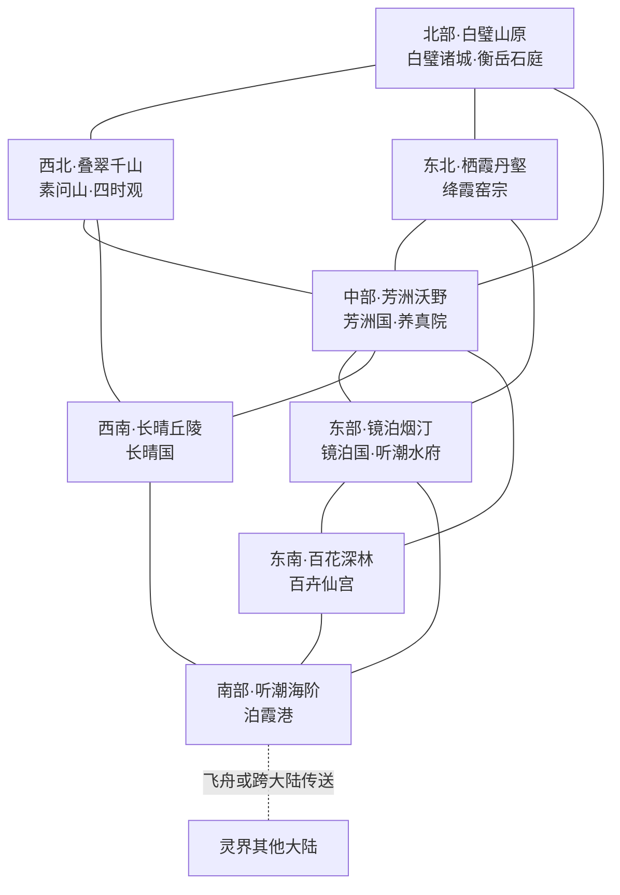

# 灵境大陆蓝图

> 状态：最终定稿。配套文件为同目录的动态总览与《灵境大陆地图.png》。
>
> 大陆主题：山水仙乡、物候修行、多族日常；灵气充足，灵族与物化生灵广泛共居。包含八片生态、六宗、四个凡国以及养真院。
>
> 本蓝图采用正式世界设定与用户确认方案，记录最终的生态、势力、人物、秘境与空间关系。

## 一、兼容约束与大陆定位

- 定位：灵气充沛、万物易于孕灵的山水仙乡。灵族与物化生灵建立聚落、延续道统，与人族共同经营城镇、田园和山林。
- 气质：清丽、丰饶、幽深，兼有热闹市井、温柔异族日常与偏远地方的志怪气息。险地和利益争端存在，但普通生活有其稳定秩序。
- 历史：上古天魔战争撕裂超大陆后，本地保存了众多山间盆地、地下水道与古灵脉。当地生灵和后来迁入者共同疏水、复田、修建聚落，逐渐形成分区庇护的宗门与凡国。
- 灵气：这里适合长期温养草木、矿石和器物，成灵现象较为常见；成灵仍需岁月、机缘或点化，普通草木、丹药、矿石与器具始终占大量份额。初生意识不等于化形，更不等于高阶修为。
- 数值：灵气充足作为环境特色，不另加全大陆修炼倍率、炼制成功率或新属性；继续服从既有灵界规则、灵脉品阶及生产判定。
- 种族：自然吸纳日月精华成精者为灵族，包括草木灵、金石灵、五行真灵、气象灵；炼制器物历久成精者为物化生灵，包括器灵、丹灵、阵灵、机傀。天然玉石成精与炼制玉印通灵分别归属两类，不能混用。
- 人格：灵族初生时天真跳脱，之后可因经历成为成熟的修士、商人或师长。物化生灵有独立人格、重契约、可择主，依靠灵气与本源材料维持，被毁本源则灭。
- 修行：灵族整体不善正面战斗、擅长辅助类功法，宗门重治疗、护持、地势与阵法协作。个体可有不同专长，不能将全体改写为以征战著称的种族。
- 境界：化神为宗门中坚，返虚常任管事或长老，合体多为宗主；本蓝图落实两位大乘，为百卉仙宫宫主与衡岳石庭庭主。渡劫不介入常规争端。
- 凡国：世俗君主、官员、将领与世家代表最高金丹（L≤3），高阶护国修士属于宗门体系。种族、器龄与担任公共职务均不自动提高境界。
- 经济：使用下品灵石统一计价，地方物产、本源材料和修补服务遵循现有分类与公式。
- 天魔：保留历史与边境威胁，不设置未来入侵年份或倒计时，也不将地方所有异常统一归因于天魔。
- 参考要素：中国青绿山水、洞天福地、花木石精志怪、园林、梯田、地方节令与水神祭祀。参考只用于创作定调，正文采用大陆自身的风物和制度。

## 二、候境与万物有灵的生活

### 候境

“候境”是由地势、灵脉、长期培育或调候阵法共同形成的特殊物候地域：冬日开花的温谷、盛夏留雪的阴岭、数十年一度枯荣的园圃皆可属于此类。

候境改变局部温湿、日照、灵气分布和生长节律，不改变时间流速，不抵消寿元消耗，也不凭空产生资源。大型候境仍依赖真实水源、地力、材料与维护者；调候可以影响邻谷和下游，不能无限向外转嫁代价。

大陆多数地方照常经历四季。特殊候境散落其间，有些由自然形成，有些由宗门经营，有些与灵族或阵灵长期协作。各区保留普通农业与生活，避免人人都围绕候境维护工作。

### 多族共居

- 人口结构：人族是凡国农业、商贸和基层治理的重要主体；灵族广布山林、水域、矿区与城镇；物化生灵常见于老作坊、宗门、园圃和交通设施，但不是每件旧物都会成灵。其他种族在港口、商路和宗门中自然存在。
- 居住：普通住宅与临水院、暖石房、日照庭并存。无法远离本源的居民可借信使或获准使用的传讯法器处理外务，不默认能够随意脱离本体。
- 寄名：部分初生灵族先使用出生地或照料者给予的名字，游历后决定是否更名；寄名不代表所有权，也不强制所有灵族遵循同一习俗。
- 休眠：有季节性休眠习惯的灵族，会将店铺、田园或家事托付熟人；休眠仍正常经过时间，不提供额外延寿机制。
- 器物觉醒：确认独立意识后，可继续与旧主合作、择主、拜师或独立谋生。未成灵的普通器物仍可正常交易，不能把每次买卖写成人格纠纷。
- 修补：物化生灵的修补需要识别本源、取得材料并运用对应技艺；更换外壳不等于重造本源，修补也不能无条件复活已灭生灵。
- 生产：正常采药、伐竹、采矿和烧陶普遍存在；开智生灵、已知栖息地和孕灵中的特殊材料需要另行辨识，不能以“万物有灵”否定日常生产。
- 食宿：人族菜饭照常供应，灵族与物化生灵各有嗜好和维持方式。旅店会询问水温、日照与材料需求，宴饮也可以纯粹为了情趣和交往。
- 防卫：公共阵灵不等于无敌护城者，其能力受本源、阵基、品阶和供给限制；低阶官员可以协调维护，不能借掌管城印自动获得高阶修为。

## 三、大陆空间与交通

地点层级：`灵界-灵境大陆-生态-宗门/城市/秘境（可选）-具体位置`。

大陆北高南低。北部白璧山原与西北叠翠千山为主要水源；中部芳洲沃野承接支流，东部镜泊烟汀调蓄湖水，南部听潮海阶为河口与跨大陆门户。

- 图中实线表示相邻或有常用通路，不表示各边距离相同；本图仅表示区域联系，不代表比例尺。
- 芳河：叠翠千山泉溪汇流，向东南流入芳洲沃野，经东部水口进入镜泊；承担灌溉、客运与花木运输。
- 璧水：白璧山原地下水在南麓出露，流经芳洲北缘再入镜泊；矿区排水与下游农事因而直接相关。
- 霞溪：栖霞丹壑温泉与山溪汇入镜泊北岸，支流保留湿地沉淀区，窑业不能把废料直接排入水道。
- 镜泊与归潮水道：镜泊为内陆大湖；出水经百花深林西缘向南抵达听潮海阶的归潮内湾。河水最终从大陆外缘泄入虚海，内陆航船与跨虚海飞舟有不同泊位，不能直接互换使用。
- 西南丘陵以雨水、小型蓄水塘和井泉为主，陆路经芳洲连接北部矿区，经听潮海阶通向外大陆。
- 跨大陆传送枢纽设于泊霞港；其他地区依靠舟路、陆路及已有条件支持的地方传送设施。不另设免费跨大陆旅行能力。

## 四、八片生态与区域灵感

### 1. 芳洲沃野（中部·田园与凡国腹地）

- 方位：北接白璧山原，西北连叠翠千山，东北通栖霞丹壑；东抵镜泊，南面分接长晴丘陵与百花深林。
- 地貌：芳河与璧水冲积出广阔平原，桑堤、稻田、花圃和村镇之间夹着天然湿地；大城建在不易受淹的河阶上。
- 气候水文：四季分明、雨热同期，春汛与夏涝须分段调蓄；候境集中于药圃和花园，不将全部粮田维持常春。
- 灵气：水土相济、适合长期培育；不同地块的肥力和灵脉品质有差别，仍需轮作、施肥与引水。
- 居民：人族农户与低阶修士最多，桑灵、稻禾灵、花灵散居田园；少数水车器灵、织机器灵、护田阵灵与机傀参与生产。
- 聚落与治理：芳洲国管理县城、村社和大部分良田；宗门园圃有约定边界，水渠经过双方土地时共同维护。
- 生产交通：灵米、蚕丝、花染、苗木与日用织物通过河道发往镜泊，矿料从北方运入；集市兼有普通粮布与修士物资。
- 生活风俗：开渠节检修闸门后共食新米；花信节互赠花枝与书信。休眠托管常见，但家业继承仍须当事人议定。
- 食物服饰：青团、桑果酿、荷叶饭、时令菜汤；短褙子、便于涉田的束裤与花染裙裳并存。
- 禁忌：不在上游偷偷截渠，不以尚未确认成灵为由随意夺走他人作物；发现初生灵识时先请有经验者辨认。
- 地标：芳津城、两水会堤、千畦花市、养真院、织雨坊。
- 普通资源：动物有青背灵牛、斑羽田鹭、桑叶蚕；植物有芳穗稻、青绵桑、露绒花；矿土有河纹砂、青陶土、浅层铁砂。均为普通生态资源，是否开智另行判断。
- 当前矛盾：花园调候需要稳定水量，粮田却随农时集中用水；丰年花价下跌，农户与苗商对下一季种植各有判断。

区域灵感：

1. 花灵掌柜将休眠，雇玩家代看客栈；账本把客人的日照需求记得分毫不差，却没有记录谁已经付过房钱。
2. 春蚕迟迟不吐丝，织坊以为有人下毒，桑灵却坚持今年应延后采叶，双方需要共同观察新叶变化。
3. 一架老织机忽然开始织陌生纹样，原来它在复原故去织工未能完成的嫁衣，家中后人却急着交付商单。
4. 女县令发现官署历年的节令表都偏了数日，村民实际遵循的是老农和灵族邻居共同留下的物候记号。
5. 开渠节前两村争抢工匠，玩家可以调查旧渠、协调工期，或护送备用木料，避免任何一村错过播种。
6. 千畦花市推出便宜的新花种，畅销后却因不耐运输引发退货；任务可能是保存花苗、查明适种环境，也可能只是帮摊主熬过最忙的一夜。

### 2. 叠翠千山（西北·山居与茶药古道）

- 方位：北连白璧山原，中南山口通芳洲，西南古道可达长晴丘陵。
- 地貌：叠嶂、竹海、梯田、岩壁药圃与深涧相间；高处有终年背阴的雪岭，低谷则可种茶养果。
- 气候水文：垂直气候明显，云雾多、山雨急；芳河源流分布各谷，修路需兼顾山泉和落石。
- 灵气：沿山脊与泉脉聚散，天然候境多，闭关洞府与普通村落共享山路但不共享全部灵脉。
- 居民：茶灵、竹灵、山雾气象灵与人族茶农药农混居；古琴器灵、采药机傀和老山院阵灵偶居其间。
- 聚落与治理：山民村社自行处理林田家事，主要驿镇参与芳洲国的山路和税务体系；宗门山场由素问山、四时观依约管理。
- 生产交通：茶叶、药草、竹材经背篓、驮兽和索桥出山；大型货物到山口换车船，御空不替代普通居民的道路维护。
- 生活风俗：春采会交换茶样、认药节开放低风险药坡；山院夜宿常以添柴、带书或修竹篱相谢。
- 食物服饰：笋脯、茶糕、菌汤和竹筒饭；斗笠、短蓑、耐磨布衣，常留腰囊装采集工具。
- 禁忌：不在泉眼倾倒药渣，不擅挖标记种株；山雾遮路时敲响路铃等候向导，不把每团雾都当作灵族。
- 地标：青篁驿、素问山、四时观、听雨栈、分泉岭。
- 普通资源：动物有岩纹山羊、白尾药兔、青翎山雀；植物有雾芽茶、节青竹、伏苓芝；矿产有温灵石、松纹石、细白云母。
- 当前矛盾：新商道使旧驿站衰落；药园扩张与村社公用林地重叠；高山调候是否影响下游农时尚需实测。

区域灵感：

1. 茶灵与茶壶器灵争论新茶火候，双方都记得旧主人，却分别坚持她年轻和年老时的口味。
2. 暴雨冲断婚队必经的竹桥，村民请玩家寻找驮兽、架绳或联系邻谷，婚事并不一定暗藏阴谋。
3. 山院阵灵误把年轻访客认作旧友，接连开放不适合其境界的练习场，需找到旧名册并重新说明身份。
4. 雨灵学着替旱村降雨，却无法独自判断山洪风险，四时观弟子要带它观察整条流域。
5. 古琴愿意陪初学者练基础曲，却拒绝参加名家雅集；组织者愿付高价，琴师本人只想保住演出承诺。
6. 旧驿站失去商队后改办采茶小住，第一批客人偏逢连雨，店主需要能陪客人认茶、讲山路或修屋的人。

### 3. 白璧山原（北部·金石与地下水脉）

- 方位：西南接叠翠千山，东南连栖霞丹壑，南麓下接芳洲沃野。
- 地貌：白色岩台、碎石原、玉矿、溶洞和断崖相接，聚落多建于向阳崖壁与地下河出露处。
- 气候水文：寒燥多风，地下水相对稳定；融雪和采矿排水汇入璧水，矿道改变可能影响远处泉眼。
- 灵气：金石灵脉集中，适合矿材温养、护体与地脉阵法；露天贫瘠地仍不适合大规模农业。
- 居民：金石灵、人族矿工石匠、少量土行真灵并居；玉印、砚台、测脉器和石刻阵盘中的器灵也有自己的工坊。
- 聚落与治理：白璧诸城管理矿权、工钱、运输与公共水道，衡岳石庭负责高阶勘脉和护境；地下聚落与地表城市定期互通道路图。
- 生产交通：矿材、碑拓、磨具、营造石件销往各地；粮食和木材从芳洲、叠翠购入，重货以驮道和经检验的货运阵运至山麓。
- 生活风俗：开石会展示新料与旧器修补，泉灯夜为地下行路人点灯；石灵的长期承诺须明确起止，避免把数十年当作短暂等待。
- 食物服饰：居民饮食包含热汤面、盐烤根菜和耐储粮饼；披肩、护目纱、厚底靴与简洁玉饰常见。
- 禁忌：不得堵死公共逃生道；不得以矿契宣称拥有已开智居民。普通矿料交易仍可正常进行。
- 地标：璧泉城、衡岳石庭、百工石阶、南麓水眼、照壁书窟。
- 普通资源：动物有灰背岩羊、洞斑鱼、石隙蜥；植物有耐寒石苔、白根薯、崖柏；矿产有白璧玉、玄铁、云纹石。
- 当前矛盾：增产会改变地下水压；老矿渐竭，矿工、城市和依赖特定材料的器灵都要寻找出路。

区域灵感：

1. 石灵雕刻师终于完成老年像，委托人却病重难行；玩家受托送像，或请雕刻师第一次亲自走出山原。
2. 两个工坊争购同一块修补材料，其中一方是即将无法维持器身的器灵，另一方承担全城水闸维修。
3. 旧碑拓本少了一个字，矿道走向因此被误读；线索分散在城中学塾、器灵记忆与早年采矿账册。
4. 一群新工人误把石灵住处当成废料场，搬迁纠纷需要找到原定界标，也要替工人保住临时住处。
5. 地下泉灯全部熄灭，居民先组织撤离与检修；查明原因可能只是旧灯具失养，并非必有地底妖魔。
6. 器灵砚台想跟随年轻书生游学，家族长辈坚持它应守着书院，双方需要重谈当年已过期的借用约定。

### 4. 栖霞丹壑（东北·地火与温泉窑城）

- 方位：北接白璧山原，西南通芳洲，南下可达镜泊北岸。
- 地貌：丹霞石壁、地热谷、红叶林、温泉阶地和陶土盆地交错，窑城沿安全地火支脉修建。
- 气候水文：谷中温暖，山顶风冷，雨季须防泥流；霞溪将山泉送往镜泊，生产废水先经沉淀和处理。
- 灵气：火土交汇，局部地热候境便于药材温养与冬季生产；高温险处不作为免费修炼捷径。
- 居民：人族陶工、火行真灵、温泉水灵、彩石灵混居；炉鼎器灵、丹灵、古窑阵灵及搬运机傀出现在宗门和老作坊。
- 聚落与治理：霞陶城和周边窑镇加入白璧诸城的南部贸易体系；日常市政由城议管理，地火安全由绛霞窑宗负责专业监督。
- 生产交通：器皿、药炉、耐火构件、釉料和温泉旅舍并兴；原料经北方石道入谷，成品装船沿霞溪外运。
- 生活风俗：开窑节当众验器、温汤会招待冬季旅人；拜师礼常从修补普通水缸开始。
- 食物服饰：温泉蛋、砂锅炖菜、蒸根菜；作业时穿束袖袍、护腕与围裙，节庆多用赭红和彩釉饰物。
- 禁忌：不能私改共用火道；未经本人同意不得试验丹灵药性，更不能把有意识的丹灵当作待售丹药。
- 地标：霞陶城、绛霞窑宗、七泉阶、试釉街、分火台。
- 普通资源：动物有暖岩蜥、赤羽雀、温泉虾；植物有赤叶枫、暖壑姜、耐火藤；矿产有霞红陶土、地火晶、彩釉矿。
- 当前矛盾：窑工赶货与地火休养冲突；温泉旅舍争水；祖传釉方与新工艺在师门内部引起争论。

区域灵感：

1. 学徒烧出的灰色器皿能改善某口井水的味道，师门要求先核验材料，商人却急着订下整窑。
2. 丹灵悄悄应聘药铺学徒，擅长辨别丹香却不懂账目，掌柜误以为它是离家出走的宗门弟子。
3. 炉鼎器灵拒绝新一批矿料，工匠怀疑它挑剔，检验后可能发现细微杂质，也可能需要说明新的炼制用途。
4. 温泉旅舍办赏雪会却遇暖冬，经营者请玩家寻找合适山路与冬景，禁止私自发动大范围降雪阵。
5. 搬运机傀完成旧主人全部订单后站在库房等候，接手作坊的人想请它留任，却需要认真解释新的工作与报酬。
6. 红叶谷的小型山火切断商道，水灵、火灵与凡人工队需分工清理，不能只靠互相克制的法术胡乱压火。

### 5. 镜泊烟汀（东部·湖国与舟居水市）

- 方位：北接栖霞丹壑，西连芳洲，南接百花深林与听潮海阶。
- 地貌：内陆大湖、苇洲、浅滩、花田与高堤城镇相间；主城立于稳定湖岸，水市随季节迁至不同泊位。
- 气候水文：湿润多雾，湖水承接芳河、璧水、霞溪，经归潮水道向南泄出；渔汛与洪枯变化关系全区生活。
- 灵气：水脉连贯，雾与日照交替形成小型候境，长期护湖阵法需要分段停养。
- 居民：人族渔户、舟居商人、莲灵、芦灵、水行真灵、雾灵及少量水族妖修共居；老渡舟器灵、桥阵灵和船坞机傀参与运输。
- 聚落与治理：镜泊国管理湖岸县镇、水市和通往南部的航道，听潮水府驻于湖岸，另在南部港口设堂。
- 生产交通：渔业、莲藕、芦纸、舟运和花木转运繁盛；大型船队须按水位通行，普通舟灵不能独自跨越虚海。
- 生活风俗：春汛祭检验堤闸，舟灯会展示各船旧物与故事；成灵舟船可以协商远航、休养和转任。
- 食物服饰：鱼羹、藕粉糕、苇叶蒸饭；窄袖轻衣、短披和防滑鞋，商旅常带防潮书囊。
- 禁忌：不得伪造水位标志，不在繁殖水区用毒捕鱼；未经许可不得擅解舟灵与船员的航行契约。
- 地标：照汀城、听潮水府、浮灯水市、九折堤、归潮闸。
- 普通资源：动物有银背湖鲤、苇羽鸭、浅水蚌；植物有镜叶莲、长节芦、浮香菱；矿产有水纹石、湖底铁砂、白泥。
- 当前矛盾：上游蓄水影响航运；湖田扩张与鱼群繁殖地重叠；老护湖阵灵休养期间需要替代方案。

区域灵感：

1. 百年渡舟想去看海，居民为它筹备远航，同时要募集一艘能接替日常渡运的新船。
2. 水市迟迟等不到粮船，调查发现上游护山阵修缮改变了支流水位，双方都以为只会影响本地。
3. 老阵灵申请停阵休养，国中要安排临时堤防、运输改道与宗门值守，玩家可参与其中一项具体工作。
4. 湖上婚礼邀请多族亲友，主家需同时准备普通席面、临水座位和器灵可参与的游戏。
5. 芦灵抄写的船籍姓名顺序总错，因为它按船声记人；船务官试着找到兼顾记忆与登记的方法。
6. 一只尚未成灵的旧船铃被传为报灾灵物，造成船票哄涨；调查既需辨器，也需追查谁在散播消息。

### 6. 百花深林（东南·草木道统与林间聚落）

- 方位：北通芳洲，东北接镜泊，南面古道下至听潮海阶；归潮水道经过西缘。
- 地貌：古林、藤桥、落花溪、菌园和疏林村落交织；林冠下有长期阴湿区，向阳坡则开辟果木和药圃。
- 气候水文：温暖多雨，落叶、开花和菌生季节各不相同；支流汇入归潮，山雨时须防藤桥湿滑和河湾暴涨。
- 灵气：适合草木温养，古园中的候境较多；普通林地仍有枯荣、病虫和自然演替。
- 居民：花木灵、菌灵、人族林居者与少量五行真灵广布，药圃阵灵、药锄器灵和园艺机傀常与数代师徒共事。
- 聚落与治理：百卉仙宫护持宗门林场和独立林社；北缘集镇与芳洲国订有贸易和调解约，林社内部家事不归凡国直接任命官员。
- 生产交通：药材、种苗、香材和菌类沿藤桥、山径与支流运出；外来旅客可走公开道路，试药圃和脆弱栖息地需向导。
- 生活风俗：花会并非全林同日举行，各聚落按自身物候邀客；寄名、赠种、休眠送别与醒春家宴常见。
- 食物服饰：菌羹、花露糕、树果酱；宽松轻衣、草编外披、花染纱和木质发饰，采药者另备实用护具。
- 禁忌：不得用强烈香气掩盖药圃标记，不把剪下枝叶自动视为成灵者本人，也不把成灵者本源当作可任意采摘的药材。
- 地标：花隐集、百卉仙宫、落英桥、千种圃、醒春亭。
- 普通资源：动物有花背鹿、长喙蜜鸟、彩翅蝶；植物有留香木、云耳菌、露心兰；矿产有叶纹石、青砂、湿谷药土。
- 当前矛盾：新药圃改变传粉路线；部分老园需要维持特殊物候，邻近聚落却希望恢复正常生长季。

区域灵感：

1. 林社第一次筹办人族婚礼，花期提前半月，居民要寻找替代装饰，而新人的亲属误以为婚约生变。
2. 园艺机傀依旧给一片已经改作住处的土地浇水，原来旧园图未更新，阵灵和居民各保存了一份不同地图。
3. 年轻花灵想出门游历，却担心无法照料幼苗，玩家可以帮忙寻找可信托管者而非劝它永远留下。
4. 一种新香粉让传粉灵蝶绕开药圃，查清原因后，香坊和种植者需要调整配方与播种位置。
5. 赠种节上有人收到不会发芽的种子，赠送者其实交出了祖辈遗存，双方对礼物意义的理解截然不同。
6. 老园维护者准备休眠，村民担心来年失去早春药材，需要商量替代供货、渐次退阵或协助维护。

### 7. 长晴丘陵（西南·果酒香坊与陆路小国）

- 方位：北接叠翠千山，东北通芳洲，东南下行至听潮海阶。
- 地貌：向阳低丘、果园、旱田、香草坡和风口驿镇交错；山塘与小型提水设施围绕村落布置。
- 气候水文：晴日较多但仍有雨季，依靠蓄水塘、井泉和顺坡水渠维持农业，旱年不能指望调候无限降雨。
- 灵气：分散于果林与草坡，适合缓慢培育和酿造；风灵活动常见于山口，但普通山风占绝大多数。
- 居民：人族果农、酿造师、香草灵、果木灵与少量风灵混居；酒器、香炉器灵和蜂箱看护机傀在家族作坊中延续旧交。
- 聚落与治理：长晴国管理集镇、驿路与山塘，绛霞窑宗承担护国职责，素问山提供约定诊疗服务。
- 生产交通：果酒、干果、香料、蜂蜜与客栈业发达；粮食部分自种、部分购自芳洲，陶罐依赖丹壑，货物由陆路集运至南港。
- 生活风俗：晒果节互换果脯，封坛日先尝家酿再封新酒；乡里常以修塘、修路与借农具建立长期互助。
- 食物服饰：炖果肉、杂粮饼、蜜渍果与清淡乳酪；轻便骑装、短披、围裙和染花头巾常见。
- 禁忌：不可隐瞒坏酒混装，不得堵占公用蓄水口；使用成灵酒器酿造需事先约定，不能随意灼洗损其本源。
- 地标：晴酿城、百香驿、晒果坡、共泉塘、封坛街。
- 普通资源：动物有黄腹蜜蜂、短角灵羊、褐尾丘狐；植物有日绯桃、晚香草、耐旱黍；矿产有赭土、浅脉铜矿、风孔石。
- 当前矛盾：丰产压低果价，香坊争抢晾晒场；连接新港的近道使旧驿镇失客；器身老化导致名酿停产。

区域灵感：

1. 酒器器灵想酿自己喜欢的淡酒，酒坊却已接下烈酒订单，解决办法可能是分炉试酿和重新安排交货。
2. 蜂群集体迁往邻国花田，果农误以为有人偷蜂，实际需要核对两地开花时节与水源变化。
3. 家族酿造师病倒，女继承人能管账却不会掌握火候，请玩家寻找曾离家的老学徒共同撑过封坛日。
4. 小国准备送外交礼物，一位香炉器灵被错误列进货单；负责官员必须补礼并向它解释，而非把疏漏升级成战争。
5. 雨季冲坏共泉塘，富户愿出钱却想独占夏季用水，村社希望请懂水利的人估算各自真实需求。
6. 旧驿站举办晒果会招揽旅人，却把邀请日期写成当地花信，外地客人接连提前到达，店家急需帮手。

### 8. 听潮海阶（南部·河口与诸族门户）

- 方位：北通镜泊和归潮水道，西北连接长晴丘陵，东北山路进入百花深林，南临虚海。
- 地貌：层叠海崖、归潮内湾、河口沙洲与高处飞舟泊台并存；内湾承接大陆河水，外缘是跨虚海航行的出发地。
- 气候水文：湿暖多风，河口有淡咸交汇的局部水域；虚海灵压和风暴影响飞舟靠泊，不能把普通内湾潮汐等同于整个虚海性质。
- 灵气：水风交汇、适合航行感知与器物温养，风暴期仍可能损坏船体和本源，不能因灵气多而免维护。
- 居民：人族水手、各族商旅、风雾气象灵、水行真灵及罗盘器灵、舟灵、港阵灵、独立谋生机傀同居。
- 聚落与治理：泊霞港属镜泊国的南部港务辖地，行会参与公共事务；听潮水府驻港堂承担高阶防卫和护航，世俗港务官最高金丹。
- 生产交通：转运花木、茶药、矿器、果酒，进口本地缺乏的修补材料与远方物产；设大陆主要跨大陆传送枢纽和飞舟换乘处。
- 生活风俗：归帆灯会为返航者留席，诸乡食会邀请不同族群摆摊；旅店张贴房间的日照、水温、承重与材料服务。
- 食物服饰：杂鱼饭、果酒炖菜、外来面点与茶食并卖；短斗篷、耐风长衣、腰带工具袋和可收拢的饰物适合码头生活。
- 禁忌：不得伪造救援信号和航图；有意识的舟灵与机傀可以作为旅客登记，不能仅因本体外形被强制列为货物。
- 地标：泊霞港、归帆灯台、诸乡客舍、阶上飞舟埠、跨大陆传送枢纽。
- 普通资源：动物有灰翼海鸥、湾鳞鱼、浅湾蟹；植物有崖盐草、耐风藤、湾口苇；矿产有盐晶、崖青石、定风砂。
- 当前矛盾：河船与飞舟转运拥堵，危险材料和成灵旅客需要不同检验方式；救援费用和港口盈利之间时有分歧。

区域灵感：

1. 一批机傀买票来灵境修补本源，商队习惯将它们当货物，港务需要核验契约并安排合适住处。
2. 罗盘器灵坚持旧航线更稳，年轻领航者拿出新测绘记录，玩家可随近岸试航核对变化。
3. 来自星坠大陆的工匠带来标准修补件，本地老器灵却不适配，需要双方共同测量和修改。
4. 花苗货船迟到，货主要求走最快的飞舟线，船员担心温压变化毁苗；委托可以围绕保温、转运或赔偿展开。
5. 诸乡食会接待一位不能随意离开器身的客人，摊主们商量把集市节目移到它的窗前。
6. 归帆灯会前一艘救援船需要大修，港国、宗门和商会都愿承担部分费用，却争论今后的使用安排。

## 五、宗门与共同教养机构

本节确定职责、传承和相互关系，组织人物见第九节名册与职位对照。六宗没有简单正邪阵营，也不要求每宗都统治一个凡国。

### 1. 百卉仙宫（大型·草木传承）

- 简介与理念：保存草木灵古老道统，主张“因其性而养，循其时而成”。宫中既有守旧古园，也有试种新圃。
- 位置：灵界-灵境大陆-百花深林，沿千种圃与数处独立山谷分布，不以单一巨树支撑全大陆。
- 声望：种苗、培育和辅助修行享有盛名，林社信赖其照料初生灵族的经验；农户有时认为其重古园、轻农时。
- 组织：宫主、护圃长老、传种堂、医芳堂、候园司、外务院；草木灵、园圃阵灵、园艺器灵及其他族弟子各按才能任事。
- 修行：培育、炼丹、医术、辅助与护体功法；化神为实务中坚，返虚主持重要园圃，合体层级统筹宗门。
- 地标：千种圃、落英桥、养根殿、候园廊。
- 生活：播种、分株、病害观察、花期记录、照料初生灵族与接待村社；允许弟子游历，不以终身留园换取基本教养。
- 外销：灵种、药材、栽培指导、护田方案与普通园林营造；出售的是材料与技艺，不出售独立成灵者。
- 庇护：与四时观共同庇护芳洲国，并护持独立林社；两项职责有各自资源预算。
- 对外：与素问山合作诊疗，与四时观讨论候境调整，依赖芳洲粮布及镜泊运输。
- 内部分歧：维持古老候园与顺应自然变迁并存，没有预设一方永远正确。

### 2. 衡岳石庭（大型·金石与地脉）

- 简介与理念：由金石灵道统与历代勘脉师共同发展，主张“识其根，承其重”。
- 位置：灵界-灵境大陆-白璧山原-璧泉城外的稳固岩台与地下石庭。
- 声望：护山、辨材和营造可靠；矿主常嫌勘测缓慢，矿工则依赖其事故预警。
- 组织：庭主、勘脉长老、石契院、护山院、刻经堂、修本坊；器灵可以担任师长，不自动从属于炼制者后人。
- 修行：阵法、炼器、护体、御物与地脉感知；尊重灵族辅助优势，正面战斗依赖护阵和同门配合。
- 地标：承重台、百刻廊、地脉测井、修本坊。
- 生活：拓碑、辨矿、检测支柱、整理旧矿图和修补本源，低阶弟子只进入适合自身的作业区。
- 外销：勘探、阵基营造、矿材鉴定、刻印、器身修补。
- 庇护：为白璧诸城提供主要高阶威慑；重大地脉事故不因矿区欠款而延误救援，费用另议。
- 对外：与绛霞窑宗共同检验耐火材料；与芳洲、四时观共享璧水监测资料。
- 内部分歧：新矿开发、停采修复和寻找替代本源材料各有成本。

### 3. 四时观（大型·物候与调候）

- 简介与理念：多族共同研究自然物候与局部调候，主张“知其变，量其宜”。
- 位置：灵界-灵境大陆-叠翠千山-分泉岭，山下至芳洲设观察站。
- 声望：农时、灾候和水源记录被广泛采用；观测结论有不确定性，不能当作必然预言。
- 组织：观主、调候长老、测雨堂、候历院、地水司、问农馆；气象灵、五行真灵、阵灵与人族测候师共同任职。
- 修行：阵法、神识、御物、培育与护持；调候须核算范围、持续时间和材料消耗。
- 地标：分泉岭、望雨台、候历库、试候小谷。
- 生活：沿途记雨量花信、检查山泉、访问农户和试验小阵；错误记录可更正，不能为维护声望隐瞒失误。
- 外销：物候历、农事咨询、有限调候、堤渠勘验和灾害预警。
- 庇护：与百卉仙宫共同保护芳洲国，涉及跨流域调整时须通知其他受影响地区。
- 对外：与听潮水府共享水位资料，与各凡国共同维护测候站。
- 内部分歧：短期解旱、长期地力恢复与邻区风险之间常需取舍。

### 4. 素问山（中型·多族医修）

- 简介与理念：治疗血肉伤病、灵族本源损伤及物化生灵失养，主张“先识其身，再论其病”。
- 位置：灵界-灵境大陆-叠翠千山，分诊处设于芳津、霞陶与晴酿。
- 声望：愿意承认诊疗边界，跨族病人信任其会诊制度；部分急求灵药者嫌疗程缓慢。
- 组织：山主、会诊长老、草木诊室、金石修养室、丹灵温养房、行医队。
- 修行：医术、炼丹、培育、神识与辅助功法；复杂器身损坏请衡岳石庭或绛霞窑宗共同处理。
- 地标：问诊坪、温养庐、药案楼、复根圃。
- 生活：巡诊、整理病案、观察药候、指导休养；丹灵既可求医也可学习医术，不被默认当作药材。
- 外销：诊疗、药品、休养服务、病案教学与材料配伍咨询。
- 职责：为长晴国及各地诊舍提供约定服务；不因医疗合同自动承担无限军事庇护。
- 对外：依赖百卉种药、衡岳辨材、绛霞制器，并为养真院提供初生生灵检查。
- 内部分歧：实验性疗法、材料稀缺和病人自身生活选择之间需要逐案讨论。

### 5. 绛霞窑宗（中型·炼器与器灵共修）

- 简介与理念：窑火传承、炼器与器灵修补并行，主张“成器有法，养器有情”。
- 位置：灵界-灵境大陆-栖霞丹壑-霞陶城外围安全地火区。
- 声望：日用陶器与实用法器均有口碑，器灵认可其协商修补的习惯；高价订单有时挤占民用维修。
- 组织：宗主、分火长老、炉院、试釉坊、修器堂、机傀作坊、外务堂；人族工匠与物化生灵按技艺共同任事。
- 修行：炼器、阵法、御物、辨材及相应火土功法；机傀延续既有物品分类，成灵后才具有独立人格。
- 地标：分火台、试釉街、养炉堂、共修器室。
- 生活：练手、验料、烧制、补器、带徒与按单交货；不把每次开窑都写成神器诞生。
- 外销：陶器、药炉、阵法构件、机傀、维修与定制；自主成灵者不列入普通产品清单。
- 庇护：承担长晴国护国责任；霞陶本地则在白璧诸城庇护框架下承担地火安全与驻地防卫，二者盟约分列。
- 对外：向衡岳购料，向长晴供酒器、香炉与农具，和素问山合作本源修补。
- 内部分歧：标准生产与个体器身差异、祖传配方与弟子创新、护国远驻与本地人手之间均有张力。

### 6. 听潮水府（中型·河湖与虚海航行）

- 简介与理念：从湖泊治水发展为兼顾河运、港口和虚海护航的宗门，主张“识水势，守归程”。
- 位置：总府在灵界-灵境大陆-镜泊烟汀-照汀城外，听潮海阶设驻港堂。
- 声望：长期承担救援，船民信任其经验；商业护航利润与公共维护支出需要平衡。
- 组织：府主、护航长老、堤阵司、测航堂、舟坞院、搜救堂；舟灵、罗盘器灵、港阵灵与人族水手共同参与。
- 修行：阵法、御物、神识、炼器及水系护持；飞舟航行需要船员、材料与维护配合。
- 地标：归潮闸、观潮廊、归帆灯台、护航舟坞。
- 生活：记录水位、检修船具、领航训练、轮值救援和校订航图。
- 外销：船票、护航、航图、维修、航道勘验与水上工程。
- 庇护：负责镜泊国及泊霞港高阶安全；常规治安归凡国，救援不以参与者种族为条件。
- 对外：与四时观共同评估水道调整，与星坠大陆观潮舟宗可开展互认航图和救援合作，不预设两宗存在隶属关系。
- 内部分歧：稳定旧航线与探索新航线、舟灵休养与旺季运力、搜救投入与收入压力。

### 7. 养真院（共同教养机构·非第七大宗）

- 位置：灵界-灵境大陆-芳洲沃野-芳津城郊，设普通教室、日照庭、浅水院和器身安置室。
- 宗旨：帮助初生灵族、新近觉醒的物化生灵理解语言、日常交往、灵石、契约与基础修行；也接待需要适应本地生活的外来生灵。
- 组织：院正、教习、照料员、访乡员；院正见第九节。养真院为共同供养机构，其人员不因芳洲出资就自动成为凡国官员。
- 供养：六宗分别提供教习、诊疗或材料，芳洲国提供院地与粮食，毕业者和商户可以捐助。
- 教养边界：不强迫认主或拜入出资宗门，不以种族天真为由剥夺选择；无法离开本源者可由访乡员上门。
- 日常：读写、买菜算账、种植、修补常识、认识自己的身体、试住不同环境与结交朋友。
- 去向：自愿返乡、继续受教、谋职、游历或拜师；先天形态与性格不直接决定职业。

## 六、城市与聚落

本节补足可日常停留的地点。城市的地方执政者最高金丹；高阶宗门据点属于独立组织，不计入世俗官僚战力。

| 地点   | 所在生态与归属             | 城市结构、经济与生活                                                                   | 代表地标与防卫                                                     |
| ------ | -------------------------- | -------------------------------------------------------------------------------------- | ------------------------------------------------------------------ |
| 芳津城 | 芳洲沃野，芳洲国都城       | 河阶上的王城与官署，外连花市、织坊、粮埠；市民同时经营普通粮布与修士物资，春夏游园热闹 | 两水会堤、千畦花市、织雨坊；地方巡卫维持治安，两宗承担高阶庇护     |
| 青篁驿 | 叠翠千山，芳洲山路驿镇     | 石木栈屋、茶棚、药材验货场与小诊舍，客人多为药农、游学者、商队                         | 听雨栈、山路铃棚；低阶驿卫负责通路，素问山和四时观按驻地职责支援   |
| 璧泉城 | 白璧山原，白璧诸城议事中心 | 地表石街与通风良好的洞居层相接，矿市、书坊、刻印和修补行当发达                         | 百工石阶、照壁书窟；城卫与避险设施自管，高阶威胁依靠衡岳石庭       |
| 霞陶城 | 栖霞丹壑，白璧诸城成员城   | 工坊区、温泉旅舍与住宅分区，货场接霞溪；白天验料交易，夜晚赏釉逛汤街                   | 七泉阶、试釉街；城议管市政，绛霞窑宗维护地火安全                   |
| 照汀城 | 镜泊烟汀，镜泊国都城       | 稳定湖岸上的官署、堤街和船坞，季节性水市停泊城外；纸坊、鱼市与游湖业并存               | 九折堤、浮灯水市；水巡与堤工处理常务，听潮水府负责高阶安全         |
| 花隐集 | 百花深林，林社共同集镇     | 疏林院落、藤桥与临溪药市构成，来客可租适应不同身体的房间；公开道路连接外界             | 醒春亭、落英桥；林社轮值护路，百卉仙宫提供庇护                     |
| 晴酿城 | 长晴丘陵，长晴国都城       | 依丘而建的街巷、酒窖、晒场和山塘相连，封坛街经营器具、果酒与香料                       | 共泉塘、封坛街；国中驿卫与城卫最高金丹，护国修士来自绛霞窑宗       |
| 泊霞港 | 听潮海阶，镜泊国南部港城   | 下层河船埠、中层仓街与客舍、上层飞舟埠和传送枢纽；旅人换乘、修器、购苗与互通风俗       | 诸乡客舍、归帆灯台、阶上飞舟埠；港务官管理世俗事务，水府驻港堂守境 |

## 七、四个凡国与庇护关系

### 1. 芳洲国（农业与织染王国）

- 疆域与都城：芳洲沃野的大部分村镇及叠翠南麓部分驿镇，以芳津城为都；独立宗门山场和百花林社不自动归入王土。
- 政体与立国：由战后治水聚落逐渐联合而成的世袭王国；王室主持政务，县官、地方议事乡老和水利代表参与税役安排。
- 行政：王廷、田水署、织造署、学塾司、郡县与堤工队；世家可办学和经营田园，无权私设截流关卡。
- 军事：普通巡卫、舟巡和少量炼气筑基修士，统领最高金丹；面对元婴及以上威胁优先报警、疏散并请求宗门支援。
- 经济：粮食、丝织、花染、苗木、河运与集市税。丰歉年影响真实收入，不能以调候保证年年丰收。
- 信仰与节庆：祭水源、农时与祖辈，开渠节、花信节、秋织会各有民俗，非排他的唯一国教。
- 禁忌：不得私截公渠、篡改粮仓账目，或以照料初生灵族为名占有其本源。
- 供养：向百卉仙宫提供粮布、苗田和自愿求学人才，向四时观提供测候站、堤工与维护经费；受灾时重新议定交付。
- 庇护：百卉负责主要人口区护持、灵植灾害与林缘安全，四时观负责流域预警和调候技术；元婴以上外敌由两宗按就近原则先行应对，不能等待分清账目才救援。
- 世俗边界：两宗不任免县官、不直接征收普通户税；宗门用水也须登记，紧急调候事后向受影响地区说明。
- 制衡：国中水利代表、两宗外务人员共同核账，跨国争水提交山川会；国王不能凭供养调动宗门发动扩张战争。
- 对外：向白璧供应粮食，向镜泊提供花木丝织，与长晴竞争部分果木市场又互补旱地作物。

### 2. 白璧诸城（矿业与百工城邦联盟）

- 疆域与中心：北部矿城及栖霞丹壑的霞陶等南部成员城，以璧泉城为常设议事地；成员城之间有独立乡村与宗门领地，并非连续严密统治全北部。
- 政体：各城自治，轮值议事；矿工行会、工坊、商路和居民推举代表，矿主不能独占所有席位。
- 行政：城议、矿务署、泉务署、工契所和道路维护队；统一公共逃生道、矿材计量与跨城交易的基本规则。
- 军事：城卫、护商队、避险阵盘和普通工程设施，人员最高金丹；护城阵不赋予官员高阶个人战力。
- 经济：矿料、石件、刻印、陶器、温泉旅业与维修；需向南方持续购买粮食、木材与药物。
- 信仰与节庆：敬山泉、工匠祖师及救难先人，泉灯夜、开石会和开窑节因城而异。
- 禁忌：不得隐瞒矿道坍塌征兆，不得切断公用水眼；开智居民不属于矿权附属物。
- 供养：向衡岳石庭提供勘测经费、约定矿材和维护人手；霞陶另向绛霞窑宗提供地火设施维护资源。
- 庇护：衡岳为联盟主要护国宗门，负责元婴以上外敌和重大地脉威胁；绛霞按辖地协议承担丹壑的地火与驻地安全，必要时两宗协作。
- 世俗边界：宗门不能以勘脉为由无偿收走民矿；城议也不能要求宗门强行开采其判定不可承受的区域。
- 制衡：封矿须提供勘察记录与可复核的依据，紧急封闭先救人；城议可申请另一宗复核，普通商业债务不动用护国战力讨债。
- 对外：共享璧水情况给芳洲和镜泊，与长晴、泊霞合作出售成品，保留跨城竞争与合作。

### 3. 镜泊国（湖泊与港口王国）

- 疆域与都城：镜泊湖岸、水道沿线及听潮海阶主要港务聚落，以照汀城为都，泊霞港设独立预算的港务辖署；百花林社内部自治不受其直接任命。
- 政体：王室主持外交和官员任命，沿湖水议参与渔汛、税费与水利；船帮、岸村和港口商会均有陈情渠道。
- 行政：王廷、船籍司、堤务司、水市署、港务辖署和水巡队。
- 军事：水巡、低阶护航修士、烽灯与岸防设施，君主官将最高金丹；飞舟上的高阶护航者为宗门派驻或临时契约者。
- 经济：渔业、芦纸、河运、仓储、船票、港税和修船，商贸繁盛但要承担救援、疏浚和堤防成本。
- 信仰与节庆：祭水源、历代治水者和未归船人，春汛祭、舟灯会、归帆灯会与诸乡食会互相衔接。
- 禁忌：不得造假遇险信号、隐报险货，或将已知有独立意识的乘客强行列作货物。
- 供养：为听潮水府提供船坞、粮食、航道记录和港税约定份额；灾年救援支出可先动用公共储备再核算。
- 庇护：水府负责元婴以上外敌、重大水患和虚海险情的专业应对；普通护航仍须依据航程与风险订约，不能承诺所有航次绝对安全。
- 世俗边界：水府不直接掌握王国税权，不因护航合同干预王位；王国不能强迫舟灵无限出航或让救援队替商户追债。
- 制衡：王廷、水议与水府共同审查年度堤务和搜救支出；影响芳洲或百花林社的水道调整另行协商。
- 对外：与芳洲共享河运，与白璧商议矿区排水，与长晴合作陆海转运，并保持跨大陆开放贸易。

### 4. 长晴国（果园香坊与驿路小国）

- 疆域与都城：长晴丘陵主要农区、集镇和驿路，以晴酿城为都；西北高山村社按各自盟约处理，不把整片叠翠归入王国。
- 政体：世袭小国，王廷规模较小，乡社与作坊代表参与山塘、道路和市场规制。
- 行政：王廷、塘务署、驿路司、市衡署及乡社；基层治理依赖熟人协作，也有隐瞒坏账和人情偏私的可能。
- 军事：驿卫、城卫、护商弓手和少量低阶修士，所有世俗人物最高金丹；外敌超过能力时疏散守路，等待护国宗门。
- 经济：果木、酿造、香料、蜂蜜、驿舍和季节市集，采购陶器、粮食与维修材料。
- 信仰与节庆：敬泉塘、祖辈和传艺师长，晒果节、封坛日与共泉修塘会是公共生活中心。
- 禁忌：不得把坏酒混入新酒，不得以私债夺占公用泉塘；成灵器物的去留按其意愿与有效约定处理。
- 供养：向绛霞窑宗提供火候试验用农产、粮食、驻地和经费；另向素问山购买巡诊、学徒培训及紧急会诊服务。
- 庇护：绛霞为正式护国宗门，负责元婴以上外敌及重大器物、阵法事故，在晴酿设驻点以减少远距响应迟延；医疗合同不把素问山变为第二护国宗门。
- 世俗边界：窑宗不包揽全国酒器生意，不控制王室婚姻或地方官员任命；王廷不能要求其为商贸竞争出兵。
- 制衡：议定公开采购和民用维修份额，护国经费单列；遇窑宗本地紧急事故与王国求援冲突，由驻点先处置并联络邻宗援助。
- 对外：向泊霞输出陆运货物，向芳洲采购粮食，与白璧诸城的丹壑成员城保持器具贸易。

## 八、大陆政治、生产与长期矛盾

### 山川会

六宗、四国和受议题直接影响的独立林社、山村共同参与。养真院可就教养和迁居事务列席。山川会不设统治全大陆的皇帝，也不拥有凌驾各方的常备大军。

会务处理跨境水路、灾害、商道、救援、材料互助和对外联络；日常由少量常任联络人员传递记录，重大事项另行召集。会议地点轮换，避免所有地方事务都集中到同一都城。

各方按约定承担费用和职责。未达成的新事项继续协商，紧急救灾依既有互助约先行；凡国代表可参与利益安排，高阶军事判断仍由负责宗门承担。

### 物产往来

| 来源     | 主要供应                           | 依赖的外部供给               |
| -------- | ---------------------------------- | ---------------------------- |
| 芳洲沃野 | 粮布、苗木、花染                   | 北部矿器、丘陵果产、山地茶药 |
| 叠翠千山 | 茶药、竹木、源流观测               | 粮食、器具、道路修缮材料     |
| 白璧山原 | 矿材、石件、刻印、修补             | 粮布、木材、药品             |
| 栖霞丹壑 | 陶器、炉具、阵材、温养服务         | 矿料、食物、冷却水与运输     |
| 镜泊烟汀 | 水产、舟运、芦纸、仓储             | 上游来水、粮食、船材         |
| 百花深林 | 药种、香材、菌类、培育经验         | 粮布、器具和外界交换渠道     |
| 长晴丘陵 | 果酒、香料、蜂蜜、陆运服务         | 粮食、陶罐、维修和医疗       |
| 听潮海阶 | 跨大陆转运、航行情报、外来本源材料 | 内地物产、船坞材料与稳定供货 |

物化生灵所需本源材料形成稳定的维修与贸易需求，但不是所有材料都稀缺；常用石料、木料与陶土可正常购买，高阶特殊材料才需要另行委托。独立成灵者是交易参与者，不是这张物产表的商品类别。

### “留春之争”远期主线方向

部分古老候境逐渐难以维持。维持它们能保护故居、药圃和地方产业，也可能消耗过多材料或影响邻区；停止维护可以恢复自然节律，却需要迁居、换种和重建生计。

候境的维护者中有灵族与阵灵，它们也会希望休眠、游历或改变修行。居民不能只讨论“谁来接替”，也要理解维护者愿意承担什么；维护者同样需要面对自己长期承诺与邻里依赖。

保留自然演替、阵法老化、过度调候、记录误差等不同成因，按地方调查判断，不能预先认定统一幕后黑手。天魔影响至多是某些边境异常的待验证猜测，不提供入侵日期。

此处仅确立矛盾方向，不写阶段任务、唯一解法、主线结局或强制触发条件。普通茶事、婚嫁、游园、酿造和旅途故事可以始终独立存在。

## 九、人物设计与关系骨架

### 人物设计原则

- 本轮具名人物共三十二名，女性二十八名、男性四名。人物类型指形象与叙事气质；本名册中的人物均按成年角色设计，不以种族初生、器龄或外形推定未成年。
- 其中六宗各三名，共十八名；四国各两名，共八名；教养、商旅与地方生活人物六名。新增配角以后仍须维持女性为主。
- 六宗名册中有两位大乘、四位合体、六位返虚、六位化神。凡国八人均为金丹或筑基；高阶驻国修士归宗门，不兼设能绕过上限的世俗身份。
- 灵族四类与物化生灵四类均有具名角色。妖族只保留一名地方配角，避免稀释本大陆重点。
- 灵族可化形不代表其原生环境毫无意义；物化生灵的本源依存单独说明。人形显现与远距活动必须服从实际境界、功法及本源条件，不赋予所有器灵统一的远程分身能力。
- 人物携带器具仅列类型与用途；正式功法、装备品阶和数值在运行时服从现有生成规则。宗门首领不会因玩家初到大陆就自动出面。

### 1. 百卉仙宫

#### 花照年

- 身份：女／成熟御姐；灵族·草木灵（古梅）；大乘前期；百卉仙宫宫主，常驻百花深林。
- 形貌与衣饰：乌发间杂银白，鬓侧疏梅枝纹，着墨绿交领长裙与月白披帛；常持修枝剪、护圃印。
- 性格与职责：温厚、有耐心，遇到故园去留却格外固执；维护草木传承与芳洲庇护盟约，只处理大陆级危机和宗门重大决定。
- 生活与牵挂：保存历代园丁亲手写的种植标签，记得许多已故凡人的习惯；担忧变更候境会连同这些生活痕迹一起抹去。
- 剧情用途：留春之争中支持审慎维持古园，同时愿意接受可靠的替代方案；化形后可离开出生地，但仍重视故土，故园并非强制束缚她的唯一命脉。

#### 阮青畦

- 身份：女／御姐；人族；返虚中期；百卉仙宫传种堂掌事，往来芳洲与千种圃。
- 形貌与衣饰：肤色微深，长发编起，手背留有栽培痕迹；青布束袖衣、细纹围裙，随身种囊与移栽铲。
- 性格与职责：爽快、重实测，负责苗种供应、弟子田作与凡国农事协调；不赞成为保名花而让普通粮田断水。
- 生活与牵挂：爱用失败育种留下的酸果制酱，想让师门承认普通农人也是传承的贡献者。
- 剧情用途：提供苗种、移栽与调查委托，连接宫主的长期记忆和农户迫在眉睫的生计。

#### 叶绡

- 身份：女／少女；物化生灵·阵灵；化神中期；千种圃候园司记录员。
- 形貌与衣饰：淡绿发尾如薄叶，眼中有细密阵纹；穿叠叶浅裙、短披与记录袋，使用阵盘和量雨尺。
- 性格与职责：爱比较花期，对玩笑有时过于认真；维护一处育苗小园，记录并纠正旧日调候偏差。
- 本源与生活：本源为该小园的旧阵枢，显形活动限于已布设的园内范围；外访由同伴携带记录，不默认可抽走阵枢。喜欢听来客描述远方的普通天气。
- 剧情用途：候境维护者的具体视角；希望有朝一日完成安全迁阵，但不愿以毁掉现有苗圃换自由。

### 2. 衡岳石庭

#### 石含璋

- 身份：女／成熟御姐；灵族·金石灵（白玉）；大乘前期；衡岳石庭庭主。
- 形貌与衣饰：银灰长发、深色眼瞳，颈侧留天然玉纹；石青宽袖衣配素玉带，持勘脉尺与石印。
- 性格与职责：言简、稳重，善于从地层变化判断风险；守护白璧盟约，与花照年共同维持大陆高阶威慑。
- 生活与牵挂：亲手雕刻普通器皿送给朋友，常低估人族等候的时间；正在学习把“以后”说成具体约期。
- 剧情用途：提供地脉历史与高阶勘察支持；主张给必要变化留余地，与花照年的保园立场形成长期分歧而非敌对。

#### 纪砚微

- 身份：女／御姐；物化生灵·器灵（古砚）；返虚前期；衡岳石庭石契院校勘师。
- 形貌与衣饰：墨色短发、指尖淡青，神情专注；玄白长衣、窄袖与卷轴腰囊，常用拓纸和刻刀。
- 性格与职责：记性极好，重承诺但不盲守已失效的契约；校订矿图、碑文和本源材料档案。
- 本源与生活：古砚随身收护，以石材和灵气养护；能化形活动，但砚体受损仍伤本源。旧日书院想请她永久回归，她却希望继续游学。
- 剧情用途：破解文字、矿契与谱录争议，帮助区分对故人的感情和对后人的义务。

#### 裴岩生

- 身份：男／青年；人族；化神后期；衡岳石庭勘脉院实地勘测师。
- 形貌与衣饰：短发、常带石粉，右眉有旧伤；厚底靴、灰袍与护目纱，背测井绳和阵旗。
- 性格与职责：谨慎却不木讷，负责先遣测井、绘图和带领低阶工队撤离。
- 生活与牵挂：喜欢雕小动物送给矿镇孩子；不愿每次事故都只记住高阶救援者，而忽略提前发现征兆的工人。
- 剧情用途：地下探索的向导与团队协作节点，不能代替大乘完成大陆级地脉修复。

### 3. 四时观

#### 谢晴岚

- 身份：女／御姐；灵族·气象灵（山岚）；合体后期；四时观观主。
- 形貌与衣饰：灰蓝长发、浅瞳，衣缘常有细雾；宽袖道衣内搭便于山行的束装，携风旗与测候盘。
- 性格与职责：温和而敏锐，不把经验当成永远正确；主持流域观测、候境研究与芳洲共同庇护事务。
- 生活与牵挂：爱晴天晒书，被弟子笑称最怕潮的山岚；担心观中准确多年的记录让世俗官员失去自行观察的习惯。
- 剧情用途：让预警具有证据与不确定性，为留春之争提供可检验的方案，不预言天魔入侵日期。

#### 温霁

- 身份：女／御姐；灵族·五行真灵（水）；返虚中期；四时观地水司主事。
- 形貌与衣饰：深青发辫、透明水珠状耳饰；青灰短披与涉水长裤，携水尺、符匣。
- 性格与职责：直率、办事快，负责泉源勘验与跨境用水记录；容易先看水量再想起水边住着什么人。
- 生活与牵挂：喜欢收集各地杯盏，正在学习辨别茶味；与镜泊治水人员既合作又争论。
- 剧情用途：水利调查、旱涝救援及上游与下游视角的冲突，不具备无限造水能力。

#### 许知禾

- 身份：女／少女；人族；化神前期；四时观问农馆巡候弟子。
- 形貌与衣饰：乌发束成短辫，脸颊有浅雀斑；土黄束袖衣、旧斗笠，背记录册和普通量具。
- 性格与职责：好奇、肯问、不怕被纠正；沿村记录农时与地方经验，是正式内门弟子，不担任凡国官职。
- 生活与牵挂：爱记录乡间笑话，担心自己的报告被写成只剩术语的官样文章。
- 剧情用途：低门槛问路、访谈与考察伙伴，把普通人的观察带入宗门判断。

### 4. 素问山

#### 白蘅君

- 身份：女／御姐；人族；合体中期；素问山山主。
- 形貌与衣饰：黑发微霜、眼神沉静；素白交领衣、药青披肩，携针囊与诊脉丝。
- 性格与职责：耐心但有边界，主持跨族会诊和行医传承；遇到无把握的病情会明确说明。
- 生活与牵挂：亲手煮普通饭菜，喜欢与康复者谈出院后的安排；不希望求医者把所有人生选择都交给医师。
- 剧情用途：长期疗养、材料寻找、医理争议与宗门合作，治疗按规则消耗材料与时间。

#### 丹初素

- 身份：女／御姐；物化生灵·丹灵；返虚前期；素问山丹灵温养房主事。
- 形貌与衣饰：浅金发、琥珀瞳，近身有清淡药香；米白长衣、细金边腰带，持药瓶和辨香匙。
- 性格与职责：细致、有幽默感，照料丹灵与辨识丹药变质；反对凭“药香相似”直接下诊断。
- 本源与生活：本源是曾封存于旧药庐的温养灵丹，化形不消除丹核弱点，依靠合适灵气与药性材料维持；会按自己口味学做点心。
- 剧情用途：丹灵人格、本源养护和药铺日常；不可被服用以换取力量或视为无限产丹来源。

#### 江停药

- 身份：男／青年；人族；化神中期；素问山行医队领队。
- 形貌与衣饰：束发、面容清瘦，常有睡眠不足的倦色；短袍、药箱与防雨披，携针具和急救符。
- 性格与职责：随和、遇病情果断，负责山路巡诊和运送低阶病人；愿意教人处理小伤。
- 生活与牵挂：爱修坏伞，试图让各村诊舍能自行处理常见问题，避免自己永远奔波。
- 剧情用途：护送、医疗、地方交往与跨种族误诊调查。

### 5. 绛霞窑宗

#### 陶绛雪

- 身份：女／御姐；人族；合体中期；绛霞窑宗宗主。
- 形貌与衣饰：赤棕发髻、手掌有旧火痕；绛色收袖工袍与耐火围裙，携小锤、炉印。
- 性格与职责：爽朗、要求严格，统筹工艺、器灵共修与长晴护国责任；不容弟子用华丽外观掩盖器物缺陷。
- 生活与牵挂：收藏自己学徒时期的歪碗；希望宗门做好日常维修，也承认高阶订单承担不少公共开支。
- 剧情用途：百工生活、委托、师承及宗门资源分配，护国时不代替王廷处理普通商事。

#### 炉心红

- 身份：女／成熟御姐；物化生灵·器灵（炼器炉）；返虚后期；绛霞窑宗养炉堂首席。
- 形貌与衣饰：深红长发、眼底如暗炭，笑声低缓；黑红长袍与铜纹护腕，持火钳、分火牌。
- 性格与职责：嘴上嫌麻烦、实际爱护学徒，负责旧炉养护、材料试烧与危险器具检查。
- 本源与生活：主炉本体安置养炉堂，现阶段显形活动限于相连炉区；迁炉需停工、封火和专业转移。爱听来送料的工人讲城外见闻。
- 剧情用途：器身与职务相连的生活，推动轮值、停养及技术传承，而非轻易拆走公共炉体。

#### 青榫

- 身份：女／少女；物化生灵·机傀；化神前期；绛霞窑宗修器堂弟子。
- 形貌与衣饰：黑短发、颈腕可见木铜接缝；青灰工衣、短裙裤与零件腰包，携榫刀、量尺。
- 性格与职责：认真、话语直接，负责民用修补和小型机傀检修，正在学习自行安排工作。
- 本源与生活：灵识依存胸腔内原生机心，更换肢体不转移人格；曾完成旧主全部订单，如今每天尝试一件自己想做的小事。
- 剧情用途：觉醒后的职业选择与日常成长，机械身体不等于不知疲劳或没有偏好。

### 6. 听潮水府

#### 沈听澜

- 身份：女／御姐；灵族·五行真灵（水）；合体中期；听潮水府府主。
- 形貌与衣饰：青黑长发、碧色眼瞳；深蓝长衣、银线水纹披，持定流印与航图卷。
- 性格与职责：镇定、重归程，管理河湖和驻港两套实务；拒绝用一时英雄行为取代长期维护。
- 生活与牵挂：喜欢独坐小船钓鱼，却常把鱼放回水中；担心水府扩展虚海业务后忽视湖岸居民。
- 剧情用途：河海利益平衡、救援合作与大型航行组织，控制水流受境界和环境限制。

#### 陆归舷

- 身份：男／大叔；人族；返虚中期；听潮水府搜救堂主、驻港轮值负责人。
- 形貌与衣饰：短须、晒深的皮肤，一只耳上有旧缺口；耐风长衣、皮护腕，携绳钩和救援阵旗。
- 性格与职责：寡言务实，负责泊霞高阶救援和船队演练；直属宗门，不任镜泊国港务官。
- 生活与牵挂：定期给旧船员家属送信，记录每一次未能救回的人，也会认真参加家宴。
- 剧情用途：高风险护航、营救与事故复盘；遇到无法承受的风险会组织撤离。

#### 定星罗

- 身份：女／少女；物化生灵·器灵（罗盘）；化神后期；听潮水府测航堂领航师。
- 形貌与衣饰：银褐发辫、瞳中细环，站立时爱辨方位；短斗篷、便装与刻度腰饰，携测风线。
- 性格与职责：自信、好胜，负责核对近岸与既有虚海航图；面对地貌变化须用测量修正旧记忆。
- 本源与生活：罗盘本体随身妥善携带，盘针受损影响感知；收集旅店菜单，认为吃过才算真正到过一个地方。
- 剧情用途：新旧航线争论、航行向导与跨大陆生活；不具备永不迷航的绝对能力。

### 7. 四国人物

#### 姚穗宁

- 身份：女／御姐；人族；金丹后期；芳洲国女王，居芳津城。
- 形貌与衣饰：乌发端绾、目光清亮；浅金与青绿交领礼衣，平日减去繁饰，携王印和水务簿。
- 性格与职责：温和、擅长听取相反意见，负责田税、官员任命和两宗盟约；没有号令高阶修士的个人武力。
- 生活与牵挂：亲手养过几盆屡次种坏的花，珍惜不把她当园艺高手奉承的访客；担忧花园繁荣掩盖粮田劳苦。
- 剧情用途：凡国视角、供养谈判与农事治理，危险时由百卉和四时观依约庇护。

#### 桑晚织

- 身份：女／御姐；灵族·草木灵（桑）；筑基后期；芳洲国织造署验布官。
- 形貌与衣饰：深绿发髻、淡褐眼瞳；靛青工作长衣，袖口别针线包，携验布尺。
- 性格与职责：细心、讨厌以身份压价，检验官购布匹和织坊交货，不管理宗门高阶物资。
- 生活与牵挂：休眠季需交接公务，担心同僚替她承担过多；与织机器灵是互相挑错的朋友。
- 剧情用途：织造、物候作息与基层官署生活，展示灵族可以是低阶普通公务人员。

#### 关砚秋

- 身份：女／御姐；人族；金丹中期；白璧诸城当值议首、璧泉城代表。
- 形貌与衣饰：乌发夹银、眉峰利落；灰白长衣、窄腰带和石扣，携议事牌与账册。
- 性格与职责：精于核账、愿意承担不讨好的决定，协调矿城供给和衡岳庇护经费。
- 生活与牵挂：出身普通刻石人家，闲时修碑拓边角；不希望工人被迫为封矿承担全部损失。
- 剧情用途：矿业政治和救援后的安置，其议首身份不赋予直接统领衡岳弟子的权力。

#### 朱釉娘

- 身份：女／御姐；人族；筑基后期；霞陶城工契所主事，白璧诸城世俗人员。
- 形貌与衣饰：棕发盘起、手指带浅釉痕；赭红短袄与耐磨裙裤，携契册和验样小盒。
- 性格与职责：直来直去，负责工钱、交货争议和民用作坊登记；涉及器灵本源安全会请窑宗辨验。
- 生活与牵挂：一家小汤面铺是她常去的议事外场，怕熟人求情使自己破坏统一规矩。
- 剧情用途：作坊与凡国衔接，不承担返虚级火道治理或宗门首席职务。

#### 柳汀仪

- 身份：女／御姐；人族；金丹后期；镜泊国女王，常驻照汀城。
- 形貌与衣饰：墨发长簪、眼神敏锐；湖蓝礼服与银白披带，携船籍册和王印。
- 性格与职责：外柔内坚，协调水议、港税与堤防；愿意为可靠搜救投入，但要求说明长期支出。
- 生活与牵挂：小时常随家人泛舟，如今难得无仪仗出游；希望王国收入也能照顾远离大港的小村。
- 剧情用途：上游下游争议、河港预算和普通居民诉求；武力依赖听潮水府。

#### 裴济舟

- 身份：男／青年；人族；筑基后期；泊霞港船籍司主簿。
- 形貌与衣饰：束发、肤色偏白，袖上常有墨点；灰蓝官衣、短披，携印泥匣和防潮册。
- 性格与职责：守规矩但愿意纠错，处理旅客、舟船与货单；遇到成灵机傀登记会核验事实，不以外形裁定身份。
- 生活与牵挂：爱写不成篇的航海小说，其实从未远航；因与裴岩生同姓常被误认为有宗门后台，两人无亲属关系。
- 剧情用途：港口入口人物、误单调查与普通人的远行愿望。

#### 苏晴棠

- 身份：女／御姐；人族；金丹中期；长晴国女王，居晴酿城。
- 形貌与衣饰：栗色长发、笑容明朗；暖黄礼裙与短披，出巡换便于行路的衣装，携塘图与王印。
- 性格与职责：务实、亲近乡社，主持道路、山塘与护国供养；必须在有限财力中选择轻重缓急。
- 生活与牵挂：擅做果脯，常想推广却怕百姓被迫种植贡品；希望王国有更稳定的旱年收入。
- 剧情用途：小国治理、家业与商贸故事，高阶危机由绛霞窑宗驻点应对。

#### 宁秤月

- 身份：女／御姐；物化生灵·器灵（铜秤）；筑基中期；长晴国市衡署验衡官。
- 形貌与衣饰：褐发齐肩、眼神专注；茶色长衣与细铜饰，携验重砝码和票册。
- 性格与职责：重公允、偶尔较真，检查计量与掺假；能发现重量异常，却不能凭本体断定一切商业欺诈。
- 本源与生活：铜秤本体是随身工具和命脉，维护须用相合铜材；喜欢做不称重的家常菜，努力接受少许误差。
- 剧情用途：物化生灵的基层职业与普通喜好，境界严格在世俗上限内。

### 8. 教养与地方生活人物

#### 闻书蘅

- 身份：女／成熟御姐；人族；返虚前期；养真院院正，常驻芳津城郊。
- 形貌与衣饰：黑发微霜、眼角常带笑；浅褐宽袖衣、书囊，使用戒尺形教具与护院阵盘。
- 性格与职责：善听、能坚持界限，主持初生生灵教养和六宗协作；属于共同教养机构，不任芳洲国官职。
- 生活与牵挂：保存学员歪歪扭扭的第一封信；担心出资者把教养当作招揽弟子的便捷途径。
- 剧情用途：初到大陆的引路人、访乡与识字日常，能提供介绍而不会替玩家决定去向。

#### 苔衣

- 身份：女／少女；灵族·草木灵（山苔）；金丹前期；青篁驿山路向导，独立谋生。
- 形貌与衣饰：青灰短发、鼻侧浅斑；苔绿短披、绑腿与草编帽，携路铃和绳索。
- 性格与职责：活泼、熟悉山雨，带客人走公开药道，险区则请宗门勘察师同行。
- 生活与牵挂：很会辨路却不爱整理自己的房间；想把旧驿站的休息点重新标进新地图。
- 剧情用途：低中阶游历伙伴和地方经验来源，不把天然亲近山林写成全知导航。

#### 织锦心

- 身份：女／御姐；物化生灵·器灵（织机）；金丹中期；芳津织雨坊的独立织工。
- 形貌与衣饰：乌发以彩线束起、手指灵巧；蓝紫工作裙、短袖外罩，常拿梭子与剪刀。
- 性格与职责：审美鲜明、珍惜旧情，接织单、教手艺，也可以拒绝超出能力的赶工。
- 本源与生活：织机本体安置坊内，当前显形不远离本体；喜欢请外出朋友带回衣料小样。修补部件须保留原有灵识依存结构。
- 剧情用途：家族记忆、手艺传承和普通订单；与桑晚织的争论多为真实工艺差异。

#### 菌小满

- 身份：女／少女；灵族·草木灵（菌）；炼气后期；花隐集菌园经营者，养真院毕业生。
- 形貌与衣饰：栗色短卷发、圆亮眼睛；蘑菇色短披、花布裙与竹篮，携辨菌札记。
- 性格与职责：热情、仍在学习识别人情暗示，经营食用菌园，分清普通食材与已成灵同类。
- 生活与牵挂：爱办小饭桌却总估错食量；希望自己的店被认可为手艺好，而非仅因她“稀奇”。
- 剧情用途：低阶生活、买卖与友谊，不能承受高阶秘境或施展化神级技艺。

#### 蜜九娘

- 身份：女／御姐；妖族·异虫（蜂妖）；金丹中期；百香驿养蜂师，非凡国官员。
- 形貌与衣饰：棕金发辫、深褐眼睛，衣后收拢薄翼；黄黑短襦、便装与防蜂纱，携蜂具。
- 性格与职责：爽利、护短，与果园协商放蜂和迁徙路线；蜂群是有生态需求的动物，不是随时无限召出的兵力。
- 生活与牵挂：喜欢酸果胜过蜂蜜，担心商人只按产蜜量评价她的工作。
- 剧情用途：授粉、果园与跨区迁徙故事，为大陆保留少量自然存在的妖族邻居。

#### 舟晚汐

- 身份：女／御姐；物化生灵·器灵（河渡舟）；金丹后期；镜泊烟汀独立渡舟经营者。
- 形貌与衣饰：深蓝发辫、手掌有木纹；短披、绛色束腰长衣，携篙钩和渡账。
- 性格与职责：健谈、守时，承担一处固定河渡，接送普通村民与客商。
- 本源与生活：本源依存渡舟龙骨，显形限船上及近岸系泊范围；想去看海，但需安排替船、检修并走安全内河至归潮内湾，不等于能横渡虚海。
- 剧情用途：远行愿望、社区关系与交接安排，渡运营业不赋予王国高阶军力。

### 9. 组织与职位对照

| 组织     | 首领或代表 | 实务人物         | 身份边界                               |
| -------- | ---------- | ---------------- | -------------------------------------- |
| 百卉仙宫 | 花照年     | 阮青畦、叶绡     | 宗门人员，庇护芳洲及林社               |
| 衡岳石庭 | 石含璋     | 纪砚微、裴岩生   | 宗门人员，庇护白璧诸城                 |
| 四时观   | 谢晴岚     | 温霁、许知禾     | 宗门人员，共同庇护芳洲                 |
| 素问山   | 白蘅君     | 丹初素、江停药   | 宗门人员，医疗合同不等于护国任职       |
| 绛霞窑宗 | 陶绛雪     | 炉心红、青榫     | 宗门人员，长晴驻点高阶职位待必要时增补 |
| 听潮水府 | 沈听澜     | 陆归舷、定星罗   | 陆归舷为宗门驻港负责人，不是凡国官员   |
| 芳洲国   | 姚穗宁     | 桑晚织           | 金丹后期／筑基后期                     |
| 白璧诸城 | 关砚秋     | 朱釉娘           | 金丹中期／筑基后期                     |
| 镜泊国   | 柳汀仪     | 裴济舟           | 金丹后期／筑基后期                     |
| 长晴国   | 苏晴棠     | 宁秤月           | 金丹中期／筑基中期                     |
| 养真院   | 闻书蘅     | 其他教习按需生成 | 独立共同机构，不属于凡国官署           |

### 10. 人物关系骨架

- 花照年—石含璋：长期相互信赖的两位大乘，分别重视故园延续与地脉变化；会激烈争论，也共同阻止地方分歧升级为战争。
- 花照年—阮青畦：宫主与掌事，阮青畦敢拿农户损失质疑古园用水；花照年要求她提出能照顾旧园居民的替代方案。
- 阮青畦—叶绡：迁阵研究的合作者；一人担心幼苗损失，一人希望看到园外，双方都不愿把另一个当作牺牲品。
- 石含璋—纪砚微—裴岩生：庭主给出长期判断，校勘师核验旧图，勘测师提供现场证据；任何一方都可能纠正另外两人的盲点。
- 谢晴岚—温霁—许知禾：观主、实务主事与巡候弟子，围绕流域尺度、工程效率和村民经验互补。
- 姚穗宁—阮青畦：共同重视粮田，却在贡苗和供养预算上不总一致；双方保持有记录的协商关系。
- 姚穗宁—谢晴岚：世俗王权依赖宗门预警，女王仍有权询问观测依据，观主不会替她决定征税与迁民。
- 关砚秋—石含璋：一方需要矿业收入，一方能看见更长远的地脉代价；封矿方案必须包含工人安置。
- 朱釉娘—陶绛雪：民用订单与高阶订单的协调者，彼此尊重但会为维修份额反复讲价。
- 白蘅君—丹初素：共同会诊的同门，丹初素不断提醒医师不要用人族感受代替丹灵的具体身体情况。
- 丹初素—炉心红：多年修养与制器合作伙伴，会互赠无关工作的点心和新釉样；互相劝对方按时停工。
- 陶绛雪—炉心红—青榫：宗主、老器灵师长与年轻机傀弟子构成传承关系；青榫必须逐渐学会自己的判断。
- 苏晴棠—陶绛雪：护国盟约双方，平日商议采购与道路，高阶求援按约响应，不以私人好恶决定救援。
- 柳汀仪—沈听澜：湖国与宗门共同承担水务；女王强调小村堤防，府主需兼顾河湖与港口，两者可以交换优先级。
- 温霁—沈听澜：上游水源与下游湖泊的专业合作者，各自记录都正确时，也可能因关注范围不同而得出不同建议。
- 陆归舷—定星罗：救援负责人偏审慎，领航师愿试新路；先安排勘测再决定是否载客。
- 裴济舟—陆归舷：港务与宗门分工协作；前者查船籍、调泊位，后者处理超出地方能力的风险。
- 闻书蘅—菌小满：教养者与毕业生，院正会来吃饭但不替她管店；小满也向新学员讲自己经营失败的经历。
- 桑晚织—织锦心：验布官与织工，公事验货严格，私下分享衣样；不会因交情免去不合格品的返工。
- 蜜九娘—阮青畦：授粉路线与新苗推广的合作者，新种试种需顾及蜂群和邻区花期。
- 舟晚汐—柳汀仪：通过水议转达的渡运与国政关系；女王支持远行愿望，但替代渡船由港务与乡村共同筹办。
- 苔衣—许知禾—江停药：向导、巡候弟子与行医者常在同一路线上相遇，共享桥况、天气和需要探访的村落消息。

## 十、秘境设计

### 统一规范

- 八个生态各三处，共二十四处。重要秘境为“留春旧苑”和“千候回廊”；总览在他大陆只保留这两处简报，其余在玩家位于灵境大陆时才显示。
- 每处四阶段，逐阶段注明危险境界、场景、危险、解法和收获。标注是风险范围，不替代战斗与非战斗判定；提出合理方法不等于自动成功。
- 低阶人物可参与入口访谈、材料筹备或安全外围；进入高阶区域须有实际护持和可行撤离方案，不能因剧情重要就无视实力差。
- 入口与日常地点明确分开。进千种圃、养真院、城市或公共码头，不自动进入秘境。秘境通常为旧设施、封存夹层或特殊地势形成的独立区域。
- 所列材料、残篇、法器皆是奖励候选，正式品阶按区域与现有生成规则确定；高阶奖励不自动转化为可使用的高阶装备。
- 已成灵者可作为交涉对象和自主同行者，不列为必得战利品。奖励不包括无条件延寿、复活、时间停滞或直接跨境界提升。

### 芳洲沃野

#### 01. 留春旧苑（重要秘境）

- 位置与入口：芳洲南缘一处封存旧园，位于公共花市之外；春季检修时由百卉与四时观共同开启外门，内门须另获调查许可。
- 推荐境界：外围化神，核心返虚；四阶段线性，第三阶段可选择先修苗床或先查档，但两项信息均影响最终方案。
- 1. 停候花径〔化神〕：花枝依旧历反复抽芽；险为花粉遮蔽与缠绕枝条；解为辨药、护息、沿检修标识通行；获为旧物候刻签与普通落枝样本。
- 2. 并渠苗床〔化神〕：三套灌溉阵争用同一水脉；险为乱开闸引起反灌；解为测水、分区停阵并保护活苗；获为分渠阵图残页、可移栽苗种。
- 3. 守园档室〔返虚〕：旧阵枢仍按过期供养记录运行；险为强拆引起灵气回冲；解为核对园丁账册、请有经验者检查是否孕生灵识，再协商停养；获为维护史与迁阵研究资料。
- 4. 留春根台〔返虚〕：多代修补叠压在旧根基上；险为骤停使园圃与邻田同时受损；解为试行小范围退阵、分段移栽或换枢，保留可逆步骤；获为有限护圃材料、过渡方案与长期研究委托。
- 用途：提供留春之争的具体证据，成因可以是多次合理修补的累积；不一次解决全大陆候境问题。

#### 02. 织雨藏楼

- 位置与入口：芳津城旧织坊地下的封存楼层，完成结构检查后由产权人委托开启；不与织雨坊现有住宅相连开放。
- 推荐境界：筑基至金丹；四阶段线性，适合工艺与家庭记忆题材。
- 1. 旧料间〔筑基〕：受潮丝轴堆叠；险为霉尘与倒架；解为通风、防护、分类搬运；获为可用旧丝及交货标记。
- 2. 引线廊〔筑基〕：自动牵线机关仍运转；险为缠缚和绊落；解为观察轮轴节拍、停机解线；获为旧织机零件。
- 3. 雨纹织室〔金丹〕：储存雨气的阵梭失衡；险为灵雨导电和阵纹反卷；解为分离电荷、移走金属杂物并稳住阵梭；获为花染与防潮织法残稿。
- 4. 未交绣柜〔金丹〕：最后一批衣料被守柜禁制封存；险为强撬毁绣；解为根据订单确认取用资格并解封；获为历史订单、可交还后人的绣品与委托报酬。
- 用途：调查旧家业、工艺失传和交付责任；有归属的遗物以归还或协商处分为先。

#### 03. 芦堤旧仓

- 位置与入口：芳河旧堤背面的废粮仓，枯水检堤时显露下层门道，必须在水位回升前退出。
- 推荐境界：金丹至元婴；四阶段线性。
- 1. 泥封仓道〔金丹〕：淤泥掩住地板；险为塌陷和窒闷；解为探杆、支撑、留绳；获为仓号牌与陈年农具。
- 2. 逆湿粮廊〔金丹〕：吸湿阵把水集中到错误隔间；险为突然涌水；解为测阵向、封支渠再泄水；获为旧防潮阵部件。
- 3. 根侵种室〔元婴〕：未开智藤木侵入种柜；险为受扰猛长挤压通道；解为辨认根系、有限修剪和移栽；获为少量仍有生机的耐涝种子。
- 4. 两岸账台〔元婴〕：旧闸与仓阵共用阵心；险为拆阵伤及现有堤基；解为只拓录和取备用部件，留待堤工联合维修；获为两岸旧水权记录和仓储技艺残篇。
- 用途：为当代争水提供历史资料，不让玩家独自拆除公共堤防。

### 叠翠千山

#### 04. 千候回廊（重要秘境）

- 位置与入口：分泉岭试候小谷后方的上古观测遗址，霜融交替时路径可测；四时观主持勘察许可，入口不在观中日常课堂内。
- 推荐境界：返虚至合体；前两段线性，第三段允许以修阵或取样两种方式获得结尾所需证据。
- 1. 四向候门〔返虚〕：相邻门道温湿差极大；险为骤变伤体、样品损坏；解为测候后逐步适应、设置退路；获为候门观测记录。
- 2. 错季样圃〔返虚〕：各床处于不同生长周期；险为交换土水触发病害扩散；解为隔离取样、辨认不同年份的维护痕迹；获为候境演变标本。
- 3. 层叠阵廊〔合体〕：多代阵路相互牵引；险为强行统一导致连锁失衡；解为保留差异、逐段隔离，或远距记录而不修复；获为局部退阵与稳候阵理。
- 4. 无定候台〔合体〕：中央台呈现数种未来物候推演；险为把模型当预言贸然启动全域调候；解为标明假设、比较样本，只作有限验证；获为相互竞争的研究结论与旧阵心碎片。
- 用途：支持留春之争的多种合理选择，推演不是真实未来，不给出天魔入侵时间。

#### 05. 听雨空庵

- 位置与入口：听雨栈上方的废弃山庵，连雨后支路显露；向导须先确认落石情况，庵内封存区另设门槛。
- 推荐境界：金丹至元婴；四阶段线性。
- 1. 滑苔阶〔金丹〕：旧石阶断续；险为滑坠、滚石；解为绳索与岩点固定；获为草药及旧路标。
- 2. 回声檐〔金丹〕：雨声经空腔放大；险为错判同伴位置；解为近距灯号、标记走位；获为聚声瓦与庵中日记。
- 3. 断弦堂〔元婴〕：旧琴阵不断重放一段音阶；险为共振伤神、诱发失衡；解为辨节律、封住共鸣点，不必毁琴；获为御物控弦与静心曲谱残页。
- 4. 后山茶室〔元婴〕：茶室被残阵护住；险为取走阵眼导致屋顶崩塌；解为补支撑、先收普通文书再停阵；获为山居札记、旧茶种与可修琴件。
- 用途：师徒与山居旧事；重复声音是阵法记录，不默认亡者仍活着。

#### 06. 眠根药窟

- 位置与入口：素问山外一条封存采药道，菌生季结束后开放短期勘采，需持采药许可并避开现有药园。
- 推荐境界：元婴至化神；四阶段线性。
- 1. 落菌前坡〔元婴〕：药粉积在石缝；险为接触混合孢子；解为辨药、隔离采样；获为无污染菌材。
- 2. 盘根温洞〔元婴〕：粗根封住温水支流；险为误割后热泉喷涌；解为探流、导水、小范围修根；获为培育记录与脱落根材。
- 3. 休眠药床〔化神〕：古灵药处于缓慢生长期；险为催熟触发生机紊乱；解为按真实药候取成熟部分；获为有限药种与温养心得。
- 4. 旧医小室〔化神〕：封柜中留病案和药具；险为混放药材性质相冲；解为逐柜辨验，交医修复核；获为异族病案与可用医具。
- 用途：医术、培育和有节制的采集；不把整片古药园一次收走。

### 白璧山原

#### 07. 璧下泉宫

- 位置与入口：璧泉城公共水眼之外的废支洞，枯水期由泉务署和衡岳共同开封，现用水道不对探索队开放。
- 推荐境界：化神至返虚；四阶段线性。
- 1. 测水石廊〔化神〕：旧刻度被沉积覆盖；险为暗水陡涨；解为先量压力再排淤；获为古水位记录。
- 2. 三井分室〔化神〕：三条水脉相互串流；险为误封引发崩壁；解为依次试流、支撑井口；获为调水石阀与矿性样本。
- 3. 玉根穹厅〔返虚〕：玉脉承受岩层重量；险为采走主脉造成塌顶；解为只取自然脱落料，测绘承重点；获为相合修补玉材。
- 4. 旧泉枢座〔返虚〕：废枢仍牵连部分地下水系；险为重启冲击现用泉井；解为隔离验证、保留封闭状态或按专业方案修复；获为地下水网图与勘脉阵法残篇。
- 用途：矿业与民生水源调查，成果须能被当代工队复核。

#### 08. 无声刻窟

- 位置与入口：照壁书窟外山的封存石刻洞，风向转北时可听出空壁位置，需勘测后拆除外封。
- 推荐境界：元婴至化神；四阶段线性。
- 1. 空壁前室〔元婴〕：墙面文字磨平；险为浮尘伤眼和隐藏裂缝；解为侧光拓印、设支架；获为首层碑拓。
- 2. 重刻甬道〔元婴〕：多层刻文彼此覆盖；险为误读符文激活挡路阵；解为辨年代、逐层复原；获为刻经技艺记载。
- 3. 共鸣石室〔化神〕：声音唤起旧石阵；险为大声施令造成震荡；解为手势、轻敲测频并静默布阵；获为护神石粉与阵纹拓本。
- 4. 留白碑台〔化神〕：缺页碑架连接剩余阵心；险为强行补字把猜测写入阵令；解为保留缺文、复制现存部分；获为未完传承残篇和原始作者标记。
- 用途：校勘与求知，不把留白自动解释为绝世功法。

#### 09. 断脊旧矿

- 位置与入口：白璧北部废矿的独立井口，衡岳确认无在用作业队后接受勘察委托，禁止擅入现用矿道。
- 推荐境界：金丹至元婴；四阶段线性。
- 1. 废轨井〔金丹〕：矿车轨断裂；险为落物与滑车；解为限载、系绳、逐段放行；获为旧运矿工具。
- 2. 暗尘层〔金丹〕：粉尘密布；险为点火爆燃；解为无焰照明、通风后行；获为可用矿样。
- 3. 岩蜥巢道〔元婴〕：未开智妖兽占据旧休息室；险为护巢袭击；解为绕行、引离，必要时依规则交战；获为自然脱落鳞材和工人遗物线索。
- 4. 承梁底仓〔元婴〕：仓中补梁材料被倾斜岩层压住；险为贪取导致二次塌方；解为先稳顶再取余料；获为维修材料与事故勘察报告。
- 用途：团队救险、有限战斗和旧矿再利用；不安排必然获救的活人作为闯关奖励。

### 栖霞丹壑

#### 10. 七焰废窑

- 位置与入口：七泉阶东侧停用的古窑群，与现用窑宗火道隔离后才能入内，入口由分火堂管理。
- 推荐境界：化神至返虚；四阶段线性。
- 1. 冷灰料场〔化神〕：灰层下有未熄火点；险为踩塌与灼伤；解为探温、架板；获为耐火陶料。
- 2. 分焰室〔化神〕：七支火道余压不同；险为误开连爆；解为测压逐级泄放；获为分火阀构件。
- 3. 釉烟长廊〔返虚〕：残留灵釉蒸气聚集；险为毒烟与视线失真；解为辨材、隔离烟路、护息；获为经净化的旧釉样与配方片段。
- 4. 祖炉隔间〔返虚〕：旧炉身裂缝牵连封火阵；险为搬动使火道贯通；解为留主炉原位，仅取备用炉件并封稳；获为炼器札记和修炉委托。
- 用途：技术协作与师门历史，无需每次产生新器灵。

#### 11. 丹香封庐

- 位置与入口：温泉背坡的无主旧药庐，药气退至安全范围才由素问山主持勘验，不能作为公共汤舍进入。
- 推荐境界：元婴至化神；四阶段线性。
- 1. 药香院〔元婴〕：不同香气交替飘散；险为误将兴奋感当疗效；解为样本比对、限制接触；获为辨香札记。
- 2. 冷热药柜〔元婴〕：柜阵冷热倒置；险为药性改变；解为分柜测验后调回；获为仍稳定的普通丹药候选。
- 3. 拟声诊室〔化神〕：旧诊阵模拟病人声音；险为误诊启动错误药雾；解为查明阵录来源、暂停自动给药；获为古病案和诊阵部件。
- 4. 温养丹龛〔化神〕：丹龛中可能有正在形成意识的丹核；险为粗暴取药毁其生机；解为请丹初素等专业者辨认，再选择封养或安全转移；获为温养技术、委托报酬，丹核不作为可服用战利品。
- 用途：丹灵诞生与诊疗边界；是否已独立成灵由实际剧情确认，不预造第33名固定人物。

#### 12. 沉釉泉眼

- 位置与入口：霞溪支谷的一处废采釉坑，旱季泉面降低后出现下行石阶，与饮用泉隔开。
- 推荐境界：金丹至元婴；四阶段线性。
- 1. 彩泥滩〔金丹〕：表面坚硬、下层浮泥；险为陷足；解为探路铺板；获为常规釉土。
- 2. 回温石阶〔金丹〕：泉温周期上升；险为烫伤和蒸气遮眼；解为测周期、分段通行；获为温泉矿样。
- 3. 晶壳潭〔元婴〕：矿晶薄壳盖住涌泉；险为踩碎后急流卷人；解为岸边取样、绳索固定；获为耐热晶材。
- 4. 沉釉底室〔元婴〕：旧矿桶堵住出水口；险为骤然疏通引发喷流；解为分次清堵、另设导流沟；获为失传色釉样本与安全采料路线。
- 用途：生产素材与温泉环境调查，重在实际地形风险。

### 镜泊烟汀

#### 13. 倒泊船坞

- 位置与入口：镜泊废湾沉船坞，低水位时露出上层支架，水府检查后开放勘察；非现用船坞。
- 推荐境界：元婴至化神；四阶段线性。
- 1. 斜栈桥〔元婴〕：桥板向水下倾斜；险为滑坠与尖桩；解为浮索、探水；获为旧泊位牌。
- 2. 反压坞门〔元婴〕：内外水压失衡；险为开门倒灌；解为先开泄压小孔；获为船坞阵件。
- 3. 旧舟装配间〔化神〕：维修机傀按旧令抓取一切可动目标；险为被当部件夹取；解为停机或出示对应检修指令，必要时破坏外部传动；获为机傀维修图。
- 4. 龙骨架〔化神〕：优质旧舟材承担残屋重量；险为拆走即坍塌；解为另设支撑，仅收可分离余材；获为修船材料与旧事故记录。
- 用途：舟灵本源维修的材料线索，不夺取有主活舟的龙骨。

#### 14. 雾汀失渡

- 位置与入口：镜泊东岸废渡口外的季节雾区，雾潮沿三处旧灯标连成水道时可入，须准备系泊退路。
- 推荐境界：金丹至元婴；四阶段线性。
- 1. 无岸浅湾〔金丹〕：近岸被浓雾遮住；险为绕圈耗尽储备；解为测深、留浮标；获为旧渡航迹。
- 2. 双灯岔汊〔金丹〕：光经水雾折射成两处；险为驶上暗礁；解为交叉定位、不追单一灯影；获为定向石片。
- 3. 废亭风阵〔元婴〕：残阵反复鼓雾；险为强风翻舟；解为固定船身，分段停阵；获为小型遮雾阵图残页。
- 4. 旧渡埠〔元婴〕：遗物浸在涨水泊室；险为退路快速淹没；解为按价值与归属有限收取、及时撤离；获为旧信件、导航记载与归还遗物的线索。
- 用途：旅途、失踪史与故乡记忆；雾区不导致时间停滞或穿越。

#### 15. 莲根水府

- 位置与入口：湖中废弃种莲圃下的旧修士洞府，秋季清淤显门，进入前须避开正常鱼汛区。
- 推荐境界：化神至返虚；四阶段线性。
- 1. 根网水廊〔化神〕：粗根掩盖石门；险为水流缠困；解为定绳、辨活根与废根；获为水生药材样本。
- 2. 守塘兽池〔化神〕：未开智水兽在残阵下聚集；险为围攻；解为分流引离或按规则交战；获为自然脱落兽材。
- 3. 蓄水丹房〔返虚〕：净水阵吸取过多周围灵力；险为持续失力；解为隔离供能、分组轮换护持；获为净水炼丹记录。
- 4. 潜泉台〔返虚〕：主台连接旧湖底泉脉；险为误启影响上层鱼场；解为远距测绘、不任意开泉；获为水系护持残篇、备用阵盘。
- 用途：水系修行与湖底生态，发现并不意味着取得整片水域控制权。

### 百花深林

#### 16. 藏种古园

- 位置与入口：千种圃外的独立封存园，百卉整理旧谱后按许可开启，日常药圃并非秘境入口。
- 推荐境界：元婴至化神；四阶段线性。
- 1. 弃苗坡〔元婴〕：不同野生苗根交错；险为毒刺和刺激花粉；解为辨种、护手、选道；获为普通古种样本。
- 2. 三层种柜〔元婴〕：湿度阵错配；险为全部开柜使种子霉变；解为逐柜测候，先准备转移容器；获为可复育种子。
- 3. 旧园病圃〔化神〕：病株与健康株难辨；险为采样传播；解为隔离、对照和必要销毁病材；获为病害研究记录。
- 4. 留种房〔化神〕：守房阵只认旧登记格式；险为强夺焚毁种册；解为根据拓本恢复合法检修流程；获为培育残篇和留种方案。
- 用途：种源恢复、知识分享与长期试种，古种不保证优于现用品种。

#### 17. 菌灯暗河

- 位置与入口：花隐集外落花溪下游的地下支河，连续晴日后水位允许进入，非当地日用菌园。
- 推荐境界：筑基至金丹；四阶段线性。
- 1. 湿根洞口〔筑基〕：根须遮住浅坑；险为跌落、毒虫；解为照明、手杖和防护；获为可食菌样。
- 2. 明暗菌岸〔筑基〕：菌光引来成群小虫；险为扑灯遮眼、接触致痒；解为降低光源、避开发孢处；获为发光菌培育样本。
- 3. 涨落石桥〔金丹〕：桥下水流间歇变急；险为被冲走；解为量水、设绳并等待窗口；获为暗河通路记录。
- 4. 老菌棚〔金丹〕：残余保湿阵困住气流；险为缺氧与孢尘；解为先通风后停阵；获为旧菌床器具与栽培笔记。
- 用途：低阶探索和采集；菌小满只可参与安全地面辨样，不能随队硬闯金丹深处。

#### 18. 落英眠庭

- 位置与入口：醒春亭外古林中的废修养院，落叶最盛时显出旧围墙缺口，林社请百卉确认后放行。
- 推荐境界：化神至返虚；四阶段线性。
- 1. 花尘前院〔化神〕：枯花仍释放安神气息；险为昏睡失去警觉；解为护息、同伴轮值；获为安神药性记录。
- 2. 轮歇居室〔化神〕：旧阵按多人轮休运行；险为误判来客需强制休眠；解为调整外部识别，不接受未明阵法接触；获为休养室设计图。
- 3. 相生根池〔返虚〕：根系与残阵相互维持；险为单点破坏引发反噬；解为联合辨根、分区供养和缓慢退阵；获为本源温养资料。
- 4. 醒春后庭〔返虚〕：最后储能维持空院常春；险为一次吸尽损及周边活树；解为将余能逐渐导回土地；获为可用小型温养阵件和旧院迁居记录。
- 用途：休养、迁居与旧承诺，资料不提供免寿元休眠法。

### 长晴丘陵

#### 19. 封坛旧窖

- 位置与入口：晴酿城外停用山窖，雨季结束且酒气可控后由产权人委托开封；现售酒坊正常营业。
- 推荐境界：筑基至金丹；四阶段线性。
- 1. 松土窖门〔筑基〕：门楣下沉；险为落石；解为木撑、分批移土；获为旧酒标。
- 2. 醉香廊〔筑基〕：挥发酒气聚集；险为醉倒和遇火燃烧；解为无焰照明、通风轮换；获为保存完整的普通酒器。
- 3. 失衡酿室〔金丹〕：发酵阵不停加温；险为坛体爆裂；解为缓慢降温、分泄压力；获为酿造改良札记。
- 4. 留年深柜〔金丹〕：封存柜连着旧地窖防潮阵；险为强拆引水；解为保持主柜、只开安全隔层；获为可检验陈酿、旧订单与补偿线索。
- 用途：作坊继承与配方重现，饮酒不会无条件提升修为。

#### 20. 蜜蜡岩庭

- 位置与入口：百香驿远郊废养蜂台后的岩洞，蜂群季节迁出后可在养蜂师引导下入内。
- 推荐境界：金丹至元婴；四阶段线性。
- 1. 弃箱坡〔金丹〕：残箱仍有护巢蜂；险为蜂毒；解为辨群、绕行或安抚驱离；获为弃用蜂具。
- 2. 蜡封石缝〔金丹〕：蜡层掩住脆石；险为受热塌落；解为低温切分、支撑；获为旧灵蜡。
- 3. 花粉囊室〔元婴〕：多种花粉积存；险为混合药性刺激；解为分层取样、封装隔离；获为历史花期样本。
- 4. 养蜂古台〔元婴〕：残阵改变了局部风向；险为停阵时气流卷回；解为先开泄风口再退阵；获为护蜂阵法残稿和旧迁徙路线。
- 用途：果园生态与养蜂传承，蜜九娘是向导而非可号令全部蜂群的统治者。

#### 21. 风孔石苑

- 位置与入口：共泉塘上游废石渠旁的风蚀石谷，长风转弱时可进入，取道不得损坏当前引水渠。
- 推荐境界：元婴至化神；四阶段线性。
- 1. 鸣孔谷口〔元婴〕：孔洞放大风声；险为方向误判；解为布标、测风；获为普通风孔石。
- 2. 飘砂长坡〔元婴〕：细砂随回流扬起；险为磨损护具、遮眼；解为遮护、沿背风侧绕行；获为耐磨矿样。
- 3. 倒灌旧渠〔化神〕：风压推动渠水逆流；险为取水时被卷入；解为开旁泄口、解除风水耦合；获为风力提水阵图残页。
- 4. 石苑中庭〔化神〕：旧导风石列仍有储能；险为强移引发乱流；解为逐块卸能，保留上游稳定结构；获为备用导风石和水渠改造依据。
- 用途：旱地水利、工程调查与实际地形冒险。

### 听潮海阶

#### 22. 阶下旧埠

- 位置与入口：泊霞港现用河埠下游的废崖洞码头，低水与低灵压同时出现时由驻港堂带队勘察。
- 推荐境界：化神至返虚；四阶段线性。
- 1. 潮痕洞门〔化神〕：潮线掩盖洞顶裂缝；险为落岩与回水；解为量潮、支护；获为旧泊位记录。
- 2. 倾仓栈道〔化神〕：仓箱压住变形栈桥；险为连锁坍塌；解为限量卸载、分散重量；获为普通封存船料。
- 3. 混货封室〔返虚〕：不相容灵材相邻存放；险为封条破损引发反应；解为逐件辨验、隔离处置；获为可安全取出的修补材料。
- 4. 旧灯基台〔返虚〕：残灯阵与外缘风压相连；险为误亮引导船只靠近险区；解为封闭对外灯路后检查；获为灯阵技术与旧港迁移史。
- 用途：港口历史、货物调查和材料救援，不连接无限异界宝库。

#### 23. 浮雾舟场

- 位置与入口：大陆外缘附近一块周期漂近的残舟浮台，需飞舟护送并设置返航标记，不可从岸边游泳前往。
- 推荐境界：返虚；四阶段线性，离场时间以实测漂移为准。
- 1. 系舟残桥〔返虚〕：残桥与浮台各自晃动；险为脱缆坠入虚海；解为双锚和轮值观察；获为可靠系泊点记录。
- 2. 雾中散架〔返虚〕：旧船骨遮蔽视线；险为距离判断错误；解为实测定位、近距结队；获为可用舟材。
- 3. 游兽盘桅〔返虚〕：虚海游兽借桅架休息；险为接近遭袭；解为绕行、诱离或谨慎交战；获为脱落兽材与活动记录。
- 4. 浮台旧舱〔返虚〕：舱中余阵维持部分浮力；险为拆阵导致平台解体；解为不取主阵、限时收取可分离物；获为旧航图、阵法维修笔记。
- 用途：护航、团队探索与撤离取舍；台上遗留物不发生时间穿越。

#### 24. 海崖藏风洞

- 位置与入口：归帆灯台之外的独立海崖裂洞，虚海风压短暂平稳时开启勘察窗口，需水府高阶队伍建立锚点。
- 推荐境界：返虚至合体；四阶段线性，高阶核心可只做远距观测。
- 1. 逆风石口〔返虚〕：裂隙形成反向气流；险为护体失衡；解为测压分段入洞、固定锚索；获为风压样本。
- 2. 间歇空腔〔返虚〕：岩腔交替吸吐气流；险为同伴被隔开；解为按节律结队，保留多处退点；获为定风矿材候选。
- 3. 断层阵壁〔合体〕：上古护崖阵与断裂地层相叠；险为强破扩大裂隙；解为远距测绘、只补外缘薄弱点；获为护崖阵理残篇。
- 4. 藏风观测台〔合体〕：深层异常可能来自地势、旧阵或外部灵压变化；险为继续探查超出安全护持范围；解为完成对照记录后撤退，不强行贯通；获为边境监测资料与后续研究线索。
- 用途：大陆远期外部威胁与专业探索，异常不是天魔已至的定论，也不推算确定入侵年份。

## 十一、定稿文件与使用说明

- 正式地图：[灵境大陆地图.png](灵境大陆地图.png)。
- 正式总览：同目录 `[mvu_plot]灵境大陆总览.txt`，采用单文件自包含 EJS。
- 本蓝图记录大陆完整设定：八片生态、六个宗门、养真院、四个凡国、八个主要城市或聚落、三十二名人物、二十四处秘境及四十八条区域灵感。
- 人物女性二十八、男性四；凡国人物不高于金丹，宗门庇护关系按正文执行。
- 地图采用古绘山水、金色边框与纸质标牌；大陆为连续浮空陆地，生态自然衔接，外围虚海以虚空表现。左下角只标“虚海”，右下角不附说明文字，右上角保留罗盘。
- 水系正式名称为归潮水道、归潮内湾、归潮闸，简称归潮。图中其他难辨笔画不另立名称，具体名称以本蓝图和总览为准。
- 地图用于地理方位展示，不表示精确比例或政治疆界；Mermaid 图补充区域联系。
- 总览在非灵界时不输出，在其他灵界大陆仅输出简报，在灵境大陆输出本地信息；人物、城市、凡国与秘境按地点和已设定条件动态展开。区域灵感保留在蓝图，不常驻注入总览。
